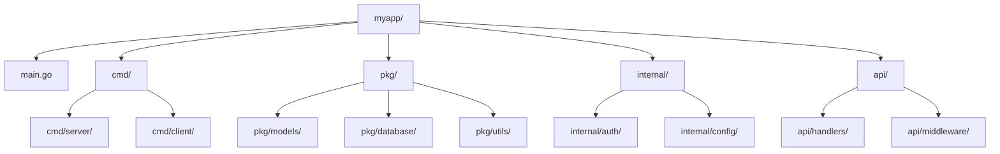

# Go Packages

## Introduction

Packages are one of Go's most powerful features for organizing and reusing code. If you're coming from other programming languages, you can think of packages as similar to modules in Python, libraries in C, or namespaces in C# - but with Go's unique approach.

In this guide, we'll explore:
- What Go packages are and why they're important
- How to create and use your own packages
- Best practices for organizing packages
- Working with standard library and third-party packages

## What is a Go Package?

A package in Go is a collection of related Go source files in the same directory that are compiled together. Every Go file must declare which package it belongs to at the top of the file.

Here's the key concept: **a package is the basic unit of code reusability in Go**.

```go
// This line must appear at the beginning of every Go file
package mypackage

// Rest of your code follows...
```

### Why Packages Matter

Packages in Go provide several benefits:

1. **Code Organization**: They group related functionality together
2. **Encapsulation**: They control what's visible outside the package (public vs. private)
3. **Reusability**: They make it easy to reuse code across different projects
4. **Namespace Management**: They prevent naming conflicts

## Package Naming Conventions

In Go, package names follow these conventions:

- Use lowercase, single-word names
- Avoid underscores or mixedCaps
- The package name should match its directory name (though it's not enforced)
- Names should be short, concise, and descriptive

```
directory name: stringutil
package declaration: package stringutil
```

## Creating Your First Package

Let's create a simple package that provides string utilities:

1. First, create a directory structure:

```
myproject/
├── main.go
└── stringutil/
    └── reverse.go
```

2. In `reverse.go`, define your package:

```go
// File: stringutil/reverse.go
package stringutil

// Reverse returns the reverse of a string
func Reverse(s string) string {
    r := []rune(s)
    for i, j := 0, len(r)-1; i < j; i, j = i+1, j-1 {
        r[i], r[j] = r[j], r[i]
    }
    return string(r)
}
```

3. In `main.go`, import and use your package:

```go
// File: main.go
package main

import (
    "fmt"
    "./stringutil" // In a proper Go module, this would be your module path/stringutil
)

func main() {
    input := "Hello, Go!"
    reversed := stringutil.Reverse(input)
    fmt.Printf("Original: %s
Reversed: %s
", input, reversed)
}
```

Output:
```
Original: Hello, Go!
Reversed: !oG ,olleH
```

## Public vs. Private Elements

Go uses a simple rule to determine whether a package element (function, type, variable, etc.) is accessible outside its package:

- If the identifier starts with an uppercase letter, it's **exported** (public)
- If it starts with a lowercase letter, it's **unexported** (private)

```go
package calculator

// Add is exported (public) - usable outside this package
func Add(a, b int) int {
    return a + b
}

// multiply is unexported (private) - only usable within this package
func multiply(a, b int) int {
    return a * b
}
```

This example shows how you would use these functions:

```go
package main

import (
    "fmt"
    "myproject/calculator"
)

func main() {
    // This works because Add is exported
    sum := calculator.Add(5, 3)
    fmt.Println("5 + 3 =", sum)
    
    // This would cause a compile error because multiply is unexported
    // product := calculator.multiply(5, 3)
}
```

Output:
```
5 + 3 = 8
```

## Package Documentation

Go encourages documenting your packages using comments. These comments can be processed by the `go doc` tool.

```go
// Package calculator provides basic arithmetic operations.
package calculator

// Add returns the sum of two integers.
// It never overflows.
func Add(a, b int) int {
    return a + b
}
```

To view the documentation:

```
go doc calculator
go doc calculator.Add
```

## Package Initialization

Go packages can have initialization code that runs when the package is imported:

1. Package-level variables are initialized first
2. `init()` functions are executed next

```go
package database

import "fmt"

var connection string

// init runs when the package is imported
func init() {
    fmt.Println("Initializing database package...")
    connection = "postgresql://localhost:5432/mydb"
}
```

A package can have multiple `init()` functions, even across different files. They execute in the order they're defined.

## Working with Standard Library Packages

Go comes with a rich standard library of packages. Here's how to use them:

```go
package main

import (
    "fmt"       // Formatted I/O
    "strings"   // String manipulation
    "time"      // Time-related functions
)

func main() {
    // Using the fmt package
    fmt.Println("Hello, World!")
    
    // Using the strings package
    message := "  Go Packages are awesome  "
    trimmed := strings.TrimSpace(message)
    fmt.Printf("Original: %q
Trimmed: %q
", message, trimmed)
    
    // Using the time package
    now := time.Now()
    fmt.Println("Current time:", now.Format("15:04:05"))
}
```

Output:
```
Hello, World!
Original: "  Go Packages are awesome  "
Trimmed: "Go Packages are awesome"
Current time: 14:30:45
```

## Importing Packages

There are several ways to import packages in Go:

### Basic Import

```go
import "fmt"

func main() {
    fmt.Println("Hello!")
}
```

### Multiple Imports

```go
import (
    "fmt"
    "strings"
)
```

### Named Imports

```go
import (
    "fmt"
    str "strings" // Now we use str instead of strings
)

func main() {
    fmt.Println(str.ToUpper("hello"))
}
```

### Dot Imports (Not Recommended)

```go
import (
    "fmt"
    . "strings" // All exported identifiers are now in current namespace
)

func main() {
    // Can call ToUpper directly without strings. prefix
    fmt.Println(ToUpper("hello")) 
}
```

### Blank Imports

```go
import (
    "fmt"
    _ "image/png" // Only run the init() function, don't access any exports
)
```

## Package Organization in Real-World Applications

In larger Go applications, packages are typically organized by functionality:

