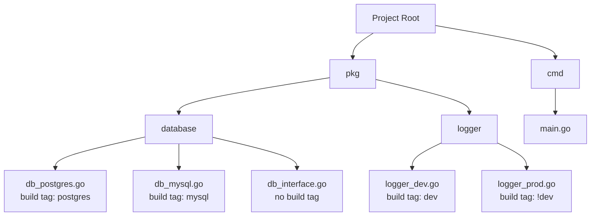

# Go Build Tags

## Introduction

When developing applications in Go, you may encounter situations where you need different code to run in different environments. Perhaps you need platform-specific code for Windows versus Linux, or you want to include additional debugging code in development but not in production. This is where **build tags** (also called build constraints) come into play.

Build tags are a powerful feature in Go that allows you to conditionally compile parts of your code based on various factors such as:

- Operating system
- Architecture
- Go version
- Custom conditions you define

In this article, we'll explore how build tags work, how to use them effectively, and see real-world examples of when they're most useful.

## Understanding Build Tags

Build tags are special comments at the top of Go files that tell the Go compiler whether to include the file during compilation based on specified conditions.

### Basic Syntax

A build tag is placed as a comment at the very top of a Go file (before the `package` declaration) and follows this format:

```go
//go:build expression
```

The `expression` part can be a simple tag name or a more complex logical expression using operators like `&&` (AND), `||` (OR), and `!` (NOT).

> **Note**: In older Go code (prior to Go 1.17), you might see the legacy syntax: `// +build tagname`. While this still works, the newer `//go:build` syntax is preferred.

## Simple Build Tag Examples

Let's start with some basic examples:

### Example 1: Operating System-Specific Code

Imagine you need different implementations for different operating systems. You can create separate files with OS-specific build tags:

**file_linux.go**:
```go
//go:build linux

package mypackage

// Linux-specific implementation
func GetTempDirectory() string {
    return "/tmp"
}
```

**file_windows.go**:
```go
//go:build windows

package mypackage

// Windows-specific implementation
func GetTempDirectory() string {
    return "C:\\Temp"
}
```

When you build your program, Go will automatically include only the appropriate file for the target operating system.

### Example 2: Development vs. Production Mode

You can create custom build tags for development-specific features:

**logger_dev.go**:
```go
//go:build dev

package myapp

// Verbose logger for development
func InitLogger() {
    // Initialize detailed logging
    println("Detailed development logging enabled")
}
```

**logger_prod.go**:
```go
//go:build !dev

package myapp

// Minimal logging for production
func InitLogger() {
    // Initialize minimal logging
    println("Production logging enabled")
}
```

To compile with development logging:
```bash
go build -tags=dev ./...
```

To compile with production logging (default):
```bash
go build ./...
```

## Complex Build Tag Expressions

You can create more complex conditions using logical operators:

### Example 3: Multiple Conditions

```go
//go:build (linux || darwin) && !cgo
```

This tag means "include this file when the target OS is Linux OR macOS, BUT NOT when cgo is enabled."

### Example 4: Version-Specific Code

```go
//go:build go1.18
```

This means "include this file only when building with Go 1.18 or later."

## Real-World Applications

Let's explore some practical scenarios where build tags are especially useful:

### 1. Database Drivers

You might want to support multiple databases but keep dependencies minimal:

**db_postgres.go**:
```go
//go:build postgres

package database

import (
    "database/sql"
    _ "github.com/lib/pq"
)

func Connect(connectionString string) (*sql.DB, error) {
    return sql.Open("postgres", connectionString)
}
```

**db_mysql.go**:
```go
//go:build mysql

package database

import (
    "database/sql"
    _ "github.com/go-sql-driver/mysql"
)

func Connect(connectionString string) (*sql.DB, error) {
    return sql.Open("mysql", connectionString)
}
```

Build with the database you need:
```bash
go build -tags=postgres ./...
# OR
go build -tags=mysql ./...
```

### 2. Testing Utilities

You can include test helpers only in test builds:

**test_helpers.go**:
```go
//go:build testing

package myapp

// Expose internal functions for testing
func ResetInternalState() {
    // Reset application state for tests
}
```

### 3. Feature Flags

You can implement feature flags using build tags:

**feature_new_ui.go**:
```go
//go:build new_ui

package myapp

func InitUI() {
    // Initialize new UI components
    println("New UI enabled")
}
```

**feature_old_ui.go**:
```go
//go:build !new_ui

package myapp

func InitUI() {
    // Initialize old UI components
    println("Classic UI enabled")
}
```

## File Organization with Build Tags

Here's a diagram showing how you might organize files with build tags in a project:



## Best Practices

1. **Keep it simple**: Avoid overly complex build tag expressions when possible
2. **Document your tags**: Make sure your team knows which build tags are available
3. **Test all combinations**: Ensure your code works correctly with different build tag combinations
4. **Be consistent**: Use the same build tag naming conventions throughout your project
5. **Prefer the new syntax**: Use `//go:build` rather than the legacy `// +build` syntax

## Common Pitfalls

1. **Forgotten build tags**: If you forget to use the `-tags` flag, files with custom build tags won't be included
2. **Build tag placement**: The build tag must be at the top of the file before the package declaration
3. **Empty lines**: For legacy syntax, there must be an empty line between the build tag and the package declaration
4. **Inconsistent implementations**: Ensure all implementations of the same function have compatible signatures

## Complete Example: HTTP Client with Timeout Options

Let's put together a more complete example. We'll create an HTTP client with different timeout configurations for development and production environments:

**http_client.go**:
```go
package client

// Common interface
type HTTPClient interface {
    Get(url string) ([]byte, error)
}

// Factory function that returns the appropriate client
func NewHTTPClient() HTTPClient {
    return newHTTPClientImpl()
}
```

**http_client_dev.go**:
```go
//go:build dev

package client

import (
    "fmt"
    "io"
    "net/http"
    "time"
)

type devHTTPClient struct {
    client *http.Client
}

func newHTTPClientImpl() HTTPClient {
    fmt.Println("Using development HTTP client with 30s timeout")
    return &devHTTPClient{
        client: &http.Client{
            Timeout: 30 * time.Second,
        },
    }
}

func (c *devHTTPClient) Get(url string) ([]byte, error) {
    fmt.Printf("[DEV] Making request to: %s
", url)
    resp, err := c.client.Get(url)
    if err != nil {
        return nil, err
    }
    defer resp.Body.Close()
    
    fmt.Printf("[DEV] Response status: %s
", resp.Status)
    return io.ReadAll(resp.Body)
}
```

**http_client_prod.go**:
```go
//go:build !dev

package client

import (
    "io"
    "net/http"
    "time"
)

type prodHTTPClient struct {
    client *http.Client
}

func newHTTPClientImpl() HTTPClient {
    return &prodHTTPClient{
        client: &http.Client{
            Timeout: 5 * time.Second, // Shorter timeout for production
        },
    }
}

func (c *prodHTTPClient) Get(url string) ([]byte, error) {
    resp, err := c.client.Get(url)
    if err != nil {
        return nil, err
    }
    defer resp.Body.Close()
    
    return io.ReadAll(resp.Body)
}
```

**main.go** (using the client):
```go
package main

import (
    "fmt"
    "log"
    "yourmodule/client"
)

func main() {
    httpClient := client.NewHTTPClient()
    
    data, err := httpClient.Get("https://api.example.com/data")
    if err != nil {
        log.Fatalf("Error fetching data: %v", err)
    }
    
    fmt.Printf("Received %d bytes of data
", len(data))
}
```

### Building and Running

For development:
```bash
go build -tags=dev -o myapp
./myapp
```

Output (development):
```
Using development HTTP client with 30s timeout
[DEV] Making request to: https://api.example.com/data
[DEV] Response status: 200 OK
Received 1234 bytes of data
```

For production:
```bash
go build -o myapp
./myapp
```

Output (production):
```
Received 1234 bytes of data
```

## Summary

Build tags are a powerful feature in Go that allows you to conditionally compile code based on various factors such as operating system, architecture, or custom conditions. They help you:

- Create platform-specific implementations
- Separate development and production code
- Implement feature flags
- Minimize dependencies
- Manage experimental features

By mastering build tags, you can create more flexible, maintainable Go applications that can adapt to different environments and requirements without sacrificing code clarity or performance.

## Additional Resources

- [Go Build Constraints Documentation](https://pkg.go.dev/cmd/go#hdr-Build_constraints)
- [Go Modules Reference](https://golang.org/ref/mod)
- [Effective Go](https://golang.org/doc/effective_go)

## Exercises

1. Create a simple program with different implementations for Windows, Linux, and macOS using build tags
2. Implement a feature flag system using build tags for an existing application
3. Create a logging package with different verbosity levels controlled by build tags
4. Modify an existing application to use different database drivers based on build tags
5. Create a test utility package that's only included during testing

Remember that build tags help you write cleaner, more maintainable code by separating platform-specific or environment-specific implementations. This keeps your codebase organized and makes it easier to understand and maintain in the long run.