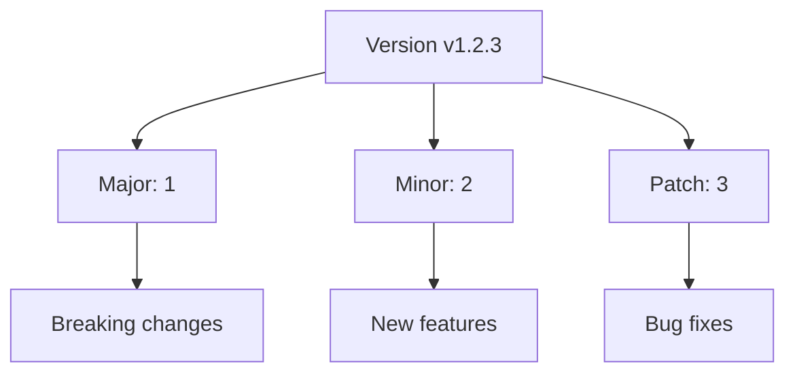

# Go Versioning

## Introduction

Version management is a critical aspect of any software development project. In Go, versioning allows developers to track changes, manage dependencies, and ensure compatibility across different parts of an application. This guide introduces Go's approach to versioning through Go Modules, which was officially introduced in Go 1.11 and became the default in Go 1.13.

Understanding versioning in Go projects will help you create maintainable codebases, collaborate effectively with other developers, and build robust applications that can evolve over time without breaking existing functionality.

## Go Modules: The Foundation of Go Versioning

Go Modules provide an official dependency management system for Go projects. Before modules, Go relied on GOPATH for organizing code, which had significant limitations for versioning and dependency management.

### What are Go Modules?

A Go module is a collection of Go packages stored in a file tree with a `go.mod` file at its root. The `go.mod` file defines:

1. The module's import path
2. The Go version used by the module
3. Dependencies required by the module and their versions

Let's look at a basic `go.mod` file:

```go
module github.com/username/myproject

go 1.20

require (
    github.com/gin-gonic/gin v1.9.1
    github.com/go-playground/validator/v10 v10.14.0
)
```

### Creating a New Module

To create a new module for your project:

```bash
mkdir myproject
cd myproject
go mod init github.com/username/myproject
```

This creates a `go.mod` file in your project directory. When you add dependencies to your project, Go automatically updates this file.

## Semantic Versioning in Go

Go relies on Semantic Versioning (SemVer) for module versioning. Understanding SemVer is essential for effective Go versioning.

### SemVer Format

Semantic Versioning follows the format: `MAJOR.MINOR.PATCH`

- **MAJOR**: Incremented for incompatible API changes
- **MINOR**: Incremented for backwards-compatible functionality additions
- **PATCH**: Incremented for backwards-compatible bug fixes

For example: `v1.2.3`



### Version Selection in Go

Go uses a concept called Minimal Version Selection (MVS) to determine which version of a dependency to use. The basic rule is:

> Go selects the minimal version that satisfies all the requirements in your project.

This approach differs from other package managers that might choose the latest compatible version.

## Managing Dependencies in Go

### Adding Dependencies

When you import a package in your code, Go can automatically add it to your module:

```bash
go get github.com/gin-gonic/gin
```

This command:
1. Downloads the latest version of the package
2. Adds the dependency to your `go.mod` file
3. Creates or updates the `go.sum` file with checksums

### Updating Dependencies

To update a dependency to its latest version:

```bash
go get -u github.com/gin-gonic/gin
```

To update all dependencies:

```bash
go get -u ./...
```

### Listing Dependencies

To see all dependencies and their versions:

```bash
go list -m all
```

Output example:
```
github.com/username/myproject
github.com/gin-gonic/gin v1.9.1
github.com/go-playground/validator/v10 v10.14.0
# ... more dependencies
```

## Understanding go.mod and go.sum

### The go.mod File

The `go.mod` file contains the module's declaration and its dependencies. Here's what each section means:

```go
// Module path - how other modules will import your code
module github.com/username/myproject

// Go version used by the module
go 1.20

// Direct and indirect dependencies
require (
    github.com/gin-gonic/gin v1.9.1 // direct dependency
    github.com/go-playground/validator/v10 v10.14.0 // direct dependency
    golang.org/x/sys v0.8.0 // indirect dependency
)

// Replace directives for using local versions or forks
replace github.com/user/repo => github.com/different/repo v1.0.0

// Exclude problematic versions
exclude github.com/user/repo v1.2.3
```

### The go.sum File

The `go.sum` file contains cryptographic checksums of the content of specific module versions:

```
github.com/gin-gonic/gin v1.9.1 h1:4+fr/el88TOO3ewCmQr8cx/CtZ/umlIRIs5M4NTNjf8=
github.com/gin-gonic/gin v1.9.1/go.mod h1:hPrL7YrpYKXt5YId3A/Tnip5kqbEAP+KLuI3SUcPTeU=
```

This file ensures that the dependencies you download are identical to what was used during development, protecting against supply chain attacks.

## Major Version Updates and Compatibility

Go has a specific approach to handling major version updates that introduce breaking changes:

### The Import Compatibility Rule

For major versions 2 and above, the major version must be included in the import path:

```go
import "github.com/user/repo/v2"  // For version 2.x.x
import "github.com/user/repo/v3"  // For version 3.x.x
```

This is because major versions are considered different modules in Go.

For example, if you want to use v2.0.0 of a package:

```bash
go get github.com/user/repo/v2@v2.0.0
```

And then import it in your code:

```go
import "github.com/user/repo/v2"
```

## Practical Example: Managing Versions in a Project

Let's walk through a complete example of managing versioning in a simple Go web service:

### 1. Initialize a new module

```bash
mkdir webservice
cd webservice
go mod init github.com/username/webservice
```

### 2. Create a simple API with Gin (version 1.9.1)

```bash
go get github.com/gin-gonic/gin@v1.9.1
```

Create `main.go`:

```go
package main

import (
    "github.com/gin-gonic/gin"
    "net/http"
)

func main() {
    r := gin.Default()
    
    r.GET("/ping", func(c *gin.Context) {
        c.JSON(http.StatusOK, gin.H{
            "message": "pong",
            "version": "1.0.0",
        })
    })
    
    r.Run(":8080")
}
```

### 3. Add more functionality and dependencies

```bash
go get github.com/go-playground/validator/v10
```

Update `main.go`:

```go
package main

import (
    "github.com/gin-gonic/gin"
    "github.com/go-playground/validator/v10"
    "net/http"
)

type User struct {
    Name  string `json:"name" validate:"required"`
    Email string `json:"email" validate:"required,email"`
    Age   int    `json:"age" validate:"gte=0,lte=130"`
}

var validate = validator.New()

func main() {
    r := gin.Default()
    
    r.GET("/ping", func(c *gin.Context) {
        c.JSON(http.StatusOK, gin.H{
            "message": "pong",
            "version": "1.0.0",
        })
    })
    
    r.POST("/users", func(c *gin.Context) {
        var user User
        if err := c.ShouldBindJSON(&user); err != nil {
            c.JSON(http.StatusBadRequest, gin.H{"error": err.Error()})
            return
        }
        
        if err := validate.Struct(user); err != nil {
            c.JSON(http.StatusBadRequest, gin.H{"error": err.Error()})
            return
        }
        
        c.JSON(http.StatusOK, gin.H{"status": "user validated"})
    })
    
    r.Run(":8080")
}
```

### 4. Check the dependencies

```bash
go list -m all
```

### 5. Create a new API version

To demonstrate versioning in the API itself, we could structure our code to handle different API versions:

```go
package main

import (
    "github.com/gin-gonic/gin"
    "github.com/go-playground/validator/v10"
    "net/http"
)

var validate = validator.New()

type User struct {
    Name  string `json:"name" validate:"required"`
    Email string `json:"email" validate:"required,email"`
    Age   int    `json:"age" validate:"gte=0,lte=130"`
}

// UserV2 adds a new field in v2 API
type UserV2 struct {
    Name     string `json:"name" validate:"required"`
    Email    string `json:"email" validate:"required,email"`
    Age      int    `json:"age" validate:"gte=0,lte=130"`
    Location string `json:"location" validate:"required"`
}

func main() {
    r := gin.Default()
    
    // API v1 routes
    v1 := r.Group("/api/v1")
    {
        v1.GET("/ping", func(c *gin.Context) {
            c.JSON(http.StatusOK, gin.H{
                "message": "pong",
                "version": "1.0.0",
            })
        })
        
        v1.POST("/users", func(c *gin.Context) {
            var user User
            if err := c.ShouldBindJSON(&user); err != nil {
                c.JSON(http.StatusBadRequest, gin.H{"error": err.Error()})
                return
            }
            
            if err := validate.Struct(user); err != nil {
                c.JSON(http.StatusBadRequest, gin.H{"error": err.Error()})
                return
            }
            
            c.JSON(http.StatusOK, gin.H{"status": "user validated", "api_version": "v1"})
        })
    }
    
    // API v2 routes (with breaking changes)
    v2 := r.Group("/api/v2")
    {
        v2.GET("/ping", func(c *gin.Context) {
            c.JSON(http.StatusOK, gin.H{
                "message": "pong",
                "version": "2.0.0",
            })
        })
        
        v2.POST("/users", func(c *gin.Context) {
            var user UserV2
            if err := c.ShouldBindJSON(&user); err != nil {
                c.JSON(http.StatusBadRequest, gin.H{"error": err.Error()})
                return
            }
            
            if err := validate.Struct(user); err != nil {
                c.JSON(http.StatusBadRequest, gin.H{"error": err.Error()})
                return
            }
            
            c.JSON(http.StatusOK, gin.H{
                "status": "user validated",
                "api_version": "v2",
                "location": user.Location,
            })
        })
    }
    
    r.Run(":8080")
}
```

## Releasing Versions of Your Go Module

When releasing your own Go module, follow these best practices:

1. **Use Git tags for versioning**:
   ```bash
   git tag v1.0.0
   git push origin v1.0.0
   ```

2. **Follow semantic versioning strictly**

3. **Create a CHANGELOG.md** to document changes between versions

4. **Use pre-release versions for testing**:
   ```bash
   git tag v1.0.0-beta.1
   git push origin v1.0.0-beta.1
   ```

5. **Maintain backward compatibility** within the same major version

## Versioning Best Practices

1. **Pin dependency versions** in production applications to ensure reproducible builds:
   ```go
   // In go.mod
   require (
       github.com/gin-gonic/gin v1.9.1 // Pinned to exact version
   )
   ```

2. **Use version ranges carefully** for libraries:
   ```bash
   go get github.com/user/repo@^1.0.0  // Any 1.x.x version
   ```

3. **Don't break the public API** without incrementing the major version

4. **Use vendoring** for mission-critical applications:
   ```bash
   go mod vendor
   ```

5. **Document breaking changes** clearly in your release notes

6. **Check for deprecated dependencies** regularly:
   ```bash
   go list -m -u all
   ```

## Common Versioning Issues and Solutions

### Issue: Dependency Conflicts

When two of your dependencies require different versions of the same package.

**Solution**: Go's Minimal Version Selection usually handles this, but you may need to use `replace` directives in complex cases:

```go
// In go.mod
replace github.com/conflicting/package v1.2.3 => github.com/conflicting/package v1.3.0
```

### Issue: Maintaining Multiple Versions

When you need to maintain multiple major versions of your library.

**Solution**: Use separate branches for different major versions:
- `main` for the latest version
- `v1` branch for v1.x.x maintenance
- `v2` branch for v2.x.x maintenance

### Issue: API Stability

Ensuring your API remains stable for users.

**Solution**: 
- Use deprecation notices before removing features
- Provide migration guides between major versions
- Use feature flags for gradually introducing breaking changes

## Summary

Go's approach to versioning through modules provides a robust way to manage dependencies and ensure compatibility. Key takeaways include:

1. Go Modules are the foundation of versioning in Go
2. Semantic Versioning helps communicate the impact of changes
3. The `go.mod` and `go.sum` files work together to maintain version information
4. Major versions (v2+) require import path changes
5. Following versioning best practices leads to maintainable, reliable code

Understanding Go versioning helps you create projects that can evolve while maintaining compatibility, making your code more reliable and your development process more efficient.

## Additional Resources

- [Official Go Modules Reference](https://go.dev/ref/mod)
- [Semantic Versioning Specification](https://semver.org/)
- [Go Wiki: Modules](https://github.com/golang/go/wiki/Modules)
- [Using Go Modules](https://blog.golang.org/using-go-modules)

## Exercises

1. Create a new Go module and add at least two dependencies.
2. Update one of your dependencies to a newer version and observe changes in `go.mod`.
3. Create a simple API with versioned endpoints (v1 and v2) that have different functionality.
4. Tag your project with semantic versions and push them to a Git repository.
5. Use the `replace` directive in your `go.mod` file to point a dependency to a local version.