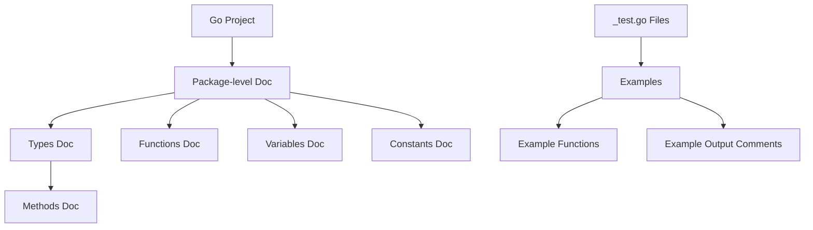

# Go Documentation

## Introduction

Documentation is a crucial aspect of any programming project, and Go takes this seriously with built-in tools and conventions that make writing and accessing documentation straightforward. In this guide, we'll explore how Go approaches documentation, from writing effective comments to generating documentation websites automatically.

Good documentation makes your code more maintainable, helps new developers understand your project quickly, and increases the likelihood that others will use and contribute to your code. Unlike many languages that require separate documentation systems, Go's documentation approach is designed to keep documentation close to the code it describes.

## Go's Documentation Philosophy

Go's documentation philosophy is simple yet powerful:

1. **Documentation lives with the code**: Comments in Go source files serve as the documentation.
2. **Tools over conventions**: Go provides tools like `godoc` and `go doc` to extract and format these comments automatically.
3. **Simplicity**: Plain text with simple formatting is preferred over complex markup.

## Writing Documentation Comments in Go

In Go, documentation is written as comments directly above the declarations they describe. The Go documentation tools recognize and process these comments.

### Package Documentation

Package documentation is written as a block comment (`/* */`) or line comments (`//`) immediately preceding the package clause:

```go
// Package math provides basic mathematical constants and functions.
//
// This package does not guarantee bit-identical results across architectures.
package math
```

### Function, Type, and Method Documentation

For functions, types, and methods, documentation is written as a comment immediately preceding the declaration:

```go
// Add returns the sum of a and b.
func Add(a, b int) int {
    return a + b
}

// Person represents a human being with a name and age.
type Person struct {
    Name string
    Age  int
}

// Greet returns a greeting message using the person's name.
func (p Person) Greet() string {
    return fmt.Sprintf("Hello, my name is %s and I am %d years old.", p.Name, p.Age)
}
```

### Documentation Best Practices

1. **Start with the name**: Begin comments with the name of the item being documented.
2. **Use complete sentences**: Write clear, complete sentences with proper punctuation.
3. **Be concise**: Provide enough information to understand the purpose and usage without unnecessary details.
4. **Include examples**: When helpful, include examples showing how to use the function or type.

## Examples in Documentation

Go has built-in support for examples in documentation. Examples serve as both documentation and tests.

To add an example, create a function with the name pattern `Example[FunctionName]` in a file ending with `_test.go`:

```go
package stringutil_test

import (
    "fmt"
    "github.com/yourusername/stringutil"
)

// This example demonstrates the Reverse function.
func ExampleReverse() {
    fmt.Println(stringutil.Reverse("hello"))
    // Output: olleh
}
```

The `// Output:` comment at the end is important - it tells Go what the expected output should be, which is used for testing. When you run `go test`, Go will verify that the function produces the expected output.

## Viewing Documentation with go doc

Go provides the `go doc` command to view documentation from the command line:

```bash
# View package documentation
go doc fmt

# View documentation for a specific function
go doc fmt.Println

# View documentation for a method
go doc bytes.Buffer.Write
```

The output includes the comment documentation along with the function signature or type definition.

## Generating Web Documentation with godoc

For a more complete documentation experience, you can use the `godoc` tool to generate a website:

```bash
# Install godoc
go install golang.org/x/tools/cmd/godoc@latest

# Run a local documentation server
godoc -http=:6060
```

This starts a local web server at `http://localhost:6060/` where you can browse the documentation for all installed packages, including your own.

## Documentation Organization

