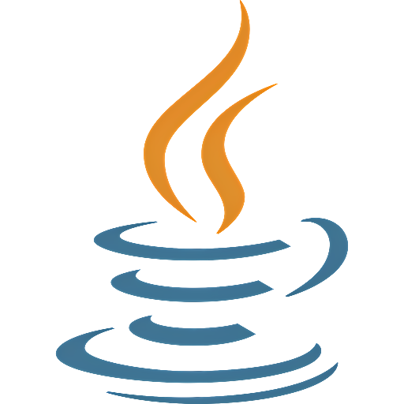
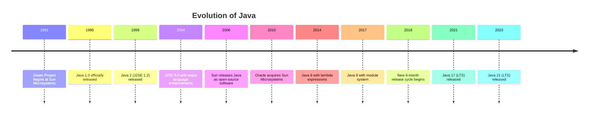
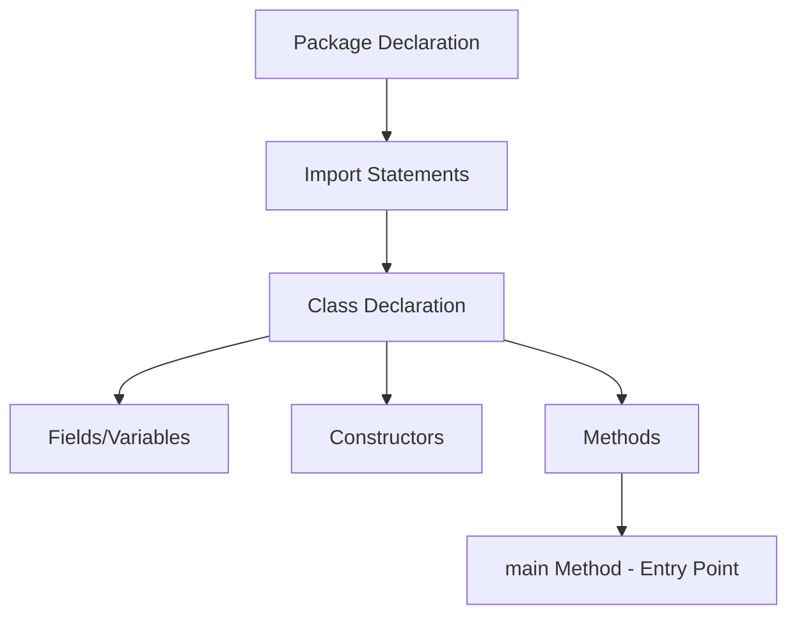
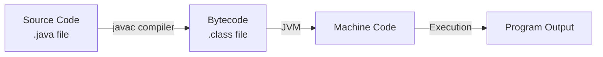

# Java Introduction

## What is Java?

<div style={{
    "width": "20%",
    "margin": "0 auto",
    "text-align": "center"
}}>
    
</div>

Java is a high-level, class-based, object-oriented programming language that was developed by James Gosling at Sun Microsystems (which is now owned by Oracle Corporation) in the mid-1990s. It was designed to have as few implementation dependencies as possible, allowing developers to "write once, run anywhere" (WORA), meaning that compiled Java code can run on all platforms that support Java without the need for recompilation.

## History of Java

Java was originally developed as part of a project called "Green Project" at Sun Microsystems in 1991. The language was initially called "Oak" after an oak tree that stood outside Gosling's office. It was later renamed "Java" in 1995 before its official release.

The timeline of Java's evolution:



## Why Learn Java?

Java remains one of the most popular programming languages in the world for several compelling reasons:

1. **Platform Independence**: Java's "write once, run anywhere" capability makes it versatile.
2. **Object-Oriented**: Java's object-oriented approach helps organize code and model real-world concepts.
3. **Rich Library Ecosystem**: Java has an extensive collection of libraries and frameworks.
4. **Strong Community Support**: A large community of developers for support and resources.
5. **Enterprise Adoption**: Widely used in enterprise environments and Android app development.
6. **Job Opportunities**: Consistently high demand for Java developers in the job market.

## Key Features of Java

Java has several distinctive features that make it a powerful and popular language:

- **Simple and Familiar Syntax**: Java's syntax is similar to C/C++ but removes complexities like pointers.
- **Object-Oriented**: Everything in Java is associated with classes and objects.
- **Platform Independent**: Java code is compiled to bytecode that can run on any device with a Java Virtual Machine (JVM).
- **Robust and Secure**: Strong memory management, exception handling, and security features.
- **Multithreaded**: Support for concurrent execution of multiple threads.
- **Distributed**: Designed with network capabilities for distributed computing.
- **Dynamic**: Adapts to an evolving environment with runtime capabilities.

## Java Applications

Java is versatile and used in various domains:

1. **Enterprise Applications**: Large-scale business applications and web services
2. **Mobile Applications**: The primary language for Android app development
3. **Web Applications**: Server-side applications with frameworks like Spring and JSP
4. **Desktop GUI Applications**: Using Swing, JavaFX, and AWT
5. **Embedded Systems**: Smart cards, IoT devices
6. **Scientific Applications**: Research and data analysis
7. **Big Data Technologies**: Hadoop and related ecosystem tools

## Setting Up Your Java Environment

Before writing Java code, you need to set up your development environment:

1. **Install Java Development Kit (JDK)**: Download and install the latest JDK from [Oracle's website](https://www.oracle.com/java/technologies/downloads/) or use [OpenJDK](https://openjdk.java.net/).

2. **Set up Environment Variables**: 
   - Set `JAVA_HOME` to your JDK installation directory
   - Add JDK's bin directory to your `PATH` variable

3. **Choose an Integrated Development Environment (IDE)**:
   - [IntelliJ IDEA](https://www.jetbrains.com/idea/): Full-featured IDE with community and commercial editions
   - [Eclipse](https://www.eclipse.org/): Popular free IDE
   - [Visual Studio Code](https://code.visualstudio.com/) with Java extensions

## Your First Java Program

Let's create the classic "Hello, World!" program to get started with Java:

```java
public class HelloWorld {
    public static void main(String[] args) {
        System.out.println("Hello, World!");
    }
}
```

### Output:
```
Hello, World!
```

### Explanation:

1. `public class HelloWorld`: Declares a public class named HelloWorld. In Java, the class name must match the file name (HelloWorld.java).

2. `public static void main(String[] args)`: This is the entry point method for a Java application:
   - `public`: The method is accessible from outside the class
   - `static`: The method belongs to the class, not to objects of the class
   - `void`: The method doesn't return any value
   - `main`: The name of the method that JVM looks for to start execution
   - `String[] args`: Command-line arguments passed to the program

3. `System.out.println("Hello, World!");`: Prints the text "Hello, World!" to the console.

## Basic Java Syntax

Let's explore some fundamental Java syntax elements:

### Variables and Data Types

Java is a strongly-typed language, which means you must declare the type of each variable:

```java
public class VariablesExample {
    public static void main(String[] args) {
        // Primitive data types
        int age = 25;                  // Integer
        double salary = 50000.50;      // Floating point
        char grade = 'A';              // Single character
        boolean isEmployed = true;     // Boolean value
        
        // Reference data type
        String name = "John Doe";      // String of characters
        
        // Printing the variables
        System.out.println("Name: " + name);
        System.out.println("Age: " + age);
        System.out.println("Salary: $" + salary);
        System.out.println("Grade: " + grade);
        System.out.println("Employed: " + isEmployed);
    }
}
```

### Output:
```
Name: John Doe
Age: 25
Salary: $50000.5
Grade: A
Employed: true
```

### Operators

Java supports various operators for performing operations on variables:

```java
public class OperatorsExample {
    public static void main(String[] args) {
        // Arithmetic operators
        int a = 10;
        int b = 5;
        
        System.out.println("a + b = " + (a + b));  // Addition
        System.out.println("a - b = " + (a - b));  // Subtraction
        System.out.println("a * b = " + (a * b));  // Multiplication
        System.out.println("a / b = " + (a / b));  // Division
        System.out.println("a % b = " + (a % b));  // Modulus (remainder)
        
        // Comparison operators
        System.out.println("a == b: " + (a == b));  // Equal to
        System.out.println("a != b: " + (a != b));  // Not equal to
        System.out.println("a > b: " + (a > b));    // Greater than
        
        // Logical operators
        boolean x = true;
        boolean y = false;
        
        System.out.println("x && y: " + (x && y));  // Logical AND
        System.out.println("x || y: " + (x || y));  // Logical OR
        System.out.println("!x: " + (!x));          // Logical NOT
    }
}
```

### Output:
```
a + b = 15
a - b = 5
a * b = 50
a / b = 2
a % b = 0
a == b: false
a != b: true
a > b: true
x && y: false
x || y: true
!x: false
```

### Control Flow

Java provides various constructs to control the flow of execution:

#### Conditional Statements

```java
public class ConditionalExample {
    public static void main(String[] args) {
        int score = 85;
        
        // If-else statement
        if (score >= 90) {
            System.out.println("Grade: A");
        } else if (score >= 80) {
            System.out.println("Grade: B");
        } else if (score >= 70) {
            System.out.println("Grade: C");
        } else {
            System.out.println("Grade: F");
        }
        
        // Switch statement
        int day = 3;
        switch (day) {
            case 1:
                System.out.println("Monday");
                break;
            case 2:
                System.out.println("Tuesday");
                break;
            case 3:
                System.out.println("Wednesday");
                break;
            default:
                System.out.println("Other day");
        }
    }
}
```

### Output:
```
Grade: B
Wednesday
```

#### Loops

```java
public class LoopsExample {
    public static void main(String[] args) {
        // For loop
        System.out.println("For Loop:");
        for (int i = 1; i <= 5; i++) {
            System.out.print(i + " ");
        }
        System.out.println();
        
        // While loop
        System.out.println("While Loop:");
        int i = 1;
        while (i <= 5) {
            System.out.print(i + " ");
            i++;
        }
        System.out.println();
        
        // Do-while loop
        System.out.println("Do-While Loop:");
        int j = 1;
        do {
            System.out.print(j + " ");
            j++;
        } while (j <= 5);
        System.out.println();
    }
}
```

### Output:
```
For Loop:
1 2 3 4 5 
While Loop:
1 2 3 4 5 
Do-While Loop:
1 2 3 4 5 
```

## Real-World Application Example

Let's create a simple temperature converter application that converts between Celsius and Fahrenheit:

```java
import java.util.Scanner;

public class TemperatureConverter {
    public static void main(String[] args) {
        Scanner scanner = new Scanner(System.in);
        
        System.out.println("Temperature Converter");
        System.out.println("1. Celsius to Fahrenheit");
        System.out.println("2. Fahrenheit to Celsius");
        System.out.print("Select option (1 or 2): ");
        
        int choice = scanner.nextInt();
        double temperature, convertedTemperature;
        
        if (choice == 1) {
            System.out.print("Enter temperature in Celsius: ");
            temperature = scanner.nextDouble();
            convertedTemperature = (temperature * 9/5) + 32;
            System.out.printf("%.1f°C is equal to %.1f°F", temperature, convertedTemperature);
        } else if (choice == 2) {
            System.out.print("Enter temperature in Fahrenheit: ");
            temperature = scanner.nextDouble();
            convertedTemperature = (temperature - 32) * 5/9;
            System.out.printf("%.1f°F is equal to %.1f°C", temperature, convertedTemperature);
        } else {
            System.out.println("Invalid option selected.");
        }
        
        scanner.close();
    }
}
```

### Example Execution 1:
```
Temperature Converter
1. Celsius to Fahrenheit
2. Fahrenheit to Celsius
Select option (1 or 2): 1
Enter temperature in Celsius: 25
25.0°C is equal to 77.0°F
```

### Example Execution 2:
```
Temperature Converter
1. Celsius to Fahrenheit
2. Fahrenheit to Celsius
Select option (1 or 2): 2
Enter temperature in Fahrenheit: 98.6
98.6°F is equal to 37.0°C
```

This application demonstrates several important Java concepts:
- Input handling with Scanner
- Conditional statements
- Mathematical operations
- Formatted output with printf

## Java Program Structure

A typical Java program consists of:



## Compilation and Execution Process

Java is both compiled and interpreted. Here's the process:



1. **Write code**: Create a `.java` file with your source code
2. **Compile**: Use `javac` to compile the source code into bytecode (`.class` files)
3. **Run**: The Java Virtual Machine (JVM) interprets the bytecode
4. **Output**: Program executes and produces output

## Summary

In this introduction to Java, we've explored:

- The history and evolution of Java
- Why Java is an important language to learn
- Key features that make Java powerful
- Common applications of Java
- Setting up a Java development environment
- Basic Java syntax including variables, operators, and control flow
- A practical example showing a real-world application

Java's combination of simplicity, portability, and robustness makes it an excellent choice for beginners. As you continue your journey with Java, you'll discover more advanced features like object-oriented programming, exception handling, collections, and more.

## Additional Resources

### Books
- "Head First Java" by Kathy Sierra and Bert Bates
- "Effective Java" by Joshua Bloch
- "Java: The Complete Reference" by Herbert Schildt

### Online Learning
- [Oracle's Java Tutorials](https://docs.oracle.com/javase/tutorial/)
- [Codecademy's Java Course](https://www.codecademy.com/learn/learn-java)
- [Coursera's Java Programming](https://www.coursera.org/specializations/java-programming)

## Exercises

1. **Variable Practice**: Create a program that declares variables for your name, age, and favorite programming language, then prints them in a sentence.

2. **Calculator**: Build a simple calculator that can add, subtract, multiply, and divide two numbers entered by the user.

3. **Guessing Game**: Create a number guessing game where the computer generates a random number between 1 and 100, and the user tries to guess it.

4. **Temperature Converter Enhancement**: Extend the temperature converter example to include Kelvin and allow conversions between all three units (Celsius, Fahrenheit, and Kelvin).

5. **Student Grade Calculator**: Write a program that calculates the average grade from a set of scores and assigns a letter grade based on the average.