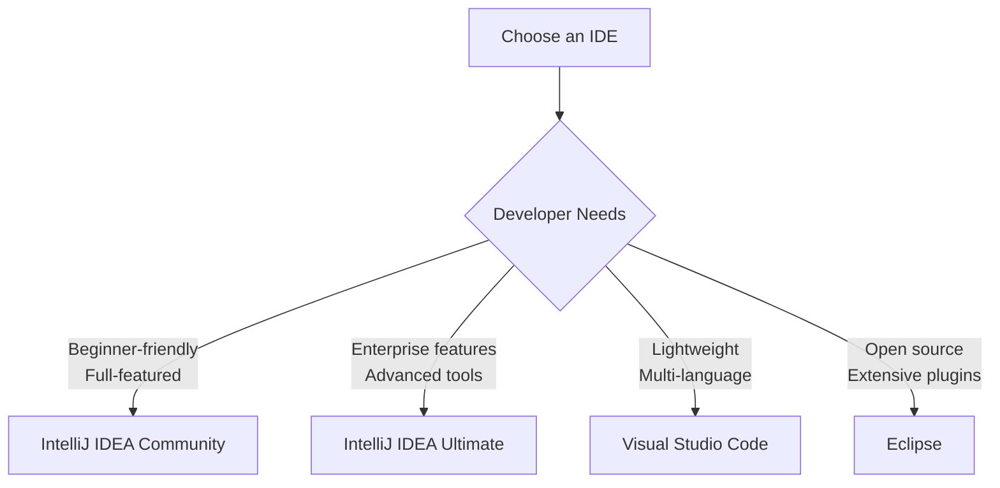
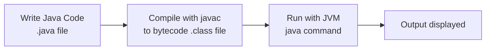

# Java Environment Setup

## Introduction

Setting up a proper Java development environment is the first crucial step in your Java programming journey. This guide will walk you through the process of installing and configuring all the necessary tools to start writing, compiling, and running Java programs. By the end of this tutorial, you'll have a fully functional Java development environment ready for coding.

Java's "Write Once, Run Anywhere" philosophy requires specific components to be installed on your system. Understanding these components and how they work together will provide a solid foundation for your Java development experience.

## Java Development Kit (JDK)

### What is the JDK?

The Java Development Kit (JDK) is a software package that provides everything you need to develop Java applications. It includes:

- **Java Runtime Environment (JRE)**: Allows you to run Java applications
- **Compiler (javac)**: Converts your Java code into bytecode
- **Debugger**: Helps find and fix errors in your code
- **Documentation**: Reference materials for Java APIs
- **Development Tools**: Various utilities for Java development

### Installing the JDK

#### Step 1: Download JDK

Visit the [Oracle JDK download page](https://www.oracle.com/java/technologies/javase-downloads.html) or consider using [OpenJDK](https://adoptopenjdk.net/) (free and open-source alternative). Select the version appropriate for your operating system.

Current LTS (Long Term Support) versions include JDK 11, JDK 17, and JDK 21, which are recommended for beginners.

#### Step 2: Install JDK

**For Windows:**
1. Run the downloaded installer (.exe file)
2. Follow the installation wizard instructions
3. Accept the default installation location (typically C:\Program Files\Java\jdk-xx.x.x)

**For macOS:**
1. Open the downloaded .dmg file
2. Follow the installation instructions
3. The JDK will be installed in /Library/Java/JavaVirtualMachines/

**For Linux:**
```bash
# For Ubuntu/Debian
sudo apt update
sudo apt install openjdk-17-jdk

# For Fedora/RHEL
sudo dnf install java-17-openjdk-devel
```

#### Step 3: Verify Installation

Open a terminal or command prompt and type:

```bash
java -version
javac -version
```

You should see output similar to:

```
java version "17.0.2" 2022-01-18 LTS
Java(TM) SE Runtime Environment (build 17.0.2+8-LTS-86)
Java HotSpot(TM) 64-Bit Server VM (build 17.0.2+8-LTS-86, mixed mode, sharing)

javac 17.0.2
```

### Setting Up Environment Variables

Environment variables help your operating system locate Java executables.

#### For Windows:

1. Right-click on "This PC" or "My Computer" and select "Properties"
2. Click on "Advanced system settings"
3. Click on "Environment Variables"
4. Under "System variables", find and select "Path", then click "Edit"
5. Click "New" and add the path to the JDK bin directory (e.g., C:\Program Files\Java\jdk-17\bin)
6. Add a new system variable called "JAVA_HOME" with the path to your JDK installation (without the \bin)

#### For macOS/Linux:

Edit your shell profile file (~/.bash_profile, ~/.zshrc, etc.) and add:

```bash
export JAVA_HOME=$(/usr/libexec/java_home)
export PATH=$JAVA_HOME/bin:$PATH
```

After saving, reload your profile with:

```bash
source ~/.bash_profile  # or the file you edited
```

## Choosing an Integrated Development Environment (IDE)

While you can write Java code in any text editor, using an IDE enhances productivity with features like code completion, debugging, and project management.

### Popular Java IDEs

#### 1. IntelliJ IDEA

IntelliJ IDEA is a powerful IDE developed by JetBrains, available in Community (free) and Ultimate editions.

**Installation:**
1. Download from [JetBrains website](https://www.jetbrains.com/idea/download/)
2. Run the installer and follow the instructions
3. Select JDK during initial setup (if prompted)

#### 2. Eclipse

Eclipse is a free, open-source IDE with extensive plugin support.

**Installation:**
1. Download from [Eclipse website](https://www.eclipse.org/downloads/)
2. Extract the downloaded archive to your preferred location
3. Run the Eclipse executable and select a workspace location
4. Configure the JDK in Window > Preferences > Java > Installed JREs

#### 3. Visual Studio Code

VS Code is a lightweight, extensible code editor that supports Java development through extensions.

**Installation:**
1. Download VS Code from [Microsoft's website](https://code.visualstudio.com/)
2. Install the required extensions:
   - Extension Pack for Java
   - Maven for Java
   - Debugger for Java

### IDE Comparison



## Your First Java Program

Let's write, compile, and run a simple "Hello World" program to verify your environment is set up correctly.

### Using Command Line

1. Create a file named `HelloWorld.java` with the following content:

```java
public class HelloWorld {
    public static void main(String[] args) {
        System.out.println("Hello, Java World!");
    }
}
```

2. Open a terminal or command prompt in the directory where you saved the file
3. Compile the program:

```bash
javac HelloWorld.java
```

4. Run the compiled program:

```bash
java HelloWorld
```

**Output:**
```
Hello, Java World!
```

### Using an IDE (IntelliJ IDEA example)

1. Open IntelliJ IDEA
2. Click "New Project"
3. Select "Java" and ensure the JDK is properly set
4. Enter a project name (e.g., "FirstJavaProject") and click "Create"
5. Right-click on the "src" folder, select "New" > "Java Class"
6. Name it "HelloWorld" and click "OK"
7. Enter the following code:

```java
public class HelloWorld {
    public static void main(String[] args) {
        System.out.println("Hello, Java World!");
    }
}
```

8. Run the program by clicking the green "Run" button or pressing Shift+F10

**Output:**
```
Hello, Java World!
```

## Understanding the Java Program Lifecycle



1. **Write**: Create a `.java` file with your source code
2. **Compile**: The `javac` compiler converts source code to bytecode (`.class` files)
3. **Run**: The Java Virtual Machine (JVM) executes the bytecode
4. **Output**: Your program produces results

This process ensures Java's "Write Once, Run Anywhere" capability, as the bytecode can run on any system with a compatible JVM.

## Real-World Application: Setting Up a Java Project Structure

Professional Java projects follow specific directory structures. Let's set up a basic project:

```
MyJavaProject/
├── src/               # Source code
│   ├── main/
│   │   ├── java/      # Java source files
│   │   └── resources/ # Configuration files
│   └── test/          # Test code
├── lib/               # External libraries
├── build/             # Compiled classes
└── README.md          # Project documentation
```

### Creating the Structure

For Windows:

```batch
mkdir MyJavaProject
cd MyJavaProject
mkdir src\main\java src\main\resources src\test lib build
echo. > README.md
```

For macOS/Linux:

```bash
mkdir -p MyJavaProject/src/main/java MyJavaProject/src/main/resources MyJavaProject/src/test MyJavaProject/lib MyJavaProject/build
cd MyJavaProject
touch README.md
```

### Sample Project with Multiple Files

Create a simple calculator application:

1. Create `Calculator.java` in `src/main/java`:

```java
public class Calculator {
    public int add(int a, int b) {
        return a + b;
    }
    
    public int subtract(int a, int b) {
        return a - b;
    }
    
    public int multiply(int a, int b) {
        return a * b;
    }
    
    public double divide(int a, int b) {
        if (b == 0) {
            throw new IllegalArgumentException("Cannot divide by zero");
        }
        return (double) a / b;
    }
}
```

2. Create `CalculatorApp.java` in `src/main/java`:

```java
public class CalculatorApp {
    public static void main(String[] args) {
        Calculator calc = new Calculator();
        
        // Perform calculations
        System.out.println("Addition: " + calc.add(5, 3));
        System.out.println("Subtraction: " + calc.subtract(5, 3));
        System.out.println("Multiplication: " + calc.multiply(5, 3));
        System.out.println("Division: " + calc.divide(5, 3));
    }
}
```

3. Compile and run:

```bash
# Compile both files
javac -d build src/main/java/Calculator.java src/main/java/CalculatorApp.java

# Run the application from the build directory
java -cp build CalculatorApp
```

**Output:**
```
Addition: 8
Subtraction: 2
Multiplication: 15
Division: 1.6666666666666667
```

## Troubleshooting Common Setup Issues

### Common Issue 1: "javac' is not recognized as an internal or external command"

This error occurs when Java is not in your PATH environment variable.

**Solution**: Make sure you've properly set up the PATH environment variable to include the JDK bin directory.

### Common Issue 2: "Error: Unable to locate/access the Java compiler 'javac'"

This typically happens when JAVA_HOME is incorrectly set.

**Solution**: Verify JAVA_HOME points to the JDK (not JRE) installation directory.

### Common Issue 3: "Error: A JNI error has occurred"

This often indicates a version mismatch between your code and the JDK.

**Solution**: Make sure you're compiling and running with the same Java version.

## Build Tools Introduction

As your projects grow, build tools become essential for managing dependencies and building processes.

### Maven

Maven is a popular build automation tool that helps manage dependencies and project lifecycle.

**Basic setup**:
1. Install Maven from [Maven's website](https://maven.apache.org/download.cgi)
2. Create a simple `pom.xml` file:

```xml
<project>
    <modelVersion>4.0.0</modelVersion>
    <groupId>com.example</groupId>
    <artifactId>my-app</artifactId>
    <version>1.0-SNAPSHOT</version>
</project>
```

### Gradle

Gradle is a flexible build tool that uses Groovy or Kotlin DSL.

**Basic setup**:
1. Install Gradle from [Gradle's website](https://gradle.org/install/)
2. Create a simple `build.gradle` file:

```groovy
plugins {
    id 'java'
}

group = 'com.example'
version = '1.0-SNAPSHOT'
sourceCompatibility = '17'

repositories {
    mavenCentral()
}

dependencies {
    testImplementation 'org.junit.jupiter:junit-jupiter-api:5.8.1'
}
```

## Summary

In this tutorial, you've learned how to:
- Install the Java Development Kit (JDK)
- Configure environment variables (JAVA_HOME and PATH)
- Choose and install a Java IDE
- Create, compile, and run your first Java program
- Set up a project structure
- Understand the Java program lifecycle
- Troubleshoot common setup issues
- Get introduced to build tools

Having a properly set up Java environment is essential for efficient Java development. The tools and techniques covered in this guide will form the foundation for your Java programming journey.

## Additional Resources

- [Oracle's Java Documentation](https://docs.oracle.com/en/java/)
- [IntelliJ IDEA Documentation](https://www.jetbrains.com/idea/documentation/)
- [Eclipse Documentation](https://help.eclipse.org/)
- [Maven Getting Started Guide](https://maven.apache.org/guides/getting-started/index.html)
- [Gradle User Manual](https://docs.gradle.org/current/userguide/userguide.html)

## Practice Exercises

1. **Environment Check**: Create a Java program that prints information about your Java environment:

```java
public class EnvironmentInfo {
    public static void main(String[] args) {
        System.out.println("Java Version: " + System.getProperty("java.version"));
        System.out.println("Java Home: " + System.getProperty("java.home"));
        System.out.println("OS Name: " + System.getProperty("os.name"));
        System.out.println("OS Version: " + System.getProperty("os.version"));
        System.out.println("User Name: " + System.getProperty("user.name"));
        System.out.println("User Home: " + System.getProperty("user.home"));
    }
}
```

2. **Project Setup**: Create a complete project structure as described in the tutorial and implement a simple address book application with classes for contacts and an address book manager.

3. **Build Tool Practice**: Install Maven or Gradle and create a new project using the build tool. Add dependencies for a popular library like Apache Commons Lang and write a simple program using features from that library.