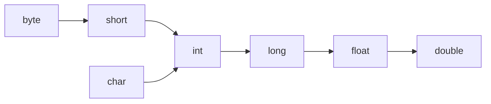

# Java Type Casting

Type casting in Java is a method of changing a variable from one data type to another. Understanding type casting is essential for Java programming as it allows you to convert data between different types when needed.

## Introduction to Type Casting

In Java, variables have specific data types that determine what kind of values they can hold. Sometimes, you need to convert a value from one type to another. This conversion process is called type casting.

There are two main types of casting in Java:

1. **Implicit Casting (Widening)**: Automatically done by the Java compiler when converting a smaller data type to a larger one
2. **Explicit Casting (Narrowing)**: Manually done by the programmer when converting a larger data type to a smaller one

Let's explore both types in detail.

## Implicit Casting (Widening Conversion)

Implicit casting occurs when a smaller data type is automatically converted to a larger data type. This conversion is safe because there's no risk of data loss.

The automatic type conversion follows this hierarchy:



### Example of Implicit Casting

```java
public class ImplicitCastingExample {
    public static void main(String[] args) {
        // Implicit casting from int to double
        int numInt = 10;
        double numDouble = numInt; // Automatic casting from int to double
        
        System.out.println("Integer value: " + numInt);
        System.out.println("Double value after casting: " + numDouble);
        
        // Implicit casting in expressions
        byte b = 42;
        short s = 1024;
        int i = 50000;
        long l = 1000000L;
        float f = 5.67f;
        double d = 0.1234;
        
        // Expression evaluation causes implicit casting
        double result = (f * b) + (i / s) - (d * l);
        
        System.out.println("Result of the expression: " + result);
    }
}
```

**Output:**
```
Integer value: 10
Double value after casting: 10.0
Result of the expression: 237.9766
```

In this example, the `int` value is implicitly cast to a `double`. In the expression, all values are automatically promoted following the conversion hierarchy.

## Explicit Casting (Narrowing Conversion)

Explicit casting is necessary when you want to convert a larger data type to a smaller data type. Since this might result in data loss, Java requires you to explicitly state your intention to cast.

### Syntax for Explicit Casting

```java
(target_type) expression
```

### Example of Explicit Casting

```java
public class ExplicitCastingExample {
    public static void main(String[] args) {
        // Explicit casting from double to int
        double numDouble = 10.99;
        int numInt = (int) numDouble; // Explicit casting
        
        System.out.println("Double value: " + numDouble);
        System.out.println("Integer value after casting: " + numInt);
        
        // Potential data loss example
        int largeValue = 130;
        byte smallValue = (byte) largeValue;
        
        System.out.println("Original large value: " + largeValue);
        System.out.println("Value after casting to byte: " + smallValue);
    }
}
```

**Output:**
```
Double value: 10.99
Integer value after casting: 10
Original large value: 130
Value after casting to byte: -126
```

Notice that when casting from `double` to `int`, the decimal part is truncated (not rounded). Also, when casting from `int` to `byte`, the value wraps around since a byte can only store values from -128 to 127.

## Type Casting with Objects (Reference Types)

In Java, object references can also be cast. This is different from primitive type casting and involves the inheritance hierarchy.

### Upcasting

Upcasting is the process of casting a reference from a subclass type to a superclass type. This is always safe and happens implicitly.

```java
public class TypeCastingWithObjects {
    public static void main(String[] args) {
        // Upcasting example
        Dog dog = new Dog();
        Animal animal = dog; // Implicit upcasting
        
        animal.makeSound(); // This calls Dog's implementation of makeSound()
    }
}

class Animal {
    public void makeSound() {
        System.out.println("Animal makes a sound");
    }
}

class Dog extends Animal {
    @Override
    public void makeSound() {
        System.out.println("Dog barks");
    }
    
    public void wagTail() {
        System.out.println("Dog wags tail");
    }
}
```

**Output:**
```
Dog barks
```

### Downcasting

Downcasting is the process of casting a reference from a superclass type to a subclass type. This requires explicit casting and should be used with caution.

```java
public class DowncastingExample {
    public static void main(String[] args) {
        // Proper downcasting
        Animal animal1 = new Dog(); // Upcasting
        Dog dog = (Dog) animal1;    // Downcasting
        
        dog.makeSound();
        dog.wagTail();  // Now we can call Dog-specific methods
        
        // Incorrect downcasting - will cause ClassCastException
        try {
            Animal animal2 = new Animal();
            Dog impossibleDog = (Dog) animal2; // Will throw ClassCastException
        } catch (ClassCastException e) {
            System.out.println("Cannot cast Animal to Dog if it's not actually a Dog");
        }
        
        // Using instanceof to prevent ClassCastException
        Animal someAnimal = new Animal();
        if (someAnimal instanceof Dog) {
            Dog safeDog = (Dog) someAnimal;
            safeDog.wagTail();
        } else {
            System.out.println("This animal is not a dog");
        }
    }
}
```

**Output:**
```
Dog barks
Dog wags tail
Cannot cast Animal to Dog if it's not actually a Dog
This animal is not a dog
```

## Practical Applications of Type Casting

### 1. Working with User Input

```java
import java.util.Scanner;

public class UserInputCasting {
    public static void main(String[] args) {
        Scanner scanner = new Scanner(System.in);
        
        System.out.print("Enter a decimal number: ");
        String input = scanner.nextLine();
        
        // Converting string to double
        double doubleValue = Double.parseDouble(input);
        
        // Converting to various types with casting
        int intValue = (int) doubleValue;
        long longValue = (long) doubleValue;
        float floatValue = (float) doubleValue;
        
        System.out.println("As double: " + doubleValue);
        System.out.println("As int: " + intValue);
        System.out.println("As long: " + longValue);
        System.out.println("As float: " + floatValue);
        
        scanner.close();
    }
}
```

**Sample Output (for input "42.75"):**
```
Enter a decimal number: 42.75
As double: 42.75
As int: 42
As long: 42
As float: 42.75
```

### 2. Mathematical Operations

```java
public class MathOperationsWithCasting {
    public static void main(String[] args) {
        int a = 5;
        int b = 2;
        
        // Without casting - integer division
        int resultWithoutCast = a / b;
        System.out.println("5/2 without casting: " + resultWithoutCast);
        
        // With casting - floating point division
        double resultWithCast = (double) a / b;
        System.out.println("5/2 with casting: " + resultWithCast);
        
        // Calculating average of integers
        int[] scores = {85, 92, 78, 95, 88};
        int sum = 0;
        
        for (int score : scores) {
            sum += score;
        }
        
        double average = (double) sum / scores.length;
        System.out.println("Average score: " + average);
    }
}
```

**Output:**
```
5/2 without casting: 2
5/2 with casting: 2.5
Average score: 87.6
```

### 3. Working with APIs and Libraries

Many Java APIs use type casting when working with collections and generic types:

```java
import java.util.ArrayList;
import java.util.List;

public class CollectionsAndCasting {
    public static void main(String[] args) {
        // Creating a list of integers
        List<Integer> numbers = new ArrayList<>();
        numbers.add(10);
        numbers.add(20);
        numbers.add(30);
        
        // Using raw type (old code) might require casting
        List oldStyleList = numbers;  // Raw type
        Integer firstNumber = (Integer) oldStyleList.get(0);  // Requires cast
        
        System.out.println("First number: " + firstNumber);
        
        // Modern approach with generics doesn't require explicit casting
        List<Integer> modernList = numbers;
        Integer secondNumber = modernList.get(1);  // No cast needed
        
        System.out.println("Second number: " + secondNumber);
        
        // Working with Object type often requires casting
        Object obj = "Hello, World!";
        if (obj instanceof String) {
            String str = (String) obj;
            System.out.println("String length: " + str.length());
        }
    }
}
```

**Output:**
```
First number: 10
Second number: 20
String length: 13
```

## Best Practices for Type Casting in Java

1. **Always use implicit casting when possible** to avoid potential data loss
2. **Use `instanceof` operator before downcasting objects** to avoid `ClassCastException`
3. **Be aware of potential data loss** when performing narrowing conversions
4. **Consider using wrapper class methods** like `Integer.parseInt()` or `Double.parseDouble()` when converting between strings and numeric types
5. **Understand autoboxing and unboxing** when working with primitive types and their wrapper classes

## Common Pitfalls and Errors

### 1. ClassCastException

```java
Object obj = new Integer(10);
String str = (String) obj;  // Throws ClassCastException
```

### 2. Loss of Precision

```java
double pi = 3.14159;
int intPi = (int) pi;  // intPi becomes 3, losing the decimal part
```

### 3. Integer Overflow

```java
int largeInt = Integer.MAX_VALUE;
short smallShort = (short) largeInt;  // Overflow occurs
```

## Summary

Type casting in Java allows you to convert variables from one data type to another. We've covered:

- **Implicit casting (widening)**: Automatic conversion from smaller to larger data types
- **Explicit casting (narrowing)**: Manual conversion from larger to smaller data types
- **Reference type casting**: Upcasting and downcasting between superclasses and subclasses
- **Practical applications**: User input processing, mathematical operations, and working with Java APIs
- **Best practices and common pitfalls**: Guidelines to use type casting effectively and avoid errors

Understanding type casting is crucial for Java programming as it helps you manipulate data effectively and prevents errors when working with different data types.

## Additional Resources

- [Java Documentation on Type Conversion](https://docs.oracle.com/javase/tutorial/java/nutsandbolts/datatypes.html)
- [Oracle's Java Tutorials](https://docs.oracle.com/javase/tutorial/)

## Exercises

1. Write a program that takes a double input from the user and displays its integer part and fractional part separately.
2. Create a class hierarchy with at least three levels (e.g., Animal → Mammal → Dog) and practice upcasting and downcasting between them.
3. Write a function that safely converts between different numeric types while handling potential errors.
4. Create a program that demonstrates the difference between `==` and `equals()` when comparing objects after casting.