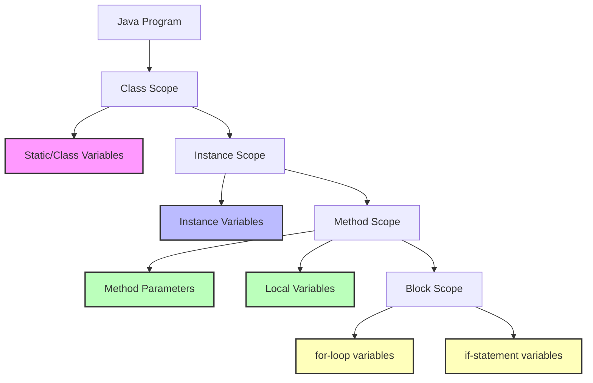

# Java Scope

## Introduction

When you write Java programs, understanding **scope** is crucial to writing effective and error-free code. Scope refers to the region of a program where a variable is accessible or visible. In Java, variables can exist in different scopes, which determines when and where you can use them in your code.

Think of scope as the "lifetime" and "visibility" of a variable. Some variables exist only within a small section of code, while others can be accessed throughout an entire class or program.

In this tutorial, we'll explore the different types of scope in Java, how they work, and how understanding scope can help you write better code.

## Types of Variable Scope in Java

Java has several levels of variable scope:

1. **Class/Static Variables** (declared with the `static` keyword)
2. **Instance Variables** (declared in a class but outside any method)
3. **Local Variables** (declared inside a method or block)
4. **Block Scope** (variables inside loops, if statements, etc.)
5. **Method Parameters** (variables defined in method declarations)

Let's explore each one with examples.

## Class/Static Variables

Class variables (also known as static variables) are declared with the `static` keyword inside a class but outside any method. They belong to the class rather than any specific instance of the class and exist for the entire life of your program.

```java
public class ScopeExample {
    // Class/static variable
    static int classVariable = 10;
    
    public static void main(String[] args) {
        System.out.println("Class variable: " + classVariable);
        classVariable = 20;
        System.out.println("Modified class variable: " + classVariable);
        
        anotherMethod();
    }
    
    public static void anotherMethod() {
        // Can access the class variable from any method in the class
        System.out.println("Class variable in another method: " + classVariable);
    }
}
```

**Output:**
```
Class variable: 10
Modified class variable: 20
Class variable in another method: 20
```

Key points about class variables:
- They are created when the class is loaded
- They exist as long as the class is loaded in memory
- Only one copy exists regardless of how many objects are created
- They can be accessed directly using the class name: `ScopeExample.classVariable`

## Instance Variables

Instance variables are declared inside a class but outside any method, and without the `static` keyword. Each object created from the class gets its own copy of these variables.

```java
public class Student {
    // Instance variables
    String name;
    int age;
    
    public Student(String name, int age) {
        this.name = name;
        this.age = age;
    }
    
    public void displayInfo() {
        // Can access instance variables within any instance method
        System.out.println("Name: " + name + ", Age: " + age);
    }
    
    public static void main(String[] args) {
        Student student1 = new Student("Alice", 20);
        Student student2 = new Student("Bob", 22);
        
        student1.displayInfo();
        student2.displayInfo();
    }
}
```

**Output:**
```
Name: Alice, Age: 20
Name: Bob, Age: 22
```

Key points about instance variables:
- Each object has its own separate copy
- They are created when an object is created using the `new` keyword
- They exist as long as the object exists
- They can be accessed from any instance method in the class
- They cannot be accessed directly from static methods (without an object reference)

## Local Variables

Local variables are declared inside a method or block and are only accessible within that method or block.

```java
public class LocalVariableDemo {
    
    public static void main(String[] args) {
        // Local variable
        int x = 100;
        System.out.println("Local variable x: " + x);
        
        // Another local variable
        String message = "Hello, local scope!";
        System.out.println(message);
        
        // This would cause a compilation error:
        // System.out.println(y);  // y is not defined yet
        
        anotherMethod();
        
        // This would also cause a compilation error:
        // System.out.println(z);  // z only exists in anotherMethod()
    }
    
    public static void anotherMethod() {
        // Different local variable (different scope)
        int z = 200;
        System.out.println("Local variable z in anotherMethod: " + z);
        
        // This would cause a compilation error:
        // System.out.println(x);  // Cannot access x from main method
    }
}
```

**Output:**
```
Local variable x: 100
Hello, local scope!
Local variable z in anotherMethod: 200
```

Key points about local variables:
- Only exist within the method or block where they're declared
- Created when the method is called or when execution enters the block
- Destroyed when the method completes or when execution leaves the block
- Cannot be accessed from outside their scope
- Local variables must be initialized before use

## Block Scope

Block scope refers to variables declared inside a specific block of code, such as within an if statement, for loop, or any code enclosed by curly braces `{}`.

```java
public class BlockScopeDemo {
    
    public static void main(String[] args) {
        boolean isValid = true;
        
        // Variables in if-block
        if (isValid) {
            int validScore = 100;  // only exists within this if block
            System.out.println("Valid score: " + validScore);
        }
        // This would cause a compilation error:
        // System.out.println(validScore);  // validScore no longer exists here
        
        // Variables in for-loop
        for (int i = 0; i < 3; i++) {
            String message = "Iteration " + i;  // recreated each iteration
            System.out.println(message);
        }
        // This would cause a compilation error:
        // System.out.println(i);  // i only exists within the for loop
        // System.out.println(message);  // message only exists within the for loop
        
        // Creating a new block
        {
            int blockVar = 500;
            System.out.println("Inside block: " + blockVar);
        }
        // This would cause a compilation error:
        // System.out.println(blockVar);  // blockVar only exists within that block
    }
}
```

**Output:**
```
Valid score: 100
Iteration 0
Iteration 1
Iteration 2
Inside block: 500
```

## Method Parameters

Method parameters are variables that are declared in a method's signature. They act as local variables within the method.

```java
public class ParameterScopeDemo {
    
    public static void main(String[] args) {
        int number = 5;
        String name = "Original";
        
        modifyValues(number, name);
        
        // Original values remain unchanged
        System.out.println("In main - number: " + number);
        System.out.println("In main - name: " + name);
    }
    
    public static void modifyValues(int number, String name) {
        // Parameters number and name are local to this method
        number = 10;
        name = "Modified";
        
        System.out.println("In method - number: " + number);
        System.out.println("In method - name: " + name);
    }
}
```

**Output:**
```
In method - number: 10
In method - name: Modified
In main - number: 5
In main - name: Original
```

Key points about method parameters:
- They are local variables with initial values provided by the caller
- They exist only within the method
- Changes to primitive parameter values don't affect the original variables
- Changes to object parameters can affect the original objects (but not the references themselves)

## Scope Shadowing

Scope shadowing occurs when a variable in an inner scope has the same name as a variable in an outer scope. The inner variable "shadows" the outer one, making it temporarily inaccessible.

```java
public class ShadowingDemo {
    // Class variable
    static int x = 10;
    
    // Instance variable
    int y = 20;
    
    public void demoMethod() {
        // Local variable - shadows the class variable 'x'
        int x = 100;
        
        // Local variable - shadows the instance variable 'y'
        int y = 200;
        
        System.out.println("Local x: " + x);  // 100 (local variable)
        System.out.println("Local y: " + y);  // 200 (local variable)
        
        // How to access the shadowed class variable
        System.out.println("Class x: " + ShadowingDemo.x);  // 10 (class variable)
        
        // How to access the shadowed instance variable
        System.out.println("Instance y: " + this.y);  // 20 (instance variable)
    }
    
    public static void main(String[] args) {
        ShadowingDemo demo = new ShadowingDemo();
        demo.demoMethod();
    }
}
```

**Output:**
```
Local x: 100
Local y: 200
Class x: 10
Instance y: 20
```

## Variable Scope Diagram

Here's a visual representation of how variable scopes work in Java:



## Practical Example: A Banking Application

Let's see how variable scopes work in a more practical example of a simple banking application:

```java
public class BankAccount {
    // Class/static variable (shared across all accounts)
    private static int totalAccounts = 0;
    private static final double INTEREST_RATE = 0.05; // 5% interest
    
    // Instance variables (unique to each account)
    private String accountNumber;
    private String accountHolder;
    private double balance;
    
    public BankAccount(String accountHolder, double initialDeposit) {
        // Local variables in constructor
        String prefix = "ACCT";
        int accountId = ++totalAccounts;
        
        this.accountHolder = accountHolder;
        this.accountNumber = prefix + accountId;
        this.balance = initialDeposit;
        
        System.out.println("Created account: " + this.accountNumber);
    }
    
    public void deposit(double amount) {
        // Parameter 'amount' is a local variable to this method
        if (amount > 0) {
            balance += amount; // Using instance variable
            System.out.println("Deposited: $" + amount);
            showBalance();
        } else {
            System.out.println("Invalid deposit amount!");
        }
    }
    
    public void withdraw(double amount) {
        // Parameter 'amount' is a local variable to this method
        if (amount > 0) {
            if (balance >= amount) {
                balance -= amount; // Using instance variable
                System.out.println("Withdrew: $" + amount);
                showBalance();
            } else {
                System.out.println("Insufficient funds!");
            }
        } else {
            System.out.println("Invalid withdrawal amount!");
        }
    }
    
    public void applyInterest() {
        // Using static variable INTEREST_RATE
        // Using instance variable balance
        double interestAmount = balance * INTEREST_RATE;
        balance += interestAmount;
        System.out.println("Applied interest: $" + interestAmount);
        showBalance();
    }
    
    private void showBalance() {
        System.out.println("Current balance: $" + balance);
    }
    
    public static int getTotalAccounts() {
        // This method can only access static variables directly
        return totalAccounts;
    }
    
    public static void main(String[] args) {
        System.out.println("Total accounts: " + getTotalAccounts());
        
        BankAccount account1 = new BankAccount("Alice Smith", 1000);
        account1.deposit(500);
        account1.withdraw(200);
        account1.applyInterest();
        
        BankAccount account2 = new BankAccount("Bob Jones", 2000);
        account2.deposit(1000);
        
        // Using class variable through static method
        System.out.println("Total accounts: " + getTotalAccounts());
    }
}
```

**Output:**
```
Total accounts: 0
Created account: ACCT1
Deposited: $500.0
Current balance: $1500.0
Withdrew: $200.0
Current balance: $1300.0
Applied interest: $65.0
Current balance: $1365.0
Created account: ACCT2
Deposited: $1000.0
Current balance: $3000.0
Total accounts: 2
```

In this example:
- `totalAccounts` and `INTEREST_RATE` are class variables shared across all BankAccount instances
- `accountNumber`, `accountHolder`, and `balance` are instance variables unique to each account
- Method parameters like `amount` in deposit and withdraw are local to those methods
- Local variables like `prefix` and `accountId` in the constructor exist only during account creation
- `interestAmount` in the applyInterest method is a local variable

## Common Scope-Related Errors

Understanding scope helps you avoid these common errors:

1. **Cannot find symbol** - Trying to access a variable outside its scope
2. **Variable already defined** - Declaring the same variable name twice in the same scope
3. **Non-static variable cannot be referenced from a static context** - Trying to access instance variables from static methods

## Best Practices for Variable Scope

1. **Keep variables in the smallest scope needed**: Declare variables in the most limited scope where they're needed to improve code readability and reduce errors.

2. **Avoid shadowing variables**: Try not to use the same variable names in inner scopes that already exist in outer scopes.

3. **Be careful with class variables**: Since they are shared across the entire class, changes in one place affect all usages.

4. **Initialize variables when declaring them**: This makes your code clearer and prevents uninitialized variable errors.

5. **Use descriptive variable names**: Good names help clarify the variable's purpose and make the scope more intuitive.

## Summary

Java's variable scope rules determine where in your code you can access a particular variable:

- **Class/static variables** are accessible throughout the class from any static or instance method
- **Instance variables** are tied to object instances and accessible from any instance method
- **Local variables** only exist within their defining method or block
- **Block scope variables** only exist within their defining code block (loops, if statements, etc.)
- **Method parameters** act as local variables within a method

Understanding Java scope is essential for writing clean, error-free code and helps you avoid common problems like variable shadowing and "variable not found" errors.

## Exercises

1. Create a class with instance, static, and local variables. Write methods that demonstrate how each can be accessed.

2. Write a program that demonstrates variable shadowing and how to access shadowed variables.

3. Create a class that simulates a simple inventory system. Use different types of variables with appropriate scopes (class variables for inventory shared information, instance variables for individual items, local variables for calculations).

4. Debug a program where scope issues are causing errors:
   ```java
   public class ScopeDebuggingExercise {
       static int counter = 0;
       
       public static void main(String[] args) {
           int x = 10;
           
           if(x > 5) {
               int y = 20;
               counter = y + x;
           }
           
           // What will work and what will cause errors?
           System.out.println(x);
           System.out.println(counter);
           System.out.println(y); // This will cause an error - fix it!
       }
   }
   ```

## Additional Resources

- [Java Language Specification - Variables](https://docs.oracle.com/javase/specs/jls/se17/html/jls-4.html#jls-4.12)
- [Oracle's Java Tutorials - Variables](https://docs.oracle.com/javase/tutorial/java/nutsandbolts/variables.html)
- [Java Variable Scope in Depth](https://www.baeldung.com/java-variable-scope)

Remember, mastering variable scope is a fundamental skill that will help you write more maintainable and bug-free Java code!