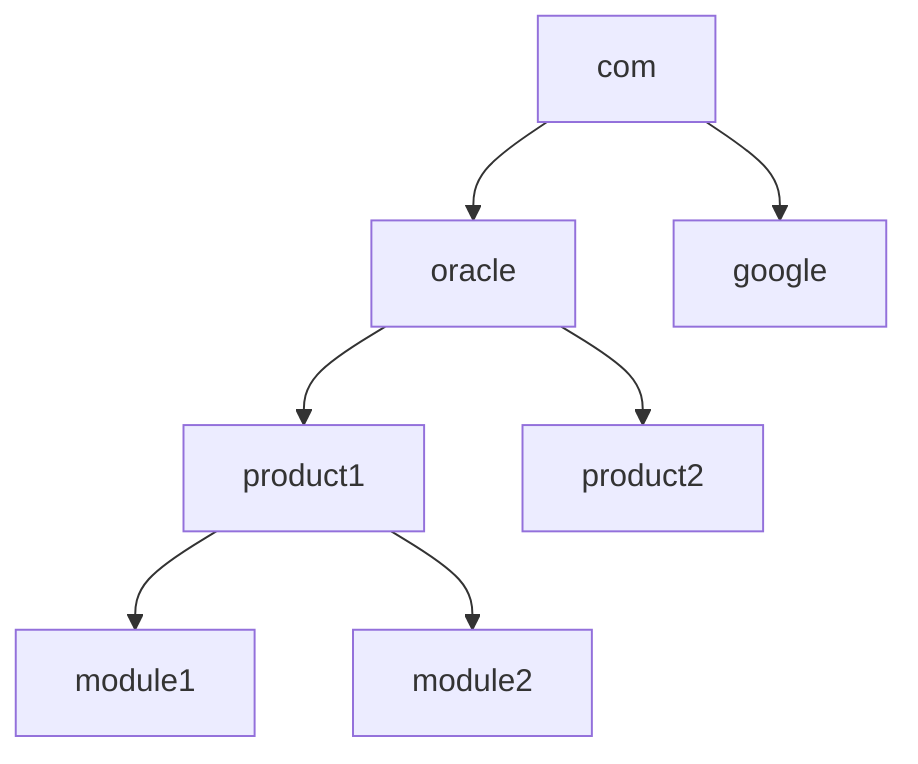

# Java Packages

## Introduction

In Java, packages are a way to organize related classes, interfaces, and sub-packages. Think of packages as folders in your file system that help keep your code organized and maintainable. As your Java projects grow in size and complexity, packages become essential for:

- **Organizing code**: Group related classes and interfaces logically
- **Avoiding naming conflicts**: Create unique namespaces to prevent class name collisions
- **Controlling access**: Restrict access to certain classes and class members
- **Making code more reusable**: Create modular components that can be used across projects

In this tutorial, we'll explore Java packages in depth, learn how to use existing packages, and create our own custom packages.

## Understanding Java Package Structure

Java uses a hierarchical naming convention for packages, similar to domain names but in reverse order. For example, Oracle's Java packages use `com.oracle.product.module` structure.



### Package Naming Conventions

Java package names are typically all lowercase and follow these conventions:

- Start with your organization's domain name in reverse (e.g., `com.company`)
- Add project name and logical group names as needed
- Avoid Java keywords in package names
- Separate words with underscores if needed (though camelCase is more common in class names)

Examples of valid package names:
- `com.mycompany.accounting`
- `org.nonprofit.donation.processing`
- `edu.university.research.ai`

## Using Built-in Java Packages

Java comes with many built-in packages that provide essential functionality. The most commonly used ones include:

### The `java.lang` Package

This is the core package automatically imported into every Java program. It contains fundamental classes like `String`, `System`, `Object`, and primitive wrapper classes.

```java
// No import needed for java.lang
public class StringExample {
    public static void main(String[] args) {
        String message = "Hello, Packages!";
        System.out.println(message.toUpperCase());
        System.out.println("Length: " + message.length());
    }
}
```

**Output:**
```
HELLO, PACKAGES!
Length: 16
```

### The `java.util` Package

This package contains utility classes including collections, date and time facilities, and more.

```java
import java.util.ArrayList;
import java.util.Scanner;

public class UtilExample {
    public static void main(String[] args) {
        // Using ArrayList from java.util
        ArrayList<String> languages = new ArrayList<>();
        languages.add("Java");
        languages.add("Python");
        languages.add("JavaScript");
        
        System.out.println("Programming Languages:");
        for (String language : languages) {
            System.out.println("- " + language);
        }
        
        // Using Scanner from java.util
        Scanner scanner = new Scanner(System.in);
        System.out.print("Enter your favorite language: ");
        String favorite = scanner.nextLine();
        System.out.println("You entered: " + favorite);
        scanner.close();
    }
}
```

**Output (assuming user entered "Java"):**
```
Programming Languages:
- Java
- Python
- JavaScript
Enter your favorite language: Java
You entered: Java
```

### Other Common Built-in Packages

- `java.io`: Input/output operations
- `java.net`: Networking capabilities
- `java.time`: Date and time API (Java 8+)
- `java.math`: Mathematical functions and operations
- `javax.*`: Extended Java API packages

## Importing Packages

To use classes from packages in your code, you need to import them. There are several ways to do this:

### Single Class Import

Import a specific class from a package:

```java
import java.util.ArrayList;

public class SingleImportExample {
    public static void main(String[] args) {
        ArrayList<String> items = new ArrayList<>();
        items.add("Item 1");
        System.out.println(items);
    }
}
```

### Wildcard Import

Import all classes from a package using the `*` wildcard:

```java
import java.util.*;

public class WildcardImportExample {
    public static void main(String[] args) {
        ArrayList<String> list = new ArrayList<>();
        HashMap<String, Integer> map = new HashMap<>();
        list.add("Test");
        map.put("Key", 100);
        System.out.println(list);
        System.out.println(map);
    }
}
```

### Fully Qualified Names

Use the full package and class name without import statements:

```java
public class FullyQualifiedExample {
    public static void main(String[] args) {
        java.util.ArrayList<String> list = new java.util.ArrayList<>();
        list.add("No import needed");
        System.out.println(list);
        
        // Using java.time without import
        java.time.LocalDate today = java.time.LocalDate.now();
        System.out.println("Today is: " + today);
    }
}
```

## Creating Your Own Package

Now let's learn how to create and use your own packages.

### Step 1: Define the Package Structure

First, decide on a package name and create the appropriate directory structure. For a package named `com.mycompany.utilities`, create directories:
`com/mycompany/utilities/`

### Step 2: Add Package Declaration to Your Classes

Add the package declaration at the top of your class files:

```java
// File: com/mycompany/utilities/MathUtils.java
package com.mycompany.utilities;

public class MathUtils {
    public static int add(int a, int b) {
        return a + b;
    }
    
    public static int subtract(int a, int b) {
        return a - b;
    }
    
    public static int multiply(int a, int b) {
        return a * b;
    }
    
    public static double divide(int a, int b) {
        if (b == 0) {
            throw new ArithmeticException("Cannot divide by zero");
        }
        return (double) a / b;
    }
}
```

```java
// File: com/mycompany/utilities/StringUtils.java
package com.mycompany.utilities;

public class StringUtils {
    public static String reverse(String input) {
        if (input == null) return null;
        
        StringBuilder reversed = new StringBuilder();
        for (int i = input.length() - 1; i >= 0; i--) {
            reversed.append(input.charAt(i));
        }
        return reversed.toString();
    }
    
    public static boolean isPalindrome(String input) {
        if (input == null) return false;
        
        String cleaned = input.replaceAll("\\s+", "").toLowerCase();
        return cleaned.equals(reverse(cleaned));
    }
}
```

### Step 3: Compile Your Package

Compile your package from the root directory:

```bash
javac com/mycompany/utilities/*.java
```

### Step 4: Using Your Package

Now you can use your package in other Java classes:

```java
// File: PackageDemo.java
import com.mycompany.utilities.MathUtils;
import com.mycompany.utilities.StringUtils;

public class PackageDemo {
    public static void main(String[] args) {
        // Using MathUtils
        int sum = MathUtils.add(5, 10);
        int product = MathUtils.multiply(4, 5);
        System.out.println("Sum: " + sum);
        System.out.println("Product: " + product);
        
        // Using StringUtils
        String original = "Java Packages are cool";
        String reversed = StringUtils.reverse(original);
        System.out.println("Original: " + original);
        System.out.println("Reversed: " + reversed);
        
        // Testing palindrome
        String text = "A man a plan a canal Panama";
        boolean isPalindrome = StringUtils.isPalindrome(text);
        System.out.println("'" + text + "' is a palindrome: " + isPalindrome);
    }
}
```

**Output:**
```
Sum: 15
Product: 20
Original: Java Packages are cool
Reversed: looc era segakcaP avaJ
'A man a plan a canal Panama' is a palindrome: true
```

## Package Access Control

Java uses packages for access control through access modifiers:

| Modifier    | Class | Package | Subclass | World |
|-------------|-------|---------|----------|-------|
| public      | Yes   | Yes     | Yes      | Yes   |
| protected   | Yes   | Yes     | Yes      | No    |
| no modifier (default) | Yes   | Yes     | No       | No    |
| private     | Yes   | No      | No       | No    |

### Package-Private Access (Default)

When no access modifier is specified, it's called "package-private" - only accessible within the same package:

```java
// File: com/mycompany/utilities/internal/Logger.java
package com.mycompany.utilities.internal;

class Logger {  // No access modifier = package-private
    static void log(String message) {
        System.out.println("[LOG] " + message);
    }
}
```

Other classes in the same package can use `Logger`, but classes in different packages cannot.

## Creating a JAR File for Your Package

To distribute your package, you can create a JAR (Java Archive) file:

```bash
# Create a JAR file with your package
jar cf utilities.jar com/mycompany/utilities/*.class

# To use the JAR in another project, add it to the classpath
java -cp .:utilities.jar YourMainClass
```

## Real-World Example: Logger Package

Let's create a simple logger package that could be used in real applications:

```java
// File: com/mycompany/logger/LogLevel.java
package com.mycompany.logger;

public enum LogLevel {
    DEBUG, INFO, WARNING, ERROR, FATAL
}
```

```java
// File: com/mycompany/logger/Logger.java
package com.mycompany.logger;

import java.time.LocalDateTime;
import java.time.format.DateTimeFormatter;

public class Logger {
    private String className;
    private static LogLevel minimumLogLevel = LogLevel.INFO;
    
    public Logger(Class<?> clazz) {
        this.className = clazz.getSimpleName();
    }
    
    public static void setMinimumLogLevel(LogLevel level) {
        minimumLogLevel = level;
    }
    
    public void debug(String message) {
        log(LogLevel.DEBUG, message);
    }
    
    public void info(String message) {
        log(LogLevel.INFO, message);
    }
    
    public void warning(String message) {
        log(LogLevel.WARNING, message);
    }
    
    public void error(String message) {
        log(LogLevel.ERROR, message);
    }
    
    public void fatal(String message) {
        log(LogLevel.FATAL, message);
    }
    
    private void log(LogLevel level, String message) {
        if (level.ordinal() >= minimumLogLevel.ordinal()) {
            String timestamp = LocalDateTime.now().format(DateTimeFormatter.ofPattern("yyyy-MM-dd HH:mm:ss"));
            System.out.println(timestamp + " [" + level + "] " + className + ": " + message);
        }
    }
}
```

Now we can use our logger in another class:

```java
// File: LoggerDemo.java
import com.mycompany.logger.Logger;
import com.mycompany.logger.LogLevel;

public class LoggerDemo {
    // Create a logger instance for this class
    private static final Logger logger = new Logger(LoggerDemo.class);
    
    public static void main(String[] args) {
        // Set minimum log level
        Logger.setMinimumLogLevel(LogLevel.DEBUG);
        
        logger.debug("This is a debug message");
        logger.info("Application started successfully");
        logger.warning("Configuration file not found, using defaults");
        logger.error("Failed to connect to database");
        logger.fatal("System shutdown due to critical error");
        
        // Change log level to only show warnings and above
        Logger.setMinimumLogLevel(LogLevel.WARNING);
        logger.debug("This debug message won't be displayed");
        logger.info("This info message won't be displayed");
        logger.warning("But this warning will be shown");
    }
}
```

**Output:**
```
2023-08-15 14:23:42 [DEBUG] LoggerDemo: This is a debug message
2023-08-15 14:23:42 [INFO] LoggerDemo: Application started successfully
2023-08-15 14:23:42 [WARNING] LoggerDemo: Configuration file not found, using defaults
2023-08-15 14:23:42 [ERROR] LoggerDemo: Failed to connect to database
2023-08-15 14:23:42 [FATAL] LoggerDemo: System shutdown due to critical error
2023-08-15 14:23:42 [WARNING] LoggerDemo: But this warning will be shown
```

## Best Practices for Using Packages

1. **Organize packages by feature or layer**: Group classes that work together
2. **Keep package names lowercase**: Follow standard naming conventions
3. **Avoid using default package**: Always specify a package for your classes
4. **Use meaningful package names**: Names should reflect the purpose of the classes inside
5. **Don't make packages too large**: Split them into sub-packages when they grow too big
6. **Use import statements wisely**: Prefer explicit imports over wildcards for better readability
7. **Consider package access**: Use access modifiers appropriately for encapsulation

## Summary

Java packages are a fundamental feature for organizing and structuring your code. They provide:

- A hierarchical organization system for your classes
- Namespace management to avoid naming conflicts
- Access control mechanisms for encapsulation
- A way to create modular, reusable code

By using packages effectively, you can create more maintainable, scalable applications and make your code more accessible to other developers.

## Exercises

1. Create a package called `com.yourname.math` with classes for different geometric shapes (Circle, Rectangle, Triangle) that each have methods to calculate area and perimeter.

2. Create a utility package with classes for common operations like:
   - `StringUtils` with methods for string manipulation
   - `FileUtils` with methods for reading/writing files
   - `ValidationUtils` with methods for validating input

3. Create a package structure for a simple banking application with packages for:
   - Models (Account, Transaction, Customer)
   - Services (AccountService, TransactionService)
   - Utils (Helpers and utility classes)

## Additional Resources

- [Oracle Java Tutorials: Packages](https://docs.oracle.com/javase/tutorial/java/package/index.html)
- [Java Package Documentation](https://docs.oracle.com/en/java/javase/17/docs/api/index.html)
- [Effective Java by Joshua Bloch](https://www.oreilly.com/library/view/effective-java-3rd/9780134686097/) - Contains excellent advice on package organization
- [Clean Code by Robert C. Martin](https://www.oreilly.com/library/view/clean-code-a/9780136083238/) - Provides principles for well-structured code