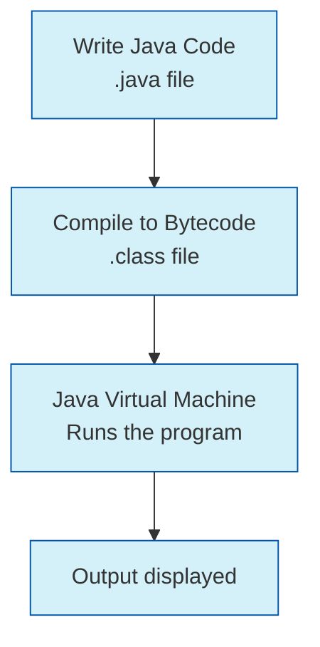

# Java First Program

Welcome to your first steps in Java programming! In this tutorial, you'll learn how to create, understand, and run your very first Java program. By the end, you'll have a solid foundation to build upon as you continue your Java journey.

## Introduction

Every programmer's journey begins with a simple "Hello, World!" program. This tradition dates back decades and serves as an excellent introduction to any programming language. In Java, this first program will help you understand:

- The basic structure of a Java program
- How to compile and run Java code
- Essential components like classes and methods
- How Java outputs information to the screen

Let's dive in and write our first Java program!

## The "Hello, World!" Program

Here's a complete "Hello, World!" program in Java:

```java
public class HelloWorld {
    public static void main(String[] args) {
        System.out.println("Hello, World!");
    }
}
```

**Output:**
```
Hello, World!
```

This simple program, when run, displays the text "Hello, World!" on your screen. While it may look straightforward, there's actually quite a lot happening behind the scenes!

## Breaking Down the Program

Let's analyze each part of our program to understand what's happening:

### 1. Class Declaration

```java
public class HelloWorld {
    // Code goes here
}
```

- `public`: This is an access modifier that makes our class accessible from anywhere.
- `class`: This keyword is used to declare a class in Java.
- `HelloWorld`: This is the name we've given to our class. In Java, class names should begin with a capital letter.

### 2. The Main Method

```java
public static void main(String[] args) {
    // Code statements go here
}
```

- `public`: Again, this access modifier makes our method accessible from anywhere.
- `static`: This keyword means the method belongs to the class itself, not to instances of the class.
- `void`: This is the return type, indicating that this method doesn't return any value.
- `main`: This is the name of the method. The `main` method is special—it's the entry point for your Java application.
- `String[] args`: This parameter allows command-line arguments to be passed to your program.

### 3. The Print Statement

```java
System.out.println("Hello, World!");
```

- `System`: A built-in class that provides access to system resources.
- `out`: A static member of the System class representing the standard output stream.
- `println`: A method that prints the specified text and then moves to a new line.
- `"Hello, World!"`: The text string we want to display.

## How Java Programs Work

Java follows a specific workflow to execute programs:



1. **Write** your Java code in a `.java` file (e.g., `HelloWorld.java`)
2. **Compile** your code using the Java compiler (`javac`), which creates a `.class` file with bytecode
3. **Run** the bytecode using the Java Virtual Machine (`java`)

## Step-by-Step: Creating and Running Your First Program

Let's walk through the process of creating and running our first Java program:

### Step 1: Set Up Your Environment

Ensure you have the Java Development Kit (JDK) installed on your computer. You can verify this by opening a terminal or command prompt and typing:

```bash
java -version
javac -version
```

If these commands display version information, you're ready to go!

### Step 2: Create Your Java File

1. Open a text editor (like Notepad, VS Code, or any code editor)
2. Type in our "Hello, World!" program:

```java
public class HelloWorld {
    public static void main(String[] args) {
        System.out.println("Hello, World!");
    }
}
```

3. Save the file as `HelloWorld.java` (the filename **must** match the class name)

### Step 3: Compile Your Program

Open a terminal or command prompt, navigate to the directory containing your `HelloWorld.java` file, and run:

```bash
javac HelloWorld.java
```

If there are no errors, a new file called `HelloWorld.class` will be created in the same directory.

### Step 4: Run Your Program

In the same terminal, run:

```bash
java HelloWorld
```

You should see the output:

```
Hello, World!
```

Congratulations! You've just written and executed your first Java program!

## Common Issues and Solutions

When writing your first program, you might encounter some issues:

| Issue | Solution |
| ----- | -------- |
| "javac not found" | Make sure JDK is installed and added to your system PATH |
| Class name doesn't match filename | Rename either the class or the file so they match exactly (case-sensitive) |
| Missing semicolon (`;`) | Add the missing semicolon at the end of the statement |
| Incorrect capitalization | Java is case-sensitive, so ensure `System`, `out`, etc., are typed correctly |

## Beyond "Hello, World!"

Let's extend our program to do something slightly more interesting:

```java
public class MyFirstProgram {
    public static void main(String[] args) {
        System.out.println("Hello, Java Programmer!");
        
        // Variables and simple calculation
        int year = 2023;
        int javaAge = year - 1995;
        
        System.out.println("Java has been around for about " + javaAge + " years.");
        
        // Using conditionals
        if(javaAge > 25) {
            System.out.println("That's a mature programming language!");
        } else {
            System.out.println("Java is still quite young!");
        }
    }
}
```

**Output:**
```
Hello, Java Programmer!
Java has been around for about 28 years.
That's a mature programming language!
```

This expanded program demonstrates:
- Outputting text
- Creating and using variables
- Performing simple calculations
- Using conditional statements
- Concatenating strings and variables in output

## Real-World Application Example

Here's how a simple Java program might be used in a real-world scenario:

```java
public class CoffeeMachine {
    public static void main(String[] args) {
        // Variables to represent the coffee machine state
        int waterLevel = 80;  // percentage
        int beanLevel = 50;   // percentage
        String coffeeType = "Espresso";
        
        // Display machine status
        System.out.println("Coffee Machine Status:");
        System.out.println("Water: " + waterLevel + "%");
        System.out.println("Coffee Beans: " + beanLevel + "%");
        
        // Prepare coffee logic
        System.out.println("\nPreparing " + coffeeType + "...");
        
        // Check if resources are sufficient
        if (waterLevel >= 20 && beanLevel >= 15) {
            System.out.println("Your " + coffeeType + " is ready!");
            // Update resource levels after making coffee
            waterLevel -= 20;
            beanLevel -= 15;
            System.out.println("Water remaining: " + waterLevel + "%");
            System.out.println("Coffee beans remaining: " + beanLevel + "%");
        } else {
            System.out.println("Not enough resources to make " + coffeeType);
            System.out.println("Please refill water and/or coffee beans.");
        }
    }
}
```

**Output:**
```
Coffee Machine Status:
Water: 80%
Coffee Beans: 50%

Preparing Espresso...
Your Espresso is ready!
Water remaining: 60%
Coffee beans remaining: 35%
```

This example shows how Java can model a simple coffee machine system, tracking resources and making decisions based on available supplies.

## Summary

In this tutorial, you've learned:

- How to write a basic Java program with the traditional "Hello, World!" example
- The structure and components of a Java program, including classes and the main method
- The process of compiling and running Java code
- How to extend your program with variables, calculations, and conditional statements
- A glimpse at how Java can be applied to model real-world systems

Writing your first program is just the beginning of your Java journey. As you progress, you'll discover the powerful features and capabilities that make Java one of the world's most popular programming languages.

## Practice Exercises

To reinforce what you've learned, try these exercises:

1. **Modify the Hello World program** to display your name and current date
2. **Create a simple calculator program** that adds two numbers and displays the result
3. **Write a temperature converter** that converts Celsius to Fahrenheit
4. **Create a program** that displays a pattern of asterisks forming a simple shape

## Additional Resources

- [Oracle's Java Tutorials](https://docs.oracle.com/javase/tutorial/)
- [Java Documentation](https://docs.oracle.com/en/java/)
- [W3Schools Java Tutorial](https://www.w3schools.com/java/)
- [CodeAcademy Java Course](https://www.codecademy.com/learn/learn-java)

Happy coding on your Java journey!