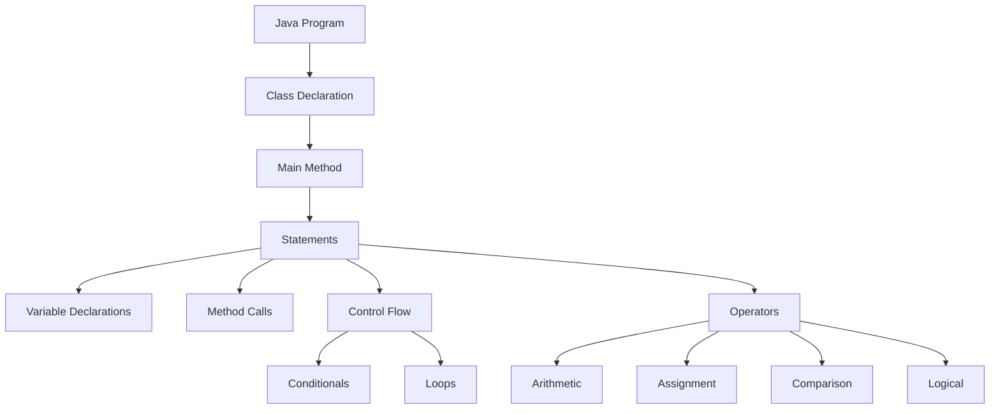

# Java Syntax

## Introduction

Java syntax is the set of rules that define how Java programs are written and interpreted. Understanding Java's syntax is the first step toward becoming proficient in the language. This guide will walk you through the basic elements of Java syntax, from program structure to variables, operators, and control flow statements.

Java is known for its clarity and readability. While it may seem strict compared to some other languages, this strictness helps prevent errors and makes code more maintainable. Let's dive into the fundamental building blocks of Java syntax!

## Basic Program Structure

Every Java program consists of at least one class. The simplest Java program looks like this:

```java
public class HelloWorld {
    public static void main(String[] args) {
        System.out.println("Hello, World!");
    }
}
```

**Output:**
```
Hello, World!
```

Let's break down this example:

1. `public class HelloWorld`: Declares a public class named "HelloWorld". In Java, the class name must match the file name (`HelloWorld.java`).
2. `public static void main(String[] args)`: The main method - the entry point of any Java program.
3. `System.out.println("Hello, World!");`: A statement that prints text to the console.
4. Each statement ends with a semicolon (`;`).
5. Code blocks are enclosed in curly braces `{ }`.

## Comments in Java

Comments are notes that explain your code but are ignored by the compiler. Java supports three types of comments:

```java
// Single-line comment

/* Multi-line comment
   that spans several lines */

/**
 * Documentation comment (Javadoc)
 * Used for generating documentation
 * @author Your Name
 */
```

## Variables and Data Types

Java is a strongly-typed language, meaning you must declare the type of each variable before using it.

### Primitive Data Types

Java has eight primitive data types:

```java
// Numeric types
byte smallNumber = 100;         // 8-bit integer (-128 to 127)
short mediumNumber = 10000;     // 16-bit integer (-32,768 to 32,767)
int number = 100000;            // 32-bit integer
long largeNumber = 15000000000L; // 64-bit integer (note the 'L' suffix)

// Floating-point types
float decimal = 3.14f;          // 32-bit floating point (note the 'f' suffix)
double preciseDecimal = 3.141592653589793; // 64-bit floating point

// Character type
char letter = 'A';              // Single 16-bit Unicode character

// Boolean type
boolean isTrue = true;          // true or false
```

### Reference Data Types

These are objects created from classes:

```java
String message = "Hello, Java!"; // String is a commonly used reference type
int[] numbers = {1, 2, 3, 4, 5}; // Arrays are reference types too
```

## Variable Declaration and Assignment

You can declare variables and assign values in different ways:

```java
// Declaration and assignment in one line
int age = 25;

// Declaration first, assignment later
double salary;
salary = 50000.50;

// Multiple variables of the same type
int x = 10, y = 20, z = 30;
```

## Constants

Constants are variables whose values cannot be changed after initialization:

```java
final double PI = 3.14159;
// PI = 3.14; // This would cause a compilation error
```

## Basic Operators

Java provides various operators for performing operations:

### Arithmetic Operators

```java
int a = 10;
int b = 3;

int sum = a + b;        // Addition: 13
int difference = a - b; // Subtraction: 7
int product = a * b;    // Multiplication: 30
int quotient = a / b;   // Division: 3 (integer division)
int remainder = a % b;  // Modulus: 1 (remainder)

System.out.println("Sum: " + sum);
System.out.println("Difference: " + difference);
System.out.println("Product: " + product);
System.out.println("Quotient: " + quotient);
System.out.println("Remainder: " + remainder);
```

**Output:**
```
Sum: 13
Difference: 7
Product: 30
Quotient: 3
Remainder: 1
```

### Assignment Operators

```java
int x = 10;
x += 5;  // Same as x = x + 5; (x is now 15)
x -= 3;  // Same as x = x - 3; (x is now 12)
x *= 2;  // Same as x = x * 2; (x is now 24)
x /= 4;  // Same as x = x / 4; (x is now 6)
x %= 4;  // Same as x = x % 4; (x is now 2)
```

### Comparison Operators

```java
int a = 5;
int b = 8;

boolean isEqual = (a == b);      // Equal to: false
boolean notEqual = (a != b);     // Not equal to: true
boolean isGreater = (a > b);     // Greater than: false
boolean isLess = (a < b);        // Less than: true
boolean isGreaterEqual = (a >= b); // Greater than or equal to: false
boolean isLessEqual = (a <= b);  // Less than or equal to: true
```

### Logical Operators

```java
boolean condition1 = true;
boolean condition2 = false;

boolean andResult = condition1 && condition2;  // Logical AND: false
boolean orResult = condition1 || condition2;   // Logical OR: true
boolean notResult = !condition1;               // Logical NOT: false
```

## Control Flow Statements

### If-Else Statements

```java
int score = 85;

if (score >= 90) {
    System.out.println("Grade: A");
} else if (score >= 80) {
    System.out.println("Grade: B");
} else if (score >= 70) {
    System.out.println("Grade: C");
} else if (score >= 60) {
    System.out.println("Grade: D");
} else {
    System.out.println("Grade: F");
}
```

**Output:**
```
Grade: B
```

### Switch Statements

```java
int day = 3;
String dayName;

switch (day) {
    case 1:
        dayName = "Monday";
        break;
    case 2:
        dayName = "Tuesday";
        break;
    case 3:
        dayName = "Wednesday";
        break;
    case 4:
        dayName = "Thursday";
        break;
    case 5:
        dayName = "Friday";
        break;
    case 6:
        dayName = "Saturday";
        break;
    case 7:
        dayName = "Sunday";
        break;
    default:
        dayName = "Invalid day";
        break;
}

System.out.println("Day: " + dayName);
```

**Output:**
```
Day: Wednesday
```

### Loops

#### For Loop

```java
// Print numbers 1 to 5
for (int i = 1; i <= 5; i++) {
    System.out.print(i + " ");
}
```

**Output:**
```
1 2 3 4 5 
```

#### While Loop

```java
// Print numbers 1 to 5
int i = 1;
while (i <= 5) {
    System.out.print(i + " ");
    i++;
}
```

**Output:**
```
1 2 3 4 5 
```

#### Do-While Loop

```java
// Print numbers 1 to 5
int i = 1;
do {
    System.out.print(i + " ");
    i++;
} while (i <= 5);
```

**Output:**
```
1 2 3 4 5 
```

## Java Syntax Overview

Here's a visual representation of Java's syntax components:



## Real-World Example: Simple Temperature Converter

Let's create a simple temperature converter that demonstrates various Java syntax elements:

```java
public class TemperatureConverter {
    public static void main(String[] args) {
        // Constants for conversion formulas
        final double FREEZING_C = 0.0;
        final double FREEZING_F = 32.0;
        final double BOILING_C = 100.0;
        final double BOILING_F = 212.0;
        
        // Conversion factor
        final double CONVERSION_FACTOR = (BOILING_F - FREEZING_F) / (BOILING_C - FREEZING_C);
        
        // Sample temperatures in Celsius
        double[] celsiusTemperatures = {-40.0, 0.0, 15.0, 30.0, 100.0};
        
        // Convert and display temperatures
        System.out.println("Celsius\tFahrenheit");
        System.out.println("-------\t----------");
        
        for (double celsius : celsiusTemperatures) {
            double fahrenheit = (celsius * CONVERSION_FACTOR) + FREEZING_F;
            System.out.printf("%.1f°C\t%.1f°F\n", celsius, fahrenheit);
            
            // Add description of the temperature
            if (celsius <= 0) {
                System.out.println("Freezing or below!");
            } else if (celsius < 20) {
                System.out.println("Cool weather");
            } else if (celsius < 35) {
                System.out.println("Warm weather");
            } else {
                System.out.println("Hot weather");
            }
            System.out.println();
        }
    }
}
```

**Output:**
```
Celsius	Fahrenheit
-------	----------
-40.0°C	-40.0°F
Freezing or below!

0.0°C	32.0°F
Freezing or below!

15.0°C	59.0°F
Cool weather

30.0°C	86.0°F
Warm weather

100.0°C	212.0°F
Hot weather
```

This example combines various syntax elements:
- Variable declarations and constants
- Arrays
- Loops
- Conditional statements
- Formatted output
- Mathematical operations

## Summary

In this guide, we've covered the fundamental syntax of the Java programming language:

- Basic program structure and organization
- Comments for documenting code
- Variables and data types
- Operators for performing various operations
- Control flow statements for decision-making and loops

Understanding Java syntax is essential for becoming proficient in the language. These fundamentals serve as building blocks for more complex Java applications and features.

## Practice Exercises

To reinforce your understanding of Java syntax, try these exercises:

1. Create a simple calculator program that performs addition, subtraction, multiplication, and division.
2. Write a program that checks if a number is prime.
3. Create a program that converts a temperature value between Celsius, Fahrenheit, and Kelvin.
4. Write a program that calculates the area of different shapes (circle, rectangle, triangle).
5. Create a simple grade calculator that takes marks as input and outputs the corresponding letter grade.

## Additional Resources

- [Oracle's Java Tutorials](https://docs.oracle.com/javase/tutorial/)
- [Java Documentation](https://docs.oracle.com/en/java/)
- [W3Schools Java Tutorial](https://www.w3schools.com/java/)
- [Codecademy Java Course](https://www.codecademy.com/learn/learn-java)
- [Java Programming Exercises](https://www.hackerrank.com/domains/java)