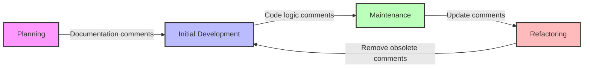

# Java Comments

## Introduction

Comments are non-executable text added to code to provide explanations, documentation, or temporarily disable code sections. Good comments can make your code easier to understand, maintain, and collaborate on, especially for large projects or when working in teams.

In this tutorial, we'll explore:
- Why comments are important
- Types of comments in Java
- Best practices for writing effective comments
- Common use cases for comments

## Why Use Comments?

Before diving into the syntax, let's understand why comments are valuable:

1. **Documentation**: Comments explain what your code does and why.
2. **Readability**: Well-commented code is easier to read and understand.
3. **Collaboration**: Comments help team members understand your code logic.
4. **Debugging**: Comments can help you track and resolve issues.
5. **Code Organization**: Comments can separate logical code sections.

## Types of Java Comments

Java supports three types of comments:

1. Single-line comments
2. Multi-line comments
3. Documentation (Javadoc) comments

Let's explore each type in detail.

### 1. Single-Line Comments

Single-line comments start with `//` and continue until the end of the line. They're perfect for brief explanations.

```java
// This is a single-line comment
int age = 25; // You can also place comments after code
```

### 2. Multi-Line Comments

Multi-line comments start with `/*` and end with `*/`. Everything between these markers is considered a comment, even across multiple lines.

```java
/* This is a multi-line comment.
   It spans several lines.
   Use it for longer explanations. */
   
int result = calculateTotal(/* you can even comment in the middle of a line */items);
```

### 3. Documentation (Javadoc) Comments

Javadoc comments are special multi-line comments that start with `/**` and end with `*/`. They're used to generate documentation for your code.

```java
/**
 * This is a Javadoc comment.
 * 
 * @param name The person's name
 * @return A greeting message
 */
public String greet(String name) {
    return "Hello, " + name + "!";
}
```

## Examples in Practice

Let's see how these comment types work in a simple program:

```java
/**
 * A simple program to demonstrate Java comments
 * 
 * @author YourName
 * @version 1.0
 */
public class CommentsDemo {
    
    public static void main(String[] args) {
        // Declare and initialize variables
        int x = 10;
        int y = 20;
        
        /* Calculate the sum of x and y
           and store it in the result variable */
        int result = x + y;
        
        // Display the result
        System.out.println("The sum is: " + result); // Prints 30
    }
    
    /**
     * Calculates the average of two numbers.
     *
     * @param a The first number
     * @param b The second number
     * @return The average of a and b
     */
    public static double calculateAverage(double a, double b) {
        return (a + b) / 2;
    }
}
```

**Output:**
```
The sum is: 30
```

## Real-World Application

Let's examine a more practical example: a simple bank account class with comments:

```java
/**
 * Represents a bank account for a customer.
 * This class provides basic banking functionality like deposits and withdrawals.
 * 
 * @author YourName
 * @version 2.1
 */
public class BankAccount {
    
    // Instance variables
    private String accountNumber;
    private String accountHolder;
    private double balance;
    private boolean active;
    
    /**
     * Constructs a new BankAccount with specified details.
     * 
     * @param accountNumber Unique identifier for this account
     * @param accountHolder Name of the account owner
     * @param initialBalance Starting balance for the account
     */
    public BankAccount(String accountNumber, String accountHolder, double initialBalance) {
        this.accountNumber = accountNumber;
        this.accountHolder = accountHolder;
        this.balance = initialBalance;
        this.active = true;  // All new accounts are active by default
    }
    
    /**
     * Deposits money into this account.
     * 
     * @param amount The amount to deposit
     * @return true if deposit was successful, false otherwise
     * @throws IllegalArgumentException if amount is negative
     */
    public boolean deposit(double amount) {
        // Check if amount is valid
        if (amount < 0) {
            throw new IllegalArgumentException("Cannot deposit negative amount");
        }
        
        // Check if account is active
        if (!active) {
            return false; // Cannot deposit to inactive account
        }
        
        // Update balance
        balance += amount;
        return true;
    }
    
    /**
     * Withdraws money from this account.
     * 
     * @param amount The amount to withdraw
     * @return true if withdrawal was successful, false otherwise
     */
    public boolean withdraw(double amount) {
        /* The withdrawal will only succeed if:
           1. The account is active
           2. The amount is positive
           3. There are sufficient funds */
        
        // Basic validation
        if (!active || amount < 0) {
            return false;
        }
        
        // Check for sufficient funds
        if (balance < amount) {
            return false; // Insufficient funds
        }
        
        // Process withdrawal
        balance -= amount;
        return true;
    }
    
    // Getter methods
    public double getBalance() {
        return balance;
    }
    
    public String getAccountNumber() {
        return accountNumber;
    }
}
```

## Best Practices for Comments

To write effective comments:

1. **Be clear and concise**: Avoid unnecessary verbosity
2. **Focus on why, not what**: Explain why the code does something, not what it does (the code already shows that)
3. **Keep comments up-to-date**: Update comments when you change the code
4. **Use appropriate comment types**: Use single-line for brief notes, multi-line for longer explanations
5. **Document public APIs with Javadoc**: This helps generate documentation
6. **Avoid obvious comments**: Don't add comments for self-explanatory code
7. **Use comments for complex logic**: Explain any complex algorithms or business rules

### Comments to Avoid

```java
// Bad comments:

// Increment i by 1
i++;  // This is obvious from the code

/* 
* Author: John
* Date: 1/1/2023
* This function adds two numbers
*/
public int add(int a, int b) {  // Too verbose for a simple function
    return a + b;
}
```

### Better Comments

```java
// Good comments:

// Skip processing for inactive users to improve performance
if (!user.isActive()) {
    return;
}

/* 
* Apply discount based on the following business rules:
* - Gold members: 15%
* - Silver members: 10%
* - Bronze members: 5%
*/
double discountRate = calculateDiscount(memberType);
```

## Comments in the Development Process

Comments serve different purposes during the development lifecycle:



### Temporary Comments for Debugging

Comments can also be used temporarily during development:

```java
public void processOrder(Order order) {
    // TODO: Implement validation logic before processing
    
    // DEBUG: Print order details during development
    // System.out.println("Processing order: " + order.getId());
    
    // FIXME: This calculation is incorrect for international orders
    double tax = order.getTotal() * 0.08;
    
    // Process the order...
}
```

Common prefixes like `TODO:`, `FIXME:`, and `NOTE:` help highlight specific actions needed.

## Summary

Comments are a vital tool in Java programming that help make your code more understandable, maintainable, and collaborative. We covered:

- The three types of Java comments: single-line, multi-line, and Javadoc
- How to use each comment type appropriately
- Best practices for writing effective comments
- Real-world examples of well-commented code

Remember, good comments explain the "why" behind your code, not just the "what." As you develop your Java skills, aim to write clean, self-explanatory code supplemented by meaningful comments when needed.

## Practice Exercises

1. Take a simple Java program you've written and add appropriate comments to it using all three types of comments.
2. Find a piece of uncommented code and add meaningful comments to explain its functionality.
3. Review some existing commented code and identify any comments that could be improved according to the best practices we discussed.
4. Write Javadoc comments for a class with multiple methods, including parameter descriptions and return value documentation.

## Additional Resources

- [Oracle's Java Documentation Guide](https://www.oracle.com/technical-resources/articles/java/javadoc-tool.html)
- [Google Java Style Guide - Comments](https://google.github.io/styleguide/javaguide.html#s7-javadoc)
- Book: "Clean Code" by Robert C. Martin (Chapter on Comments)
- [Javadoc Tool Documentation](https://docs.oracle.com/javase/8/docs/technotes/tools/windows/javadoc.html)

Happy coding and commenting!