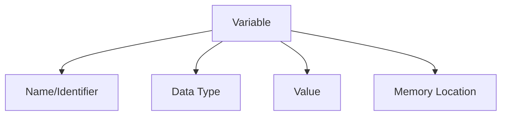

# Java Variables

## Introduction

Variables are fundamental building blocks in any programming language, including Java. They act as containers that store data which can be manipulated throughout your program. Think of variables as labeled boxes where you can put different types of information that your program needs to remember.

In this tutorial, you'll learn:
- What variables are in Java
- How to declare and initialize variables
- Different data types in Java
- Variable naming conventions
- Variable scope
- Best practices for using variables

## What Are Variables?

In Java, a variable is a named storage location in the computer's memory that contains data which can be modified during program execution. Each variable in Java has:

1. A name (identifier)
2. A data type
3. A value
4. A memory location



## Declaring Variables in Java

To use a variable in Java, you must first declare it, specifying its data type and name.

**Syntax:**
```java
dataType variableName;
```

**Examples:**
```java
// Variable declarations
int age;
double salary;
String name;
boolean isActive;
```

## Initializing Variables

After declaring a variable, you need to assign a value to it before using it. This is called initialization.

**Syntax:**
```java
dataType variableName = value;
```

**Examples:**
```java
// Variable declaration and initialization
int age = 25;
double salary = 50000.50;
String name = "John Doe";
boolean isActive = true;
```

You can also declare multiple variables of the same type in a single line:

```java
int x = 10, y = 20, z = 30;
```

## Java Data Types

Java has two categories of data types:

### 1. Primitive Data Types

Primitive data types are built-in and predefined in Java. They represent simple values.

| Data Type | Size | Description | Range | Example |
|-----------|------|-------------|-------|---------|
| `byte` | 1 byte | Whole number | -128 to 127 | `byte b = 100;` |
| `short` | 2 bytes | Whole number | -32,768 to 32,767 | `short s = 5000;` |
| `int` | 4 bytes | Whole number | -2^31 to 2^31-1 | `int i = 100000;` |
| `long` | 8 bytes | Whole number | -2^63 to 2^63-1 | `long l = 15000000000L;` |
| `float` | 4 bytes | Decimal number | 7 decimal digits | `float f = 5.75f;` |
| `double` | 8 bytes | Decimal number | 15 decimal digits | `double d = 19.99;` |
| `boolean` | 1 bit | True or False | true/false | `boolean b = true;` |
| `char` | 2 bytes | Single character/letter | Unicode characters | `char c = 'A';` |

### 2. Reference Data Types (Object Types)

Reference types are created using defined constructors of the classes and are used to access objects. Examples include:

- `String`
- Arrays
- Classes
- Interfaces
- Enum

Let's see an example with both primitive and reference types:

```java
// Primitive data types
int age = 30;
double price = 19.99;
char grade = 'A';
boolean isRegistered = false;

// Reference data types
String message = "Hello, Java!";
int[] numbers = {1, 2, 3, 4, 5};
```

## Complete Example with Variables

Let's put together what we've learned in a simple program:

```java
public class VariablesExample {
    public static void main(String[] args) {
        // Primitive variables
        int age = 25;
        double height = 5.9;
        char gender = 'M';
        boolean isEmployed = true;
        
        // Reference variable
        String name = "Alex Johnson";
        
        // Printing variable values
        System.out.println("Name: " + name);
        System.out.println("Age: " + age);
        System.out.println("Height: " + height + " feet");
        System.out.println("Gender: " + gender);
        System.out.println("Employed: " + isEmployed);
        
        // Changing variable values
        age = 26;
        isEmployed = false;
        
        System.out.println("\nAfter changes:");
        System.out.println("Age: " + age);
        System.out.println("Employed: " + isEmployed);
    }
}
```

**Output:**
```
Name: Alex Johnson
Age: 25
Height: 5.9 feet
Gender: M
Employed: true

After changes:
Age: 26
Employed: false
```

## Variable Naming Conventions in Java

Java has specific rules and conventions for naming variables:

### Rules (Must Follow)

1. Names can contain letters, digits, underscores (`_`), and dollar signs (`$`)
2. Names must begin with a letter, underscore (`_`), or dollar sign (`$`)
3. Names are case-sensitive (`age` and `Age` are different variables)
4. Names cannot contain spaces or special characters like `!, @, #, %, ^, etc.`
5. Names cannot be Java reserved keywords like `int`, `class`, `public`, etc.

### Conventions (Best Practices)

1. Start variable names with a lowercase letter
2. Use camelCase for multi-word variable names: `firstName`, `totalAmount`
3. Be descriptive and use meaningful names that indicate purpose
4. Constants (variables that don't change) should be in ALL_CAPS with underscores: `MAX_WIDTH`

**Good variable names:**
```java
int age;
double hourlyRate;
String firstName;
boolean isVisible;
final int MAX_SIZE = 100;
```

**Poor variable names:**
```java
int a;  // Not descriptive
double rrr;  // Meaningless
String S;  // Starts with uppercase
boolean is_visible;  // Java convention prefers camelCase over snake_case
```

## Variable Scope

The scope of a variable defines where in the program the variable can be accessed. Java has several levels of variable scope:

### 1. Instance Variables (Object Variables)

Declared within a class but outside any method. They are accessible throughout the class.

### 2. Static Variables (Class Variables)

Declared with the `static` keyword. They belong to the class rather than any specific instance.

### 3. Local Variables

Declared within a method, constructor, or block. They can only be accessed within that specific method, constructor, or block.

### 4. Parameter Variables

Variables that are passed to methods as parameters.

```java
public class VariableScopeExample {
    // Instance variable - accessible by all methods in this class
    int instanceVar = 10;
    
    // Static variable - belongs to the class, not objects
    static int staticVar = 20;
    
    public void methodOne() {
        // Local variable - only accessible within this method
        int localVar = 30;
        
        System.out.println("Instance Variable: " + instanceVar);
        System.out.println("Static Variable: " + staticVar);
        System.out.println("Local Variable: " + localVar);
        
        // Block scope
        {
            int blockVar = 40;
            System.out.println("Block Variable: " + blockVar);
        }
        // blockVar is not accessible here
    }
    
    public void methodTwo(int paramVar) {  // Parameter variable
        System.out.println("Parameter Variable: " + paramVar);
        System.out.println("Instance Variable: " + instanceVar);
        // localVar is not accessible here
    }
}
```

## Real-World Application: Student Management System

Here's a practical example of using variables in a simple student management system:

```java
public class StudentManagementSystem {
    public static void main(String[] args) {
        // Student information
        String studentId = "ST12345";
        String firstName = "Emma";
        String lastName = "Smith";
        int age = 20;
        double gpa = 3.8;
        boolean isInternational = false;
        char gender = 'F';
        
        // Course information
        String courseName = "Computer Science";
        int courseCredit = 4;
        String[] enrolledCourses = {"Java Programming", "Database Systems", "Web Development"};
        
        // Calculate tuition based on credit hours
        double creditCost = 350.50;
        double tuitionFee = courseCredit * creditCost;
        
        // International student fee
        if (isInternational) {
            double internationalFee = 1200.00;
            tuitionFee += internationalFee;
        }
        
        // Display student information
        System.out.println("STUDENT INFORMATION");
        System.out.println("-------------------");
        System.out.println("ID: " + studentId);
        System.out.println("Name: " + firstName + " " + lastName);
        System.out.println("Age: " + age);
        System.out.println("Gender: " + gender);
        System.out.println("GPA: " + gpa);
        System.out.println("International Student: " + (isInternational ? "Yes" : "No"));
        
        // Display course information
        System.out.println("\nCOURSE INFORMATION");
        System.out.println("------------------");
        System.out.println("Major: " + courseName);
        System.out.println("Enrolled Courses:");
        
        for (int i = 0; i < enrolledCourses.length; i++) {
            System.out.println("  " + (i+1) + ". " + enrolledCourses[i]);
        }
        
        // Display financial information
        System.out.println("\nFINANCIAL INFORMATION");
        System.out.println("---------------------");
        System.out.println("Credit Hours: " + courseCredit);
        System.out.println("Cost per Credit: $" + creditCost);
        System.out.println("Total Tuition: $" + tuitionFee);
    }
}
```

**Output:**
```
STUDENT INFORMATION
-------------------
ID: ST12345
Name: Emma Smith
Age: 20
Gender: F
GPA: 3.8
International Student: No

COURSE INFORMATION
------------------
Major: Computer Science
Enrolled Courses:
  1. Java Programming
  2. Database Systems
  3. Web Development

FINANCIAL INFORMATION
---------------------
Credit Hours: 4
Cost per Credit: $350.5
Total Tuition: $1402.0
```

## Type Casting in Java

Type casting is converting a variable from one data type to another. Java supports two types of casting:

### 1. Widening Casting (Implicit Conversion)

Converting a smaller data type to a larger one. This happens automatically by Java.

```java
// Widening casting examples
byte myByte = 10;
short myShort = myByte;     // byte to short
int myInt = myShort;        // short to int
long myLong = myInt;        // int to long
float myFloat = myLong;     // long to float
double myDouble = myFloat;  // float to double

System.out.println("Original byte value: " + myByte);
System.out.println("After conversion to double: " + myDouble);
```

### 2. Narrowing Casting (Explicit Conversion)

Converting a larger data type to a smaller one. This requires explicit casting.

```java
// Narrowing casting examples
double d = 9.78;
int i = (int) d;  // Manual casting: double to int

System.out.println("Double value: " + d);  // Output: 9.78
System.out.println("Int value after casting: " + i);  // Output: 9 (decimal part is lost)
```

## Constants in Java

Constants are variables whose values cannot be changed once assigned. They are declared with the `final` keyword.

```java
public class ConstantsExample {
    // Constants are typically declared as static final
    public static final double PI = 3.14159;
    public static final String APP_NAME = "My Java Application";
    public static final int MAX_USERS = 100;
    
    public static void main(String[] args) {
        System.out.println("Application: " + APP_NAME);
        
        // Calculate circle area
        int radius = 7;
        double area = PI * radius * radius;
        
        System.out.println("Circle area with radius " + radius + ": " + area);
        System.out.println("Maximum allowed users: " + MAX_USERS);
        
        // This would cause an error:
        // PI = 3.14; // Cannot assign a value to final variable
    }
}
```

## Summary

In this tutorial, we covered Java variables and their fundamental role in programming:

- **Variables** are named memory locations that store data in Java programs
- Java has **primitive data types** (int, double, boolean, char, etc.) and **reference types** (String, arrays, objects)
- Variables must be **declared** with a data type before use and can be **initialized** with values
- Java has specific **naming conventions** for variables that make code more readable
- **Variable scope** determines where variables can be accessed in your program
- **Type casting** allows converting variables from one data type to another
- **Constants** (declared with `final`) are variables whose values cannot be changed

Understanding variables is essential for any Java programmer as they form the foundation for storing and manipulating data in your programs.

## Practice Exercises

1. Create a program that declares variables for a person's details (name, age, height, weight) and prints out a summary.
2. Write a program that calculates the area and perimeter of a rectangle using variables.
3. Create a simple bank account program that manages a user's balance with deposits and withdrawals.
4. Write a temperature conversion program that converts Celsius to Fahrenheit and vice versa.
5. Create a shopping cart program that calculates the total cost of items, including tax and discount.

## Additional Resources

- [Oracle's Java Documentation on Variables](https://docs.oracle.com/javase/tutorial/java/nutsandbolts/variables.html)
- [W3Schools Java Variables Tutorial](https://www.w3schools.com/java/java_variables.asp)
- [Java Data Types Documentation](https://docs.oracle.com/javase/tutorial/java/nutsandbolts/datatypes.html)
- [Java Variable Naming Conventions](https://www.oracle.com/java/technologies/javase/codeconventions-namingconventions.html)

Good luck on your Java programming journey! Remember that mastering variables is an essential step toward becoming proficient in Java.