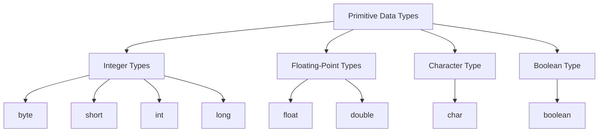

# Java Data Types

## Introduction

In Java, data types specify the size and type of values that can be stored in an identifier or variable. Understanding data types is fundamental to programming in Java because they determine how the data is stored in memory and what operations can be performed on that data.

Java is a statically typed language, which means that all variables must be declared before they can be used. This involves stating the variable's type and name. Java provides two categories of data types:

1. **Primitive Data Types**: These are the most basic data types available in Java language.
2. **Reference/Object Data Types**: These are more complex types that hold references to objects.

In this guide, we'll explore both categories in detail, with plenty of examples to help you understand how to use them effectively.

## Primitive Data Types

Primitive data types are predefined by the language and named by a keyword. Let's examine the eight primitive data types in Java:

### 1. byte

- **Size**: 8 bits
- **Range**: -128 to 127
- **Default value**: 0

```java
byte smallNumber = 100;
byte negativeNumber = -50;
// This would cause an error: byte tooBig = 200; // 200 is outside the byte range

System.out.println("Byte value: " + smallNumber);
```

**Output:**
```
Byte value: 100
```

### 2. short

- **Size**: 16 bits
- **Range**: -32,768 to 32,767
- **Default value**: 0

```java
short mediumNumber = 20000;
short negativeNumber = -10000;

System.out.println("Short value: " + mediumNumber);
```

**Output:**
```
Short value: 20000
```

### 3. int

- **Size**: 32 bits
- **Range**: -2^31 to 2^31-1
- **Default value**: 0

```java
int largeNumber = 100000;
int populationOfCity = 2500000;

System.out.println("Integer value: " + largeNumber);
```

**Output:**
```
Integer value: 100000
```

### 4. long

- **Size**: 64 bits
- **Range**: -2^63 to 2^63-1
- **Default value**: 0L

```java
long veryLargeNumber = 9223372036854775807L; // Note the 'L' suffix
long worldPopulation = 7900000000L;

System.out.println("Long value: " + veryLargeNumber);
```

**Output:**
```
Long value: 9223372036854775807
```

### 5. float

- **Size**: 32 bits
- **Range**: Approximately ±3.40282347E+38F
- **Default value**: 0.0f

```java
float decimal = 45.75f; // Note the 'f' suffix
float pi = 3.14159f;

System.out.println("Float value: " + decimal);
```

**Output:**
```
Float value: 45.75
```

### 6. double

- **Size**: 64 bits
- **Range**: Approximately ±1.79769313486231570E+308
- **Default value**: 0.0d

```java
double largeDecimal = 123456.789012;
double scientificNotation = 1.23456e5; // Equals 123456.0

System.out.println("Double value: " + largeDecimal);
System.out.println("Scientific notation: " + scientificNotation);
```

**Output:**
```
Double value: 123456.789012
Scientific notation: 123456.0
```

### 7. char

- **Size**: 16 bits
- **Range**: 0 to 65,535
- **Default value**: '\u0000' (null character)

```java
char letter = 'A';
char digit = '7';
char unicode = '\u00A9'; // Copyright symbol

System.out.println("Character: " + letter);
System.out.println("Unicode character: " + unicode);
```

**Output:**
```
Character: A
Unicode character: ©
```

### 8. boolean

- **Size**: Not precisely defined, depends on JVM (typically 1 bit of information)
- **Range**: true or false
- **Default value**: false

```java
boolean isJavaFun = true;
boolean isCodingHard = false;

System.out.println("Is Java fun? " + isJavaFun);
```

**Output:**
```
Is Java fun? true
```

## Type Hierarchy of Primitive Data Types



## Reference Data Types

Reference data types refer to objects. Unlike primitive data types that hold their values directly, reference types store the address where the object is located in memory. Here are some common reference types:

### 1. Classes

The fundamental reference type in Java, classes are user-defined blueprints for objects.

```java
public class Person {
    String name;
    int age;
    
    public Person(String name, int age) {
        this.name = name;
        this.age = age;
    }
    
    public void introduce() {
        System.out.println("Hello, my name is " + name + " and I am " + age + " years old.");
    }
}

// Usage:
public class Main {
    public static void main(String[] args) {
        Person person = new Person("John", 30);
        person.introduce();
    }
}
```

**Output:**
```
Hello, my name is John and I am 30 years old.
```

### 2. Arrays

Arrays are objects that store multiple variables of the same type.

```java
// Array of integers
int[] numbers = {10, 20, 30, 40, 50};

// Accessing array elements
System.out.println("First number: " + numbers[0]);
System.out.println("Array length: " + numbers.length);

// Array of objects
Person[] people = new Person[3];
people[0] = new Person("Alice", 25);
people[1] = new Person("Bob", 30);
people[2] = new Person("Charlie", 35);

// Looping through an array
for (Person p : people) {
    p.introduce();
}
```

**Output:**
```
First number: 10
Array length: 5
Hello, my name is Alice and I am 25 years old.
Hello, my name is Bob and I am 30 years old.
Hello, my name is Charlie and I am 35 years old.
```

### 3. Interfaces

Interfaces declare methods that implementing classes must define.

```java
interface Drawable {
    void draw();
}

class Circle implements Drawable {
    @Override
    public void draw() {
        System.out.println("Drawing a circle");
    }
}

class Rectangle implements Drawable {
    @Override
    public void draw() {
        System.out.println("Drawing a rectangle");
    }
}

// Usage
public class Main {
    public static void main(String[] args) {
        Drawable circle = new Circle();
        Drawable rectangle = new Rectangle();
        
        circle.draw();
        rectangle.draw();
    }
}
```

**Output:**
```
Drawing a circle
Drawing a rectangle
```

### 4. Strings

Strings are special reference types in Java that represent sequences of characters.

```java
String greeting = "Hello, World!";
String name = "Java Programmer";

// String methods
System.out.println("Length: " + greeting.length());
System.out.println("Uppercase: " + greeting.toUpperCase());
System.out.println("Contains 'World': " + greeting.contains("World"));
System.out.println("Concatenation: " + greeting + " I am a " + name);
```

**Output:**
```
Length: 13
Uppercase: HELLO, WORLD!
Contains 'World': true
Concatenation: Hello, World! I am a Java Programmer
```

## Type Casting in Java

Type casting is converting one data type to another. There are two types of casting in Java:

### 1. Widening Casting (Implicit)

Automatic type conversion from smaller to larger data type size.

```java
// Widening casting: byte -> short -> int -> long -> float -> double
int myInt = 100;
long myLong = myInt;      // Automatic casting: int to long
float myFloat = myLong;   // Automatic casting: long to float
double myDouble = myFloat; // Automatic casting: float to double

System.out.println("Original int: " + myInt);
System.out.println("After conversion to long: " + myLong);
System.out.println("After conversion to float: " + myFloat);
System.out.println("After conversion to double: " + myDouble);
```

**Output:**
```
Original int: 100
After conversion to long: 100
After conversion to float: 100.0
After conversion to double: 100.0
```

### 2. Narrowing Casting (Explicit)

Manual type conversion from larger to smaller data type size. This requires explicit casting.

```java
// Narrowing casting: double -> float -> long -> int -> short -> byte
double myDouble = 9.78;
int myInt = (int) myDouble; // Manual casting: double to int (loses decimal part)

System.out.println("Original double: " + myDouble);
System.out.println("After conversion to int: " + myInt);

// Potential data loss
int largeValue = 130;
byte smallByte = (byte) largeValue; // Exceeds byte range and causes overflow

System.out.println("Original int: " + largeValue);
System.out.println("After conversion to byte: " + smallByte); // -126 due to overflow
```

**Output:**
```
Original double: 9.78
After conversion to int: 9
Original int: 130
After conversion to byte: -126
```

## Real-world Applications

Let's look at some practical examples of using different data types in real-world scenarios:

### 1. Banking Application

```java
public class BankAccount {
    private String accountNumber;
    private String accountHolder;
    private double balance;
    private boolean isActive;
    
    public BankAccount(String accountNumber, String accountHolder) {
        this.accountNumber = accountNumber;
        this.accountHolder = accountHolder;
        this.balance = 0.0;
        this.isActive = true;
    }
    
    public void deposit(double amount) {
        if (amount > 0 && isActive) {
            balance += amount;
            System.out.println("$" + amount + " deposited. New balance: $" + balance);
        } else {
            System.out.println("Invalid deposit amount or account inactive.");
        }
    }
    
    public void withdraw(double amount) {
        if (amount > 0 && amount <= balance && isActive) {
            balance -= amount;
            System.out.println("$" + amount + " withdrawn. Remaining balance: $" + balance);
        } else {
            System.out.println("Withdrawal failed. Check amount or account status.");
        }
    }
    
    public void accountInfo() {
        System.out.println("Account Number: " + accountNumber);
        System.out.println("Account Holder: " + accountHolder);
        System.out.println("Balance: $" + balance);
        System.out.println("Account Status: " + (isActive ? "Active" : "Inactive"));
    }
}

// Usage
public class Main {
    public static void main(String[] args) {
        BankAccount account = new BankAccount("123456789", "John Doe");
        account.accountInfo();
        account.deposit(1000.50);
        account.withdraw(500.25);
        account.accountInfo();
    }
}
```

**Output:**
```
Account Number: 123456789
Account Holder: John Doe
Balance: $0.0
Account Status: Active
$1000.5 deposited. New balance: $1000.5
$500.25 withdrawn. Remaining balance: $500.25
Account Number: 123456789
Account Holder: John Doe
Balance: $500.25
Account Status: Active
```

### 2. Temperature Converter

```java
public class TemperatureConverter {
    // Convert Celsius to Fahrenheit
    public static double celsiusToFahrenheit(double celsius) {
        return (celsius * 9/5) + 32;
    }
    
    // Convert Fahrenheit to Celsius
    public static double fahrenheitToCelsius(double fahrenheit) {
        return (fahrenheit - 32) * 5/9;
    }
    
    public static void main(String[] args) {
        double celsiusTemp = 25.0;
        double fahrenheitTemp = celsiusToFahrenheit(celsiusTemp);
        
        System.out.printf("%.1f°C is equal to %.1f°F\n", celsiusTemp, fahrenheitTemp);
        
        double fTemp = 98.6;
        double cTemp = fahrenheitToCelsius(fTemp);
        
        System.out.printf("%.1f°F is equal to %.1f°C\n", fTemp, cTemp);
    }
}
```

**Output:**
```
25.0°C is equal to 77.0°F
98.6°F is equal to 37.0°C
```

## Summary

Java data types are fundamental to programming in Java and understanding them is crucial for writing efficient code. Let's recap what we've learned:

1. **Primitive data types**:
   - Include `byte`, `short`, `int`, `long`, `float`, `double`, `char`, and `boolean`
   - Directly store values in memory
   - Have fixed sizes and ranges

2. **Reference data types**:
   - Include classes, interfaces, arrays, and strings
   - Store references to objects rather than the actual objects
   - More complex and flexible than primitive types

3. **Type casting**:
   - Widening (implicit) conversions happen automatically when moving to a larger data type
   - Narrowing (explicit) conversions require manual casting and may result in data loss

Understanding when to use each data type allows you to write more efficient Java programs by managing memory effectively and ensuring that your variables can hold the appropriate values for your applications.

## Additional Resources and Exercises

### Resources
- [Oracle Java Documentation on Data Types](https://docs.oracle.com/javase/tutorial/java/nutsandbolts/datatypes.html)
- [Java Data Types - W3Schools](https://www.w3schools.com/java/java_data_types.asp)

### Practice Exercises

1. **Data Type Selection**:
   Create variables of appropriate data types to store the following information:
   - Your age
   - The population of your country
   - The average temperature of your city
   - Whether it's raining today
   - Your first name

2. **Type Conversion**:
   Write a program that demonstrates both widening and narrowing conversions between different numeric data types.

3. **Calculator Application**:
   Create a simple calculator that takes two numbers and an operation (+, -, *, /) as input and returns the result. Pay attention to the data types you use for storing the numbers and result.

4. **Student Management System**:
   Design a class called `Student` with appropriate data types for storing student information like ID, name, grades (for multiple subjects), and enrollment status.

5. **Array Manipulation**:
   Create arrays of different data types (integers, doubles, strings) and write methods to calculate the sum, average, find minimum and maximum values where applicable.

By practicing with these exercises, you'll gain a deeper understanding of Java data types and how to use them effectively in your programs.