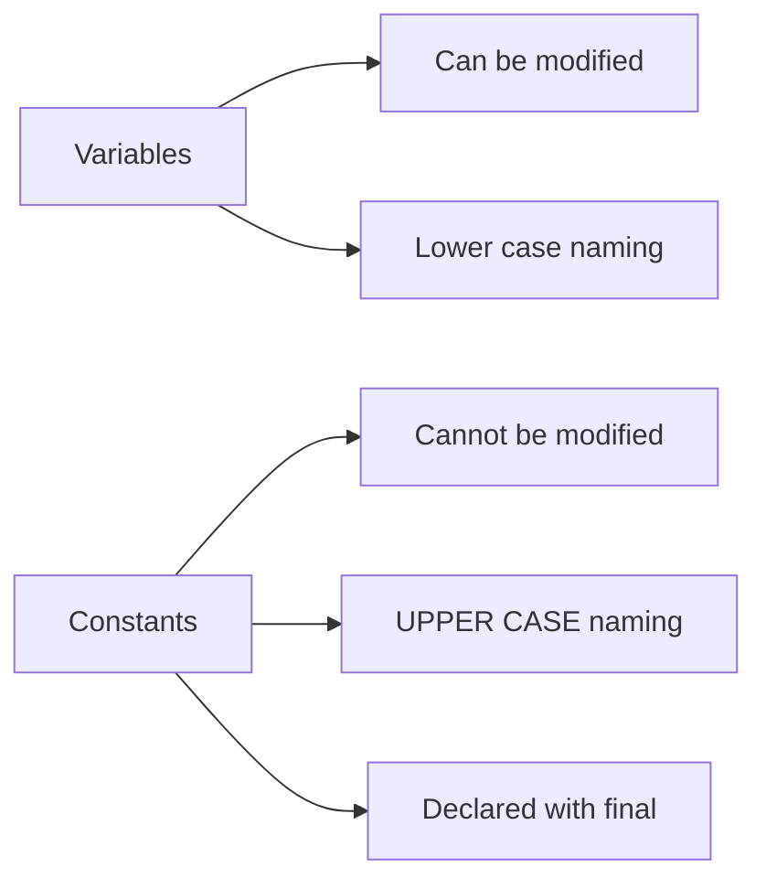

# Java Constants

## Introduction

Constants in Java represent fixed values that cannot be changed once they have been assigned. They are an essential part of programming as they provide a way to store values that should remain unchanged throughout the execution of a program.

Using constants in your code instead of hard-coded values offers several advantages:

- **Improved code readability**: Descriptive names make your code easier to understand
- **Easier maintenance**: Change a value in one place rather than throughout your code
- **Reduced errors**: Prevents accidental value modifications
- **Better organization**: Groups related values together logically

Let's explore how to declare and use constants in Java, along with best practices and real-world examples.

## Declaring Constants in Java

In Java, constants are typically declared using the `final` keyword. When applied to a variable, `final` ensures that once a value is assigned, it cannot be changed.

### Basic Syntax

```java
final dataType CONSTANT_NAME = value;
```

By convention, constant names are written in UPPERCASE with underscores separating words.

### Example: Simple Constants

```java
public class ConstantsExample {
    public static void main(String[] args) {
        final int MAX_USERS = 100;
        final double PI = 3.14159;
        final String APP_NAME = "MyJavaApp";
        
        System.out.println("Maximum users allowed: " + MAX_USERS);
        System.out.println("Value of PI: " + PI);
        System.out.println("Application name: " + APP_NAME);
        
        // This would cause a compilation error if uncommented:
        // MAX_USERS = 200;  // Cannot assign a value to final variable
    }
}
```

**Output:**
```
Maximum users allowed: 100
Value of PI: 3.14159
Application name: MyJavaApp
```

## Class Constants

When you want to share constants across multiple methods within a class, you can declare them as class variables (static constants).

### Syntax for Class Constants

```java
public class ClassName {
    public static final dataType CONSTANT_NAME = value;
}
```

### Example: Class Constants

```java
public class MathConstants {
    public static final double PI = 3.14159265359;
    public static final double E = 2.71828182846;
    public static final double GOLDEN_RATIO = 1.61803398875;
    
    public static void main(String[] args) {
        System.out.println("PI: " + PI);
        System.out.println("E: " + E);
        System.out.println("Golden Ratio: " + GOLDEN_RATIO);
        
        double circleArea = calculateCircleArea(5);
        System.out.println("Area of circle with radius 5: " + circleArea);
    }
    
    public static double calculateCircleArea(double radius) {
        return PI * radius * radius;
    }
}
```

**Output:**
```
PI: 3.14159265359
E: 2.71828182846
Golden Ratio: 1.61803398875
Area of circle with radius 5: 78.5398163397475
```

## When to Use Constants

Use constants when you have values that:

1. Should not change during program execution
2. Are used in multiple places in your code
3. Have special meaning in your application domain

## Types of Constants in Java

In Java, constants can be categorized in several ways:

### 1. Primitive Constants

These are constant values of primitive data types like `int`, `double`, `boolean`, etc.

```java
public class PrimitiveConstants {
    public static final int MAX_LOGIN_ATTEMPTS = 3;
    public static final double TAX_RATE = 0.07;
    public static final boolean DEBUG_MODE = true;
    
    public static void main(String[] args) {
        System.out.println("Maximum login attempts: " + MAX_LOGIN_ATTEMPTS);
        
        double price = 100.00;
        double totalPrice = price + (price * TAX_RATE);
        System.out.println("Price: $" + price);
        System.out.println("Price with tax: $" + totalPrice);
        
        if (DEBUG_MODE) {
            System.out.println("Debug mode is enabled");
        }
    }
}
```

**Output:**
```
Maximum login attempts: 3
Price: $100.0
Price with tax: $107.0
Debug mode is enabled
```

### 2. Reference Constants

These are constant references to objects. Note that while the reference cannot change, the object's internal state might still be mutable unless properly designed.

```java
import java.util.ArrayList;
import java.util.Arrays;
import java.util.List;

public class ReferenceConstants {
    // A constant reference to a List
    public static final List<String> APPROVED_DOMAINS = new ArrayList<>(Arrays.asList(
            "example.com",
            "example.org",
            "example.net"
    ));
    
    public static void main(String[] args) {
        System.out.println("Approved domains: " + APPROVED_DOMAINS);
        
        // We can modify the contents of the list
        APPROVED_DOMAINS.add("example.edu");
        System.out.println("Updated approved domains: " + APPROVED_DOMAINS);
        
        // But we cannot reassign the reference
        // APPROVED_DOMAINS = new ArrayList<>(); // This would cause a compilation error
    }
}
```

**Output:**
```
Approved domains: [example.com, example.org, example.net]
Updated approved domains: [example.com, example.org, example.net, example.edu]
```

### 3. Enum Constants

Enumerations provide a type-safe way to define a set of related constants.

```java
public class EnumConstantsExample {
    // An enum of days of the week
    public enum Day {
        MONDAY, TUESDAY, WEDNESDAY, THURSDAY, FRIDAY, SATURDAY, SUNDAY
    }
    
    // An enum with associated values
    public enum Planet {
        MERCURY(3.303e+23, 2.4397e6),
        VENUS(4.869e+24, 6.0518e6),
        EARTH(5.976e+24, 6.37814e6),
        MARS(6.421e+23, 3.3972e6),
        JUPITER(1.9e+27, 7.1492e7),
        SATURN(5.688e+26, 6.0268e7),
        URANUS(8.686e+25, 2.5559e7),
        NEPTUNE(1.024e+26, 2.4746e7);
        
        private final double mass;   // in kilograms
        private final double radius; // in meters
        
        Planet(double mass, double radius) {
            this.mass = mass;
            this.radius = radius;
        }
        
        public double getMass() { return mass; }
        public double getRadius() { return radius; }
        
        // Universal gravitational constant
        public static final double G = 6.67300E-11;
        
        public double surfaceGravity() {
            return G * mass / (radius * radius);
        }
        
        public double surfaceWeight(double otherMass) {
            return otherMass * surfaceGravity();
        }
    }
    
    public static void main(String[] args) {
        // Using the Day enum
        Day today = Day.WEDNESDAY;
        System.out.println("Today is: " + today);
        
        // Using the Planet enum
        double earthWeight = 75.0;
        double mass = earthWeight / Planet.EARTH.surfaceGravity();
        
        for (Planet planet : Planet.values()) {
            System.out.printf("Your weight on %s is %.2f N%n",
                    planet.name(), planet.surfaceWeight(mass));
        }
    }
}
```

**Output:**
```
Today is: WEDNESDAY
Your weight on MERCURY is 28.12 N
Your weight on VENUS is 67.76 N
Your weight on EARTH is 75.00 N
Your weight on MARS is 28.13 N
Your weight on JUPITER is 190.24 N
Your weight on SATURN is 80.14 N
Your weight on URANUS is 67.81 N
Your weight on NEPTUNE is 85.29 N
```

## Creating Immutable Constants

For reference types, ensuring true immutability requires additional steps:

```java
import java.util.Collections;
import java.util.ArrayList;
import java.util.Arrays;
import java.util.List;

public class ImmutableConstants {
    // Truly immutable list constant
    public static final List<String> COLORS = Collections.unmodifiableList(
            Arrays.asList("Red", "Green", "Blue", "Yellow")
    );
    
    public static void main(String[] args) {
        System.out.println("Available colors: " + COLORS);
        
        // This will throw an UnsupportedOperationException at runtime
        try {
            COLORS.add("Purple");
        } catch (UnsupportedOperationException e) {
            System.out.println("Cannot modify an immutable list!");
        }
    }
}
```

**Output:**
```
Available colors: [Red, Green, Blue, Yellow]
Cannot modify an immutable list!
```

## Constants vs. Variables

To understand the importance of constants, let's compare them with regular variables:



## Real-World Application: Configuration Constants

Constants are often used to store configuration values that might change between deployments but should remain constant during runtime.

```java
public class ApplicationConfig {
    // Database configuration
    public static final String DB_URL = "jdbc:mysql://localhost:3306/myapp";
    public static final String DB_USER = "user";
    public static final String DB_PASSWORD = "password";
    
    // Application settings
    public static final int SESSION_TIMEOUT = 30; // minutes
    public static final int MAX_UPLOAD_SIZE = 10485760; // 10MB in bytes
    public static final String[] ALLOWED_FILE_TYPES = {"jpg", "png", "pdf", "docx"};
    
    // Feature flags
    public static final boolean ENABLE_NEW_UI = true;
    public static final boolean ENABLE_ANALYTICS = false;
    
    public static void main(String[] args) {
        System.out.println("Connecting to database: " + DB_URL);
        System.out.println("Session timeout: " + SESSION_TIMEOUT + " minutes");
        System.out.println("Maximum upload size: " + (MAX_UPLOAD_SIZE / 1024 / 1024) + "MB");
        System.out.println("New UI enabled: " + ENABLE_NEW_UI);
    }
}
```

**Output:**
```
Connecting to database: jdbc:mysql://localhost:3306/myapp
Session timeout: 30 minutes
Maximum upload size: 10MB
New UI enabled: true
```

## Constants in Interfaces

Java interfaces can also contain constants. All variables declared in an interface are implicitly `public`, `static`, and `final`.

```java
public interface PaymentConstants {
    // Payment status codes
    int PAYMENT_PENDING = 0;
    int PAYMENT_COMPLETED = 1;
    int PAYMENT_FAILED = 2;
    int PAYMENT_REFUNDED = 3;
    
    // Payment methods
    String CREDIT_CARD = "CREDIT_CARD";
    String DEBIT_CARD = "DEBIT_CARD";
    String PAYPAL = "PAYPAL";
    String BANK_TRANSFER = "BANK_TRANSFER";
}

class PaymentProcessor implements PaymentConstants {
    public void processPayment(String method, double amount) {
        System.out.println("Processing payment of $" + amount + " via " + method);
        
        // Use payment constants
        int status = PAYMENT_COMPLETED;
        
        if (method.equals(CREDIT_CARD)) {
            System.out.println("Credit card payment processed");
        } else if (method.equals(PAYPAL)) {
            System.out.println("PayPal payment processed");
        }
        
        System.out.println("Payment status: " + status);
    }
    
    public static void main(String[] args) {
        PaymentProcessor processor = new PaymentProcessor();
        processor.processPayment(CREDIT_CARD, 99.99);
    }
}
```

**Output:**
```
Processing payment of $99.99 via CREDIT_CARD
Credit card payment processed
Payment status: 1
```

## Best Practices for Using Constants

1. **Use descriptive names**: Constants should have clear, descriptive names that indicate their purpose.

2. **Group related constants**: Put related constants in the same class or interface.

3. **Use proper access modifiers**: Make constants `private` if they should only be used within the class, or `public` if they need to be accessed from outside.

4. **Choose the right scope**: Use class constants (static) when the constant applies to the entire class, or instance constants when it applies to a specific instance.

5. **Make reference types truly immutable**: When creating constants of reference types, ensure they cannot be modified by using immutable collections or creating defensive copies.

6. **Consider using enums**: For related constants, enums often provide a better, type-safe alternative.

## Summary

Constants are a fundamental concept in Java programming that enable you to define values that should not change throughout the execution of your program. They improve code readability, maintainability, and help prevent errors caused by inadvertent value changes.

Key points to remember:

- Constants are declared using the `final` keyword
- By convention, constants are named in UPPERCASE_WITH_UNDERSCORES
- Class constants are declared with `static final` modifiers
- Enum provides a type-safe way to define related constants
- For reference types, additional steps are needed to ensure true immutability
- Constants improve code readability and maintainability

## Additional Resources

- [Oracle Java Documentation: Variables](https://docs.oracle.com/javase/tutorial/java/nutsandbolts/variables.html)
- [Oracle Java Documentation: Enum Types](https://docs.oracle.com/javase/tutorial/java/javaOO/enum.html)
- [Oracle Java Documentation: Immutable Objects](https://docs.oracle.com/javase/tutorial/essential/concurrency/immutable.html)

## Exercises

1. Create a `MathUtils` class with constants for common mathematical values like PI, E, and the Golden Ratio.

2. Define a `ColorConstants` interface with RGB values for common colors (RED, GREEN, BLUE, etc.).

3. Create an enum `DayOfWeek` with constants for each day of the week and a method that returns whether it's a weekday or weekend.

4. Implement a `ConfigurationManager` class that stores application settings as constants and provides methods to access them.

5. Write a program that uses constants to represent HTTP status codes (200 OK, 404 Not Found, etc.) and displays appropriate messages for each.