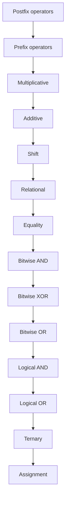

# Java Operators

## Introduction

Operators are special symbols that perform specific operations on one, two, or three operands, and then return a result. Java provides a rich set of operators to manipulate variables and values. Understanding operators is crucial for writing efficient code and implementing various algorithms in Java.

In this tutorial, we'll explore different categories of operators in Java:

1. Arithmetic Operators
2. Assignment Operators
3. Comparison (Relational) Operators
4. Logical Operators
5. Bitwise Operators
6. Ternary Operator
7. Increment and Decrement Operators

## Arithmetic Operators

Arithmetic operators are used to perform common mathematical operations.

| Operator | Description | Example |
|----------|-------------|---------|
| `+`      | Addition    | `a + b` |
| `-`      | Subtraction | `a - b` |
| `*`      | Multiplication | `a * b` |
| `/`      | Division    | `a / b` |
| `%`      | Modulus (remainder) | `a % b` |

### Example of Arithmetic Operators

```java
public class ArithmeticOperatorsDemo {
    public static void main(String[] args) {
        int a = 10;
        int b = 3;
        
        System.out.println("a + b = " + (a + b));  // Addition
        System.out.println("a - b = " + (a - b));  // Subtraction
        System.out.println("a * b = " + (a * b));  // Multiplication
        System.out.println("a / b = " + (a / b));  // Division (integer division)
        System.out.println("a % b = " + (a % b));  // Modulus (remainder)
        
        // Division with floating-point numbers
        double c = 10.0;
        double d = 3.0;
        System.out.println("c / d = " + (c / d));  // Division (floating-point)
    }
}
```

**Output:**
```
a + b = 13
a - b = 7
a * b = 30
a / b = 3
a % b = 1
c / d = 3.3333333333333335
```

:::tip
When dividing integers in Java, the result is also an integer. To get a floating-point result, at least one of the operands must be a floating-point number.
:::

## Assignment Operators

Assignment operators are used to assign values to variables.

| Operator | Description | Example | Equivalent to |
|----------|-------------|---------|---------------|
| `=`      | Simple assignment | `a = b` | `a = b` |
| `+=`     | Add and assign | `a += b` | `a = a + b` |
| `-=`     | Subtract and assign | `a -= b` | `a = a - b` |
| `*=`     | Multiply and assign | `a *= b` | `a = a * b` |
| `/=`     | Divide and assign | `a /= b` | `a = a / b` |
| `%=`     | Modulus and assign | `a %= b` | `a = a % b` |

### Example of Assignment Operators

```java
public class AssignmentOperatorsDemo {
    public static void main(String[] args) {
        int a = 10;  // Simple assignment
        System.out.println("Initially, a = " + a);
        
        a += 5;      // Add and assign
        System.out.println("After a += 5, a = " + a);
        
        a -= 3;      // Subtract and assign
        System.out.println("After a -= 3, a = " + a);
        
        a *= 2;      // Multiply and assign
        System.out.println("After a *= 2, a = " + a);
        
        a /= 4;      // Divide and assign
        System.out.println("After a /= 4, a = " + a);
        
        a %= 3;      // Modulus and assign
        System.out.println("After a %= 3, a = " + a);
    }
}
```

**Output:**
```
Initially, a = 10
After a += 5, a = 15
After a -= 3, a = 12
After a *= 2, a = 24
After a /= 4, a = 6
After a %= 3, a = 0
```

## Comparison (Relational) Operators

Comparison operators are used to compare two values. The result of a comparison is always a boolean value (`true` or `false`).

| Operator | Description | Example |
|----------|-------------|---------|
| `==`     | Equal to    | `a == b` |
| `!=`     | Not equal to | `a != b` |
| `>`      | Greater than | `a > b` |
| `<`      | Less than   | `a < b` |
| `>=`     | Greater than or equal to | `a >= b` |
| `<=`     | Less than or equal to | `a <= b` |

### Example of Comparison Operators

```java
public class ComparisonOperatorsDemo {
    public static void main(String[] args) {
        int a = 10;
        int b = 20;
        
        System.out.println("a == b: " + (a == b));  // Equal to
        System.out.println("a != b: " + (a != b));  // Not equal to
        System.out.println("a > b: " + (a > b));    // Greater than
        System.out.println("a < b: " + (a < b));    // Less than
        System.out.println("a >= b: " + (a >= b));  // Greater than or equal to
        System.out.println("a <= b: " + (a <= b));  // Less than or equal to
    }
}
```

**Output:**
```
a == b: false
a != b: true
a > b: false
a < b: true
a >= b: false
a <= b: true
```

:::caution
When comparing objects in Java, the `==` operator checks if the references point to the same object, not if the contents are equal. To compare the contents of objects like strings, use the `equals()` method.
:::

## Logical Operators

Logical operators are used to determine the logic between variables or values.

| Operator | Name | Description | Example |
|----------|------|-------------|---------|
| `&&`     | Logical AND | Returns true if both statements are true | `a && b` |
| `\|\|`   | Logical OR | Returns true if one of the statements is true | `a \|\| b` |
| `!`      | Logical NOT | Reverses the result, returns false if the result is true | `!a` |

### Example of Logical Operators

```java
public class LogicalOperatorsDemo {
    public static void main(String[] args) {
        boolean a = true;
        boolean b = false;
        
        System.out.println("a && b: " + (a && b));  // Logical AND
        System.out.println("a || b: " + (a || b));  // Logical OR
        System.out.println("!a: " + (!a));          // Logical NOT
        
        // Short-circuit evaluation
        int x = 10;
        int y = 20;
        
        // The second condition is not evaluated if the first is false
        boolean result = (x > 15) && (++y > 20);
        System.out.println("result = " + result);
        System.out.println("y = " + y);  // y remains 20 because ++y wasn't evaluated
    }
}
```

**Output:**
```
a && b: false
a || b: true
!a: false
result = false
y = 20
```

:::tip
Java uses short-circuit evaluation for logical operators. In `a && b`, if `a` is false, `b` is not evaluated because the result will always be false regardless of `b`. Similarly, in `a || b`, if `a` is true, `b` is not evaluated.
:::

## Bitwise Operators

Bitwise operators perform operations on individual bits of integer types.

| Operator | Description | Example |
|----------|-------------|---------|
| `&`      | Bitwise AND | `a & b` |
| `\|`     | Bitwise OR  | `a \| b` |
| `^`      | Bitwise XOR (exclusive OR) | `a ^ b` |
| `~`      | Bitwise complement | `~a` |
| `<<`     | Left shift  | `a << n` |
| `>>`     | Right shift with sign extension | `a >> n` |
| `>>>`    | Right shift with zero extension | `a >>> n` |

### Example of Bitwise Operators

```java
public class BitwiseOperatorsDemo {
    public static void main(String[] args) {
        int a = 5;  // Binary: 0101
        int b = 3;  // Binary: 0011
        
        System.out.println("a & b = " + (a & b));   // Bitwise AND: 0001 (1)
        System.out.println("a | b = " + (a | b));   // Bitwise OR: 0111 (7)
        System.out.println("a ^ b = " + (a ^ b));   // Bitwise XOR: 0110 (6)
        System.out.println("~a = " + (~a));         // Bitwise complement: 1111...1010 (-6)
        
        // Shift operators
        System.out.println("a << 1 = " + (a << 1));  // Left shift: 1010 (10)
        System.out.println("a >> 1 = " + (a >> 1));  // Right shift: 0010 (2)
        
        // Demonstrate >>> with negative numbers
        int c = -8;
        System.out.println("c >> 1 = " + (c >> 1));   // -4 (sign bit preserved)
        System.out.println("c >>> 1 = " + (c >>> 1)); // Large positive number (sign bit not preserved)
    }
}
```

**Output:**
```
a & b = 1
a | b = 7
a ^ b = 6
~a = -6
a << 1 = 10
a >> 1 = 2
c >> 1 = -4
c >>> 1 = 2147483644
```

## Ternary Operator

The conditional operator (? :), also known as the ternary operator, is a shorthand for the if-then-else statement.

**Syntax:**
```
variable = (condition) ? expressionIfTrue : expressionIfFalse;
```

### Example of Ternary Operator

```java
public class TernaryOperatorDemo {
    public static void main(String[] args) {
        int age = 17;
        
        // Using ternary operator
        String status = (age >= 18) ? "Adult" : "Minor";
        System.out.println("Status: " + status);
        
        // Equivalent if-else statement
        String statusWithIfElse;
        if (age >= 18) {
            statusWithIfElse = "Adult";
        } else {
            statusWithIfElse = "Minor";
        }
        System.out.println("Status with if-else: " + statusWithIfElse);
        
        // Finding the maximum of two numbers
        int a = 15;
        int b = 8;
        int max = (a > b) ? a : b;
        System.out.println("Maximum value is: " + max);
    }
}
```

**Output:**
```
Status: Minor
Status with if-else: Minor
Maximum value is: 15
```

## Increment and Decrement Operators

Increment (++) and decrement (--) operators are used to increase or decrease the value of a variable by one.

| Operator | Description | Example |
|----------|-------------|---------|
| `++var`  | Pre-increment: increment then use | `++a` |
| `var++`  | Post-increment: use then increment | `a++` |
| `--var`  | Pre-decrement: decrement then use | `--a` |
| `var--`  | Post-decrement: use then decrement | `a--` |

### Example of Increment and Decrement Operators

```java
public class IncrementDecrementDemo {
    public static void main(String[] args) {
        int a = 5;
        int b = 5;
        
        // Pre-increment
        System.out.println("Pre-increment: " + (++a));  // Increment a to 6, then use the value
        System.out.println("a after pre-increment: " + a);
        
        // Post-increment
        System.out.println("Post-increment: " + (b++)); // Use b (5), then increment to 6
        System.out.println("b after post-increment: " + b);
        
        // Reset values
        a = 5;
        b = 5;
        
        // Pre-decrement
        System.out.println("Pre-decrement: " + (--a));  // Decrement a to 4, then use the value
        System.out.println("a after pre-decrement: " + a);
        
        // Post-decrement
        System.out.println("Post-decrement: " + (b--)); // Use b (5), then decrement to 4
        System.out.println("b after post-decrement: " + b);
    }
}
```

**Output:**
```
Pre-increment: 6
a after pre-increment: 6
Post-increment: 5
b after post-increment: 6
Pre-decrement: 4
a after pre-decrement: 4
Post-decrement: 5
b after post-decrement: 4
```

## Operator Precedence

Not all operators are evaluated with equal precedence. Some have higher precedence than others, which means they are applied first in an expression.

Here's the operator precedence in Java (from highest to lowest):



### Example of Operator Precedence

```java
public class OperatorPrecedenceDemo {
    public static void main(String[] args) {
        int result = 10 + 5 * 2;
        System.out.println("10 + 5 * 2 = " + result);  // Multiplication has higher precedence
        
        result = (10 + 5) * 2;
        System.out.println("(10 + 5) * 2 = " + result);  // Parentheses override precedence
        
        boolean logicalResult = true || false && false;
        System.out.println("true || false && false = " + logicalResult);  // && has higher precedence
        
        logicalResult = (true || false) && false;
        System.out.println("(true || false) && false = " + logicalResult);
    }
}
```

**Output:**
```
10 + 5 * 2 = 20
(10 + 5) * 2 = 30
true || false && false = true
(true || false) && false = false
```

## Real-world Applications

### Example 1: Simple Calculator

Here's a simple calculator application that uses operators to perform basic arithmetic operations:

```java
import java.util.Scanner;

public class SimpleCalculator {
    public static void main(String[] args) {
        Scanner scanner = new Scanner(System.in);
        
        System.out.println("Simple Calculator");
        System.out.println("----------------");
        
        // Get first number
        System.out.print("Enter first number: ");
        double num1 = scanner.nextDouble();
        
        // Get operation
        System.out.print("Enter operation (+, -, *, /): ");
        char operation = scanner.next().charAt(0);
        
        // Get second number
        System.out.print("Enter second number: ");
        double num2 = scanner.nextDouble();
        
        // Perform calculation based on the operation
        double result = 0.0;
        boolean validOperation = true;
        
        switch (operation) {
            case '+':
                result = num1 + num2;
                break;
            case '-':
                result = num1 - num2;
                break;
            case '*':
                result = num1 * num2;
                break;
            case '/':
                if (num2 != 0) {
                    result = num1 / num2;
                } else {
                    System.out.println("Error: Division by zero!");
                    validOperation = false;
                }
                break;
            default:
                System.out.println("Error: Invalid operation!");
                validOperation = false;
        }
        
        if (validOperation) {
            System.out.println(num1 + " " + operation + " " + num2 + " = " + result);
        }
        
        scanner.close();
    }
}
```

**Sample Output:**
```
Simple Calculator
----------------
Enter first number: 10
Enter operation (+, -, *, /): *
Enter second number: 5
10.0 * 5.0 = 50.0
```

### Example 2: Checking if a Number is Even or Odd

This example uses the modulus operator to check if a number is even or odd:

```java
import java.util.Scanner;

public class EvenOddChecker {
    public static void main(String[] args) {
        Scanner scanner = new Scanner(System.in);
        
        System.out.print("Enter a number: ");
        int number = scanner.nextInt();
        
        // Using modulus operator to determine even or odd
        String result = (number % 2 == 0) ? "even" : "odd";
        System.out.println(number + " is " + result);
        
        scanner.close();
    }
}
```

**Sample Output:**
```
Enter a number: 7
7 is odd
```

### Example 3: Temperature Converter

This example uses arithmetic and comparison operators to convert between Celsius and Fahrenheit:

```java
import java.util.Scanner;

public class TemperatureConverter {
    public static void main(String[] args) {
        Scanner scanner = new Scanner(System.in);
        
        System.out.println("Temperature Converter");
        System.out.println("1. Celsius to Fahrenheit");
        System.out.println("2. Fahrenheit to Celsius");
        System.out.print("Choose an option (1/2): ");
        
        int choice = scanner.nextInt();
        double temperature, converted;
        
        if (choice == 1) {
            System.out.print("Enter temperature in Celsius: ");
            temperature = scanner.nextDouble();
            converted = (temperature * 9/5) + 32;
            System.out.printf("%.1f°C = %.1f°F\n", temperature, converted);
        } else if (choice == 2) {
            System.out.print("Enter temperature in Fahrenheit: ");
            temperature = scanner.nextDouble();
            converted = (temperature - 32) * 5/9;
            System.out.printf("%.1f°F = %.1f°C\n", temperature, converted);
        } else {
            System.out.println("Invalid choice!");
        }
        
        scanner.close();
    }
}
```

**Sample Output:**
```
Temperature Converter
1. Celsius to Fahrenheit
2. Fahrenheit to Celsius
Choose an option (1/2): 1
Enter temperature in Celsius: 25
25.0°C = 77.0°F
```

## Summary

In this tutorial, we've explored the various operators available in Java:

- **Arithmetic Operators** (`+`, `-`, `*`, `/`, `%`) for mathematical operations
- **Assignment Operators** (`=`, `+=`, `-=`, `*=`, `/=`, `%=`) for assigning values to variables
- **Comparison Operators** (`==`, `!=`, `>`, `<`, `>=`, `<=`) for comparing values
- **Logical Operators** (`&&`, `||`, `!`) for combining boolean expressions
- **Bitwise Operators** (`&`, `|`, `^`, `~`, `<<`, `>>`, `>>>`) for bit-level operations
- **Ternary Operator** (`? :`) as a shorthand for if-else statement
- **Increment and Decrement Operators** (`++`, `--`) for increasing or decreasing values by one

Understanding these operators is essential for writing efficient and effective Java programs. They form the building blocks of expressions and control structures in your code.

## Additional Resources

1. [Java Documentation on Operators](https://docs.oracle.com/javase/tutorial/java/nutsandbolts/operators.html)
2. [Operator Precedence in Java](https://docs.oracle.com/javase/tutorial/java/nutsandbolts/operators.html)
3. [Bitwise and Bit Shift Operators (Oracle Tutorial)](https://docs.oracle.com/javase/tutorial/java/nutsandbolts/op3.html)

## Exercises

1. Write a program that calculates the area and perimeter of a rectangle using arithmetic operators.
2. Create a program that swaps two numbers without using a third variable (hint: use arithmetic operators).
3. Write a program that determines if a year is a leap year using logical operators.
4. Create a program that uses bitwise operators to set, clear, and toggle specific bits in an integer.
5. Write a program that implements a simple calculator with the four basic operations using the switch statement and arithmetic operators.