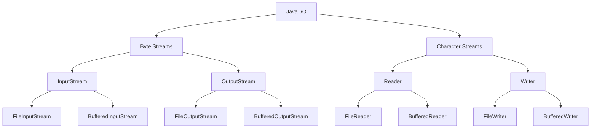

# Java Input Output

## Introduction

Input/Output (I/O) operations are fundamental to almost every application. Whether you're reading user input from the console, writing data to files, or communicating over a network, Java's I/O APIs provide the necessary tools to handle these operations effectively.

In this tutorial, we'll explore Java's I/O capabilities, from basic console input/output to working with files and streams. By the end, you'll have a solid understanding of how to implement I/O operations in your Java applications.

## Understanding Java I/O Basics

Java organizes I/O operations around **streams**, which represent a flow of data. There are two main types of streams:

1. **Input streams** - for reading data
2. **Output streams** - for writing data

Additionally, Java provides specialized classes for handling different data types:

- **Byte streams** - for handling binary data (bytes)
- **Character streams** - for handling text data (characters)



## Console Input and Output

### Standard Output with `System.out`

The simplest form of output is printing to the console using `System.out`:

```java
System.out.println("Hello, world!");  // Prints with a new line
System.out.print("Hello ");          // Prints without a new line
System.out.print("world!");          // Continues on the same line

// Formatted output
int age = 25;
String name = "John";
System.out.printf("My name is %s and I am %d years old.\n", name, age);
```

**Output:**
```
Hello, world!
Hello world!
My name is John and I am 25 years old.
```

### Reading Input with `Scanner`

The `Scanner` class is the most convenient way to read user input from the console:

```java
import java.util.Scanner;

public class InputExample {
    public static void main(String[] args) {
        Scanner scanner = new Scanner(System.in);
        
        System.out.print("Enter your name: ");
        String name = scanner.nextLine();
        
        System.out.print("Enter your age: ");
        int age = scanner.nextInt();
        
        System.out.println("Hello, " + name + "! You are " + age + " years old.");
        
        // Always close the scanner when done
        scanner.close();
    }
}
```

**Sample interaction:**
```
Enter your name: Alice
Enter your age: 30
Hello, Alice! You are 30 years old.
```

### Common Scanner Methods

| Method | Description |
|--------|-------------|
| `nextLine()` | Reads a line of text |
| `next()` | Reads the next token (word) |
| `nextInt()` | Reads the next integer |
| `nextDouble()` | Reads the next double value |
| `nextBoolean()` | Reads the next boolean value |
| `hasNext()` | Checks if there's another token |
| `hasNextLine()` | Checks if there's another line |

## File I/O Operations

### Working with Files

The `java.io.File` class represents a file or directory path. It's used to:
- Create new files and directories
- Check if files exist
- Get file information (size, permissions, etc.)
- List directory contents

```java
import java.io.File;
import java.io.IOException;

public class FileExample {
    public static void main(String[] args) {
        // Create a File object
        File file = new File("example.txt");
        
        try {
            // Create a new file
            if (file.createNewFile()) {
                System.out.println("File created: " + file.getName());
            } else {
                System.out.println("File already exists.");
            }
            
            // Print file information
            System.out.println("File path: " + file.getAbsolutePath());
            System.out.println("File size: " + file.length() + " bytes");
            System.out.println("Can read: " + file.canRead());
            System.out.println("Can write: " + file.canWrite());
            
        } catch (IOException e) {
            System.out.println("An error occurred.");
            e.printStackTrace();
        }
    }
}
```

### Writing to Files

#### Using `FileWriter` (Character Stream)

For text files, `FileWriter` is a convenient choice:

```java
import java.io.FileWriter;
import java.io.IOException;

public class FileWriteExample {
    public static void main(String[] args) {
        try {
            FileWriter writer = new FileWriter("output.txt");
            writer.write("Hello, this is a test file.\n");
            writer.write("This is the second line.");
            writer.close();
            System.out.println("Successfully wrote to the file.");
        } catch (IOException e) {
            System.out.println("An error occurred.");
            e.printStackTrace();
        }
    }
}
```

#### Using `BufferedWriter` for Better Performance

`BufferedWriter` wraps around a `Writer` to provide buffering capabilities, which improves performance:

```java
import java.io.BufferedWriter;
import java.io.FileWriter;
import java.io.IOException;

public class BufferedWriteExample {
    public static void main(String[] args) {
        try {
            FileWriter fileWriter = new FileWriter("buffered_output.txt");
            BufferedWriter bufferedWriter = new BufferedWriter(fileWriter);
            
            bufferedWriter.write("Using BufferedWriter for better performance.");
            bufferedWriter.newLine();  // Add a new line
            bufferedWriter.write("This is another line.");
            
            bufferedWriter.close();  // This also closes the underlying FileWriter
            System.out.println("File written successfully!");
        } catch (IOException e) {
            e.printStackTrace();
        }
    }
}
```

### Reading from Files

#### Using `FileReader` (Character Stream)

For reading text files character by character:

```java
import java.io.FileReader;
import java.io.IOException;

public class FileReadExample {
    public static void main(String[] args) {
        try {
            FileReader reader = new FileReader("output.txt");
            int character;
            
            // Read character by character
            while ((character = reader.read()) != -1) {
                System.out.print((char) character);
            }
            reader.close();
        } catch (IOException e) {
            e.printStackTrace();
        }
    }
}
```

#### Using `BufferedReader` for Efficient Line Reading

`BufferedReader` makes it easy to read text files line by line:

```java
import java.io.BufferedReader;
import java.io.FileReader;
import java.io.IOException;

public class BufferedReadExample {
    public static void main(String[] args) {
        try {
            FileReader fileReader = new FileReader("buffered_output.txt");
            BufferedReader bufferedReader = new BufferedReader(fileReader);
            
            String line;
            while ((line = bufferedReader.readLine()) != null) {
                System.out.println(line);
            }
            
            bufferedReader.close();
        } catch (IOException e) {
            e.printStackTrace();
        }
    }
}
```

## Binary File Operations

### Writing Binary Data with `FileOutputStream`

For writing binary data (like images, audio, or any non-text file):

```java
import java.io.FileOutputStream;
import java.io.IOException;

public class BinaryWriteExample {
    public static void main(String[] args) {
        try {
            FileOutputStream fos = new FileOutputStream("binary_file.bin");
            
            // Write some bytes
            byte[] data = {65, 66, 67, 68, 69}; // ASCII values for 'A', 'B', 'C', 'D', 'E'
            fos.write(data);
            
            // Write a single byte
            fos.write(70); // ASCII for 'F'
            
            fos.close();
            System.out.println("Binary data written successfully!");
        } catch (IOException e) {
            e.printStackTrace();
        }
    }
}
```

### Reading Binary Data with `FileInputStream`

```java
import java.io.FileInputStream;
import java.io.IOException;

public class BinaryReadExample {
    public static void main(String[] args) {
        try {
            FileInputStream fis = new FileInputStream("binary_file.bin");
            
            int byteValue;
            System.out.print("Read bytes: ");
            while ((byteValue = fis.read()) != -1) {
                System.out.print((char)byteValue + " ");
            }
            
            fis.close();
        } catch (IOException e) {
            e.printStackTrace();
        }
    }
}
```

**Output:**
```
Read bytes: A B C D E F
```

## Working with BufferedStreams

Buffered streams improve performance by minimizing the number of I/O operations:

```java
import java.io.BufferedInputStream;
import java.io.BufferedOutputStream;
import java.io.FileInputStream;
import java.io.FileOutputStream;
import java.io.IOException;

public class BufferedStreamExample {
    public static void main(String[] args) {
        try {
            // Write with BufferedOutputStream
            FileOutputStream fos = new FileOutputStream("buffered_binary.bin");
            BufferedOutputStream bos = new BufferedOutputStream(fos);
            
            for (int i = 0; i < 1000; i++) {
                bos.write(i % 256); // Write values 0-255 repeatedly
            }
            bos.close();
            
            // Read with BufferedInputStream
            FileInputStream fis = new FileInputStream("buffered_binary.bin");
            BufferedInputStream bis = new BufferedInputStream(fis);
            
            int count = 0;
            while (bis.available() > 0) {
                bis.read();
                count++;
            }
            
            bis.close();
            System.out.println("Read " + count + " bytes from the buffered file.");
        } catch (IOException e) {
            e.printStackTrace();
        }
    }
}
```

## Real-world Example: CSV File Processing

Let's create a practical example of reading and writing CSV files, which is a common task in many applications:

```java
import java.io.BufferedReader;
import java.io.BufferedWriter;
import java.io.FileReader;
import java.io.FileWriter;
import java.io.IOException;
import java.util.ArrayList;
import java.util.List;

public class CSVProcessingExample {
    static class Person {
        String name;
        int age;
        String email;
        
        public Person(String name, int age, String email) {
            this.name = name;
            this.age = age;
            this.email = email;
        }
        
        @Override
        public String toString() {
            return name + "," + age + "," + email;
        }
        
        public static Person fromCSV(String csvLine) {
            String[] parts = csvLine.split(",");
            return new Person(
                parts[0],
                Integer.parseInt(parts[1]),
                parts[2]
            );
        }
    }
    
    public static void main(String[] args) {
        // Sample data
        List<Person> people = new ArrayList<>();
        people.add(new Person("John Smith", 28, "john@example.com"));
        people.add(new Person("Alice Johnson", 32, "alice@example.com"));
        people.add(new Person("Bob Williams", 45, "bob@example.com"));
        
        // Write to CSV file
        try (BufferedWriter writer = new BufferedWriter(new FileWriter("people.csv"))) {
            // Write header
            writer.write("Name,Age,Email");
            writer.newLine();
            
            // Write data
            for (Person person : people) {
                writer.write(person.toString());
                writer.newLine();
            }
            
            System.out.println("Successfully wrote to CSV file");
        } catch (IOException e) {
            e.printStackTrace();
        }
        
        // Read from CSV file and filter
        try (BufferedReader reader = new BufferedReader(new FileReader("people.csv"))) {
            String line;
            boolean isHeader = true;
            System.out.println("People over 30:");
            
            while ((line = reader.readLine()) != null) {
                if (isHeader) {
                    isHeader = false;
                    continue;
                }
                
                Person person = Person.fromCSV(line);
                if (person.age > 30) {
                    System.out.printf("- %s (%d) - %s%n", 
                                     person.name, person.age, person.email);
                }
            }
        } catch (IOException e) {
            e.printStackTrace();
        }
    }
}
```

**Output:**
```
Successfully wrote to CSV file
People over 30:
- Alice Johnson (32) - alice@example.com
- Bob Williams (45) - bob@example.com
```

## Best Practices for Java I/O

1. **Always close resources**: Use try-with-resources or ensure manual closing in finally blocks
2. **Use buffered streams/readers/writers** for better performance
3. **Handle exceptions properly**: I/O operations can fail for many reasons
4. **Choose the right stream type**: Use character streams for text and byte streams for binary data
5. **Prefer newer NIO.2 APIs** for advanced operations (File Path operations, asynchronous I/O)

## Try-with-Resources

Modern Java provides the try-with-resources statement that automatically closes resources:

```java
import java.io.BufferedReader;
import java.io.FileReader;
import java.io.IOException;

public class TryWithResourcesExample {
    public static void main(String[] args) {
        // Resources are automatically closed when the try block exits
        try (BufferedReader reader = new BufferedReader(new FileReader("example.txt"))) {
            String line;
            while ((line = reader.readLine()) != null) {
                System.out.println(line);
            }
        } catch (IOException e) {
            System.out.println("Error reading the file: " + e.getMessage());
        }
        // No need for finally block to close resources!
    }
}
```

## Summary

In this tutorial, we've covered:
- Basic console input and output
- Working with text files using FileReader/FileWriter
- Working with binary files using FileInputStream/FileOutputStream
- Improving performance with buffered streams
- A practical example of CSV file processing
- Best practices for Java I/O operations

Java's I/O API provides a rich set of tools for handling various input/output scenarios. As you become more comfortable with these concepts, you can explore more advanced features like NIO (New I/O) and asynchronous I/O operations.

## Exercises

1. Create a program that reads a text file and counts the frequency of each word.
2. Write a program that creates a copy of an image file using binary streams.
3. Implement a simple "notes" application that can create, read, update, and delete text notes saved in files.
4. Create a CSV file parser that can handle quoted fields (e.g., "Smith, John",27,"john.smith@example.com").
5. Write a program that merges multiple text files into a single file.

## Additional Resources

- [Oracle's Java I/O Tutorial](https://docs.oracle.com/javase/tutorial/essential/io/)
- [Java NIO.2 Path API Documentation](https://docs.oracle.com/javase/8/docs/api/java/nio/file/Path.html)
- [Java BufferedReader Documentation](https://docs.oracle.com/javase/8/docs/api/java/io/BufferedReader.html)
- Book: "Java I/O, NIO and NIO.2" by Jeff Friesen
- Book: "Effective Java" by Joshua Bloch (Chapter on I/O operations)

Keep practicing these concepts, and you'll become proficient at handling I/O operations in your Java applications!