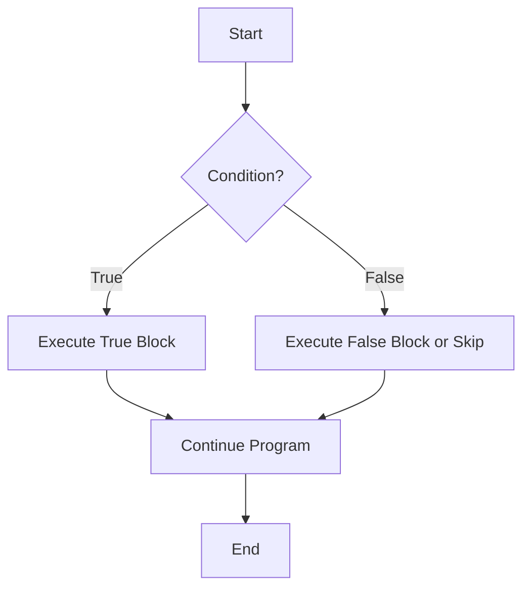

# Java Conditional Statements

In programming, we often need our code to make decisions based on certain conditions. Conditional statements in Java allow your program to execute different blocks of code depending on whether a specified condition is true or false. This ability to make decisions is a fundamental aspect of creating dynamic and responsive programs.

## Introduction to Conditional Statements

Conditional statements are essential control flow structures that enable Java programs to perform different actions based on different conditions. They are like the decision-making process in our daily lives.

For example, in real life, if it's raining, you might take an umbrella; otherwise, you might leave it at home. Similarly, in Java, your program can check if a condition is true and execute specific code accordingly.

Java provides several types of conditional statements:

1. `if` statement
2. `if-else` statement
3. `if-else-if` ladder
4. Nested `if` statements
5. `switch` statement
6. Ternary operator (`? :`)

Let's explore each of these in detail.

## The `if` Statement

The `if` statement is the simplest form of conditional statement. It evaluates a boolean expression and executes a block of code only if the expression evaluates to `true`.

### Syntax

```java
if (condition) {
    // code to be executed if the condition is true
}
```

### Example

```java
public class IfDemo {
    public static void main(String[] args) {
        int temperature = 32;
        
        if (temperature > 30) {
            System.out.println("It's hot today!");
        }
        
        System.out.println("Program continues here regardless of the condition.");
    }
}
```

**Output:**
```
It's hot today!
Program continues here regardless of the condition.
```

In this example, since the temperature (32) is greater than 30, the message "It's hot today!" is printed.

## The `if-else` Statement

The `if-else` statement provides an alternative code block to execute when the condition is false.

### Syntax

```java
if (condition) {
    // code to be executed if the condition is true
} else {
    // code to be executed if the condition is false
}
```

### Example

```java
public class IfElseDemo {
    public static void main(String[] args) {
        int age = 17;
        
        if (age >= 18) {
            System.out.println("You are eligible to vote.");
        } else {
            System.out.println("You are not eligible to vote yet.");
        }
    }
}
```

**Output:**
```
You are not eligible to vote yet.
```

In this example, since the age (17) is less than 18, the program executes the code in the `else` block.

## The `if-else-if` Ladder

When you need to check multiple conditions, you can use the `if-else-if` ladder.

### Syntax

```java
if (condition1) {
    // code to be executed if condition1 is true
} else if (condition2) {
    // code to be executed if condition2 is true
} else if (condition3) {
    // code to be executed if condition3 is true
} else {
    // code to be executed if all conditions are false
}
```

### Example

```java
public class IfElseIfDemo {
    public static void main(String[] args) {
        int score = 85;
        
        if (score >= 90) {
            System.out.println("Grade: A");
        } else if (score >= 80) {
            System.out.println("Grade: B");
        } else if (score >= 70) {
            System.out.println("Grade: C");
        } else if (score >= 60) {
            System.out.println("Grade: D");
        } else {
            System.out.println("Grade: F");
        }
    }
}
```

**Output:**
```
Grade: B
```

In this example, as the score (85) is between 80 and 89, the program assigns a grade of 'B'.

## Nested `if` Statements

You can include an `if` statement inside another `if` or `else` block. This is called a nested `if` statement.

### Syntax

```java
if (outerCondition) {
    // code to be executed if outerCondition is true
    
    if (innerCondition) {
        // code to be executed if both outerCondition and innerCondition are true
    }
}
```

### Example

```java
public class NestedIfDemo {
    public static void main(String[] args) {
        int age = 25;
        boolean hasID = true;
        
        if (age >= 21) {
            System.out.println("Age requirement met.");
            
            if (hasID) {
                System.out.println("You may enter the venue.");
            } else {
                System.out.println("Please provide a valid ID.");
            }
        } else {
            System.out.println("You must be at least 21 years old to enter.");
        }
    }
}
```

**Output:**
```
Age requirement met.
You may enter the venue.
```

In this example, the person is 25 years old and has an ID, so both conditions are true, and they're allowed to enter the venue.

## The `switch` Statement

The `switch` statement is an alternative to the `if-else-if` ladder when you have multiple possible values for a single variable.

### Syntax

```java
switch (expression) {
    case value1:
        // code to be executed if expression equals value1
        break;
    case value2:
        // code to be executed if expression equals value2
        break;
    // more case statements...
    default:
        // code to be executed if expression doesn't match any case
}
```

### Example

```java
public class SwitchDemo {
    public static void main(String[] args) {
        int dayOfWeek = 3;
        
        switch (dayOfWeek) {
            case 1:
                System.out.println("Monday");
                break;
            case 2:
                System.out.println("Tuesday");
                break;
            case 3:
                System.out.println("Wednesday");
                break;
            case 4:
                System.out.println("Thursday");
                break;
            case 5:
                System.out.println("Friday");
                break;
            case 6:
                System.out.println("Saturday");
                break;
            case 7:
                System.out.println("Sunday");
                break;
            default:
                System.out.println("Invalid day");
        }
    }
}
```

**Output:**
```
Wednesday
```

In this example, since `dayOfWeek` is 3, the program prints "Wednesday". The `break` statement ensures that after a match is found, the program exits the `switch` block.

### Enhanced `switch` Statement (Java 12+)

Starting from Java 12, you can use an enhanced `switch` statement with a more concise syntax:

```java
public class EnhancedSwitchDemo {
    public static void main(String[] args) {
        int month = 4;
        
        String season = switch (month) {
            case 12, 1, 2 -> "Winter";
            case 3, 4, 5 -> "Spring";
            case 6, 7, 8 -> "Summer";
            case 9, 10, 11 -> "Fall";
            default -> "Invalid month";
        };
        
        System.out.println("The season is: " + season);
    }
}
```

**Output:**
```
The season is: Spring
```

The arrow syntax (`->`) automatically includes the break behavior, making the code more concise and less error-prone.

## The Ternary Operator

The ternary operator provides a compact way to express simple conditional statements. It's a shorthand for the `if-else` statement.

### Syntax

```java
variable = (condition) ? expressionIfTrue : expressionIfFalse;
```

### Example

```java
public class TernaryOperatorDemo {
    public static void main(String[] args) {
        int number = 7;
        
        // Using ternary operator
        String result = (number % 2 == 0) ? "Even" : "Odd";
        System.out.println(number + " is " + result);
        
        // Equivalent if-else statement
        if (number % 2 == 0) {
            result = "Even";
        } else {
            result = "Odd";
        }
        System.out.println(number + " is " + result);
    }
}
```

**Output:**
```
7 is Odd
7 is Odd
```

Both approaches produce the same result, but the ternary operator is more concise for simple conditions.

## Practical Example: Simple User Authentication

Let's build a simple user authentication system that demonstrates multiple conditional statements working together:

```java
import java.util.Scanner;

public class UserAuthentication {
    public static void main(String[] args) {
        // Predefined credentials
        String correctUsername = "admin";
        String correctPassword = "password123";
        
        Scanner scanner = new Scanner(System.in);
        
        System.out.print("Enter username: ");
        String username = scanner.nextLine();
        
        System.out.print("Enter password: ");
        String password = scanner.nextLine();
        
        // Outer if checks username
        if (username.equals(correctUsername)) {
            // Nested if checks password
            if (password.equals(correctPassword)) {
                System.out.println("Authentication successful!");
                
                // Additional switch for user role (assuming admin role = 1)
                int userRole = 1;
                switch (userRole) {
                    case 1:
                        System.out.println("Welcome, Administrator!");
                        System.out.println("You have full system access.");
                        break;
                    case 2:
                        System.out.println("Welcome, Editor!");
                        System.out.println("You have content management access.");
                        break;
                    default:
                        System.out.println("Welcome, User!");
                        System.out.println("You have limited access.");
                }
            } else {
                System.out.println("Incorrect password. Authentication failed.");
            }
        } else {
            System.out.println("Username not found. Authentication failed.");
        }
        
        scanner.close();
    }
}
```

**Example Output (if entered username="admin" and password="password123"):**
```
Enter username: admin
Enter password: password123
Authentication successful!
Welcome, Administrator!
You have full system access.
```

In this practical example, we've combined nested `if` statements with a `switch` statement to create a basic user authentication system. When the correct credentials are provided, the program determines the user's role and displays appropriate welcome messages.

## Decision-Making Flow Chart

Here's a visual representation of how conditional statements control program flow:



## Summary

Java conditional statements are fundamental tools that allow your programs to make decisions based on conditions:

1. **`if` statement**: Executes a block of code if a condition is true.
2. **`if-else` statement**: Provides alternative execution paths based on the condition.
3. **`if-else-if` ladder**: Handles multiple conditions in sequence.
4. **Nested `if` statements**: Allows conditions to be checked inside other conditions.
5. **`switch` statement**: Provides a cleaner alternative to multiple `if-else` statements when checking a single variable against multiple values.
6. **Ternary operator**: Offers a compact one-line syntax for simple if-else conditions.

Understanding these conditional structures is essential for creating dynamic programs that can respond to different situations and inputs.

## Practice Exercises

To reinforce your understanding of Java conditional statements, try these exercises:

1. Write a program that determines if a year is a leap year. (Hint: A leap year is divisible by 4, but not divisible by 100 unless it's also divisible by 400.)
2. Create a simple calculator that takes two numbers and an operator (+, -, *, /) and performs the appropriate operation using a switch statement.
3. Write a program that categorizes a person's BMI (Body Mass Index) into "Underweight," "Normal," "Overweight," or "Obese" based on standard BMI ranges.
4. Create a program that simulates a traffic light with three states (red, yellow, green) and appropriate messages for drivers.
5. Implement a grade calculator that assigns letter grades (A, B, C, D, F) based on numerical scores and also adds "+" or "-" for scores at the high or low end of each grade range.

## Additional Resources

- [Java Documentation on Control Flow Statements](https://docs.oracle.com/javase/tutorial/java/nutsandbolts/flow.html)
- [Oracle Java Tutorials: The if-then and if-then-else Statements](https://docs.oracle.com/javase/tutorial/java/nutsandbolts/if.html)
- [Oracle Java Tutorials: The switch Statement](https://docs.oracle.com/javase/tutorial/java/nutsandbolts/switch.html)
- [W3Schools Java Tutorial: Java Conditions](https://www.w3schools.com/java/java_conditions.asp)
- [CodeAcademy: Learn Java - Conditionals and Control Flow](https://www.codecademy.com/learn/learn-java)

Learning to effectively use conditional statements will significantly enhance your ability to write sophisticated Java programs that can handle complex logic and make dynamic decisions.