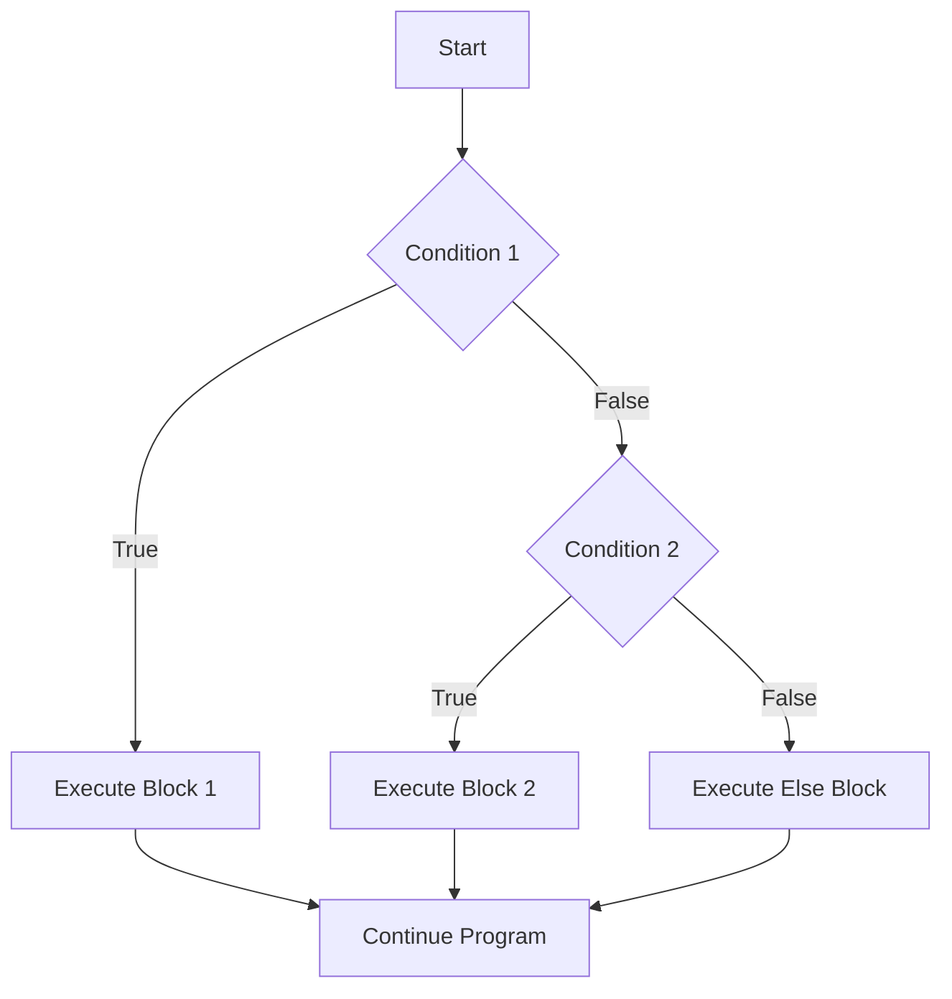

# Java If-Else Statements

## Introduction

In programming, we often need our code to make decisions based on certain conditions. This is where conditional statements come into play, and the `if-else` statement is one of the most fundamental of these.

Java's `if-else` statements allow your program to execute different blocks of code depending on whether a specified condition evaluates to `true` or `false`. This ability to choose different execution paths is what makes programs dynamic and responsive to user input, data values, and other changing conditions.

## Basic If Statement

The simplest form of conditional execution is the `if` statement. It evaluates a condition and executes a block of code only if that condition is `true`.

### Syntax

```java
if (condition) {
    // code to execute if condition is true
}
```

### Example

```java
int temperature = 28;

if (temperature > 25) {
    System.out.println("It's a hot day!");
}

// Output: It's a hot day!
```

In this example, since 28 is greater than 25, the message "It's a hot day!" is printed to the console.

## If-Else Statement

What if we want to execute a different block of code when the condition is `false`? This is where the `else` clause comes in.

### Syntax

```java
if (condition) {
    // code to execute if condition is true
} else {
    // code to execute if condition is false
}
```

### Example

```java
int temperature = 20;

if (temperature > 25) {
    System.out.println("It's a hot day!");
} else {
    System.out.println("It's not a hot day.");
}

// Output: It's not a hot day.
```

In this case, since 20 is not greater than 25, the code inside the `else` block executes, printing "It's not a hot day."

## If-Else-If Ladder

Often, we need to check multiple conditions in sequence. The `if-else-if` ladder (also called an `if-else-if` chain) allows us to test several conditions one after the other.

### Syntax

```java
if (condition1) {
    // code to execute if condition1 is true
} else if (condition2) {
    // code to execute if condition2 is true
} else if (condition3) {
    // code to execute if condition3 is true
} else {
    // code to execute if none of the conditions are true
}
```

### Example

```java
int temperature = 20;

if (temperature > 30) {
    System.out.println("It's very hot!");
} else if (temperature > 25) {
    System.out.println("It's hot!");
} else if (temperature > 15) {
    System.out.println("It's warm.");
} else {
    System.out.println("It's cold.");
}

// Output: It's warm.
```

The program checks each condition in order. Since temperature is 20, which is greater than 15, it prints "It's warm." Once a condition evaluates to `true`, the corresponding block executes, and the rest of the conditions in the ladder are skipped.

## Nested If-Else

You can also place `if-else` statements inside other `if-else` blocks. This is called nesting, and it allows for more complex decision-making logic.

### Syntax

```java
if (outerCondition) {
    // code to execute if outerCondition is true
    if (innerCondition) {
        // code to execute if both outerCondition and innerCondition are true
    } else {
        // code to execute if outerCondition is true but innerCondition is false
    }
} else {
    // code to execute if outerCondition is false
}
```

### Example

```java
int age = 25;
boolean hasLicense = true;

if (age >= 18) {
    System.out.println("You are an adult.");
    
    if (hasLicense) {
        System.out.println("You can drive a car.");
    } else {
        System.out.println("You need to get a license to drive.");
    }
} else {
    System.out.println("You are a minor.");
}

/* Output:
You are an adult.
You can drive a car.
*/
```

This program first checks if the person is an adult. Since `age` is 25, which is greater than or equal to 18, it executes the first block. Inside that block, it checks if the person has a license. Since `hasLicense` is `true`, it also prints "You can drive a car."

## Using Logical Operators in Conditions

You can use logical operators to combine multiple conditions:

- `&&` (AND) - Both conditions must be true
- `||` (OR) - At least one condition must be true
- `!` (NOT) - Negates a condition

### Example

```java
int age = 25;
boolean hasLicense = true;
boolean hasInsurance = true;

if (age >= 18 && hasLicense && hasInsurance) {
    System.out.println("You can legally drive your car.");
} else if (age >= 18 && hasLicense && !hasInsurance) {
    System.out.println("You need insurance to legally drive.");
} else if (age >= 18 && !hasLicense) {
    System.out.println("You need to get a license first.");
} else {
    System.out.println("You are too young to drive.");
}

// Output: You can legally drive your car.
```

## Flow of If-Else Statements

Let's visualize how the flow of execution works in if-else statements:



## Common Pitfalls and Best Practices

### 1. Forgetting Curly Braces

If you omit curly braces, only the first statement following the condition is considered part of the `if` or `else` block.

```java
// Risky code
if (temperature > 30)
    System.out.println("It's very hot!");
    System.out.println("Drink water!"); // This always executes regardless of the condition!

// Better code
if (temperature > 30) {
    System.out.println("It's very hot!");
    System.out.println("Drink water!");
}
```

### 2. Using `==` for String Comparison

For String comparisons, use the `.equals()` method instead of `==`:

```java
// Incorrect
String name = "John";
if (name == "John") { // Don't do this!
    System.out.println("Hello, John!");
}

// Correct
if (name.equals("John")) {
    System.out.println("Hello, John!");
}
```

### 3. Excessive Nesting

Too many nested `if-else` statements can make your code hard to read and maintain. Consider refactoring using early returns, switch statements, or separate methods.

## Practical Examples

### 1. Simple Login System

```java
String storedUsername = "user123";
String storedPassword = "pass456";

String inputUsername = "user123";
String inputPassword = "pass456";

if (inputUsername.equals(storedUsername)) {
    if (inputPassword.equals(storedPassword)) {
        System.out.println("Login successful!");
    } else {
        System.out.println("Incorrect password!");
    }
} else {
    System.out.println("Username not found!");
}

// Output: Login successful!
```

### 2. Grade Calculator

```java
int score = 85;
char grade;

if (score >= 90) {
    grade = 'A';
} else if (score >= 80) {
    grade = 'B';
} else if (score >= 70) {
    grade = 'C';
} else if (score >= 60) {
    grade = 'D';
} else {
    grade = 'F';
}

System.out.println("Your grade is: " + grade);

// Output: Your grade is: B
```

### 3. Discount Calculator for an Online Store

```java
double totalPurchase = 120.0;
boolean isMember = true;
double discount = 0.0;
double finalPrice;

if (isMember) {
    if (totalPurchase >= 100.0) {
        discount = 0.15; // 15% discount for members purchasing $100+
    } else {
        discount = 0.10; // 10% discount for members purchasing less than $100
    }
} else {
    if (totalPurchase >= 100.0) {
        discount = 0.05; // 5% discount for non-members purchasing $100+
    }
}

finalPrice = totalPurchase * (1 - discount);
System.out.println("Total purchase: $" + totalPurchase);
System.out.println("Discount: " + (discount * 100) + "%");
System.out.println("Final price: $" + finalPrice);

/* Output:
Total purchase: $120.0
Discount: 15.0%
Final price: $102.0
*/
```

## Summary

In this lesson, we've covered:

1. The basic `if` statement for executing code when a condition is true
2. The `if-else` statement for handling both true and false conditions
3. The `if-else-if` ladder for checking multiple conditions in sequence
4. Nested `if-else` statements for more complex decision-making
5. Using logical operators in conditions to combine multiple checks
6. Common pitfalls and best practices when using conditional statements
7. Practical examples of conditional statements in real-world scenarios

Understanding `if-else` statements is crucial for controlling the flow of your Java programs. As you become more comfortable with these concepts, you'll be able to write increasingly sophisticated logic to handle a wide range of scenarios.

## Exercises

1. Write a program that checks if a number is positive, negative, or zero.
2. Create a BMI calculator that outputs different messages based on the calculated BMI value.
3. Implement a simple calculator that performs addition, subtraction, multiplication, or division based on user input.
4. Write a program that determines if a year is a leap year.
5. Create a program that recommends an activity based on weather conditions and temperature.

## Additional Resources

- [Oracle's Java Documentation on Control Flow Statements](https://docs.oracle.com/javase/tutorial/java/nutsandbolts/flow.html)
- [Java Conditional Statements Practice](https://www.hackerrank.com/domains/java?filters%5Bsubdomains%5D%5B%5D=java-conditionals)
- [Interactive Java exercises on Codecademy](https://www.codecademy.com/learn/learn-java)