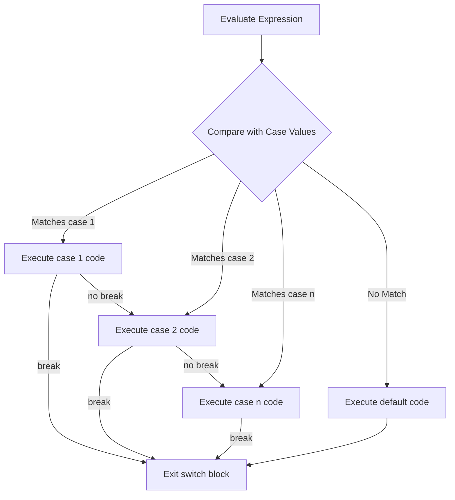

# Java Switch Case

## Introduction

When writing programs, we often need to perform different actions based on different conditions. While `if-else` statements work well for simple conditions, they can become unwieldy when checking a single variable against multiple values. This is where the **switch case** statement comes in handy.

The switch case statement in Java provides a more elegant way to handle multiple conditions that revolve around a single variable or expression. Think of it as a cleaner alternative to multiple if-else statements, especially when all conditions check the same variable.

## Basic Syntax

Here's the basic syntax of a switch case statement in Java:

```java
switch (expression) {
    case value1:
        // code to execute if expression equals value1
        break;
    case value2:
        // code to execute if expression equals value2
        break;
    // more cases...
    default:
        // code to execute if expression doesn't match any cases
}
```

Let's understand each component:

- **expression**: The variable or expression that is evaluated once and compared with each case
- **case value**: The value to compare against the expression
- **break**: A statement that terminates the switch block (prevents "fall-through")
- **default**: An optional case that executes when none of the cases match

## How Switch Case Works

The execution flow of a switch case statement can be visualized as:



## Example: Simple Switch Case

Let's look at a basic example of a switch case statement:

```java
public class DayChecker {
    public static void main(String[] args) {
        int day = 4;
        String dayName;
        
        switch (day) {
            case 1:
                dayName = "Monday";
                break;
            case 2:
                dayName = "Tuesday";
                break;
            case 3:
                dayName = "Wednesday";
                break;
            case 4:
                dayName = "Thursday";
                break;
            case 5:
                dayName = "Friday";
                break;
            case 6:
                dayName = "Saturday";
                break;
            case 7:
                dayName = "Sunday";
                break;
            default:
                dayName = "Invalid day";
        }
        
        System.out.println("Day " + day + " is " + dayName);
    }
}
```

**Output:**
```
Day 4 is Thursday
```

In this example, `day` has a value of `4`, so the code in the `case 4` block executes, and `dayName` becomes "Thursday".

## The Importance of Break Statements

The `break` statement is critical in switch cases. Without it, Java will continue executing all subsequent case blocks until it encounters a break or reaches the end of the switch statement. This behavior is called "fall-through".

Here's an example showing what happens without break statements:

```java
public class FallThroughExample {
    public static void main(String[] args) {
        int number = 2;
        
        System.out.println("Without break statements:");
        switch (number) {
            case 1:
                System.out.println("One");
            case 2:
                System.out.println("Two");
            case 3:
                System.out.println("Three");
            default:
                System.out.println("Default case");
        }
        
        System.out.println("\nWith break statements:");
        switch (number) {
            case 1:
                System.out.println("One");
                break;
            case 2:
                System.out.println("Two");
                break;
            case 3:
                System.out.println("Three");
                break;
            default:
                System.out.println("Default case");
        }
    }
}
```

**Output:**
```
Without break statements:
Two
Three
Default case

With break statements:
Two
```

As you can see, without break statements, all cases after the matching case (including the default case) are executed, which is rarely the desired behavior.

## Data Types Supported by Switch Case

Java switch statements support the following data types:
- `byte`, `short`, `int`, and `char`
- Enumeration types (`enum`)
- `String` (since Java 7)
- Wrapper classes for primitive types: `Byte`, `Short`, `Integer`, `Character`

Example with String:

```java
public class StringSwitchExample {
    public static void main(String[] args) {
        String role = "admin";
        
        switch (role) {
            case "admin":
                System.out.println("Welcome, Administrator!");
                break;
            case "editor":
                System.out.println("You can edit content.");
                break;
            case "user":
                System.out.println("Welcome, User!");
                break;
            default:
                System.out.println("Unknown role.");
        }
    }
}
```

**Output:**
```
Welcome, Administrator!
```

## Using Enumerations with Switch Case

Using enumerations (`enum`) with switch cases is a powerful combination that provides type safety:

```java
public class EnumSwitchExample {
    enum TrafficLight {
        RED, YELLOW, GREEN
    }
    
    public static void main(String[] args) {
        TrafficLight light = TrafficLight.YELLOW;
        
        switch (light) {
            case RED:
                System.out.println("Stop!");
                break;
            case YELLOW:
                System.out.println("Caution!");
                break;
            case GREEN:
                System.out.println("Go!");
                break;
        }
    }
}
```

**Output:**
```
Caution!
```

## Multiple Cases with Same Action

Sometimes different cases should execute the same code. Instead of duplicating code, you can group cases together:

```java
public class GroupedCasesExample {
    public static void main(String[] args) {
        int month = 4;
        String season;
        
        switch (month) {
            case 12:
            case 1:
            case 2:
                season = "Winter";
                break;
            case 3:
            case 4:
            case 5:
                season = "Spring";
                break;
            case 6:
            case 7:
            case 8:
                season = "Summer";
                break;
            case 9:
            case 10:
            case 11:
                season = "Fall";
                break;
            default:
                season = "Invalid month";
        }
        
        System.out.println("Month " + month + " is in " + season);
    }
}
```

**Output:**
```
Month 4 is in Spring
```

## Switch Expressions (Java 12+)

Starting with Java 12, switch statements can also be used as expressions, and from Java 14 onward, they're a standard feature. This modern form eliminates the need for break statements and provides a more concise syntax:

```java
public class SwitchExpressionExample {
    public static void main(String[] args) {
        int day = 3;
        
        String dayType = switch (day) {
            case 1, 2, 3, 4, 5 -> "Weekday";
            case 6, 7 -> "Weekend";
            default -> "Invalid day";
        };
        
        System.out.println(day + " is a " + dayType);
    }
}
```

**Output:**
```
3 is a Weekday
```

This syntax is cleaner and prevents fall-through issues by design.

## Real-World Application: Simple Calculator

Let's create a simple calculator using the switch case statement:

```java
import java.util.Scanner;

public class SimpleCalculator {
    public static void main(String[] args) {
        Scanner scanner = new Scanner(System.in);
        
        System.out.println("Simple Calculator");
        System.out.print("Enter first number: ");
        double num1 = scanner.nextDouble();
        
        System.out.print("Enter an operator (+, -, *, /): ");
        char operator = scanner.next().charAt(0);
        
        System.out.print("Enter second number: ");
        double num2 = scanner.nextDouble();
        
        double result;
        
        switch (operator) {
            case '+':
                result = num1 + num2;
                System.out.println(num1 + " + " + num2 + " = " + result);
                break;
            case '-':
                result = num1 - num2;
                System.out.println(num1 + " - " + num2 + " = " + result);
                break;
            case '*':
                result = num1 * num2;
                System.out.println(num1 + " * " + num2 + " = " + result);
                break;
            case '/':
                if (num2 != 0) {
                    result = num1 / num2;
                    System.out.println(num1 + " / " + num2 + " = " + result);
                } else {
                    System.out.println("Error: Division by zero");
                }
                break;
            default:
                System.out.println("Error: Invalid operator");
        }
        
        scanner.close();
    }
}
```

**Example Input/Output:**
```
Simple Calculator
Enter first number: 10
Enter an operator (+, -, *, /): *
Enter second number: 5
10.0 * 5.0 = 50.0
```

This calculator demonstrates how switch cases can handle different operations based on user input.

## When to Use Switch Case vs. If-Else

While both switch case and if-else can be used for conditional branching, they serve different purposes:

| Use Switch Case When | Use If-Else When |
|---------------------|------------------|
| Testing a single variable against multiple values | Testing different variables |
| Checking for equality (not range comparisons) | Comparing ranges or using complex conditions |
| Working with a limited set of known values | Working with unpredictable values |
| Seeking better readability with multiple conditions | Having just a few simple conditions |

## Summary

The switch case statement in Java provides an efficient and readable way to handle multiple conditions based on a single variable or expression. Key points to remember:

- Use it when comparing a single variable against multiple constant values
- Always include break statements (unless fall-through is intentional)
- The default case handles any values that don't match specific cases
- Java supports switch cases with `int`, `char`, `String` (Java 7+), and enums
- Switch expressions (Java 12+) provide a more concise syntax without fall-through issues

By mastering switch case statements, you'll be able to write cleaner, more maintainable code, especially when dealing with multiple conditions based on a single value.

## Practice Exercises

1. Write a program that converts numerical grades (1-5) to letter grades (A, B, C, D, F) using a switch case.
2. Create a menu-driven program that offers different operations (add, remove, display, exit) and executes the corresponding code using a switch case.
3. Implement a program that takes a month number (1-12) and prints the number of days in that month using a switch case.
4. Write a program that takes a day of the week (as a String) and prints whether it's a weekday or weekend using a switch case.

## Additional Resources

- [Java Documentation: The switch Statement](https://docs.oracle.com/javase/tutorial/java/nutsandbolts/switch.html)
- [Java 14 Switch Expressions](https://docs.oracle.com/en/java/javase/14/language/switch-expressions.html)
- [Oracle: Java Language Updates](https://docs.oracle.com/en/java/javase/14/language/index.html)