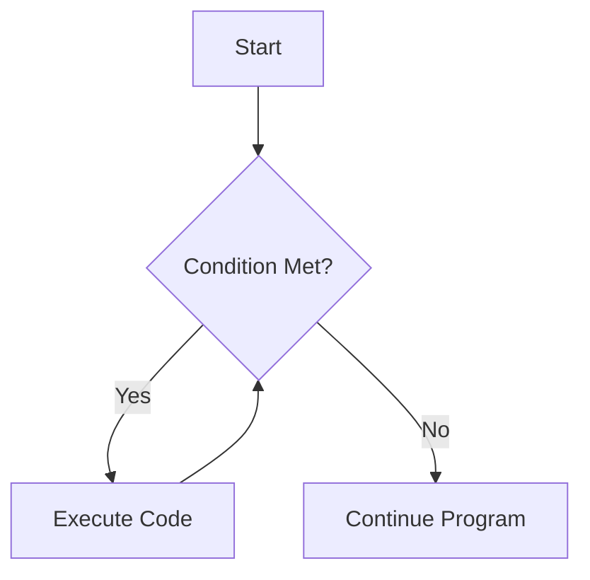

# Java Loops

## Introduction

Loops are fundamental programming constructs that allow you to execute a block of code repeatedly. In Java, loops help you automate repetitive tasks, process collections of data, and create efficient algorithms. Instead of writing the same code multiple times, you can use loops to perform the task as many times as needed.

For example, imagine you need to print the numbers 1 through 100. Without loops, you would need to write 100 separate print statements. With loops, you can accomplish this in just a few lines of code.

In this tutorial, we'll explore the different types of loops available in Java, when to use each one, and how they work.

## Types of Loops in Java

Java provides three main types of loops:

1. **while loop** - repeats as long as a condition is true
2. **do-while loop** - executes at least once and then repeats as long as a condition is true
3. **for loop** - repeats a specific number of times

Let's explore each type in detail.



## The while Loop

The `while` loop is the simplest form of loop in Java. It continues to execute a block of code as long as a specified condition evaluates to `true`.

### Syntax

```java
while (condition) {
    // code to be executed repeatedly
}
```

### How it works

1. The condition is evaluated.
2. If the condition is `true`, the code inside the loop executes.
3. After executing the code, the condition is evaluated again.
4. This process repeats until the condition becomes `false`.

### Example: Counting from 1 to 5

```java
public class WhileLoopExample {
    public static void main(String[] args) {
        int i = 1;  // Initialize counter
        
        while (i <= 5) {  // Condition
            System.out.println("Count: " + i);
            i++;  // Increment counter
        }
        
        System.out.println("Loop finished!");
    }
}
```

**Output:**
```
Count: 1
Count: 2
Count: 3
Count: 4
Count: 5
Loop finished!
```

### Important considerations:

1. **Update the loop variable**: Always ensure that the condition will eventually become false; otherwise, you'll create an infinite loop.
2. **Infinite loops**: If the condition never becomes `false`, the loop will run indefinitely, which may crash your program.

```java
// WARNING: This is an infinite loop!
while (true) {
    System.out.println("This will print forever!");
}
```

## The do-while Loop

The `do-while` loop is similar to the `while` loop, but with one important difference: the code block is executed at least once before the condition is checked.

### Syntax

```java
do {
    // code to be executed repeatedly
} while (condition);
```

### How it works

1. The code inside the loop executes once.
2. Then, the condition is evaluated.
3. If the condition is `true`, the code executes again.
4. This process repeats until the condition becomes `false`.

### Example: Menu Selection

```java
import java.util.Scanner;

public class DoWhileExample {
    public static void main(String[] args) {
        Scanner scanner = new Scanner(System.in);
        int choice;
        
        do {
            System.out.println("\nMenu:");
            System.out.println("1. Option One");
            System.out.println("2. Option Two");
            System.out.println("3. Exit");
            System.out.print("Enter your choice: ");
            
            choice = scanner.nextInt();
            
            switch (choice) {
                case 1:
                    System.out.println("You selected Option One");
                    break;
                case 2:
                    System.out.println("You selected Option Two");
                    break;
                case 3:
                    System.out.println("Exiting program...");
                    break;
                default:
                    System.out.println("Invalid choice! Please try again.");
            }
        } while (choice != 3);
        
        scanner.close();
    }
}
```

**Possible Output:**
```
Menu:
1. Option One
2. Option Two
3. Exit
Enter your choice: 1
You selected Option One

Menu:
1. Option One
2. Option Two
3. Exit
Enter your choice: 3
Exiting program...
```

The `do-while` loop is particularly useful for input validation and menu-driven programs where you want to ensure that a block of code executes at least once.

## The for Loop

The `for` loop is the most compact form of loop in Java. It's commonly used when you know exactly how many times you want to repeat a block of code.

### Syntax

```java
for (initialization; condition; update) {
    // code to be executed repeatedly
}
```

### How it works

1. The **initialization** part executes once when the loop starts.
2. The **condition** is evaluated before each iteration.
3. If the condition is `true`, the loop body executes.
4. After each iteration, the **update** part executes.
5. This process repeats until the condition becomes `false`.

### Example: Printing Numbers 1 to 5

```java
public class ForLoopExample {
    public static void main(String[] args) {
        for (int i = 1; i <= 5; i++) {
            System.out.println("Count: " + i);
        }
        
        System.out.println("Loop finished!");
    }
}
```

**Output:**
```
Count: 1
Count: 2
Count: 3
Count: 4
Count: 5
Loop finished!
```

### Example: Iterating through an Array

```java
public class ArrayIterationExample {
    public static void main(String[] args) {
        String[] fruits = {"Apple", "Banana", "Cherry", "Date", "Elderberry"};
        
        System.out.println("List of fruits:");
        for (int i = 0; i < fruits.length; i++) {
            System.out.println((i+1) + ". " + fruits[i]);
        }
    }
}
```

**Output:**
```
List of fruits:
1. Apple
2. Banana
3. Cherry
4. Date
5. Elderberry
```

## The Enhanced for Loop (for-each)

Java provides an enhanced `for` loop specifically designed for iterating through arrays and collections. It's often called the "for-each" loop.

### Syntax

```java
for (dataType item : collection) {
    // code to be executed for each item
}
```

### Example: Iterating through an Array with for-each

```java
public class EnhancedForLoopExample {
    public static void main(String[] args) {
        String[] fruits = {"Apple", "Banana", "Cherry", "Date", "Elderberry"};
        
        System.out.println("List of fruits:");
        for (String fruit : fruits) {
            System.out.println("- " + fruit);
        }
    }
}
```

**Output:**
```
List of fruits:
- Apple
- Banana
- Cherry
- Date
- Elderberry
```

## Loop Control Statements

Java provides statements that let you control the flow of loops:

### break Statement

The `break` statement immediately terminates the loop it is in.

```java
public class BreakExample {
    public static void main(String[] args) {
        for (int i = 1; i <= 10; i++) {
            if (i == 6) {
                System.out.println("Breaking at i = " + i);
                break;  // Exit the loop when i is 6
            }
            System.out.println("Count: " + i);
        }
        System.out.println("Loop finished!");
    }
}
```

**Output:**
```
Count: 1
Count: 2
Count: 3
Count: 4
Count: 5
Breaking at i = 6
Loop finished!
```

### continue Statement

The `continue` statement skips the current iteration and proceeds to the next one.

```java
public class ContinueExample {
    public static void main(String[] args) {
        for (int i = 1; i <= 5; i++) {
            if (i == 3) {
                System.out.println("Skipping iteration at i = " + i);
                continue;  // Skip the rest of this iteration
            }
            System.out.println("Processing: " + i);
        }
        System.out.println("Loop finished!");
    }
}
```

**Output:**
```
Processing: 1
Processing: 2
Skipping iteration at i = 3
Processing: 4
Processing: 5
Loop finished!
```

## Practical Examples

### Example 1: Summing Numbers

Let's calculate the sum of numbers from 1 to n:

```java
import java.util.Scanner;

public class SumExample {
    public static void main(String[] args) {
        Scanner scanner = new Scanner(System.in);
        
        System.out.print("Enter a positive number: ");
        int n = scanner.nextInt();
        
        int sum = 0;
        for (int i = 1; i <= n; i++) {
            sum += i;
        }
        
        System.out.println("The sum of numbers from 1 to " + n + " is: " + sum);
        scanner.close();
    }
}
```

**Example Output:**
```
Enter a positive number: 10
The sum of numbers from 1 to 10 is: 55
```

### Example 2: Multiplication Table

Generate a multiplication table for a given number:

```java
import java.util.Scanner;

public class MultiplicationTable {
    public static void main(String[] args) {
        Scanner scanner = new Scanner(System.in);
        
        System.out.print("Enter a number to see its multiplication table: ");
        int number = scanner.nextInt();
        
        System.out.println("\nMultiplication Table for " + number + ":");
        System.out.println("----------------------------");
        
        for (int i = 1; i <= 10; i++) {
            System.out.println(number + " × " + i + " = " + (number * i));
        }
        
        scanner.close();
    }
}
```

**Example Output:**
```
Enter a number to see its multiplication table: 7

Multiplication Table for 7:
----------------------------
7 × 1 = 7
7 × 2 = 14
7 × 3 = 21
7 × 4 = 28
7 × 5 = 35
7 × 6 = 42
7 × 7 = 49
7 × 8 = 56
7 × 9 = 63
7 × 10 = 70
```

### Example 3: Finding Prime Numbers

Check if a number is prime using loops:

```java
import java.util.Scanner;

public class PrimeChecker {
    public static void main(String[] args) {
        Scanner scanner = new Scanner(System.in);
        
        System.out.print("Enter a positive integer to check if it's prime: ");
        int number = scanner.nextInt();
        
        boolean isPrime = true;
        
        if (number <= 1) {
            isPrime = false;
        } else {
            for (int i = 2; i <= Math.sqrt(number); i++) {
                if (number % i == 0) {
                    isPrime = false;
                    break;
                }
            }
        }
        
        if (isPrime) {
            System.out.println(number + " is a prime number.");
        } else {
            System.out.println(number + " is not a prime number.");
        }
        
        scanner.close();
    }
}
```

**Example Output:**
```
Enter a positive integer to check if it's prime: 17
17 is a prime number.
```

## Nested Loops

Loops can be nested inside one another. This is useful for working with multi-dimensional data structures like 2D arrays, or for generating complex patterns.

### Example: Printing a Pattern

```java
public class PatternExample {
    public static void main(String[] args) {
        int rows = 5;
        
        for (int i = 1; i <= rows; i++) {
            // Print spaces
            for (int j = 1; j <= rows - i; j++) {
                System.out.print(" ");
            }
            
            // Print stars
            for (int k = 1; k <= 2 * i - 1; k++) {
                System.out.print("*");
            }
            
            System.out.println();  // Move to the next line
        }
    }
}
```

**Output:**
```
    *
   ***
  *****
 *******
*********
```

### Example: Processing a 2D Array

```java
public class TwoDArrayExample {
    public static void main(String[] args) {
        int[][] matrix = {
            {1, 2, 3},
            {4, 5, 6},
            {7, 8, 9}
        };
        
        System.out.println("Matrix elements:");
        
        for (int row = 0; row < matrix.length; row++) {
            for (int col = 0; col < matrix[row].length; col++) {
                System.out.print(matrix[row][col] + " ");
            }
            System.out.println();  // Move to next row
        }
        
        // Calculate the sum of all elements
        int sum = 0;
        for (int row = 0; row < matrix.length; row++) {
            for (int col = 0; col < matrix[row].length; col++) {
                sum += matrix[row][col];
            }
        }
        
        System.out.println("Sum of all elements: " + sum);
    }
}
```

**Output:**
```
Matrix elements:
1 2 3 
4 5 6 
7 8 9 
Sum of all elements: 45
```

## Common Loop Pitfalls and Best Practices

### 1. Infinite Loops

Always ensure your loop has an exit condition that will eventually be met:

```java
// Bad: Infinite loop
while (true) {
    System.out.println("This will run forever!");
}

// Good: Loop with a clear exit condition
int i = 0;
while (i < 10) {
    System.out.println(i);
    i++;  // Don't forget this!
}
```

### 2. Off-by-One Errors

Be careful when setting loop boundaries:

```java
// If you want to process array elements from 0 to length-1:
for (int i = 0; i < array.length; i++) {  // Note the < operator, not <=
    // Process array[i]
}
```

### 3. Loop Variable Scope

The scope of variables declared in the initialization part of a for loop is limited to the loop:

```java
// The variable 'i' exists only within the loop
for (int i = 0; i < 5; i++) {
    System.out.println(i);
}
// System.out.println(i);  // This would cause a compilation error

// If you need to use the variable after the loop:
int j;
for (j = 0; j < 5; j++) {
    System.out.println(j);
}
System.out.println("Final value of j: " + j);  // This works
```

### 4. Choosing the Right Loop

- **for loop**: Use when you know the exact number of iterations.
- **while loop**: Use when you don't know how many iterations you need beforehand.
- **do-while loop**: Use when you need to execute the code at least once.
- **enhanced for loop**: Use for iterating through collections or arrays when you don't need the index.

## Summary

Loops are essential control flow structures in Java that allow you to execute code repeatedly. We've covered:

- **while loops**: Execute code as long as a condition is true
- **do-while loops**: Execute code at least once, then continue as long as a condition is true
- **for loops**: Execute code a specific number of times
- **Enhanced for loops**: Iterate through collections and arrays easily
- **Control statements**: `break` and `continue` to further control loop execution
- **Nested loops**: Loops within loops for complex tasks
- **Best practices**: Avoiding common pitfalls like infinite loops

Mastering loops is crucial for solving many programming problems efficiently. With practice, you'll find yourself using these structures naturally in your code.

## Exercises

Test your understanding of loops with these exercises:

1. Write a program that calculates the factorial of a number (e.g., factorial of 5 = 5×4×3×2×1 = 120).
2. Create a program that prints the Fibonacci sequence up to a specified number of terms.
3. Write a program that reverses a string using a loop.
4. Create a simple guessing game where the user has to guess a random number between 1 and 100, with hints saying "too high" or "too low".
5. Write a program that checks if a string is a palindrome (reads the same backward as forward).

## Additional Resources

- [Oracle's Java Tutorial on Loops](https://docs.oracle.com/javase/tutorial/java/nutsandbolts/while.html)
- [Java Loops Explained on GeeksforGeeks](https://www.geeksforgeeks.org/loops-in-java/)
- [Practice Loop Problems on HackerRank](https://www.hackerrank.com/domains/tutorials/10-days-of-javascript/loops)
- [Java Loop Performance Considerations](https://www.baeldung.com/java-for-loop-vs-stream-forEach)