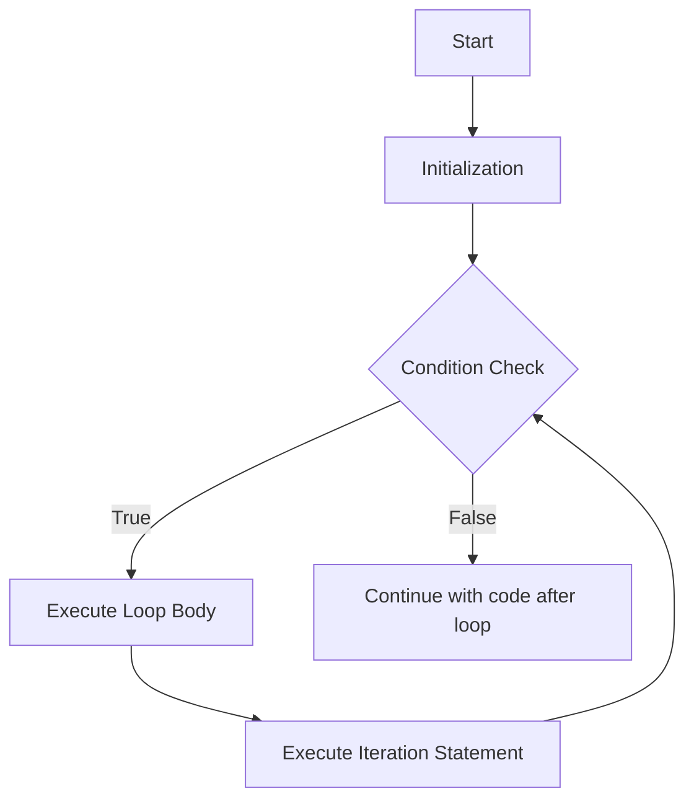

# Java For Loop

## Introduction

A for loop is one of the most commonly used control flow statements in Java that allows you to execute a block of code repeatedly. Unlike while loops that simply check a condition, for loops are specifically designed for situations where you know in advance how many times you want to execute a block of code.

For loops are particularly useful when you need to iterate through arrays, collections, or when you need to repeat actions a specific number of times. They combine initialization, condition checking, and iteration statements in a single, compact syntax.

## Basic Syntax

The basic syntax of a Java for loop is:

```java
for (initialization; condition; iteration) {
    // code to be executed in each iteration
}
```

Where:
- **initialization**: Executed once at the beginning of the loop
- **condition**: Evaluated before each iteration; if false, the loop stops
- **iteration**: Executed after each iteration of the loop body

## How For Loops Work

Let's visualize the flow of a for loop:



## Basic For Loop Examples

### Example 1: Printing Numbers from 1 to 5

```java
// Print numbers from 1 to 5
for (int i = 1; i <= 5; i++) {
    System.out.println(i);
}
```

**Output:**
```
1
2
3
4
5
```

In this example:
- `int i = 1`: Initialize variable i to 1
- `i <= 5`: Continue looping as long as i is less than or equal to 5
- `i++`: Increment i by 1 after each iteration

### Example 2: Calculating the Sum of Numbers from 1 to 10

```java
int sum = 0;
for (int i = 1; i <= 10; i++) {
    sum += i;  // Add i to sum
}
System.out.println("Sum of numbers 1 to 10: " + sum);
```

**Output:**
```
Sum of numbers 1 to 10: 55
```

## Advanced For Loop Variations

### Multiple Initialization or Iteration Statements

You can include multiple statements in the initialization and iteration parts of a for loop by separating them with commas:

```java
for (int i = 0, j = 10; i < j; i++, j--) {
    System.out.println("i = " + i + ", j = " + j);
}
```

**Output:**
```
i = 0, j = 10
i = 1, j = 9
i = 2, j = 8
i = 3, j = 7
i = 4, j = 6
```

### Omitting Parts of the For Loop

You can omit any part of the for loop if needed:

```java
// Initialization outside the loop
int i = 1;
for (; i <= 5; i++) {
    System.out.println(i);
}

// Infinite loop with break condition
for (int j = 1; ; j++) {
    System.out.println(j);
    if (j >= 5) {
        break;  // Exit loop when j reaches 5
    }
}

// Handling iteration inside the loop
for (int k = 1; k <= 5;) {
    System.out.println(k);
    k++;  // Increment inside loop body
}
```

### Nested For Loops

You can nest one for loop inside another to work with multi-dimensional structures:

```java
// Print a multiplication table for 1-5
for (int i = 1; i <= 5; i++) {
    for (int j = 1; j <= 5; j++) {
        System.out.print(i * j + "\t");
    }
    System.out.println();  // New line after each row
}
```

**Output:**
```
1	2	3	4	5	
2	4	6	8	10	
3	6	9	12	15	
4	8	12	16	20	
5	10	15	20	25	
```

## Enhanced For Loop (For-Each Loop)

Java also provides an enhanced for loop specifically designed for iterating through arrays and collections:

```java
int[] numbers = {1, 2, 3, 4, 5};

// Traditional for loop
for (int i = 0; i < numbers.length; i++) {
    System.out.println(numbers[i]);
}

// Enhanced for loop (for-each)
for (int number : numbers) {
    System.out.println(number);
}
```

Both loops produce the same output, but the enhanced for loop provides cleaner syntax when you need to process each element without needing the index.

## Common Use Cases and Practical Examples

### Example 1: Working with Arrays

```java
String[] fruits = {"Apple", "Banana", "Cherry", "Dragon fruit", "Elderberry"};

System.out.println("List of fruits:");
for (int i = 0; i < fruits.length; i++) {
    System.out.println((i+1) + ". " + fruits[i]);
}
```

**Output:**
```
List of fruits:
1. Apple
2. Banana
3. Cherry
4. Dragon fruit
5. Elderberry
```

### Example 2: Pattern Printing

```java
// Print a right-angled triangle pattern
int rows = 5;
for (int i = 1; i <= rows; i++) {
    for (int j = 1; j <= i; j++) {
        System.out.print("* ");
    }
    System.out.println();
}
```

**Output:**
```
* 
* * 
* * * 
* * * * 
* * * * * 
```

### Example 3: Finding Prime Numbers

```java
// Check if a number is prime
int num = 29;
boolean isPrime = true;

for (int i = 2; i <= num/2; i++) {
    if (num % i == 0) {
        isPrime = false;
        break;
    }
}

if (isPrime) {
    System.out.println(num + " is a prime number");
} else {
    System.out.println(num + " is not a prime number");
}
```

**Output:**
```
29 is a prime number
```

## Common Pitfalls and Best Practices

### Infinite Loops

Be careful not to create infinite loops by ensuring your loop condition will eventually become false:

```java
// Infinite loop - condition never becomes false
for (int i = 1; i > 0; i++) {
    System.out.println(i);  // This will run forever
}
```

### Off-by-One Errors

Pay attention to the comparison operator you use to avoid off-by-one errors:

```java
// Prints 0 to 9 (10 numbers)
for (int i = 0; i < 10; i++) {
    System.out.println(i);
}

// Prints 0 to 10 (11 numbers)
for (int i = 0; i <= 10; i++) {
    System.out.println(i);
}
```

### Performance Considerations

For performance optimization, avoid doing expensive operations in the loop condition:

```java
// Inefficient - calling array.length in each iteration
for (int i = 0; i < array.length; i++) {
    // Loop body
}

// More efficient - calculate length once
int length = array.length;
for (int i = 0; i < length; i++) {
    // Loop body
}
```

## Summary

The for loop is a powerful control flow statement in Java that provides a concise way to execute code repeatedly with controlled initialization, condition checking, and iteration. Key points to remember:

- Use a for loop when you know in advance how many iterations you need
- The basic syntax includes initialization, condition, and iteration expressions
- For loops can be nested for working with multi-dimensional data structures
- Enhanced for loops (for-each) provide cleaner syntax for iterating through arrays and collections
- Be careful to avoid common mistakes like infinite loops and off-by-one errors

With practice, you'll find that for loops are an essential tool in your Java programming toolkit, especially for processing collections of data and implementing repetitive algorithms.

## Exercises

To solidify your understanding of for loops, try these exercises:

1. Write a program to calculate the factorial of a number (e.g., 5! = 5×4×3×2×1)
2. Print the Fibonacci series up to n terms using a for loop
3. Write a program that uses nested for loops to print a pyramid pattern
4. Create a program that identifies all prime numbers between 1 and 100
5. Write a program to reverse a string using a for loop

## Additional Resources

- [Oracle's Java Documentation on Control Flow Statements](https://docs.oracle.com/javase/tutorial/java/nutsandbolts/flow.html)
- [Java for Loop (W3Schools)](https://www.w3schools.com/java/java_for_loop.asp)
- [Loop Control Structures in Java (GeeksforGeeks)](https://www.geeksforgeeks.org/loops-in-java/)

Understanding for loops thoroughly will help you write more efficient and elegant code in Java, especially when working with collections of data or implementing algorithms that require repetitive operations.