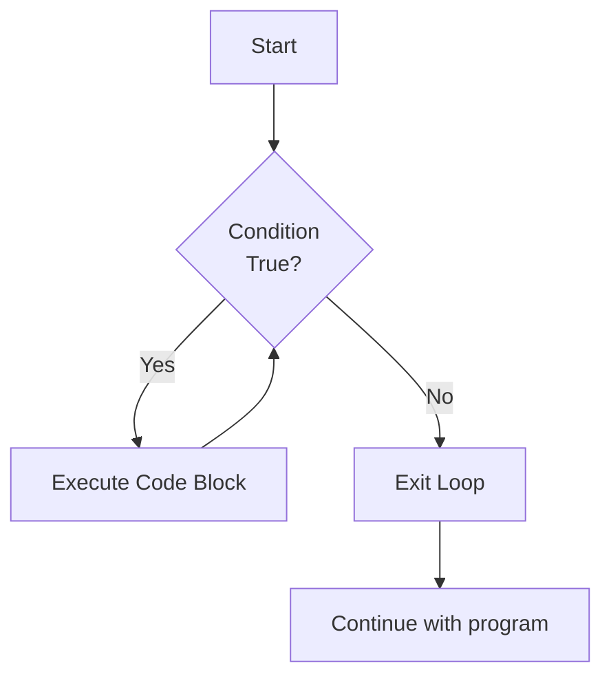

# Java While Loop

## Introduction

In programming, we often need to execute a block of code repeatedly until a certain condition is met. Java provides several loop structures to accomplish this, and the **while loop** is one of the most fundamental ones. The while loop is a control flow statement that allows code to be executed repeatedly based on a given boolean condition.

A while loop is particularly useful when you don't know in advance how many times you need to execute a block of code. Instead, the code will continue to execute as long as the specified condition remains true.

## Basic Syntax

The syntax of a while loop in Java is straightforward:

```java
while (condition) {
    // code block to be executed
}
```

The flow works like this:
1. Java evaluates the condition
2. If the condition is `true`, the code block executes
3. After execution, Java evaluates the condition again
4. This process repeats until the condition becomes `false`



## Simple While Loop Examples

### Example 1: Counting from 1 to 5

```java
public class WhileLoopCounter {
    public static void main(String[] args) {
        int count = 1;
        
        while (count <= 5) {
            System.out.println("Count is: " + count);
            count++;
        }
        
        System.out.println("Loop completed!");
    }
}
```

**Output:**
```
Count is: 1
Count is: 2
Count is: 3
Count is: 4
Count is: 5
Loop completed!
```

In this example:
- We initialize a counter variable `count` with a value of 1.
- The while loop continues as long as `count` is less than or equal to 5.
- Inside the loop, we print the current value of `count` and then increment it by 1.
- Once `count` becomes 6, the condition `count <= 5` becomes `false`, and the loop terminates.

### Example 2: Sum of Numbers

```java
public class WhileLoopSum {
    public static void main(String[] args) {
        int number = 1;
        int sum = 0;
        
        while (number <= 10) {
            sum += number;  // Add current number to sum
            number++;       // Move to next number
        }
        
        System.out.println("Sum of numbers from 1 to 10 is: " + sum);
    }
}
```

**Output:**
```
Sum of numbers from 1 to 10 is: 55
```

In this example, we calculate the sum of all numbers from 1 to 10 using a while loop.

## Important Considerations

### 1. Infinite Loops

If the condition in a while loop never becomes `false`, the loop will run indefinitely, creating what's known as an infinite loop.

```java
// CAUTION: This creates an infinite loop
while (true) {
    System.out.println("This will print forever!");
}
```

To avoid infinite loops, make sure:
- Your loop condition can eventually become `false`
- You update variables used in the condition within the loop
- You don't accidentally reset counter variables inside the loop

### 2. Loop Control Statements

Java provides special statements to control the flow of loops:

- `break`: Exits the loop immediately
- `continue`: Skips the current iteration and proceeds to the next one

#### Break Example

```java
public class WhileLoopBreak {
    public static void main(String[] args) {
        int i = 1;
        
        while (i <= 10) {
            System.out.println("Number: " + i);
            
            if (i == 5) {
                System.out.println("Breaking the loop");
                break;  // Exit the loop when i equals 5
            }
            
            i++;
        }
        
        System.out.println("After the loop");
    }
}
```

**Output:**
```
Number: 1
Number: 2
Number: 3
Number: 4
Number: 5
Breaking the loop
After the loop
```

#### Continue Example

```java
public class WhileLoopContinue {
    public static void main(String[] args) {
        int i = 0;
        
        while (i < 10) {
            i++;
            
            // Skip printing if number is even
            if (i % 2 == 0) {
                continue;
            }
            
            System.out.println("Odd number: " + i);
        }
    }
}
```

**Output:**
```
Odd number: 1
Odd number: 3
Odd number: 5
Odd number: 7
Odd number: 9
```

## The do-while Loop Variant

Java also offers a variation of the while loop called the **do-while** loop. The key difference is that a do-while loop always executes the code block at least once before checking the condition.

```java
do {
    // code block to be executed
} while (condition);
```

### Example of do-while loop

```java
public class DoWhileExample {
    public static void main(String[] args) {
        int i = 1;
        
        do {
            System.out.println("Number: " + i);
            i++;
        } while (i <= 5);
        
        System.out.println("Loop completed");
    }
}
```

**Output:**
```
Number: 1
Number: 2
Number: 3
Number: 4
Number: 5
Loop completed
```

## Practical Applications

Let's explore some real-world applications of while loops:

### 1. User Input Validation

```java
import java.util.Scanner;

public class InputValidation {
    public static void main(String[] args) {
        Scanner scanner = new Scanner(System.in);
        int userInput;
        
        System.out.println("Please enter a number between 1 and 10:");
        userInput = scanner.nextInt();
        
        // Continue asking until valid input is received
        while (userInput < 1 || userInput > 10) {
            System.out.println("Invalid input! Please enter a number between 1 and 10:");
            userInput = scanner.nextInt();
        }
        
        System.out.println("Thank you! You entered: " + userInput);
        scanner.close();
    }
}
```

In this example, the program keeps asking for input until the user provides a number within the valid range.

### 2. Menu-Driven Programs

```java
import java.util.Scanner;

public class SimpleMenu {
    public static void main(String[] args) {
        Scanner scanner = new Scanner(System.in);
        int choice = 0;
        
        while (choice != 4) {
            // Display menu
            System.out.println("\n===== MENU =====");
            System.out.println("1. Option One");
            System.out.println("2. Option Two");
            System.out.println("3. Option Three");
            System.out.println("4. Exit");
            System.out.print("Enter your choice: ");
            
            choice = scanner.nextInt();
            
            // Process user choice
            switch (choice) {
                case 1:
                    System.out.println("You selected Option One");
                    break;
                case 2:
                    System.out.println("You selected Option Two");
                    break;
                case 3:
                    System.out.println("You selected Option Three");
                    break;
                case 4:
                    System.out.println("Exiting program. Goodbye!");
                    break;
                default:
                    System.out.println("Invalid option. Please try again.");
            }
        }
        
        scanner.close();
    }
}
```

This menu-driven program continues to display options until the user selects the exit option.

### 3. Data Processing

```java
public class DataProcessing {
    public static void main(String[] args) {
        int[] data = {5, 10, 15, 20, 25, 30, 35, 40};
        int i = 0;
        int sum = 0;
        
        // Process data until end of array
        while (i < data.length) {
            sum += data[i];
            i++;
        }
        
        double average = (double) sum / data.length;
        System.out.println("Sum: " + sum);
        System.out.println("Average: " + average);
    }
}
```

**Output:**
```
Sum: 180
Average: 22.5
```

This example calculates the sum and average of values in an array using a while loop.

## When to Use While Loops

While loops are particularly useful when:

1. **You don't know the exact number of iterations** needed ahead of time
2. **The loop condition depends on user input** or external data
3. **You need a loop that might never execute** (in this case, use a standard while loop, not do-while)
4. **You need a loop that always executes at least once** (use do-while)
5. **You're waiting for a specific event or condition** to occur

## While Loop vs For Loop

Both while loops and for loops can achieve similar results, but they're designed for different scenarios:

| While Loop                                   | For Loop                                   |
|----------------------------------------------|--------------------------------------------|
| Best when number of iterations is unknown    | Best when number of iterations is known    |
| Simpler syntax when only a condition matters | Better for counter-based iteration         |
| More flexible for complex conditions         | More concise for simple iteration patterns |
| Good for event-based looping                 | Good for collection/array traversal        |

## Common Mistakes and Best Practices

### Common Mistakes

1. **Forgetting to update the loop control variable**, leading to infinite loops
2. **Incorrect loop conditions** that never evaluate to false
3. **Off-by-one errors** where the loop runs one too many or one too few times
4. **Using `<=` instead of `<`** (or vice versa) for array index bounds

### Best Practices

1. **Always ensure** there's a way for the loop to terminate
2. **Use clear variable names** to make your code easier to understand
3. **Avoid complex conditions** in while loops; break them down or compute them before the loop
4. **Consider a for loop** if you're counting or iterating through a collection
5. **Be careful with break and continue statements** as they can make code harder to follow

## Summary

The while loop is a powerful control flow structure in Java that allows code to be executed repeatedly based on a boolean condition. It's particularly useful when the number of iterations is not known in advance or depends on external factors.

Key points to remember about while loops:

- The loop body executes only if the condition is true
- The condition is evaluated before each iteration 
- Variables in the condition must be updated within the loop to avoid infinite loops
- The do-while variant ensures the loop executes at least once
- Break and continue statements provide additional control within loops

With practice, you'll become comfortable deciding when to use while loops versus other looping constructs in your Java programs.

## Exercises

To solidify your understanding of while loops, try these exercises:

1. Write a program that calculates the factorial of a number using a while loop
2. Create a guessing game where the user tries to guess a random number between 1 and 100
3. Implement a program that reverses a string using a while loop
4. Write a program to find the sum of all digits in a number (e.g., 123 → 1+2+3 = 6)
5. Create a program that prints a countdown from 10 to 1 and then prints "Blastoff!"

## Additional Resources

- [Oracle's Java Documentation on Control Flow Statements](https://docs.oracle.com/javase/tutorial/java/nutsandbolts/flow.html)
- [Java While Loop Tutorial - W3Schools](https://www.w3schools.com/java/java_while_loop.asp)
- [Java Loop Control - GeeksforGeeks](https://www.geeksforgeeks.org/loops-in-java/)

By mastering while loops, you're adding an essential tool to your programming toolkit that will serve you well in countless programming scenarios.