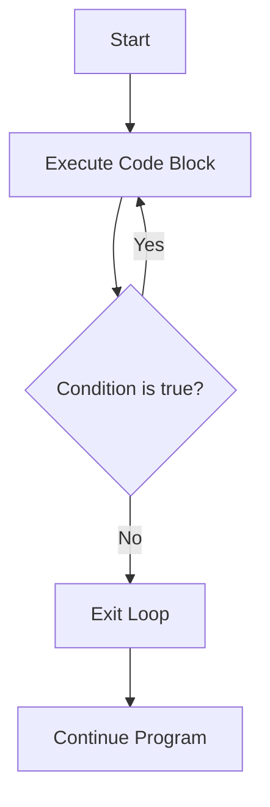

# Java Do While Loop

## Introduction

The `do-while` loop is one of Java's fundamental loop structures that allows you to repeatedly execute a block of code. What makes the `do-while` loop special is that it guarantees the execution of the code block **at least once**, regardless of whether the condition is true or false. This "execute-then-test" behavior distinguishes it from the regular `while` loop, which checks the condition before any execution.

In programming scenarios where you need to ensure a block of code runs at least once before checking any condition, the `do-while` loop becomes particularly useful.

## Basic Syntax

Here's the basic syntax of a `do-while` loop in Java:

```java
do {
    // Code to be executed
} while (condition);
```

Note the semicolon after the closing parenthesis of the condition - this is required and often a source of syntax errors for beginners.

## How Do-While Loop Works

The execution flow of a `do-while` loop follows these steps:

1. Execute the code block inside the `do` section
2. Evaluate the condition in the `while` section
3. If the condition is `true`, go back to step 1
4. If the condition is `false`, exit the loop and continue with the code after the loop

Here's a visual representation of the flow:



## Simple Example: Counting with Do-While

Let's look at a basic example that prints numbers from 1 to 5:

```java
public class DoWhileDemo {
    public static void main(String[] args) {
        int counter = 1;
        
        do {
            System.out.println("Count: " + counter);
            counter++;
        } while (counter <= 5);
    }
}
```

**Output:**
```
Count: 1
Count: 2
Count: 3
Count: 4
Count: 5
```

In this example:
1. We initialize a `counter` variable to 1
2. The `do` block executes, printing the counter value and incrementing it
3. After each execution, the condition `counter <= 5` is checked
4. The loop continues until the counter exceeds 5

## Do-While vs. While Loop

Understanding the difference between `do-while` and regular `while` loops is crucial:

| Feature | `do-while` Loop | `while` Loop |
|---------|----------------|-------------|
| Execution guarantee | At least once | Zero or more times |
| Condition check | After execution | Before execution |
| Best for | When code must run at least once | When execution depends on a condition |

Consider this example with both loops where the condition is false from the start:

```java
public class LoopComparison {
    public static void main(String[] args) {
        int x = 10;
        
        System.out.println("Using do-while loop:");
        do {
            System.out.println("Value of x: " + x);
        } while (x < 5);
        
        System.out.println("\nUsing while loop:");
        x = 10;  // Reset x
        while (x < 5) {
            System.out.println("Value of x: " + x);
        }
    }
}
```

**Output:**
```
Using do-while loop:
Value of x: 10

Using while loop:
```

Notice that with the `do-while` loop, the message prints once even though the condition is false. The `while` loop doesn't execute at all since the condition is checked first.

## Practical Example: User Input Validation

One common real-world application of `do-while` loops is input validation. Since we want to prompt the user at least once for input, and then potentially repeat if the input is invalid, `do-while` is a perfect fit:

```java
import java.util.Scanner;

public class InputValidation {
    public static void main(String[] args) {
        Scanner scanner = new Scanner(System.in);
        int userNumber;
        
        do {
            System.out.print("Please enter a positive number: ");
            userNumber = scanner.nextInt();
            
            if (userNumber <= 0) {
                System.out.println("That's not a positive number! Try again.");
            }
        } while (userNumber <= 0);
        
        System.out.println("Thank you! You entered: " + userNumber);
        scanner.close();
    }
}
```

**Example Interaction:**
```
Please enter a positive number: -5
That's not a positive number! Try again.
Please enter a positive number: 0
That's not a positive number! Try again.
Please enter a positive number: 10
Thank you! You entered: 10
```

This example demonstrates how the `do-while` loop ensures the user is prompted at least once, and the loop continues until valid input is provided.

## Practical Example: Menu-Driven Program

Another common use of `do-while` loops is creating menu-driven applications, where users see a menu of options and can repeatedly make selections:

```java
import java.util.Scanner;

public class MenuDrivenProgram {
    public static void main(String[] args) {
        Scanner scanner = new Scanner(System.in);
        int choice;
        
        do {
            // Display menu
            System.out.println("\n===== Calculator Menu =====");
            System.out.println("1. Add two numbers");
            System.out.println("2. Subtract two numbers");
            System.out.println("3. Multiply two numbers");
            System.out.println("4. Divide two numbers");
            System.out.println("0. Exit");
            System.out.print("Enter your choice: ");
            
            choice = scanner.nextInt();
            
            // Process the choice
            switch (choice) {
                case 1:
                    performAddition(scanner);
                    break;
                case 2:
                    performSubtraction(scanner);
                    break;
                case 3:
                    performMultiplication(scanner);
                    break;
                case 4:
                    performDivision(scanner);
                    break;
                case 0:
                    System.out.println("Exiting program. Goodbye!");
                    break;
                default:
                    System.out.println("Invalid option! Please try again.");
            }
            
        } while (choice != 0);
        
        scanner.close();
    }
    
    // Method to perform addition
    private static void performAddition(Scanner scanner) {
        System.out.print("Enter first number: ");
        double num1 = scanner.nextDouble();
        System.out.print("Enter second number: ");
        double num2 = scanner.nextDouble();
        System.out.println("Result: " + (num1 + num2));
    }
    
    // Method to perform subtraction
    private static void performSubtraction(Scanner scanner) {
        System.out.print("Enter first number: ");
        double num1 = scanner.nextDouble();
        System.out.print("Enter second number: ");
        double num2 = scanner.nextDouble();
        System.out.println("Result: " + (num1 - num2));
    }
    
    // Method to perform multiplication
    private static void performMultiplication(Scanner scanner) {
        System.out.print("Enter first number: ");
        double num1 = scanner.nextDouble();
        System.out.print("Enter second number: ");
        double num2 = scanner.nextDouble();
        System.out.println("Result: " + (num1 * num2));
    }
    
    // Method to perform division
    private static void performDivision(Scanner scanner) {
        System.out.print("Enter first number: ");
        double num1 = scanner.nextDouble();
        System.out.print("Enter second number: ");
        double num2 = scanner.nextDouble();
        
        if (num2 == 0) {
            System.out.println("Error: Cannot divide by zero!");
        } else {
            System.out.println("Result: " + (num1 / num2));
        }
    }
}
```

This example creates a calculator program that continuously displays a menu and performs operations based on user input until the user chooses to exit.

## Common Pitfalls and Best Practices

### 1. Infinite Loops

Be careful not to create infinite loops by ensuring your condition will eventually become false:

```java
// Infinite loop - counter never updated
do {
    System.out.println("This will print forever!");
} while (true);

// Correct approach - has an exit condition
int counter = 1;
do {
    System.out.println("Count: " + counter);
    counter++;  // Important: update the variable used in condition
} while (counter <= 10);
```

### 2. Semicolon Placement

The semicolon after the `while` condition is required:

```java
// Correct
do {
    // Code
} while (condition);  // Semicolon here

// Incorrect - will cause compilation error
do {
    // Code
} while (condition)  // Missing semicolon
```

### 3. Updating Variables Used in Condition

Always ensure that variables used in the loop condition are updated within the loop body to avoid infinite loops:

```java
int number = 1;
do {
    System.out.println(number);
    number++;  // This ensures the loop will eventually end
} while (number <= 5);
```

## Summary

The `do-while` loop is a powerful control flow structure in Java that guarantees at least one execution of a code block before checking a condition. Key points to remember:

- The loop body always executes at least once
- The condition is checked after each execution
- It's ideal for scenarios like input validation and menu-driven programs
- Remember to include the semicolon after the condition
- Take care to avoid infinite loops by updating condition variables

Understanding when to use a `do-while` loop versus other loop types is an important skill in Java programming. It's particularly valuable when you need to ensure that specific code runs at least once regardless of conditions.

## Exercises

To practice your understanding of `do-while` loops, try these exercises:

1. Write a program that asks the user to guess a number between 1 and 100, providing "higher" or "lower" hints until they guess correctly.

2. Create a simple ATM simulation that presents a menu of options (check balance, deposit, withdraw, exit) and processes user selections using a do-while loop.

3. Write a program that calculates the sum of integers entered by a user until they enter a negative number.

4. Create a program that validates a password, requiring it to be at least 8 characters long with at least one number and one special character.

5. Implement a number-guessing game where the computer randomly selects a number, and the user has to guess it with hints like "too high" or "too low".

## Additional Resources

- [Oracle's Java Documentation on Control Flow Statements](https://docs.oracle.com/javase/tutorial/java/nutsandbolts/flow.html)
- [W3Schools Java Do While Tutorial](https://www.w3schools.com/java/java_do_while.asp)
- [GeeksforGeeks - Java do-while loop](https://www.geeksforgeeks.org/java-do-while-loop/)