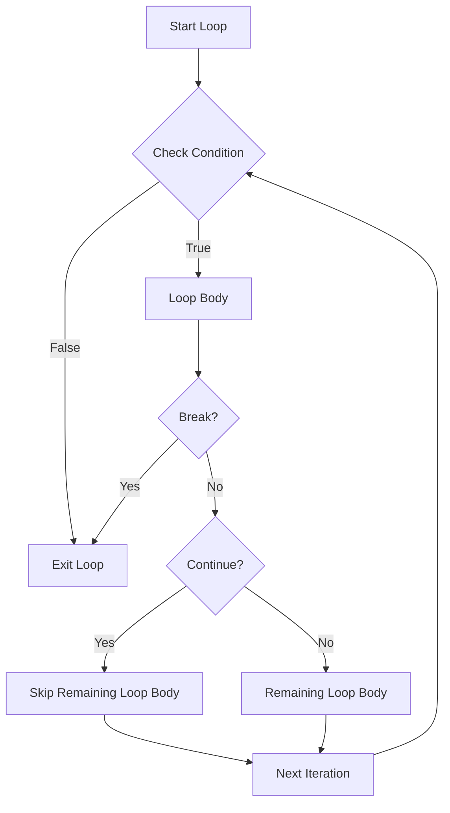

# Java Break and Continue Statements

In Java programming, there are times when you need to alter the normal flow of a loop. Perhaps you want to exit a loop early when a specific condition is met, or you want to skip certain iterations within the loop. Java provides two powerful keywords to help you control loop execution: `break` and `continue`.

## Introduction to Break and Continue

Both `break` and `continue` are flow control statements that let you modify the behavior of loops, but they work in different ways:

- **break** statement: Terminates the loop completely and transfers control to the statement following the loop.
- **continue** statement: Skips the current iteration of the loop and continues with the next iteration.

These statements can make your code more efficient and readable by avoiding unnecessary iterations and nested conditions.

## The Break Statement

### What Does Break Do?

The `break` statement is used to exit a loop prematurely, regardless of whether the loop condition is still true or not. When Java encounters a `break` statement, it immediately terminates the innermost loop containing it.

### Break Statement Syntax

```java
break;
```

### Break in Action: Examples

#### Example 1: Breaking out of a for loop

```java
// Find the first occurrence of a number in an array
public class FindNumber {
    public static void main(String[] args) {
        int[] numbers = {10, 20, 30, 40, 50, 60};
        int target = 30;
        int index = -1;
        
        for (int i = 0; i < numbers.length; i++) {
            if (numbers[i] == target) {
                index = i;
                break;  // Exit the loop once we find the target
            }
        }
        
        if (index != -1) {
            System.out.println("Found " + target + " at index " + index);
        } else {
            System.out.println(target + " not found in array");
        }
    }
}
```

**Output:**
```
Found 30 at index 2
```

In this example, once the target number `30` is found at index 2, the `break` statement immediately exits the `for` loop, avoiding unnecessary comparisons.

#### Example 2: Breaking out of a while loop

```java
// Read user input until a specific value is entered
import java.util.Scanner;

public class UserInputExample {
    public static void main(String[] args) {
        Scanner scanner = new Scanner(System.in);
        System.out.println("Enter numbers (enter -1 to stop):");
        
        int sum = 0;
        while (true) {  // Infinite loop
            int number = scanner.nextInt();
            
            if (number == -1) {
                break;  // Exit the loop when -1 is entered
            }
            
            sum += number;
        }
        
        System.out.println("Sum of entered numbers: " + sum);
        scanner.close();
    }
}
```

**Sample Input:**
```
5
10
15
-1
```

**Output:**
```
Enter numbers (enter -1 to stop):
Sum of entered numbers: 30
```

Here, we use `break` to exit an otherwise infinite `while` loop when the user enters `-1`.

### Break with Labeled Statements

Java also allows using `break` with a label to break out of nested loops. This can be useful when you need to exit multiple levels of loops at once.

```java
public class NestedLoopBreak {
    public static void main(String[] args) {
        int[][] matrix = {
            {1, 2, 3},
            {4, 5, 6},
            {7, 8, 9}
        };
        
        // Search for the first occurrence of 5
        boolean found = false;
        
        searchBlock: {
            for (int i = 0; i < matrix.length; i++) {
                for (int j = 0; j < matrix[i].length; j++) {
                    if (matrix[i][j] == 5) {
                        System.out.println("Found 5 at position [" + i + "][" + j + "]");
                        found = true;
                        break searchBlock;  // Break out of both loops
                    }
                }
            }
        }
        
        if (!found) {
            System.out.println("Value 5 not found in the matrix");
        }
    }
}
```

**Output:**
```
Found 5 at position [1][1]
```

## The Continue Statement

### What Does Continue Do?

The `continue` statement skips the current iteration of a loop and jumps to the next iteration. When encountered, Java skips any remaining code in the current iteration and moves directly to the loop's update statement (in a `for` loop) or back to the condition check (in a `while` or `do-while` loop).

### Continue Statement Syntax

```java
continue;
```

### Continue in Action: Examples

#### Example 1: Skipping even numbers in a for loop

```java
// Print only odd numbers from 1 to 10
public class PrintOddNumbers {
    public static void main(String[] args) {
        System.out.println("Odd numbers from 1 to 10:");
        
        for (int i = 1; i <= 10; i++) {
            if (i % 2 == 0) {
                continue;  // Skip even numbers
            }
            System.out.println(i);
        }
    }
}
```

**Output:**
```
Odd numbers from 1 to 10:
1
3
5
7
9
```

In this example, when `i` is even, the `continue` statement skips the `System.out.println(i)` line and moves to the next iteration.

#### Example 2: Continue with while loop

```java
// Process positive numbers only
import java.util.Scanner;

public class ProcessPositiveNumbers {
    public static void main(String[] args) {
        Scanner scanner = new Scanner(System.in);
        System.out.println("Enter 5 numbers:");
        
        int count = 0;
        int positiveSum = 0;
        
        while (count < 5) {
            int number = scanner.nextInt();
            count++;
            
            if (number <= 0) {
                System.out.println("Skipping non-positive number: " + number);
                continue;  // Skip processing for non-positive numbers
            }
            
            positiveSum += number;
        }
        
        System.out.println("Sum of positive numbers: " + positiveSum);
        scanner.close();
    }
}
```

**Sample Input:**
```
10
-5
20
0
15
```

**Output:**
```
Enter 5 numbers:
Skipping non-positive number: -5
Skipping non-positive number: 0
Sum of positive numbers: 45
```

Here, we use `continue` to skip the addition for non-positive numbers.

### Continue with Labeled Statements

Similar to `break`, the `continue` statement can also be used with labels to skip iterations in nested loops.

```java
public class LabeledContinue {
    public static void main(String[] args) {
        System.out.println("Multiplication table (skipping multiples of 3):");
        
        outerLoop: for (int i = 1; i <= 3; i++) {
            for (int j = 1; j <= 5; j++) {
                if (i * j % 3 == 0) {
                    // Skip all values that are multiples of 3
                    continue outerLoop;
                }
                System.out.print(i * j + " ");
            }
            System.out.println();  // New line after each row
        }
    }
}
```

**Output:**
```
Multiplication table (skipping multiples of 3):
1 2 
1 2 4 5 
```

In this example, the first row prints 1 and 2, then hits `i*j = 3` which is a multiple of 3, so it skips to the next value of `i`. For the second row, it prints all values. The third row starts with `i*j = 3`, which is a multiple of 3, so it doesn't print anything.

## Flow Diagram: Break vs Continue



## Real-World Applications

### Example 1: Input Validation

```java
import java.util.Scanner;

public class UserRegistration {
    public static void main(String[] args) {
        Scanner scanner = new Scanner(System.in);
        String username;
        
        while (true) {
            System.out.print("Enter a username (must be at least 4 characters): ");
            username = scanner.nextLine();
            
            // Check if username meets requirements
            if (username.length() < 4) {
                System.out.println("Username too short! Try again.");
                continue;  // Skip the rest and ask again
            }
            
            if (username.contains(" ")) {
                System.out.println("Username cannot contain spaces! Try again.");
                continue;  // Skip the rest and ask again
            }
            
            // If we get here, the username is valid
            break;  // Exit the loop
        }
        
        System.out.println("Username '" + username + "' has been registered successfully!");
        scanner.close();
    }
}
```

**Sample Interaction:**
```
Enter a username (must be at least 4 characters): me
Username too short! Try again.
Enter a username (must be at least 4 characters): user name
Username cannot contain spaces! Try again.
Enter a username (must be at least 4 characters): java_user
Username 'java_user' has been registered successfully!
```

### Example 2: Data Processing

```java
public class DataProcessor {
    public static void main(String[] args) {
        // Sample array with some "error" values (represented by -1)
        int[] data = {45, 72, -1, 36, 90, -1, 57, 81};
        
        int sum = 0;
        int validCount = 0;
        
        for (int value : data) {
            // Skip error values
            if (value == -1) {
                System.out.println("Encountered an error value, skipping...");
                continue;
            }
            
            // Process valid data
            sum += value;
            validCount++;
        }
        
        if (validCount > 0) {
            double average = (double) sum / validCount;
            System.out.println("Processed " + validCount + " valid values.");
            System.out.println("Sum: " + sum);
            System.out.println("Average: " + average);
        } else {
            System.out.println("No valid data found.");
        }
    }
}
```

**Output:**
```
Encountered an error value, skipping...
Encountered an error value, skipping...
Processed 6 valid values.
Sum: 381
Average: 63.5
```

## Best Practices

1. **Use break and continue sparingly**: Overusing these statements can make your code harder to understand and maintain.

2. **Add clear comments**: Always comment your code to explain why you're using `break` or `continue`.

3. **Avoid deeply nested labeled breaks**: If you find yourself using many labeled breaks, consider refactoring your code to use methods instead.

4. **Prefer break over complex conditions**: Sometimes using a `break` with a simple condition is cleaner than a complex loop condition.

5. **Be cautious with continue in resource management**: When working with resources (like file operations), make sure all resources are properly closed even if a `continue` statement is triggered.

## Summary

- The `break` statement exits a loop completely.
- The `continue` statement skips the current iteration and moves to the next one.
- Both statements can be used with labels to control nested loops.
- Use these statements to make your code more efficient and clean by avoiding unnecessary processing or complex conditions.

## Practice Exercises

1. Write a program that finds and prints the first prime number greater than 100 using a `break` statement.

2. Create a program that prints all numbers from 1 to 50 except those divisible by both 2 and 3. Use the `continue` statement.

3. Write a program that simulates a simple menu system where users can enter options 1-5, and the program exits when they enter 0. Use the `break` statement appropriately.

4. Create a nested loop structure that prints a pattern, and use a labeled `continue` to skip certain combinations.

## Additional Resources

- [Oracle's Java Documentation on Branching Statements](https://docs.oracle.com/javase/tutorial/java/nutsandbolts/branch.html)
- [Java Language Specification: The break Statement](https://docs.oracle.com/javase/specs/jls/se17/html/jls-14.html#jls-14.15)
- [Java Language Specification: The continue Statement](https://docs.oracle.com/javase/specs/jls/se17/html/jls-14.html#jls-14.16)

By understanding and properly using `break` and `continue` statements, you can write more efficient and cleaner Java code that handles special cases elegantly while maintaining readability.