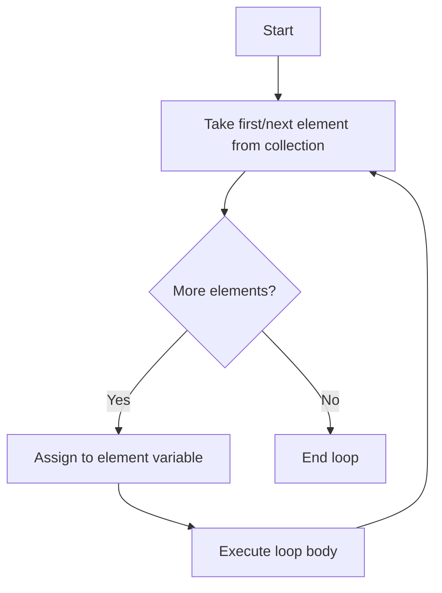

# Java Enhanced For Loop

## Introduction

The enhanced for loop, often called the "for-each" loop, was introduced in Java 5 as a simpler way to iterate through collections and arrays. It provides a cleaner, more readable alternative to the traditional for loop when you need to access each element in a collection sequentially without needing to know the index position.

This feature makes your code more concise and reduces the potential for common errors like off-by-one mistakes or index out of bounds exceptions that can occur with traditional indexing loops.

## Basic Syntax

The enhanced for loop has a simple syntax:

```java
for (elementType element : collection) {
    // code to process each element
}
```

Where:
- `elementType` is the data type of the elements in the collection
- `element` is the variable name that will hold each item during iteration
- `collection` is the array or collection being iterated over

## How It Works

Let's visualize how the enhanced for loop processes a collection:



## Using Enhanced For Loop with Arrays

### Basic Array Example

```java
public class EnhancedForWithArray {
    public static void main(String[] args) {
        // An array of integers
        int[] numbers = {1, 2, 3, 4, 5};
        
        // Using enhanced for loop to print each number
        System.out.println("Array elements:");
        for (int number : numbers) {
            System.out.println(number);
        }
    }
}
```

**Output:**
```
Array elements:
1
2
3
4
5
```

### String Array Example

```java
public class EnhancedForWithStringArray {
    public static void main(String[] args) {
        // An array of strings
        String[] fruits = {"Apple", "Banana", "Cherry", "Date", "Elderberry"};
        
        // Using enhanced for loop to print each fruit
        System.out.println("Fruits available:");
        for (String fruit : fruits) {
            System.out.println(fruit);
        }
    }
}
```

**Output:**
```
Fruits available:
Apple
Banana
Cherry
Date
Elderberry
```

## Using Enhanced For Loop with Collections

The enhanced for loop works seamlessly with any class that implements the `Iterable` interface, including all Java collections like ArrayList, LinkedList, HashSet, etc.

### ArrayList Example

```java
import java.util.ArrayList;
import java.util.List;

public class EnhancedForWithArrayList {
    public static void main(String[] args) {
        // Create an ArrayList of String
        List<String> languages = new ArrayList<>();
        languages.add("Java");
        languages.add("Python");
        languages.add("JavaScript");
        languages.add("C++");
        
        // Using enhanced for loop with ArrayList
        System.out.println("Programming languages:");
        for (String language : languages) {
            System.out.println(language);
        }
    }
}
```

**Output:**
```
Programming languages:
Java
Python
JavaScript
C++
```

### HashSet Example

```java
import java.util.HashSet;
import java.util.Set;

public class EnhancedForWithHashSet {
    public static void main(String[] args) {
        // Create a HashSet of integers
        Set<Integer> uniqueNumbers = new HashSet<>();
        uniqueNumbers.add(10);
        uniqueNumbers.add(20);
        uniqueNumbers.add(30);
        uniqueNumbers.add(20); // Duplicate, will be ignored
        
        // Using enhanced for loop with HashSet
        System.out.println("Unique numbers in set:");
        int sum = 0;
        for (int num : uniqueNumbers) {
            System.out.println(num);
            sum += num;
        }
        System.out.println("Sum of all numbers: " + sum);
    }
}
```

**Output:**
```
Unique numbers in set:
20
10
30
Sum of all numbers: 60
```

## Advantages of Enhanced For Loop

1. **Cleaner Code**: Reduces boilerplate code needed for iteration
2. **Prevents Errors**: Eliminates index out of bounds exceptions
3. **Focus on Processing**: Shifts focus from loop mechanics to business logic
4. **Works with Collections**: Provides a uniform way to iterate over different collection types

## Limitations

While the enhanced for loop is very useful, it has some limitations:

1. **No Index Access**: You don't have access to the index of the current element
2. **Read-Only Access**: You cannot modify the collection being iterated over
3. **Forward-Only**: You can only iterate forward through the collection
4. **No Filtering During Iteration**: Cannot selectively skip elements during iteration

## Comparison with Traditional For Loop

Let's compare the enhanced for loop with the traditional approach:

```java
public class LoopComparison {
    public static void main(String[] args) {
        int[] scores = {85, 92, 78, 95, 88};
        
        // Traditional for loop
        System.out.println("Using traditional for loop:");
        for (int i = 0; i < scores.length; i++) {
            System.out.println("Student " + (i + 1) + ": " + scores[i]);
        }
        
        // Enhanced for loop
        System.out.println("\nUsing enhanced for loop:");
        int studentNum = 1;
        for (int score : scores) {
            System.out.println("Student " + (studentNum++) + ": " + score);
        }
    }
}
```

**Output:**
```
Using traditional for loop:
Student 1: 85
Student 2: 92
Student 3: 78
Student 4: 95
Student 5: 88

Using enhanced for loop:
Student 1: 85
Student 2: 92
Student 3: 78
Student 4: 95
Student 5: 88
```

## Real-World Applications

### Example 1: Processing Student Grades

```java
import java.util.HashMap;
import java.util.Map;

public class StudentGradeProcessor {
    public static void main(String[] args) {
        // Map of student names and their grades
        Map<String, Integer> studentGrades = new HashMap<>();
        studentGrades.put("Alice", 92);
        studentGrades.put("Bob", 85);
        studentGrades.put("Charlie", 79);
        studentGrades.put("Diana", 96);
        
        // Calculate average grade
        int sum = 0;
        for (int grade : studentGrades.values()) {
            sum += grade;
        }
        double average = (double) sum / studentGrades.size();
        
        // Print each student's status
        System.out.println("Student grades status:");
        for (Map.Entry<String, Integer> entry : studentGrades.entrySet()) {
            String name = entry.getKey();
            int grade = entry.getValue();
            String status = grade >= average ? "Above average" : "Below average";
            System.out.println(name + ": " + grade + " (" + status + ")");
        }
        System.out.println("Class average: " + String.format("%.2f", average));
    }
}
```

**Output:**
```
Student grades status:
Bob: 85 (Below average)
Charlie: 79 (Below average)
Diana: 96 (Above average)
Alice: 92 (Above average)
Class average: 88.00
```

### Example 2: Finding Elements in a Collection

```java
import java.util.ArrayList;
import java.util.List;

public class BookFinder {
    
    static class Book {
        String title;
        String author;
        int yearPublished;
        
        public Book(String title, String author, int yearPublished) {
            this.title = title;
            this.author = author;
            this.yearPublished = yearPublished;
        }
        
        @Override
        public String toString() {
            return title + " by " + author + " (" + yearPublished + ")";
        }
    }
    
    public static void main(String[] args) {
        // Create a list of books
        List<Book> library = new ArrayList<>();
        library.add(new Book("1984", "George Orwell", 1949));
        library.add(new Book("To Kill a Mockingbird", "Harper Lee", 1960));
        library.add(new Book("The Great Gatsby", "F. Scott Fitzgerald", 1925));
        library.add(new Book("Brave New World", "Aldous Huxley", 1932));
        
        // Find books published before 1950
        System.out.println("Books published before 1950:");
        for (Book book : library) {
            if (book.yearPublished < 1950) {
                System.out.println(book);
            }
        }
    }
}
```

**Output:**
```
Books published before 1950:
1984 by George Orwell (1949)
The Great Gatsby by F. Scott Fitzgerald (1925)
Brave New World by Aldous Huxley (1932)
```

## Best Practices

1. **Use for Collections and Arrays**: Prefer the enhanced for loop when iterating through entire collections or arrays.

2. **Name Variables Meaningfully**: Choose meaningful singular names for your iteration variables (e.g., `student` for a collection of students).

3. **Consider Immutability**: Remember that modifying the collection being iterated can cause `ConcurrentModificationException`. Use other approaches if you need to modify the collection during iteration.

4. **Use When Index Isn't Needed**: Choose the enhanced for loop when you don't need the index value during iteration.

## Summary

The enhanced for loop is a powerful feature in Java that simplifies the process of iterating through collections and arrays. It provides a cleaner, more concise alternative to traditional indexed for loops, reducing the chance of errors and making code more readable.

Key points to remember:
- It works with arrays and any class that implements the `Iterable` interface
- It provides read-only access to elements
- It's ideal when you need to process each element sequentially
- It doesn't provide access to element indices
- It cannot be used to modify the collection during iteration

By using the enhanced for loop appropriately, you can write cleaner, more maintainable Java code, especially when dealing with collections.

## Exercises

1. Write a program that uses an enhanced for loop to find the maximum value in an array of integers.
2. Create a program that counts the number of strings in an ArrayList that start with a specific letter.
3. Write a program that processes an array of objects and filters them based on certain criteria.
4. Implement a method that uses the enhanced for loop to compute the average of values in any numeric collection.

## Additional Resources

- [Oracle Java Documentation on For-Each Loop](https://docs.oracle.com/javase/8/docs/technotes/guides/language/foreach.html)
- [Java Collections Framework](https://docs.oracle.com/javase/tutorial/collections/index.html)
- [Java Generics](https://docs.oracle.com/javase/tutorial/java/generics/index.html)