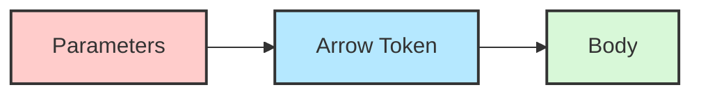

# Java Lambda Basics

Lambda expressions were introduced in Java 8 as a major feature that brings functional programming capabilities to Java. If you've been writing traditional Java code with lots of anonymous inner classes, lambda expressions will make your code more concise and readable.

## What Are Lambda Expressions?

Lambda expressions are essentially anonymous methods (functions without names) that you can treat as values. They enable you to:

- Pass behavior as arguments to methods
- Create more concise code
- Implement functional interfaces more elegantly

Think of them as a shorter way to write anonymous inner classes when they implement interfaces with a single method.

## Lambda Expression Syntax

A lambda expression consists of three parts:



Here's the basic syntax:

```java
(parameters) -> { statements; }
```

Let's break it down:

1. **Parameters**: The parameters that the lambda expression accepts (similar to method parameters)
2. **Arrow token** `->`: Separates the parameter list from the body
3. **Body**: Contains the statements that are executed when the lambda is invoked

### Simplified Syntax Rules

- If there is only one parameter, you can omit the parentheses: `x -> x * x`
- If the body contains only one statement, you can omit the curly braces: `(x, y) -> x + y`
- If the single statement returns a value, `return` is implicit: `x -> x * x` (returns x squared)

## Your First Lambda Expression

Let's start with a simple example. Suppose we want to create a comparator to sort strings by length:

**Traditional anonymous class approach:**

```java
// Without Lambda
List<String> names = Arrays.asList("John", "Alexandra", "Bob", "Elizabeth");
Collections.sort(names, new Comparator<String>() {
    @Override
    public int compare(String s1, String s2) {
        return s1.length() - s2.length();
    }
});

System.out.println(names);
// Output: [Bob, John, Alexandra, Elizabeth]
```

**Using a lambda expression:**

```java
// With Lambda
List<String> names = Arrays.asList("John", "Alexandra", "Bob", "Elizabeth");
Collections.sort(names, (s1, s2) -> s1.length() - s2.length());

System.out.println(names);
// Output: [Bob, John, Alexandra, Elizabeth]
```

Notice how much cleaner and more concise the lambda version is!

## Functional Interfaces

Lambda expressions work with **functional interfaces** - interfaces that have exactly one abstract method. Java 8 introduced the `@FunctionalInterface` annotation to mark interfaces as functional interfaces.

Some common functional interfaces in Java include:

- `Runnable` - has a single `run()` method with no parameters and no return value
- `Comparator` - has a `compare()` method with two parameters and returns an int
- `ActionListener` - has a single `actionPerformed()` method

### Example with Runnable

**Traditional way:**

```java
// Without Lambda
Thread thread = new Thread(new Runnable() {
    @Override
    public void run() {
        System.out.println("Thread is running");
    }
});
thread.start();
// Output: Thread is running
```

**With Lambda:**

```java
// With Lambda
Thread thread = new Thread(() -> System.out.println("Thread is running"));
thread.start();
// Output: Thread is running
```

## Lambda Expression Variations

Let's explore various syntaxes based on different scenarios:

### No Parameters

```java
Runnable runnable = () -> System.out.println("Hello World");
runnable.run();
// Output: Hello World
```

### Single Parameter (with type inference)

```java
Consumer<String> consumer = message -> System.out.println(message);
consumer.accept("Hello Lambda!");
// Output: Hello Lambda!
```

### Multiple Parameters

```java
BiFunction<Integer, Integer, Integer> add = (a, b) -> a + b;
System.out.println(add.apply(5, 3));
// Output: 8
```

### Multiple Statements in Lambda Body

```java
BiFunction<Integer, Integer, Integer> calculator = (a, b) -> {
    int sum = a + b;
    return sum * sum;  // Return the square of the sum
};
System.out.println(calculator.apply(2, 3));
// Output: 25 (as (2+3)^2 = 5^2 = 25)
```

### Explicitly Specifying Parameter Types

```java
BiFunction<String, String, Integer> compareLength = 
    (String s1, String s2) -> s1.length() - s2.length();
System.out.println(compareLength.apply("Hello", "World"));
// Output: 0 (both strings have 5 characters)
```

## Real-World Applications

### Example 1: Filtering Collections

Let's filter a list of integers to get only even numbers:

```java
import java.util.Arrays;
import java.util.List;
import java.util.stream.Collectors;

public class FilterExample {
    public static void main(String[] args) {
        List<Integer> numbers = Arrays.asList(1, 2, 3, 4, 5, 6, 7, 8, 9, 10);
        
        // Using lambda to filter even numbers
        List<Integer> evenNumbers = numbers.stream()
                                          .filter(n -> n % 2 == 0)
                                          .collect(Collectors.toList());
        
        System.out.println(evenNumbers);
        // Output: [2, 4, 6, 8, 10]
    }
}
```

### Example 2: Event Handling in JavaFX

Lambda expressions are particularly useful for event handling in UI frameworks:

```java
Button button = new Button("Click me");
button.setOnAction(event -> {
    System.out.println("Button clicked!");
    // Perform action here
});
```

### Example 3: Custom Sorting

Sort a list of persons by age:

```java
import java.util.ArrayList;
import java.util.Collections;
import java.util.List;

class Person {
    private String name;
    private int age;

    public Person(String name, int age) {
        this.name = name;
        this.age = age;
    }

    public int getAge() {
        return age;
    }

    @Override
    public String toString() {
        return name + " (" + age + ")";
    }
}

public class SortingExample {
    public static void main(String[] args) {
        List<Person> people = new ArrayList<>();
        people.add(new Person("John", 25));
        people.add(new Person("Alice", 22));
        people.add(new Person("Bob", 30));

        // Sort by age using lambda
        Collections.sort(people, (p1, p2) -> p1.getAge() - p2.getAge());
        
        System.out.println(people);
        // Output: [Alice (22), John (25), Bob (30)]
    }
}
```

## Benefits of Lambda Expressions

1. **Concise Code**: Reduces boilerplate associated with anonymous classes
2. **Increased Readability**: Makes intentions clearer, especially with simple operations
3. **Functional Programming Support**: Enables functional programming techniques in Java
4. **Easier API Usage**: Many new Java APIs are designed with lambdas in mind
5. **Parallel Processing Support**: Works well with streams for parallel operations

## Common Functional Interfaces in Java 8+

Java 8 introduced the `java.util.function` package with several predefined functional interfaces:

| Interface | Description | Method Signature |
|-----------|-------------|------------------|
| `Function<T,R>` | Transforms a value | `R apply(T t)` |
| `Predicate<T>` | Tests a condition | `boolean test(T t)` |
| `Consumer<T>` | Consumes a value | `void accept(T t)` |
| `Supplier<T>` | Supplies a value | `T get()` |
| `BiFunction<T,U,R>` | Takes two args, returns a value | `R apply(T t, U u)` |
| `BinaryOperator<T>` | Operates on two values of same type | `T apply(T t1, T t2)` |

Example with `Function`:

```java
import java.util.function.Function;

public class FunctionExample {
    public static void main(String[] args) {
        // A function that converts a string to its length
        Function<String, Integer> lengthFunction = s -> s.length();
        
        // Apply the function
        System.out.println(lengthFunction.apply("Hello Lambda"));
        // Output: 12
    }
}
```

## Variable Capture in Lambda Expressions

Lambda expressions can access:
- Parameters of the lambda
- Variables defined in the enclosing scope
- `this` reference (which points to the enclosing class)

However, variables from the enclosing scope must be **effectively final** (either explicitly declared final or never modified after initialization).

```java
public class VariableCaptureExample {
    public static void main(String[] args) {
        String prefix = "User: ";  // Effectively final
        
        List<String> names = Arrays.asList("John", "Mary", "Bob");
        names.forEach(name -> {
            // Using the captured variable 'prefix'
            System.out.println(prefix + name);
        });
        
        // Output:
        // User: John
        // User: Mary
        // User: Bob
    }
}
```

## Summary

Lambda expressions are a powerful feature in Java that allow for more concise and functional code. They:

- Reduce boilerplate code
- Work with functional interfaces (interfaces with a single abstract method)
- Follow a simple syntax: `(parameters) -> { body }`
- Can access variables from their enclosing scope if those variables are effectively final
- Are commonly used with the Stream API, Collections, and event handlers

Learning to use lambda expressions effectively can significantly improve your Java code's readability and maintainability.

## Practice Exercises

1. Write a lambda expression to sort a list of strings alphabetically
2. Create a lambda expression that checks if a number is prime
3. Use a lambda expression with the `forEach` method to print all elements of a list
4. Implement a lambda that transforms a list of strings to uppercase
5. Create a custom functional interface and use it with a lambda expression

## Additional Resources

- [Oracle's Lambda Expressions Tutorial](https://docs.oracle.com/javase/tutorial/java/javaOO/lambdaexpressions.html)
- [Java 8 Functional Interfaces](https://docs.oracle.com/javase/8/docs/api/java/util/function/package-summary.html)
- Book: "Java 8 in Action" by Raoul-Gabriel Urma, Mario Fusco, and Alan Mycroft
- [Method References in Java](https://docs.oracle.com/javase/tutorial/java/javaOO/methodreferences.html) (A related topic)

Happy coding with lambdas!