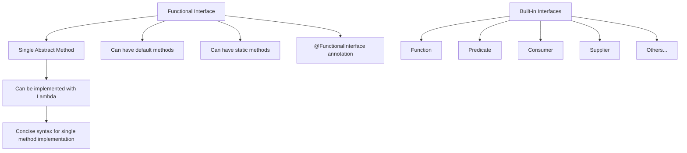

import Tabs from '@theme/Tabs';
import TabItem from '@theme/TabItem';

# Java Functional Interfaces

## Introduction

Functional interfaces are a cornerstone of Java's support for functional programming, introduced in Java 8. A functional interface is simply an interface that contains **exactly one abstract method**. These special interfaces serve as the foundation for lambda expressions, allowing you to create more concise and expressive code.

In this guide, we'll explore:
- What functional interfaces are and why they matter
- How to define and use your own functional interfaces
- Built-in functional interfaces in the Java API
- How functional interfaces enable lambda expressions
- Practical applications in real-world scenarios

## What is a Functional Interface?

A functional interface is an interface with a single abstract method (SAM). This single method defines the functional behavior that can be implemented by a lambda expression or method reference.

```java
@FunctionalInterface
interface Greeting {
    // Single abstract method
    void greet(String name);
    
    // Default or static methods are allowed
    default void greetWithHello(String name) {
        greet("Hello, " + name);
    }
}
```

Key points about functional interfaces:

1. They contain exactly one abstract method (but can have default and static methods)
2. They can be annotated with `@FunctionalInterface` (optional but recommended)
3. They can be implemented using lambda expressions or method references
4. They enable functional programming paradigms in Java

The `@FunctionalInterface` annotation is not required, but it helps the compiler verify that the interface follows the functional interface contract and will generate an error if you add another abstract method.

## Creating Your Own Functional Interface

Let's create a simple functional interface that represents a mathematical operation:

```java
@FunctionalInterface
public interface MathOperation {
    int operate(int a, int b);
}
```

This interface can now be used with lambda expressions:

```java
public class MathOperationExample {
    public static void main(String[] args) {
        // Implementation using lambda expressions
        MathOperation addition = (a, b) -> a + b;
        MathOperation subtraction = (a, b) -> a - b;
        MathOperation multiplication = (a, b) -> a * b;
        MathOperation division = (a, b) -> a / b;
        
        System.out.println("10 + 5 = " + addition.operate(10, 5));
        System.out.println("10 - 5 = " + subtraction.operate(10, 5));
        System.out.println("10 * 5 = " + multiplication.operate(10, 5));
        System.out.println("10 / 5 = " + division.operate(10, 5));
    }
}
```

Output:
```
10 + 5 = 15
10 - 5 = 5
10 * 5 = 50
10 / 5 = 2
```

## Built-in Functional Interfaces

Java provides numerous predefined functional interfaces in the `java.util.function` package. These interfaces are designed to cover common use cases in functional programming.

### Core Functional Interfaces

<Tabs>
  <TabItem value="function" label="Function<T,R>" default>
  
  ```java
  @FunctionalInterface
  public interface Function<T, R> {
      R apply(T t);
  }
  ```

  Used for transforming one value into another.
  
  ```java
  Function<String, Integer> stringLength = str -> str.length();
  System.out.println(stringLength.apply("Hello")); // Output: 5
  ```
  
  </TabItem>
  <TabItem value="predicate" label="Predicate<T>">
  
  ```java
  @FunctionalInterface
  public interface Predicate<T> {
      boolean test(T t);
  }
  ```

  Used for testing conditions and returning boolean values.
  
  ```java
  Predicate<String> isLongString = str -> str.length() > 10;
  System.out.println(isLongString.test("Hello")); // Output: false
  System.out.println(isLongString.test("Hello, World! How are you?")); // Output: true
  ```
  
  </TabItem>
  <TabItem value="consumer" label="Consumer<T>">
  
  ```java
  @FunctionalInterface
  public interface Consumer<T> {
      void accept(T t);
  }
  ```

  Used for operations that take a value but don't return anything.
  
  ```java
  Consumer<String> printer = message -> System.out.println(message);
  printer.accept("Hello, World!"); // Output: Hello, World!
  ```
  
  </TabItem>
  <TabItem value="supplier" label="Supplier<T>">
  
  ```java
  @FunctionalInterface
  public interface Supplier<T> {
      T get();
  }
  ```

  Used for generating or supplying values without taking any inputs.
  
  ```java
  Supplier<Double> randomValue = () -> Math.random();
  System.out.println(randomValue.get()); // Output: Random double between 0.0 and 1.0
  ```
  
  </TabItem>
</Tabs>

### Special-Purpose Functional Interfaces

Java also provides specialized versions of these interfaces:
- `BiFunction<T, U, R>`: Takes two arguments and returns a result
- `BiPredicate<T, U>`: Tests two arguments and returns a boolean
- `BiConsumer<T, U>`: Consumes two arguments and returns nothing
- Type-specific variants like `IntPredicate`, `LongConsumer`, etc.

```java
BiFunction<String, String, String> combineStrings = (str1, str2) -> str1 + " " + str2;
System.out.println(combineStrings.apply("Hello", "World")); // Output: Hello World

BiPredicate<String, Integer> checkLength = (str, length) -> str.length() == length;
System.out.println(checkLength.test("Java", 4)); // Output: true
```

## Understanding Functional Interfaces Visually



## Method References with Functional Interfaces

Method references provide a more concise way to express lambda expressions that simply call an existing method:

```java
import java.util.Arrays;
import java.util.List;
import java.util.function.Consumer;

public class MethodReferenceExample {
    public static void main(String[] args) {
        List<String> names = Arrays.asList("Alice", "Bob", "Charlie", "David");
        
        // Lambda expression
        names.forEach(name -> System.out.println(name));
        
        // Method reference (more concise)
        names.forEach(System.out::println);
        
        // Static method reference
        names.forEach(MethodReferenceExample::printInUpperCase);
    }
    
    public static void printInUpperCase(String name) {
        System.out.println(name.toUpperCase());
    }
}
```

Output:
```
Alice
Bob
Charlie
David
ALICE
BOB
CHARLIE
DAVID
```

## Real-World Applications of Functional Interfaces

### Example 1: Custom Event Handling

Create a simple event system using functional interfaces:

```java
@FunctionalInterface
interface EventHandler {
    void handle(String event);
}

class EventSystem {
    private final Map<String, List<EventHandler>> listeners = new HashMap<>();
    
    public void addEventListener(String eventType, EventHandler handler) {
        listeners.computeIfAbsent(eventType, k -> new ArrayList<>()).add(handler);
    }
    
    public void triggerEvent(String eventType, String eventData) {
        if (listeners.containsKey(eventType)) {
            listeners.get(eventType).forEach(handler -> handler.handle(eventData));
        }
    }
}

// Usage
public class EventExample {
    public static void main(String[] args) {
        EventSystem eventSystem = new EventSystem();
        
        // Add event listeners using lambda expressions
        eventSystem.addEventListener("click", data -> 
            System.out.println("Click event handled: " + data));
            
        eventSystem.addEventListener("hover", data -> 
            System.out.println("Hover event handled: " + data));
            
        // Multiple handlers for same event
        eventSystem.addEventListener("click", data -> 
            System.out.println("Second click handler: " + data));
        
        // Trigger events
        eventSystem.triggerEvent("click", "Button clicked");
        eventSystem.triggerEvent("hover", "Mouse moved over element");
    }
}
```

Output:
```
Click event handled: Button clicked
Second click handler: Button clicked
Hover event handled: Mouse moved over element
```

### Example 2: Strategy Pattern Implementation

The Strategy pattern is used to define a family of algorithms and make them interchangeable:

```java
@FunctionalInterface
interface ValidationStrategy {
    boolean validate(String text);
}

class Validator {
    private final ValidationStrategy strategy;
    
    public Validator(ValidationStrategy strategy) {
        this.strategy = strategy;
    }
    
    public boolean validate(String text) {
        return strategy.validate(text);
    }
}

public class StrategyExample {
    public static void main(String[] args) {
        // Different validation strategies
        ValidationStrategy isAllLowerCase = text -> text.matches("[a-z]+");
        ValidationStrategy isNumeric = text -> text.matches("\\d+");
        ValidationStrategy hasMinLength = text -> text.length() >= 5;
        
        // Create validators with different strategies
        Validator lowerCaseValidator = new Validator(isAllLowerCase);
        Validator numericValidator = new Validator(isNumeric);
        Validator lengthValidator = new Validator(hasMinLength);
        
        // Test the validators
        String test1 = "abcdef";
        String test2 = "12345";
        
        System.out.println("Testing: " + test1);
        System.out.println("Is lowercase: " + lowerCaseValidator.validate(test1));
        System.out.println("Is numeric: " + numericValidator.validate(test1));
        System.out.println("Has min length: " + lengthValidator.validate(test1));
        
        System.out.println("\nTesting: " + test2);
        System.out.println("Is lowercase: " + lowerCaseValidator.validate(test2));
        System.out.println("Is numeric: " + numericValidator.validate(test2));
        System.out.println("Has min length: " + lengthValidator.validate(test2));
    }
}
```

Output:
```
Testing: abcdef
Is lowercase: true
Is numeric: false
Has min length: true

Testing: 12345
Is lowercase: false
Is numeric: true
Has min length: true
```

## Best Practices for Using Functional Interfaces

1. **Use the built-in interfaces** when possible instead of creating your own
2. **Be explicit with the `@FunctionalInterface` annotation** to signal your intent
3. **Keep functional interfaces focused** on a single responsibility
4. **Use descriptive method names** that clearly indicate the purpose
5. **Consider using type parameters** to make interfaces more versatile
6. **Document your functional interfaces** thoroughly, especially parameter and return value meanings
7. **Use default methods** to provide utility functionality without breaking the functional interface contract

## Summary

Functional interfaces are a powerful feature in Java that enables functional programming paradigms. They provide:

- A clean way to express functions as objects (first-class citizens)
- The foundation for lambda expressions and method references
- Support for functional programming concepts in an object-oriented language
- A path to more concise and readable code

By mastering functional interfaces, you can write more expressive, maintainable, and flexible Java code that takes advantage of modern programming techniques.

## Exercises

1. Create a custom functional interface called `StringTransformer` that converts a string to another form, then implement it using lambda expressions for:
   - Converting to uppercase
   - Reversing the string
   - Removing vowels

2. Implement a simple calculator that accepts two numbers and an operation defined by a functional interface.

3. Create a text processing pipeline using Java's built-in functional interfaces to:
   - Filter out strings shorter than 3 characters
   - Convert remaining strings to uppercase
   - Concatenate them with a comma separator

## Additional Resources

- [Java Documentation on Functional Interfaces](https://docs.oracle.com/javase/8/docs/api/java/util/function/package-summary.html)
- [Oracle's Java Tutorials on Lambda Expressions](https://docs.oracle.com/javase/tutorial/java/javaOO/lambdaexpressions.html)
- [Effective Java, 3rd Edition](https://www.oreilly.com/library/view/effective-java-3rd/9780134686097/) by Joshua Bloch
- [Modern Java in Action](https://www.manning.com/books/modern-java-in-action) by Raoul-Gabriel Urma, Mario Fusco, and Alan Mycroft