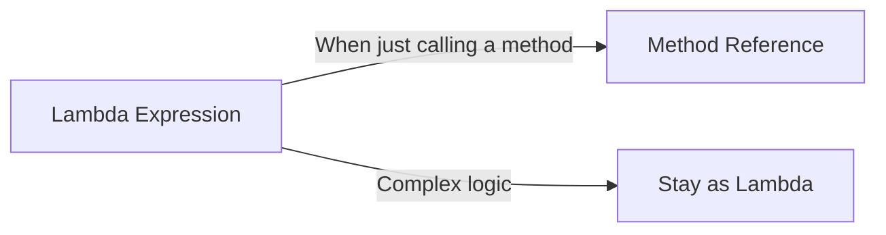

# Java Method References

## Introduction

Method references in Java provide a cleaner and more concise way to write lambda expressions that simply call an existing method. Introduced along with lambda expressions in Java 8, method references are especially useful when your lambda expression does nothing but call a single method.

Think of method references as shorthand notation for lambda expressions that execute just one method. They make your code more readable and expressive, focusing on "what" rather than "how" to execute.

## Understanding Method References

When a lambda expression simply forwards parameters to another method, you can replace it with a method reference. The general syntax for a method reference is:

```
TypeName::methodName
```

Notice that there are no parentheses after the method name, as you're not calling the method but referencing it.

## Types of Method References

Java provides four kinds of method references:

### 1. Reference to a Static Method

This references a static method from a class.

**Syntax**: `ClassName::staticMethodName`

**Example**:

```java
// Using lambda expression
Function<String, Integer> converter1 = s -> Integer.parseInt(s);

// Using method reference
Function<String, Integer> converter2 = Integer::parseInt;

// Using the function
String numString = "123";
System.out.println(converter2.apply(numString));  // Output: 123
```

### 2. Reference to an Instance Method of a Particular Object

This references an instance method from a specific object.

**Syntax**: `objectReference::instanceMethodName`

**Example**:

```java
// Using lambda expression
Consumer<String> printer1 = s -> System.out.println(s);

// Using method reference
Consumer<String> printer2 = System.out::println;

// Using the consumer
printer2.accept("Hello, Method References!");  // Output: Hello, Method References!
```

### 3. Reference to an Instance Method of an Arbitrary Object of a Particular Type

This references an instance method that will be called on a parameter.

**Syntax**: `ClassName::instanceMethodName`

**Example**:

```java
// Using lambda expression
Function<String, Integer> lengthFunction1 = s -> s.length();

// Using method reference
Function<String, Integer> lengthFunction2 = String::length;

// Using the function
String example = "Method References";
System.out.println(lengthFunction2.apply(example));  // Output: 17
```

### 4. Reference to a Constructor

This references a constructor of a class.

**Syntax**: `ClassName::new`

**Example**:

```java
// Using lambda expression
Supplier<ArrayList<String>> listCreator1 = () -> new ArrayList<>();

// Using constructor reference
Supplier<ArrayList<String>> listCreator2 = ArrayList::new;

// Using the supplier
ArrayList<String> list = listCreator2.get();
list.add("Java");
list.add("Method References");
System.out.println(list);  // Output: [Java, Method References]
```

## Method References vs. Lambda Expressions

Here's a comparison showing when method references are cleaner than lambda expressions:



**Example Comparison**:

```java
// Example list
List<String> names = Arrays.asList("Alice", "Bob", "Charlie", "David");

// Using lambda expression
names.forEach(name -> System.out.println(name));

// Using method reference
names.forEach(System.out::println);
```

Both achieve the same result, but the method reference is more concise.

## Practical Examples

### Example 1: Sorting with Method References

```java
import java.util.*;

public class MethodReferenceSort {
    public static void main(String[] args) {
        List<Person> people = Arrays.asList(
            new Person("Alice", 25),
            new Person("Bob", 30),
            new Person("Charlie", 22)
        );
        
        // Using lambda expression
        people.sort((p1, p2) -> p1.getAge() - p2.getAge());
        
        // Using method reference
        // First, create a comparison method
        people.sort(Comparator.comparing(Person::getAge));
        
        // Print the sorted list
        people.forEach(System.out::println);
    }
    
    static class Person {
        private String name;
        private int age;
        
        Person(String name, int age) {
            this.name = name;
            this.age = age;
        }
        
        public String getName() { return name; }
        public int getAge() { return age; }
        
        @Override
        public String toString() {
            return name + " - " + age;
        }
    }
}
```

**Output**:
```
Charlie - 22
Alice - 25
Bob - 30
```

### Example 2: Working with Streams

```java
import java.util.*;
import java.util.stream.Collectors;

public class MethodReferenceStream {
    public static void main(String[] args) {
        List<String> names = Arrays.asList("Alice", "Bob", "Charlie", "David");
        
        // Convert all names to uppercase using method reference
        List<String> upperNames = names.stream()
                                      .map(String::toUpperCase)
                                      .collect(Collectors.toList());
        
        System.out.println(upperNames);
        
        // Filter names starting with 'C'
        List<String> cNames = names.stream()
                                  .filter(MethodReferenceStream::startsWithC)
                                  .collect(Collectors.toList());
        
        System.out.println(cNames);
    }
    
    // Custom static method for filtering
    public static boolean startsWithC(String name) {
        return name.startsWith("C");
    }
}
```

**Output**:
```
[ALICE, BOB, CHARLIE, DAVID]
[Charlie]
```

### Example 3: Creating Objects Using Constructor References

```java
import java.util.*;
import java.util.function.Function;
import java.util.stream.Collectors;

public class ConstructorReferenceExample {
    public static void main(String[] args) {
        List<String> names = Arrays.asList("Alice", "Bob", "Charlie");
        
        // Using constructor reference to create Employee objects
        List<Employee> employees = names.stream()
                                       .map(Employee::new)  // Constructor reference
                                       .collect(Collectors.toList());
        
        // Print all employees
        employees.forEach(System.out::println);
        
        // Using a Function with constructor reference
        Function<String, Employee> employeeCreator = Employee::new;
        Employee newEmployee = employeeCreator.apply("David");
        System.out.println("New employee: " + newEmployee);
    }
    
    static class Employee {
        private String name;
        
        Employee(String name) {
            this.name = name;
        }
        
        @Override
        public String toString() {
            return "Employee: " + name;
        }
    }
}
```

**Output**:
```
Employee: Alice
Employee: Bob
Employee: Charlie
New employee: Employee: David
```

## Common Use Cases for Method References

1. **Working with Collections**: Sorting, filtering, and transforming collections
2. **Event Handling**: In UI frameworks for handling user actions
3. **Data Processing**: With streams for mapping, filtering, and collecting results
4. **Initialization**: For creating and initializing objects
5. **Callbacks**: For implementing callback mechanisms

## Best Practices

1. **Use method references when they increase readability**: Choose them over lambda expressions when they make your code more clear
2. **Avoid method references that call multiple methods**: If your lambda calls more than one method, a traditional lambda expression might be clearer
3. **Leverage existing methods**: Instead of writing new lambda functions, consider using existing methods when applicable
4. **Combine with streams**: Method references work especially well with the Stream API for clean, functional code

## Summary

Method references provide an elegant way to make your code more concise when working with functional interfaces in Java. They are particularly useful when your lambda expression simply calls an existing method.

The four types of method references (static method, instance method of a particular object, instance method of an arbitrary object, and constructor) cover most use cases you'll encounter in real-world programming.

By understanding and using method references effectively, you can write more readable and maintainable functional-style code in Java.

## Exercises

1. Convert the following lambda expression to a method reference:
   ```java
   Consumer<String> printer = s -> System.out.println(s);
   ```

2. Create a list of integers and sort it using a method reference.

3. Use a constructor reference to create a list of `Person` objects from a list of names.

4. Write a program that uses method references with streams to filter a list of strings containing only those with more than 5 characters.

5. Implement a comparator using method references to sort a list of custom objects.

## Additional Resources

- [Java Documentation on Method References](https://docs.oracle.com/javase/tutorial/java/javaOO/methodreferences.html)
- [Oracle's Lambda Expressions and Method References Tutorial](https://docs.oracle.com/javase/tutorial/java/javaOO/lambdaexpressions.html)
- [Effective Java, 3rd Edition](https://www.oreilly.com/library/view/effective-java-3rd/9780134686097/) by Joshua Bloch (Items related to lambdas and method references)
- [Modern Java in Action](https://www.manning.com/books/modern-java-in-action) by Raoul-Gabriel Urma, Mario Fusco, and Alan Mycroft