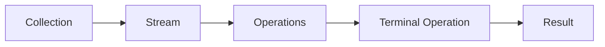

# Java Stream API

## Introduction

The Java Stream API, introduced in Java 8, provides a powerful and expressive way to process collections of data. Unlike traditional imperative programming where you explicitly describe *how* to accomplish a task, streams follow a declarative approach where you describe *what* you want to accomplish. This makes your code more concise, readable, and often more efficient.

Streams work hand-in-hand with lambda expressions to create a fluent interface for transforming and manipulating data. They don't actually store data - instead, they operate on a source (like collections, arrays, or I/O channels) and produce a result.

## What Are Streams?

A stream in Java represents a sequence of elements supporting various operations that can be applied to produce a desired result. Streams are:

- **Not a data structure**: They don't store elements
- **Functional in nature**: Operations produce a result without modifying the source
- **Lazy**: Many stream operations are implemented lazily, computing values only when needed
- **Possibly unbounded**: Collections have finite size, but streams can represent infinite sequences
- **Consumable**: Elements of a stream are visited only once during the life of a stream



## Creating Streams

There are several ways to create streams in Java:

### From Collections

```java
List<String> list = Arrays.asList("Apple", "Banana", "Cherry", "Date");
Stream<String> stream = list.stream();
```

### From Arrays

```java
String[] array = {"Apple", "Banana", "Cherry", "Date"};
Stream<String> stream = Arrays.stream(array);
```

### Using Stream.of()

```java
Stream<String> stream = Stream.of("Apple", "Banana", "Cherry", "Date");
```

### Generate Streams

```java
// Infinite stream of random numbers
Stream<Double> randomStream = Stream.generate(Math::random);

// Infinite stream of sequential numbers starting from 1
Stream<Integer> sequentialStream = Stream.iterate(1, n -> n + 1);
```

## Stream Operations

Stream operations are divided into two categories:

1. **Intermediate Operations**: These operations transform a stream into another stream and are lazy (they don't execute until a terminal operation is called).
2. **Terminal Operations**: These operations produce a result or a side-effect and cause the stream pipeline to be executed.

### Common Intermediate Operations

#### filter()

Filters elements based on a predicate.

```java
List<String> fruits = Arrays.asList("Apple", "Banana", "Cherry", "Date", "Apricot");

// Filter fruits that start with 'A'
List<String> aFruits = fruits.stream()
    .filter(fruit -> fruit.startsWith("A"))
    .collect(Collectors.toList());

System.out.println(aFruits); // Output: [Apple, Apricot]
```

#### map()

Transforms elements using a function.

```java
List<String> fruits = Arrays.asList("Apple", "Banana", "Cherry");

// Convert each string to uppercase
List<String> upperCaseFruits = fruits.stream()
    .map(String::toUpperCase)
    .collect(Collectors.toList());

System.out.println(upperCaseFruits); // Output: [APPLE, BANANA, CHERRY]
```

#### sorted()

Sorts the elements of the stream.

```java
List<String> fruits = Arrays.asList("Cherry", "Apple", "Banana");

// Sort alphabetically
List<String> sortedFruits = fruits.stream()
    .sorted()
    .collect(Collectors.toList());

System.out.println(sortedFruits); // Output: [Apple, Banana, Cherry]

// Sort by length
List<String> lengthSortedFruits = fruits.stream()
    .sorted(Comparator.comparing(String::length))
    .collect(Collectors.toList());

System.out.println(lengthSortedFruits); // Output: [Apple, Cherry, Banana]
```

#### distinct()

Removes duplicate elements.

```java
List<Integer> numbers = Arrays.asList(1, 2, 2, 3, 3, 3, 4, 5);

List<Integer> uniqueNumbers = numbers.stream()
    .distinct()
    .collect(Collectors.toList());

System.out.println(uniqueNumbers); // Output: [1, 2, 3, 4, 5]
```

#### limit() and skip()

`limit(n)` restricts the stream to `n` elements, while `skip(n)` skips the first `n` elements.

```java
List<Integer> numbers = Arrays.asList(1, 2, 3, 4, 5, 6, 7, 8, 9, 10);

List<Integer> firstThree = numbers.stream()
    .limit(3)
    .collect(Collectors.toList());

System.out.println(firstThree); // Output: [1, 2, 3]

List<Integer> afterFive = numbers.stream()
    .skip(5)
    .collect(Collectors.toList());

System.out.println(afterFive); // Output: [6, 7, 8, 9, 10]
```

### Common Terminal Operations

#### collect()

The most versatile terminal operation, collects stream elements into a collection or other data structure.

```java
List<String> fruits = Arrays.asList("Apple", "Banana", "Cherry");

// Collect to List
List<String> fruitList = fruits.stream().collect(Collectors.toList());

// Collect to Set
Set<String> fruitSet = fruits.stream().collect(Collectors.toSet());

// Join elements with a comma
String joinedFruits = fruits.stream().collect(Collectors.joining(", "));
System.out.println(joinedFruits); // Output: Apple, Banana, Cherry
```

#### forEach()

Performs an action for each element.

```java
List<String> fruits = Arrays.asList("Apple", "Banana", "Cherry");

// Print each fruit
fruits.stream().forEach(fruit -> System.out.println("I like " + fruit));

// Output:
// I like Apple
// I like Banana
// I like Cherry
```

#### reduce()

Combines elements to produce a single value.

```java
List<Integer> numbers = Arrays.asList(1, 2, 3, 4, 5);

// Sum all numbers
int sum = numbers.stream()
    .reduce(0, (a, b) -> a + b);
System.out.println("Sum: " + sum); // Output: Sum: 15

// Find the maximum value
int max = numbers.stream()
    .reduce(Integer.MIN_VALUE, Integer::max);
System.out.println("Max: " + max); // Output: Max: 5
```

#### count(), anyMatch(), allMatch(), noneMatch()

These operations check properties of the stream.

```java
List<String> fruits = Arrays.asList("Apple", "Banana", "Cherry", "Date");

// Count elements
long count = fruits.stream().count();
System.out.println("Count: " + count); // Output: Count: 4

// Check if any fruit starts with 'B'
boolean anyStartWithB = fruits.stream().anyMatch(f -> f.startsWith("B"));
System.out.println("Any fruit starts with 'B': " + anyStartWithB); // Output: true

// Check if all fruits have length > 3
boolean allLongerThan3 = fruits.stream().allMatch(f -> f.length() > 3);
System.out.println("All fruits longer than 3 chars: " + allLongerThan3); // Output: true

// Check if no fruit contains 'z'
boolean noZ = fruits.stream().noneMatch(f -> f.contains("z"));
System.out.println("No fruit contains 'z': " + noZ); // Output: true
```

#### findFirst() and findAny()

Return an element from the stream.

```java
List<String> fruits = Arrays.asList("Apple", "Banana", "Cherry");

// Find any fruit that starts with 'B'
Optional<String> anyBFruit = fruits.stream()
    .filter(f -> f.startsWith("B"))
    .findAny();

System.out.println("A fruit starting with 'B': " + anyBFruit.orElse("None")); 
// Output: A fruit starting with 'B': Banana
```

## Stream Pipelines

A typical stream pipeline consists of:
1. Source (collection, array, etc.)
2. Zero or more intermediate operations
3. A terminal operation

The power of streams comes from chaining operations together. Here's an example that combines several operations:

```java
List<Employee> employees = Arrays.asList(
    new Employee("Alice", "Development", 75000),
    new Employee("Bob", "HR", 65000),
    new Employee("Charlie", "Development", 85000),
    new Employee("Diana", "Marketing", 78000),
    new Employee("Eve", "Development", 92000)
);

// Find the average salary of developers
double avgDevSalary = employees.stream()
    .filter(e -> e.getDepartment().equals("Development"))  // Keep only developers
    .mapToInt(Employee::getSalary)                         // Extract salary
    .average()                                             // Calculate average
    .orElse(0);

System.out.println("Average developer salary: $" + avgDevSalary);
// Output: Average developer salary: $84000.0
```

In this example:
- We start with a list of employees
- Filter to keep only those in the Development department
- Extract their salaries
- Calculate the average

## Practical Examples

### Example 1: Processing Student Data

Let's create a student management system that uses streams to process student data:

```java
class Student {
    private String name;
    private int age;
    private String grade;
    private List<Integer> scores;
    
    public Student(String name, int age, String grade, List<Integer> scores) {
        this.name = name;
        this.age = age;
        this.grade = grade;
        this.scores = scores;
    }
    
    // Getters
    public String getName() { return name; }
    public int getAge() { return age; }
    public String getGrade() { return grade; }
    public List<Integer> getScores() { return scores; }
    
    // Calculate average score
    public double getAverageScore() {
        return scores.stream().mapToDouble(Integer::doubleValue).average().orElse(0);
    }
    
    @Override
    public String toString() {
        return name + " (Grade: " + grade + ", Avg: " + getAverageScore() + ")";
    }
}

// Example usage
public class StudentManagement {
    public static void main(String[] args) {
        List<Student> students = Arrays.asList(
            new Student("Alice", 15, "10th", Arrays.asList(85, 90, 78, 92, 88)),
            new Student("Bob", 16, "11th", Arrays.asList(75, 82, 79, 67, 80)),
            new Student("Charlie", 15, "10th", Arrays.asList(92, 90, 93, 95, 91)),
            new Student("Diana", 16, "11th", Arrays.asList(70, 72, 75, 80, 69)),
            new Student("Eve", 15, "10th", Arrays.asList(85, 88, 82, 89, 90))
        );
        
        // Find top 2 students of 10th grade by average score
        List<Student> top10thGraders = students.stream()
            .filter(s -> s.getGrade().equals("10th"))
            .sorted(Comparator.comparing(Student::getAverageScore).reversed())
            .limit(2)
            .collect(Collectors.toList());
        
        System.out.println("Top 2 students in 10th grade:");
        top10thGraders.forEach(System.out::println);
        
        // Calculate average score by grade
        Map<String, Double> avgScoreByGrade = students.stream()
            .collect(Collectors.groupingBy(
                Student::getGrade,
                Collectors.averagingDouble(Student::getAverageScore)
            ));
        
        System.out.println("\nAverage scores by grade:");
        avgScoreByGrade.forEach((grade, avg) -> 
            System.out.println(grade + ": " + String.format("%.2f", avg)));
    }
}
```

Output:
```
Top 2 students in 10th grade:
Charlie (Grade: 10th, Avg: 92.2)
Eve (Grade: 10th, Avg: 86.8)

Average scores by grade:
10th: 86.67
11th: 74.33
```

### Example 2: File Processing

```java
import java.nio.file.*;
import java.io.IOException;
import java.util.*;
import java.util.stream.*;

public class FileWordCounter {
    public static void main(String[] args) {
        Path filePath = Paths.get("sample.txt");
        
        try {
            // Read all lines from file and count word frequencies
            Map<String, Long> wordFrequency = Files.lines(filePath)
                .flatMap(line -> Arrays.stream(line.toLowerCase().split("\\W+")))
                .filter(word -> !word.isEmpty())
                .collect(Collectors.groupingBy(
                    word -> word,
                    Collectors.counting()
                ));
            
            // Find top 5 most common words
            List<Map.Entry<String, Long>> topWords = wordFrequency.entrySet()
                .stream()
                .sorted(Map.Entry.<String, Long>comparingByValue().reversed())
                .limit(5)
                .collect(Collectors.toList());
            
            System.out.println("Top 5 most common words:");
            topWords.forEach(entry -> 
                System.out.println(entry.getKey() + ": " + entry.getValue()));
                
        } catch (IOException e) {
            System.err.println("Error reading file: " + e.getMessage());
        }
    }
}
```

This example reads a text file and uses streams to:
1. Split each line into words
2. Convert words to lowercase and filter out empty strings
3. Count the frequency of each word
4. Find and print the top 5 most common words

## Performance Considerations

While streams are powerful, there are some performance considerations:

1. **Parallelism**: For large data sets, consider using `parallelStream()` instead of `stream()` to utilize multiple CPU cores:

```java
List<Integer> numbers = Arrays.asList(1, 2, 3, 4, 5, /* many more */);
int sum = numbers.parallelStream().reduce(0, Integer::sum);
```

2. **Lazy Evaluation**: Streams evaluate lazily, so operations are only performed when needed. This can improve performance by avoiding unnecessary computations.

3. **Short-circuiting**: Operations like `findFirst()`, `findAny()`, `allMatch()`, `anyMatch()`, and `noneMatch()` may not need to process the entire stream.

## Common Stream Pitfalls

### 1. Multiple Traversals

Streams can only be traversed once. Attempting to reuse a stream will result in an `IllegalStateException`:

```java
Stream<String> stream = Stream.of("a", "b", "c");
stream.forEach(System.out::println); // Works fine
stream.forEach(System.out::println); // Will throw IllegalStateException
```

### 2. Side Effects

Avoid side effects in stream operations, as they can lead to unexpected results:

```java
// Bad practice: modifying external state from within a stream
List<String> results = new ArrayList<>();
list.stream().forEach(item -> results.add(item.toUpperCase())); // Don't do this

// Better approach
List<String> results = list.stream()
    .map(String::toUpperCase)
    .collect(Collectors.toList());
```

### 3. Excessive Boxing/Unboxing

For primitive types, use specialized streams like `IntStream`, `LongStream`, and `DoubleStream` to avoid boxing/unboxing overhead:

```java
// Inefficient for large streams
Stream<Integer> boxedStream = Stream.of(1, 2, 3, 4, 5);
int sum = boxedStream.reduce(0, Integer::sum);

// More efficient
IntStream primitiveStream = IntStream.of(1, 2, 3, 4, 5);
int sum = primitiveStream.sum();
```

## Summary

The Java Stream API provides a powerful, declarative way to process collections of data. By combining streams with lambda expressions, you can write more concise and readable code.

Key concepts we've covered:
- Stream creation methods
- Intermediate operations (filter, map, sorted, etc.)
- Terminal operations (collect, forEach, reduce, etc.)
- Building stream pipelines
- Specialized stream types for primitives
- Performance considerations

Streams shine when you need to perform complex operations on collections in a readable, maintainable way. They're particularly valuable for transformations, filtering, and aggregation tasks.

## Exercises

1. **Basic Stream Operations**: Create a list of integers and use streams to:
   - Filter out all odd numbers
   - Double each even number
   - Calculate the sum of the resulting numbers

2. **Person Class Processing**: Create a `Person` class with name, age, and gender properties. Then create a list of persons and use streams to:
   - Find the average age of all females
   - Get a list of all male names, sorted alphabetically
   - Group persons by age decade (0-9, 10-19, etc.)

3. **File Analysis Challenge**: Read a large text file and use streams to:
   - Find the longest word
   - Count the occurrences of each letter
   - Identify lines containing a specific pattern or keyword

4. **Transaction Processing**: Create a `Transaction` class with amount, date, and category fields. Use streams to analyze a list of transactions:
   - Calculate total spending by category
   - Find the month with highest expenses
   - Identify transactions above a certain amount

## Additional Resources

- [Java 8 Stream API Documentation](https://docs.oracle.com/javase/8/docs/api/java/util/stream/package-summary.html)
- [Oracle's Java Tutorials: Streams](https://docs.oracle.com/javase/tutorial/collections/streams/index.html)
- Book: "Java 8 in Action" by Raoul-Gabriel Urma, Mario Fusco, and Alan Mycroft
- [Baeldung's Guide to Java 8 Streams](https://www.baeldung.com/java-8-streams)

Happy streaming!