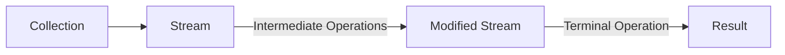

# Java Stream Operations

## Introduction

In the previous sections, we've learned about Lambda expressions and how they provide a concise way to express behavior. Now, let's explore Java Stream operations, one of the most powerful applications of Lambda expressions.

Java Streams, introduced in Java 8, provide a modern approach to processing collections of data using functional-style operations. A Stream represents a sequence of elements and supports various operations that can be chained together to produce a desired result.

In this tutorial, we'll dive deep into the different types of Stream operations, how they work, and how you can use them to write cleaner, more efficient code.

## Understanding Stream Operations

Stream operations are divided into two categories:

1. **Intermediate Operations**: These operations transform a stream into another stream. They are lazy, meaning they don't execute until a terminal operation is invoked.

2. **Terminal Operations**: These operations produce a result or a side-effect. After a terminal operation is performed, the stream pipeline is considered consumed and cannot be used again.



Let's explore both types in detail.

## Intermediate Stream Operations

Intermediate operations return a new stream as a result. They are lazy operations, meaning they don't process the elements until a terminal operation is executed.

### 1. `filter()`

The `filter()` operation creates a new stream that contains elements matching a given predicate.

```java
// Example: Filter even numbers
List<Integer> numbers = Arrays.asList(1, 2, 3, 4, 5, 6, 7, 8, 9, 10);

List<Integer> evenNumbers = numbers.stream()
                                  .filter(n -> n % 2 == 0)
                                  .collect(Collectors.toList());

System.out.println("Original numbers: " + numbers);
System.out.println("Even numbers: " + evenNumbers);
```

Output:
```
Original numbers: [1, 2, 3, 4, 5, 6, 7, 8, 9, 10]
Even numbers: [2, 4, 6, 8, 10]
```

### 2. `map()`

The `map()` operation applies a function to each element and transforms it.

```java
// Example: Square each number
List<Integer> numbers = Arrays.asList(1, 2, 3, 4, 5);

List<Integer> squaredNumbers = numbers.stream()
                                    .map(n -> n * n)
                                    .collect(Collectors.toList());

System.out.println("Original numbers: " + numbers);
System.out.println("Squared numbers: " + squaredNumbers);
```

Output:
```
Original numbers: [1, 2, 3, 4, 5]
Squared numbers: [1, 4, 9, 16, 25]
```

### 3. `sorted()`

The `sorted()` operation sorts the elements of the stream according to natural order or a provided comparator.

```java
// Example: Sort strings by length
List<String> names = Arrays.asList("John", "Alice", "Bob", "Elizabeth", "Tom");

List<String> sortedByLength = names.stream()
                                   .sorted((s1, s2) -> s1.length() - s2.length())
                                   .collect(Collectors.toList());

System.out.println("Original names: " + names);
System.out.println("Sorted by length: " + sortedByLength);
```

Output:
```
Original names: [John, Alice, Bob, Elizabeth, Tom]
Sorted by length: [Bob, Tom, John, Alice, Elizabeth]
```

### 4. `distinct()`

The `distinct()` operation returns a stream with duplicate elements removed.

```java
// Example: Get distinct elements
List<Integer> numbers = Arrays.asList(1, 2, 2, 3, 3, 3, 4, 5, 5);

List<Integer> distinctNumbers = numbers.stream()
                                      .distinct()
                                      .collect(Collectors.toList());

System.out.println("Original numbers: " + numbers);
System.out.println("Distinct numbers: " + distinctNumbers);
```

Output:
```
Original numbers: [1, 2, 2, 3, 3, 3, 4, 5, 5]
Distinct numbers: [1, 2, 3, 4, 5]
```

### 5. `limit()` and `skip()`

The `limit()` operation limits the size of the stream while `skip()` skips the specified number of elements.

```java
// Example: Pagination using limit and skip
List<Integer> numbers = Arrays.asList(1, 2, 3, 4, 5, 6, 7, 8, 9, 10);

// Page size of 3, getting the second page
int pageSize = 3;
int pageNumber = 2; // 0-based index

List<Integer> page = numbers.stream()
                            .skip(pageNumber * pageSize)
                            .limit(pageSize)
                            .collect(Collectors.toList());

System.out.println("All numbers: " + numbers);
System.out.println("Page " + (pageNumber + 1) + " (size " + pageSize + "): " + page);
```

Output:
```
All numbers: [1, 2, 3, 4, 5, 6, 7, 8, 9, 10]
Page 3 (size 3): [7, 8, 9]
```

### 6. `flatMap()`

The `flatMap()` operation transforms each element into a stream and then flattens the resulting streams into a single stream.

```java
// Example: Flatten a list of lists
List<List<Integer>> listOfLists = Arrays.asList(
    Arrays.asList(1, 2),
    Arrays.asList(3, 4, 5),
    Arrays.asList(6, 7, 8, 9)
);

List<Integer> flattenedList = listOfLists.stream()
                                        .flatMap(list -> list.stream())
                                        .collect(Collectors.toList());

System.out.println("Original list of lists: " + listOfLists);
System.out.println("Flattened list: " + flattenedList);
```

Output:
```
Original list of lists: [[1, 2], [3, 4, 5], [6, 7, 8, 9]]
Flattened list: [1, 2, 3, 4, 5, 6, 7, 8, 9]
```

## Terminal Stream Operations

Terminal operations produce a result or a side-effect and terminate the stream pipeline.

### 1. `collect()`

The `collect()` operation accumulates elements into a collection or other data structure.

```java
// Example: Collect into different collections
List<String> fruits = Arrays.asList("Apple", "Banana", "Cherry", "Date", "Elderberry");

// Collect to List
List<String> fruitsList = fruits.stream()
                               .filter(f -> f.startsWith("A") || f.startsWith("B"))
                               .collect(Collectors.toList());

// Collect to Set
Set<String> fruitsSet = fruits.stream()
                             .filter(f -> f.length() > 5)
                             .collect(Collectors.toSet());

// Collect to Map
Map<String, Integer> fruitsMap = fruits.stream()
                                      .collect(Collectors.toMap(
                                          f -> f,  // key mapper
                                          f -> f.length()  // value mapper
                                      ));

System.out.println("Fruits starting with A or B: " + fruitsList);
System.out.println("Fruits with length > 5: " + fruitsSet);
System.out.println("Fruits with their lengths: " + fruitsMap);
```

Output:
```
Fruits starting with A or B: [Apple, Banana]
Fruits with length > 5: [Elderberry]
Fruits with their lengths: {Apple=5, Banana=6, Cherry=6, Date=4, Elderberry=10}
```

### 2. `forEach()`

The `forEach()` operation performs an action for each element in the stream.

```java
// Example: Print each element
List<String> colors = Arrays.asList("Red", "Green", "Blue");

System.out.println("Colors:");
colors.stream()
      .forEach(color -> System.out.println("- " + color));
```

Output:
```
Colors:
- Red
- Green
- Blue
```

### 3. `reduce()`

The `reduce()` operation combines stream elements into a single result.

```java
// Example 1: Sum of numbers
List<Integer> numbers = Arrays.asList(1, 2, 3, 4, 5);

int sum = numbers.stream()
                .reduce(0, (a, b) -> a + b);

// Example 2: Concatenate strings
List<String> words = Arrays.asList("Java", "is", "awesome");

String sentence = words.stream()
                      .reduce("", (s1, s2) -> s1 + " " + s2)
                      .trim();

System.out.println("Sum of numbers: " + sum);
System.out.println("Concatenated sentence: \"" + sentence + "\"");
```

Output:
```
Sum of numbers: 15
Concatenated sentence: "Java is awesome"
```

### 4. `count()`, `min()`, and `max()`

These operations return the count, minimum, and maximum elements of the stream respectively.

```java
// Example: Count, min, and max operations
List<Integer> numbers = Arrays.asList(3, 1, 4, 1, 5, 9, 2, 6);

long count = numbers.stream().count();
int min = numbers.stream().min(Integer::compare).orElse(-1);
int max = numbers.stream().max(Integer::compare).orElse(-1);

System.out.println("Numbers: " + numbers);
System.out.println("Count: " + count);
System.out.println("Min: " + min);
System.out.println("Max: " + max);
```

Output:
```
Numbers: [3, 1, 4, 1, 5, 9, 2, 6]
Count: 8
Min: 1
Max: 9
```

### 5. `anyMatch()`, `allMatch()`, and `noneMatch()`

These operations test if a predicate matches any, all, or no elements in the stream.

```java
// Example: Testing predicates
List<Integer> numbers = Arrays.asList(2, 4, 6, 8, 10);

boolean anyOdd = numbers.stream().anyMatch(n -> n % 2 != 0);
boolean allEven = numbers.stream().allMatch(n -> n % 2 == 0);
boolean noneNegative = numbers.stream().noneMatch(n -> n < 0);

System.out.println("Numbers: " + numbers);
System.out.println("Are any numbers odd? " + anyOdd);
System.out.println("Are all numbers even? " + allEven);
System.out.println("Are there no negative numbers? " + noneNegative);
```

Output:
```
Numbers: [2, 4, 6, 8, 10]
Are any numbers odd? false
Are all numbers even? true
Are there no negative numbers? true
```

### 6. `findFirst()` and `findAny()`

These operations return the first element or any element of the stream.

```java
// Example: Finding elements
List<String> names = Arrays.asList("John", "Jane", "Jack", "Jill");

// Find first name starting with 'Ja'
Optional<String> firstJa = names.stream()
                              .filter(name -> name.startsWith("Ja"))
                              .findFirst();

// Find any name with length 4
Optional<String> anyLength4 = names.stream()
                                 .filter(name -> name.length() == 4)
                                 .findAny();

System.out.println("First name starting with 'Ja': " + firstJa.orElse("None found"));
System.out.println("Any name with length 4: " + anyLength4.orElse("None found"));
```

Output:
```
First name starting with 'Ja': Jane
Any name with length 4: John
```

## Real-World Examples

Let's apply what we've learned to solve some practical problems.

### Example 1: Processing a List of Products

```java
class Product {
    private String name;
    private double price;
    private String category;

    public Product(String name, double price, String category) {
        this.name = name;
        this.price = price;
        this.category = category;
    }

    // Getters
    public String getName() { return name; }
    public double getPrice() { return price; }
    public String getCategory() { return category; }

    @Override
    public String toString() {
        return name + " ($" + price + ")";
    }
}

// Example usage
public class StreamExample {
    public static void main(String[] args) {
        List<Product> products = Arrays.asList(
            new Product("Laptop", 1200.0, "Electronics"),
            new Product("Phone", 800.0, "Electronics"),
            new Product("Desk", 350.0, "Furniture"),
            new Product("Chair", 120.0, "Furniture"),
            new Product("Book", 15.0, "Books"),
            new Product("Headphones", 80.0, "Electronics")
        );

        // 1. Find all electronics products
        List<Product> electronics = products.stream()
                                          .filter(p -> p.getCategory().equals("Electronics"))
                                          .collect(Collectors.toList());
        
        // 2. Calculate average price of furniture
        double avgFurniturePrice = products.stream()
                                          .filter(p -> p.getCategory().equals("Furniture"))
                                          .mapToDouble(Product::getPrice)
                                          .average()
                                          .orElse(0.0);
        
        // 3. Find the most expensive product
        Optional<Product> mostExpensive = products.stream()
                                               .max((p1, p2) -> Double.compare(p1.getPrice(), p2.getPrice()));
        
        // 4. Group products by category
        Map<String, List<Product>> productsByCategory = products.stream()
                                                              .collect(Collectors.groupingBy(Product::getCategory));

        System.out.println("Electronics products: " + electronics);
        System.out.println("Average furniture price: $" + avgFurniturePrice);
        System.out.println("Most expensive product: " + mostExpensive.orElse(null));
        System.out.println("Products by category: " + productsByCategory);
    }
}
```

Output:
```
Electronics products: [Laptop ($1200.0), Phone ($800.0), Headphones ($80.0)]
Average furniture price: $235.0
Most expensive product: Laptop ($1200.0)
Products by category: {Electronics=[Laptop ($1200.0), Phone ($800.0), Headphones ($80.0)], Books=[Book ($15.0)], Furniture=[Desk ($350.0), Chair ($120.0)]}
```

### Example 2: Processing Text

```java
public class TextProcessingExample {
    public static void main(String[] args) {
        String text = "Java streams are powerful. Streams make data processing easy. " +
                     "With streams, we can write clean and concise code.";

        // 1. Count words
        long wordCount = Arrays.stream(text.split("\\s+"))
                             .count();
        
        // 2. Find unique words
        List<String> uniqueWords = Arrays.stream(text.split("\\s+"))
                                       .map(word -> word.replaceAll("[^a-zA-Z]", "").toLowerCase())
                                       .distinct()
                                       .collect(Collectors.toList());
        
        // 3. Find word frequency
        Map<String, Long> wordFrequency = Arrays.stream(text.split("\\s+"))
                                               .map(word -> word.replaceAll("[^a-zA-Z]", "").toLowerCase())
                                               .filter(word -> !word.isEmpty())
                                               .collect(Collectors.groupingBy(
                                                   word -> word,
                                                   Collectors.counting()
                                               ));

        System.out.println("Text: " + text);
        System.out.println("Word count: " + wordCount);
        System.out.println("Unique words: " + uniqueWords);
        System.out.println("Word frequency: " + wordFrequency);
    }
}
```

Output:
```
Text: Java streams are powerful. Streams make data processing easy. With streams, we can write clean and concise code.
Word count: 19
Unique words: [java, streams, are, powerful, make, data, processing, easy, with, we, can, write, clean, and, concise, code]
Word frequency: {streams=3, code=1, powerful=1, we=1, processing=1, can=1, java=1, clean=1, concise=1, are=1, data=1, make=1, easy=1, with=1, write=1, and=1}
```

## Stream Performance Considerations

When working with streams, keep these performance tips in mind:

1. **Laziness**: Intermediate operations are lazy and only executed when a terminal operation is called, which can improve performance.

2. **Short-circuiting**: Operations like `limit()`, `findFirst()`, and `anyMatch()` can terminate processing early and improve performance.

3. **Parallel Streams**: For large datasets, consider using parallel streams (`parallelStream()`) to leverage multi-core processors, but be aware of potential thread-safety issues.

```java
// Example: Sequential vs. Parallel streams
List<Integer> numbers = new ArrayList<>();
for (int i = 1; i <= 10_000_000; i++) {
    numbers.add(i);
}

// Sequential processing
long startSeq = System.currentTimeMillis();
long countSeq = numbers.stream()
                      .filter(n -> n % 2 == 0)
                      .count();
long timeSeq = System.currentTimeMillis() - startSeq;

// Parallel processing
long startPar = System.currentTimeMillis();
long countPar = numbers.parallelStream()
                      .filter(n -> n % 2 == 0)
                      .count();
long timePar = System.currentTimeMillis() - startPar;

System.out.println("Sequential time: " + timeSeq + "ms");
System.out.println("Parallel time: " + timePar + "ms");
```

## Summary

Java Stream operations provide a powerful way to process collections using functional programming techniques. In this tutorial, we covered:

- The difference between intermediate and terminal operations
- Common intermediate operations like `filter()`, `map()`, `sorted()`, and `flatMap()`
- Common terminal operations like `collect()`, `forEach()`, `reduce()`, and `count()`
- Real-world examples of using streams to process data
- Performance considerations when working with streams

By mastering Stream operations, you can write more concise, readable, and efficient code for data processing tasks in Java.

## Exercises

To practice what you've learned, try these exercises:

1. Given a list of strings, use streams to find all strings that start with a specific letter and have a length greater than a certain value.

2. Using the `Product` class from the examples, write code to find the total price of all products in each category.

3. Write a program that reads a text file, counts the frequency of each word, and outputs the top 10 most common words.

4. Implement a method that takes a list of integers and returns the sum of the squares of all even numbers.

5. Use parallel streams to find all prime numbers between 1 and 1,000,000.

## Additional Resources

- [Java 8 Stream API documentation](https://docs.oracle.com/javase/8/docs/api/java/util/stream/package-summary.html)
- [Oracle's Java Tutorial: Streams](https://docs.oracle.com/javase/tutorial/collections/streams/index.html)
- Book: "Java 8 in Action" by Raoul-Gabriel Urma, Mario Fusco, and Alan Mycroft
- Book: "Modern Java in Action" by Raoul-Gabriel Urma, Mario Fusco, and Alan Mycroft

Happy coding with Java Streams!