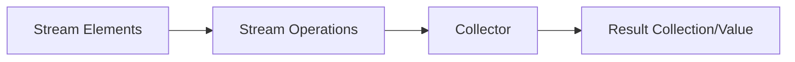

# Java Stream Collectors

In this tutorial, we'll explore Java Stream Collectors, a powerful feature that complements Lambda expressions and the Stream API to transform data in elegant and functional ways.

## Introduction to Collectors

Collectors are special classes in Java that are used with streams to gather the elements of a stream into a collection or to perform various reduction operations such as finding averages, sums, or grouping elements. They are the final piece in most stream operations, allowing you to collect processed data into a useful result.



The `Collectors` class provides many static factory methods for common collector implementations, allowing you to easily:

- Accumulate elements into collections
- Summarize elements according to various criteria
- Group elements by classification
- Partition elements based on conditions

## Basic Collectors

### Collecting Elements to a Collection

The most common use of collectors is to accumulate stream elements into a collection.

#### Collecting to a List

```java
import java.util.List;
import java.util.stream.Collectors;
import java.util.stream.Stream;

public class CollectorExample {
    public static void main(String[] args) {
        List<String> names = Stream.of("Alice", "Bob", "Charlie", "David")
                                   .collect(Collectors.toList());
        
        System.out.println("Collected names: " + names);
    }
}
```

**Output:**
```
Collected names: [Alice, Bob, Charlie, David]
```

#### Collecting to a Set

```java
import java.util.Set;
import java.util.stream.Collectors;
import java.util.stream.Stream;

public class SetCollectorExample {
    public static void main(String[] args) {
        Set<String> uniqueNames = Stream.of("Alice", "Bob", "Charlie", "Alice")
                                        .collect(Collectors.toSet());
        
        System.out.println("Unique names: " + uniqueNames);
    }
}
```

**Output:**
```
Unique names: [Alice, Bob, Charlie]
```

#### Collecting to a Map

```java
import java.util.Map;
import java.util.stream.Collectors;
import java.util.stream.Stream;

public class MapCollectorExample {
    public static void main(String[] args) {
        Map<String, Integer> nameLengths = Stream.of("Alice", "Bob", "Charlie")
                                               .collect(Collectors.toMap(
                                                   name -> name,         // Key mapper
                                                   name -> name.length() // Value mapper
                                               ));
        
        System.out.println("Name lengths: " + nameLengths);
    }
}
```

**Output:**
```
Name lengths: {Bob=3, Alice=5, Charlie=7}
```

## Aggregation Collectors

### Counting Elements

```java
import java.util.stream.Collectors;
import java.util.stream.Stream;

public class CountingExample {
    public static void main(String[] args) {
        long count = Stream.of("Alice", "Bob", "Charlie", "David")
                           .collect(Collectors.counting());
        
        System.out.println("Total elements: " + count);
    }
}
```

**Output:**
```
Total elements: 4
```

### Finding Sum, Average, Min, and Max

```java
import java.util.stream.Collectors;
import java.util.stream.Stream;

public class AggregationExample {
    public static void main(String[] args) {
        // Create a stream of numbers
        Stream<Integer> numbers = Stream.of(5, 10, 15, 20, 25);
        
        // Calculate sum
        int sum = numbers.collect(Collectors.summingInt(n -> n));
        System.out.println("Sum: " + sum);
        
        // Need to recreate the stream as it's already consumed
        numbers = Stream.of(5, 10, 15, 20, 25);
        
        // Calculate average
        double average = numbers.collect(Collectors.averagingInt(n -> n));
        System.out.println("Average: " + average);
        
        // Statistics (min, max, sum, average, count)
        numbers = Stream.of(5, 10, 15, 20, 25);
        var statistics = numbers.collect(Collectors.summarizingInt(n -> n));
        
        System.out.println("Min: " + statistics.getMin());
        System.out.println("Max: " + statistics.getMax());
        System.out.println("Count: " + statistics.getCount());
    }
}
```

**Output:**
```
Sum: 75
Average: 15.0
Min: 5
Max: 25
Count: 5
```

## Joining Strings

The `joining()` collector is specialized for working with streams of strings:

```java
import java.util.stream.Collectors;
import java.util.stream.Stream;

public class JoiningExample {
    public static void main(String[] args) {
        // Simple joining
        String joined = Stream.of("Apple", "Banana", "Cherry")
                             .collect(Collectors.joining());
        System.out.println("Joined: " + joined);
        
        // Joining with delimiter
        joined = Stream.of("Apple", "Banana", "Cherry")
                      .collect(Collectors.joining(", "));
        System.out.println("Joined with comma: " + joined);
        
        // Joining with delimiter, prefix, and suffix
        joined = Stream.of("Apple", "Banana", "Cherry")
                      .collect(Collectors.joining(", ", "Fruits: [", "]"));
        System.out.println(joined);
    }
}
```

**Output:**
```
Joined: AppleBananaCherry
Joined with comma: Apple, Banana, Cherry
Fruits: [Apple, Banana, Cherry]
```

## Grouping and Partitioning

### Grouping By

The `groupingBy()` collector allows you to group stream elements by a classification function:

```java
import java.util.List;
import java.util.Map;
import java.util.stream.Collectors;
import java.util.Arrays;

public class GroupingExample {
    public static void main(String[] args) {
        // Create a list of people
        List<Person> people = Arrays.asList(
            new Person("Alice", 25),
            new Person("Bob", 30),
            new Person("Charlie", 25),
            new Person("David", 30),
            new Person("Eve", 25)
        );
        
        // Group people by their age
        Map<Integer, List<Person>> peopleByAge = people.stream()
            .collect(Collectors.groupingBy(Person::getAge));
        
        System.out.println("People grouped by age:");
        peopleByAge.forEach((age, personList) -> {
            System.out.println(age + ": " + personList);
        });
    }
    
    // Person class
    static class Person {
        private String name;
        private int age;
        
        public Person(String name, int age) {
            this.name = name;
            this.age = age;
        }
        
        public String getName() { return name; }
        public int getAge() { return age; }
        
        @Override
        public String toString() {
            return name;
        }
    }
}
```

**Output:**
```
People grouped by age:
25: [Alice, Charlie, Eve]
30: [Bob, David]
```

### Partitioning By

The `partitioningBy()` collector divides elements into two groups based on a predicate:

```java
import java.util.List;
import java.util.Map;
import java.util.stream.Collectors;
import java.util.Arrays;

public class PartitioningExample {
    public static void main(String[] args) {
        List<Integer> numbers = Arrays.asList(1, 2, 3, 4, 5, 6, 7, 8, 9, 10);
        
        // Partition numbers into even and odd
        Map<Boolean, List<Integer>> evenAndOddNumbers = numbers.stream()
            .collect(Collectors.partitioningBy(n -> n % 2 == 0));
        
        System.out.println("Even numbers: " + evenAndOddNumbers.get(true));
        System.out.println("Odd numbers: " + evenAndOddNumbers.get(false));
    }
}
```

**Output:**
```
Even numbers: [2, 4, 6, 8, 10]
Odd numbers: [1, 3, 5, 7, 9]
```

## Downstream Collectors

Collectors can be combined with other collectors to perform more complex operations:

```java
import java.util.List;
import java.util.Map;
import java.util.stream.Collectors;
import java.util.Arrays;

public class DownstreamCollectorExample {
    public static void main(String[] args) {
        List<Person> people = Arrays.asList(
            new Person("Alice", 25),
            new Person("Bob", 30),
            new Person("Charlie", 25),
            new Person("David", 30),
            new Person("Eve", 25)
        );
        
        // Group by age and count people in each group
        Map<Integer, Long> countByAge = people.stream()
            .collect(Collectors.groupingBy(
                Person::getAge,
                Collectors.counting()
            ));
        
        System.out.println("Count by age: " + countByAge);
        
        // Group by age and collect names as a comma-separated string
        Map<Integer, String> namesByAge = people.stream()
            .collect(Collectors.groupingBy(
                Person::getAge,
                Collectors.mapping(
                    Person::getName,
                    Collectors.joining(", ")
                )
            ));
        
        System.out.println("Names by age: " + namesByAge);
    }
    
    static class Person {
        private String name;
        private int age;
        
        public Person(String name, int age) {
            this.name = name;
            this.age = age;
        }
        
        public String getName() { return name; }
        public int getAge() { return age; }
    }
}
```

**Output:**
```
Count by age: {25=3, 30=2}
Names by age: {25=Alice, Charlie, Eve, 30=Bob, David}
```

## Creating Custom Collectors

While the built-in collectors cover most use cases, you can create custom collectors for specific needs:

```java
import java.util.ArrayList;
import java.util.List;
import java.util.function.BiConsumer;
import java.util.function.Supplier;
import java.util.stream.Collector;
import java.util.stream.Stream;

public class CustomCollectorExample {
    public static void main(String[] args) {
        // Create a custom collector that builds a comma-separated string
        Collector<String, StringBuilder, String> customStringJoiner = Collector.of(
            StringBuilder::new,                      // supplier
            (sb, str) -> {                           // accumulator
                if (sb.length() > 0) sb.append(", ");
                sb.append(str);
            },
            (sb1, sb2) -> {                          // combiner
                if (sb2.length() > 0) {
                    if (sb1.length() > 0) sb1.append(", ");
                    sb1.append(sb2);
                }
                return sb1;
            },
            StringBuilder::toString                  // finisher
        );
        
        String result = Stream.of("Apple", "Banana", "Cherry")
                           .collect(customStringJoiner);
        
        System.out.println("Custom joined: " + result);
    }
}
```

**Output:**
```
Custom joined: Apple, Banana, Cherry
```

## Real-World Example: Processing Sales Data

Let's apply collectors to a more realistic scenario: analyzing sales data.

```java
import java.util.*;
import java.util.stream.Collectors;

public class SalesAnalysisExample {
    public static void main(String[] args) {
        // Create sample sales data
        List<Sale> sales = Arrays.asList(
            new Sale("Electronics", "Laptop", 1200.00),
            new Sale("Electronics", "Phone", 800.00),
            new Sale("Books", "Java Programming", 50.00),
            new Sale("Books", "Clean Code", 45.00),
            new Sale("Electronics", "Tablet", 500.00),
            new Sale("Clothing", "T-Shirt", 25.00),
            new Sale("Clothing", "Jeans", 70.00),
            new Sale("Books", "Design Patterns", 60.00)
        );
        
        // 1. Calculate total sales
        double totalSales = sales.stream()
            .collect(Collectors.summingDouble(Sale::getAmount));
        System.out.println("Total sales: $" + totalSales);
        
        // 2. Calculate sales by category
        Map<String, Double> salesByCategory = sales.stream()
            .collect(Collectors.groupingBy(
                Sale::getCategory,
                Collectors.summingDouble(Sale::getAmount)
            ));
        
        System.out.println("\nSales by category:");
        salesByCategory.forEach((category, total) -> 
            System.out.println(category + ": $" + total));
        
        // 3. Find the highest value sale in each category
        Map<String, Optional<Sale>> highestSaleByCategory = sales.stream()
            .collect(Collectors.groupingBy(
                Sale::getCategory,
                Collectors.maxBy(Comparator.comparing(Sale::getAmount))
            ));
        
        System.out.println("\nHighest sale in each category:");
        highestSaleByCategory.forEach((category, optionalSale) -> {
            Sale sale = optionalSale.get();
            System.out.println(category + ": " + sale.getProduct() + " ($" + sale.getAmount() + ")");
        });
        
        // 4. Group products by category
        Map<String, List<String>> productsByCategory = sales.stream()
            .collect(Collectors.groupingBy(
                Sale::getCategory,
                Collectors.mapping(Sale::getProduct, Collectors.toList())
            ));
        
        System.out.println("\nProducts by category:");
        productsByCategory.forEach((category, products) -> 
            System.out.println(category + ": " + products));
    }
    
    static class Sale {
        private String category;
        private String product;
        private double amount;
        
        public Sale(String category, String product, double amount) {
            this.category = category;
            this.product = product;
            this.amount = amount;
        }
        
        public String getCategory() { return category; }
        public String getProduct() { return product; }
        public double getAmount() { return amount; }
    }
}
```

**Output:**
```
Total sales: $2750.0

Sales by category:
Electronics: $2500.0
Books: $155.0
Clothing: $95.0

Highest sale in each category:
Electronics: Laptop ($1200.0)
Books: Design Patterns ($60.0)
Clothing: Jeans ($70.0)

Products by category:
Electronics: [Laptop, Phone, Tablet]
Books: [Java Programming, Clean Code, Design Patterns]
Clothing: [T-Shirt, Jeans]
```

## Summary

Java Stream Collectors are powerful tools that allow you to:

- Transform streams into various collection types (lists, sets, maps)
- Perform aggregate operations like counting, summing, averaging
- Join strings with customizable delimiters
- Group and partition data based on criteria
- Combine collectors to perform complex transformations
- Create custom collectors for specialized needs

When used with Lambda expressions and the Stream API, collectors enable you to write concise, readable, and maintainable code that processes collections of data efficiently.

## Practice Exercises

1. Create a collector that groups a list of strings by their first letter and counts how many words start with each letter.
2. Write a program that processes a list of employees, grouping them by department and calculating the average salary in each department.
3. Create a custom collector that accumulates a stream of integers into an array where even numbers come before odd numbers.
4. Use collectors to analyze a list of products to find the most expensive product in each category and the total inventory value.

## Additional Resources

- [Java Documentation for Collectors](https://docs.oracle.com/javase/8/docs/api/java/util/stream/Collectors.html)
- [Java Stream API Tutorial](https://www.baeldung.com/java-8-streams)
- [Functional Programming in Java](https://www.oracle.com/technical-resources/articles/java/architect-lambdas-part1.html)

Happy collecting!