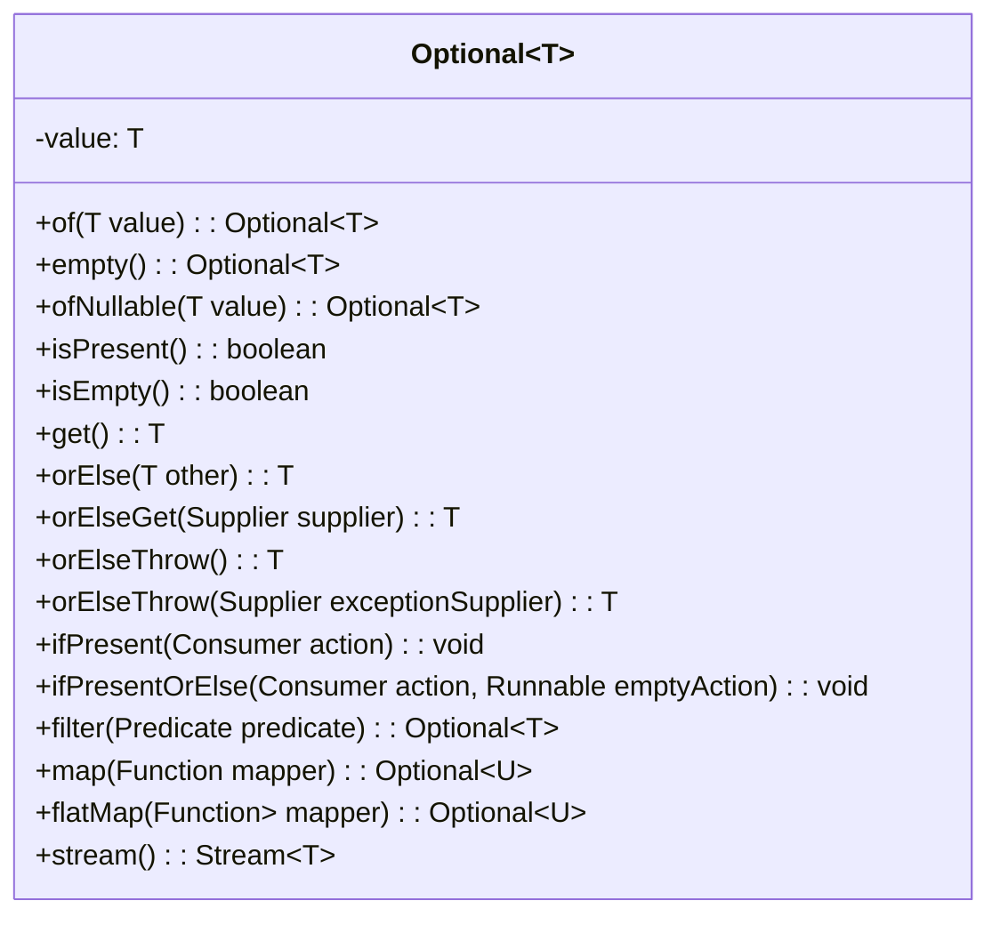

# Java Optional Class

## Introduction

The `Optional` class was introduced in Java 8 as a container object that may or may not contain a non-null value. It's designed to provide a more elegant and less error-prone alternative to handling null values in Java code. Before Optional, handling potential null values often led to defensive coding with multiple null checks or, worse, unexpected `NullPointerException` errors.

Optional is closely tied to Java's functional programming features, especially lambda expressions, as it provides methods that work well with lambdas to process values that might not exist.

## What Problems Does Optional Solve?

Consider this common scenario:

```java
public String getUserEmail(User user) {
    if (user != null) {
        if (user.getAccount() != null) {
            if (user.getAccount().getEmail() != null) {
                return user.getAccount().getEmail();
            }
        }
    }
    return "unknown";
}
```

This code is:
- Verbose and difficult to read
- Error-prone (easy to miss a null check)
- Not expressive about the intent

Optional offers a cleaner solution to this problem.

## Creating Optional Objects

There are several ways to create an Optional object:

```java
// Empty Optional
Optional<String> empty = Optional.empty();

// Optional with a non-null value
Optional<String> opt = Optional.of("Hello");

// Optional that might contain a null value
Optional<String> nullable = Optional.ofNullable(someString);  // someString can be null
```

:::caution
Using `Optional.of(null)` will throw a `NullPointerException`. If the value might be null, use `Optional.ofNullable()` instead.
:::

## Checking If a Value Exists

To check if an Optional contains a value:

```java
Optional<String> opt = Optional.ofNullable("Hello");

// Check if a value exists
boolean isPresent = opt.isPresent();  // true

// Check if a value does not exist
boolean isEmpty = opt.isEmpty();  // false (added in Java 11)

System.out.println("Is value present? " + isPresent);
System.out.println("Is value empty? " + isEmpty);
```

Output:
```
Is value present? true
Is value empty? false
```

## Accessing the Value

There are several ways to access the value in an Optional:

```java
Optional<String> opt = Optional.of("Hello, Optional!");

// Get the value (throws NoSuchElementException if empty)
String value = opt.get();

// Get the value or a default
String valueOrDefault = opt.orElse("Default Value");

// Get the value or compute a default with a lambda
String computed = opt.orElseGet(() -> "Computed Value");

// Get the value or throw a custom exception
String valueOrThrow = opt.orElseThrow(() -> new IllegalStateException("Value not present"));

System.out.println("Value: " + value);
System.out.println("Value or default: " + valueOrDefault);
System.out.println("Computed value: " + computed);
System.out.println("Value or throw: " + valueOrThrow);
```

Output:
```
Value: Hello, Optional!
Value or default: Hello, Optional!
Computed value: Hello, Optional!
Value or throw: Hello, Optional!
```

:::tip
`orElse` always evaluates its argument, while `orElseGet` only does so if the Optional is empty. Use `orElseGet` when the default value is expensive to create.
:::

## Working with Optional Values Using Lambda Expressions

Optional really shines when combined with lambda expressions:

### Using `ifPresent`

```java
Optional<String> opt = Optional.of("Hello");

// Execute code if a value is present
opt.ifPresent(value -> System.out.println("Value is present: " + value));

Optional<String> empty = Optional.empty();
empty.ifPresent(value -> System.out.println("This won't print"));
```

Output:
```
Value is present: Hello
```

### Using `ifPresentOrElse` (Java 9+)

```java
Optional<String> opt = Optional.of("Hello");

// Execute different code based on whether value is present or not
opt.ifPresentOrElse(
    value -> System.out.println("Value is present: " + value),
    () -> System.out.println("Value is absent")
);

Optional.empty().ifPresentOrElse(
    value -> System.out.println("This won't print"),
    () -> System.out.println("Value is absent")
);
```

Output:
```
Value is present: Hello
Value is absent
```

### Transforming Values with `map`

The `map` method transforms the value if it exists:

```java
Optional<String> opt = Optional.of("Hello");

// Transform the value if it exists
Optional<Integer> length = opt.map(String::length);
System.out.println("Length: " + length.orElse(0));

Optional<String> empty = Optional.empty();
Optional<Integer> emptyLength = empty.map(String::length);
System.out.println("Empty length: " + emptyLength.orElse(0));
```

Output:
```
Length: 5
Empty length: 0
```

### Using `flatMap` for Nested Optionals

When working with methods that return Optionals, `flatMap` is useful to avoid nested Optionals:

```java
public class User {
    private String name;
    
    public User(String name) {
        this.name = name;
    }
    
    public Optional<String> getName() {
        return Optional.ofNullable(name);
    }
}

// Using map would result in Optional<Optional<String>>
Optional<User> user = Optional.of(new User("John"));
Optional<Optional<String>> nestedName = user.map(User::getName);

// flatMap flattens the result
Optional<String> name = user.flatMap(User::getName);
System.out.println("User name: " + name.orElse("Unknown"));
```

Output:
```
User name: John
```

## Filtering Optional Values

You can filter Optionals with a predicate:

```java
Optional<String> opt = Optional.of("Hello");

// Filter based on a condition
Optional<String> filtered = opt.filter(s -> s.length() > 3);
System.out.println("Filtered value: " + filtered.orElse("Value filtered out"));

// Filter that doesn't match
Optional<String> notFiltered = opt.filter(s -> s.length() > 10);
System.out.println("Non-matching filter: " + notFiltered.orElse("Value filtered out"));
```

Output:
```
Filtered value: Hello
Non-matching filter: Value filtered out
```

## Real-world Example: User Authentication System

Let's see how Optional can improve a user authentication system:

```java
class UserService {
    private Map<String, User> users = new HashMap<>();
    
    public Optional<User> findUserByUsername(String username) {
        return Optional.ofNullable(users.get(username));
    }
    
    // Adding a user for demonstration
    public void addUser(User user) {
        users.put(user.getUsername(), user);
    }
}

class User {
    private String username;
    private String email;
    
    public User(String username, String email) {
        this.username = username;
        this.email = email;
    }
    
    public String getUsername() {
        return username;
    }
    
    public Optional<String> getEmail() {
        return Optional.ofNullable(email);
    }
}

class AuthenticationService {
    private UserService userService;
    
    public AuthenticationService(UserService userService) {
        this.userService = userService;
    }
    
    public void sendPasswordResetEmail(String username) {
        userService.findUserByUsername(username)
            .flatMap(User::getEmail)
            .ifPresentOrElse(
                email -> System.out.println("Sending password reset email to: " + email),
                () -> System.out.println("Could not send password reset email: email not found")
            );
    }
}

// Example usage
UserService userService = new UserService();
userService.addUser(new User("john", "john@example.com"));
userService.addUser(new User("jane", null));

AuthenticationService authService = new AuthenticationService(userService);
authService.sendPasswordResetEmail("john");
authService.sendPasswordResetEmail("jane");
authService.sendPasswordResetEmail("unknown");
```

Output:
```
Sending password reset email to: john@example.com
Could not send password reset email: email not found
Could not send password reset email: email not found
```

In this example:
1. `UserService` returns an Optional`<User>` for the find method
2. `User` returns an Optional`<String>` for the email
3. The password reset functionality elegantly handles all cases:
   - User exists with email
   - User exists but email is missing
   - User doesn't exist

## Optional in Stream Operations

Optional works well with Java Streams:

```java
List<Optional<String>> listOfOptionals = Arrays.asList(
    Optional.of("Hello"),
    Optional.empty(),
    Optional.of("World")
);

// Filter out empty optionals and get values
List<String> filteredList = listOfOptionals.stream()
    .filter(Optional::isPresent)
    .map(Optional::get)
    .collect(Collectors.toList());

System.out.println("Filtered list: " + filteredList);
```

Output:
```
Filtered list: [Hello, World]
```

In Java 9, there's a more elegant way:

```java
// Using Stream.flatMap with Optional.stream() (Java 9+)
List<String> streamedList = listOfOptionals.stream()
    .flatMap(Optional::stream)  // Converts each Optional to a Stream of 0 or 1 elements
    .collect(Collectors.toList());

System.out.println("Streamed list: " + streamedList);
```

Output:
```
Streamed list: [Hello, World]
```

## Best Practices for Using Optional

1. **Don't use Optional just for the sake of it**:
   - Optional adds overhead and complexity
   - Only use it when null handling is required

2. **Don't use Optional as a method parameter**:
   - This pushes null-handling responsibility to the caller
   - It's better to define multiple method overloads

3. **Don't use Optional in fields or collections**:
   - Optional isn't designed for serialization
   - `Optional<T>` is not a replacement for `List<T>` with zero or one elements

4. **Do use Optional as a return type** when:
   - A method might not return a value
   - You want to make this possibility explicit in the API

5. **Prefer higher-level methods over isPresent/get**:
   - Use `map`, `flatMap`, `orElse`, etc. rather than checking `isPresent()` and calling `get()`

## How Optional Works Under the Hood



Optional uses a single instance field to store its value. It's a lightweight container that uses static factory methods instead of public constructors to create instances.

## Summary

The Java Optional class is a powerful tool for handling nullable values in a clean, functional way. It provides:

- A clear way to express that a value might be absent
- Methods to handle both present and absent values
- Integration with functional interfaces and lambda expressions
- A more expressive alternative to null checks

When used appropriately, Optional leads to more readable, maintainable, and robust code by forcing developers to think about and handle the null case explicitly.

## Exercises

1. Refactor the following method to use Optional:
   ```java
   public String getUserDisplayName(User user) {
       if (user != null) {
           String name = user.getName();
           if (name != null && !name.isEmpty()) {
               return name;
           } else {
               return user.getEmail();
           }
       }
       return "Guest";
   }
   ```

2. Implement a method `findLongestString` that takes a list of strings and returns an Optional containing the longest string, or an empty Optional if the list is empty or only contains null/empty strings.

3. Create a simple address book application that stores person records with optional phone numbers and email addresses. Implement search functionality that uses Optional to handle potentially missing data.

## Additional Resources

- [Java Documentation for Optional](https://docs.oracle.com/en/java/javase/11/docs/api/java.base/java/util/Optional.html)
- [Oracle Tutorial on Optional](https://www.oracle.com/technical-resources/articles/java/java8-optional.html)
- [Effective Java, 3rd Edition](https://www.oreilly.com/library/view/effective-java-3rd/9780134686097/) by Joshua Bloch - Item 55: "Return optionals judiciously"
- [Baeldung's Guide to Java 8 Optional](https://www.baeldung.com/java-optional)