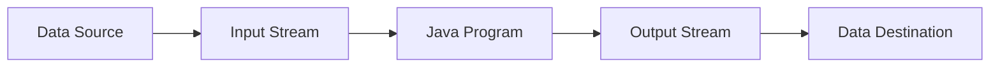

# Java I/O Streams

## Introduction

In Java, input and output operations are performed through **streams**. A stream represents a flow of data, similar to a physical stream of water. Just as water flows from a source to a destination, data in Java flows from a source to a destination through streams.

Java I/O (Input/Output) streams are fundamental for reading data from various sources (like files, network connections, or memory) and writing data to various destinations. They form the backbone of how Java programs interact with external resources.

In this tutorial, we'll explore:
- What streams are and how they work
- The different types of streams in Java
- How to use streams for reading and writing data
- Practical examples with real-world scenarios

## Understanding Java Streams

### What is a Stream?

In Java, a stream is an abstract representation of a sequence of data. It doesn't hold the data itself but provides a way to read from or write to the data source. Think of a stream as a pipeline that connects your program to an external data source or destination.



### Key Characteristics of Streams

1. **Direction**: Streams are unidirectional. They either read data (input streams) or write data (output streams).
2. **Data Type**: Streams work with either bytes (byte streams) or characters (character streams).
3. **Functionality**: Basic streams simply transfer data, while specialized streams add additional functionality like buffering, filtering, or data conversion.

## Types of Streams in Java

Java provides two main categories of streams:

### 1. Byte Streams

These handle data in binary format (as raw bytes). The base abstract classes for byte streams are:
- `InputStream`: For reading byte data
- `OutputStream`: For writing byte data

Common byte stream classes include:
- `FileInputStream` / `FileOutputStream`: For reading/writing files
- `ByteArrayInputStream` / `ByteArrayOutputStream`: For reading/writing byte arrays
- `DataInputStream` / `DataOutputStream`: For reading/writing primitive data types

### 2. Character Streams

These handle data as characters, automatically managing the conversion between bytes and characters. The base abstract classes are:
- `Reader`: For reading character data
- `Writer`: For writing character data

Common character stream classes include:
- `FileReader` / `FileWriter`: For reading/writing text files
- `StringReader` / `StringWriter`: For reading/writing strings
- `BufferedReader` / `BufferedWriter`: For efficient reading/writing with buffering

## Working with Byte Streams

### Reading from a File with FileInputStream

Let's start with a basic example of reading bytes from a file:

```java
import java.io.FileInputStream;
import java.io.IOException;

public class FileInputStreamExample {
    public static void main(String[] args) {
        try (FileInputStream fis = new FileInputStream("sample.txt")) {
            int data;
            System.out.println("File content:");
            
            // Read byte by byte until end of file (-1)
            while ((data = fis.read()) != -1) {
                System.out.print((char) data);
            }
        } catch (IOException e) {
            System.err.println("Error reading file: " + e.getMessage());
        }
    }
}
```

If `sample.txt` contains "Hello, Java I/O!", the output would be:
```
File content:
Hello, Java I/O!
```

### Writing to a File with FileOutputStream

Now let's see how to write bytes to a file:

```java
import java.io.FileOutputStream;
import java.io.IOException;

public class FileOutputStreamExample {
    public static void main(String[] args) {
        String content = "Hello, this is written using FileOutputStream!";
        
        try (FileOutputStream fos = new FileOutputStream("output.txt")) {
            byte[] contentBytes = content.getBytes();
            fos.write(contentBytes);
            System.out.println("Content has been written to output.txt");
        } catch (IOException e) {
            System.err.println("Error writing to file: " + e.getMessage());
        }
    }
}
```

After running this code, a file named `output.txt` will be created with the content: "Hello, this is written using FileOutputStream!"

## Working with Character Streams

Character streams are particularly useful for text data because they handle character encoding automatically.

### Reading Text with FileReader

```java
import java.io.FileReader;
import java.io.IOException;

public class FileReaderExample {
    public static void main(String[] args) {
        try (FileReader reader = new FileReader("sample.txt")) {
            int character;
            System.out.println("File content:");
            
            // Read character by character
            while ((character = reader.read()) != -1) {
                System.out.print((char) character);
            }
        } catch (IOException e) {
            System.err.println("Error reading file: " + e.getMessage());
        }
    }
}
```

### Writing Text with FileWriter

```java
import java.io.FileWriter;
import java.io.IOException;

public class FileWriterExample {
    public static void main(String[] args) {
        String content = "This text is written using FileWriter, which handles character encoding!";
        
        try (FileWriter writer = new FileWriter("writer_output.txt")) {
            writer.write(content);
            System.out.println("Content has been written to writer_output.txt");
        } catch (IOException e) {
            System.err.println("Error writing to file: " + e.getMessage());
        }
    }
}
```

## Buffered Streams for Efficiency

Reading or writing one byte/character at a time can be inefficient. Buffered streams improve performance by reading or writing chunks of data at once.

### BufferedReader Example

```java
import java.io.BufferedReader;
import java.io.FileReader;
import java.io.IOException;

public class BufferedReaderExample {
    public static void main(String[] args) {
        try (BufferedReader reader = new BufferedReader(new FileReader("sample.txt"))) {
            String line;
            System.out.println("File content (line by line):");
            
            // Read line by line
            while ((line = reader.readLine()) != null) {
                System.out.println(line);
            }
        } catch (IOException e) {
            System.err.println("Error reading file: " + e.getMessage());
        }
    }
}
```

### BufferedWriter Example

```java
import java.io.BufferedWriter;
import java.io.FileWriter;
import java.io.IOException;

public class BufferedWriterExample {
    public static void main(String[] args) {
        try (BufferedWriter writer = new BufferedWriter(new FileWriter("buffered_output.txt"))) {
            writer.write("First line of text");
            writer.newLine(); // Add a new line
            writer.write("Second line of text");
            writer.newLine();
            writer.write("Third line of text");
            
            System.out.println("Content has been written to buffered_output.txt");
        } catch (IOException e) {
            System.err.println("Error writing to file: " + e.getMessage());
        }
    }
}
```

## Data Streams for Primitive Types

Data streams allow you to read and write Java primitive data types.

```java
import java.io.DataOutputStream;
import java.io.FileOutputStream;
import java.io.DataInputStream;
import java.io.FileInputStream;
import java.io.IOException;

public class DataStreamExample {
    public static void main(String[] args) {
        // Writing primitive data types
        try (DataOutputStream dos = new DataOutputStream(new FileOutputStream("data.bin"))) {
            dos.writeInt(42);
            dos.writeDouble(3.14159);
            dos.writeBoolean(true);
            dos.writeUTF("Hello, Data Streams!");
            
            System.out.println("Data has been written to data.bin");
        } catch (IOException e) {
            System.err.println("Error writing data: " + e.getMessage());
        }
        
        // Reading primitive data types
        try (DataInputStream dis = new DataInputStream(new FileInputStream("data.bin"))) {
            int intValue = dis.readInt();
            double doubleValue = dis.readDouble();
            boolean booleanValue = dis.readBoolean();
            String stringValue = dis.readUTF();
            
            System.out.println("Read values:");
            System.out.println("Int: " + intValue);
            System.out.println("Double: " + doubleValue);
            System.out.println("Boolean: " + booleanValue);
            System.out.println("String: " + stringValue);
        } catch (IOException e) {
            System.err.println("Error reading data: " + e.getMessage());
        }
    }
}
```

Output:
```
Data has been written to data.bin
Read values:
Int: 42
Double: 3.14159
Boolean: true
String: Hello, Data Streams!
```

## Object Streams for Serialization

Object streams enable you to write entire Java objects to a stream and read them back.

```java
import java.io.*;

// Ensure the class is serializable
class Person implements Serializable {
    private static final long serialVersionUID = 1L;
    private String name;
    private int age;
    
    public Person(String name, int age) {
        this.name = name;
        this.age = age;
    }
    
    @Override
    public String toString() {
        return "Person [name=" + name + ", age=" + age + "]";
    }
}

public class ObjectStreamExample {
    public static void main(String[] args) {
        Person person = new Person("John Doe", 30);
        
        // Write the object to a file
        try (ObjectOutputStream oos = new ObjectOutputStream(new FileOutputStream("person.dat"))) {
            oos.writeObject(person);
            System.out.println("Person object has been serialized");
        } catch (IOException e) {
            System.err.println("Error writing object: " + e.getMessage());
        }
        
        // Read the object from the file
        try (ObjectInputStream ois = new ObjectInputStream(new FileInputStream("person.dat"))) {
            Person deserializedPerson = (Person) ois.readObject();
            System.out.println("Deserialized person: " + deserializedPerson);
        } catch (IOException | ClassNotFoundException e) {
            System.err.println("Error reading object: " + e.getMessage());
        }
    }
}
```

Output:
```
Person object has been serialized
Deserialized person: Person [name=John Doe, age=30]
```

## Real-World Example: File Copy Utility

Let's create a practical example that combines what we've learned - a file copy utility:

```java
import java.io.*;

public class FileCopyUtility {
    public static void main(String[] args) {
        if (args.length != 2) {
            System.out.println("Usage: java FileCopyUtility <source-file> <target-file>");
            return;
        }
        
        String sourceFile = args[0];
        String targetFile = args[1];
        
        // Using try-with-resources to ensure streams are closed
        try (InputStream in = new BufferedInputStream(new FileInputStream(sourceFile));
             OutputStream out = new BufferedOutputStream(new FileOutputStream(targetFile))) {
            
            byte[] buffer = new byte[1024];
            int bytesRead;
            long totalBytes = 0;
            
            long startTime = System.currentTimeMillis();
            
            // Read from source and write to target
            while ((bytesRead = in.read(buffer)) != -1) {
                out.write(buffer, 0, bytesRead);
                totalBytes += bytesRead;
            }
            
            long endTime = System.currentTimeMillis();
            
            System.out.println("File copied successfully!");
            System.out.println("Copied " + totalBytes + " bytes");
            System.out.println("Time taken: " + (endTime - startTime) + " ms");
            
        } catch (IOException e) {
            System.err.println("Error copying file: " + e.getMessage());
        }
    }
}
```

To use this utility, compile it and run:
```
java FileCopyUtility original.txt copy.txt
```

## Working with Standard Streams

Java provides three standard streams:
1. `System.in`: Standard input (typically keyboard)
2. `System.out`: Standard output (typically console)
3. `System.err`: Standard error (typically console)

Here's a simple example of using `System.in` to read user input:

```java
import java.io.BufferedReader;
import java.io.IOException;
import java.io.InputStreamReader;

public class StandardStreamExample {
    public static void main(String[] args) {
        try (BufferedReader reader = new BufferedReader(new InputStreamReader(System.in))) {
            System.out.print("Enter your name: ");
            String name = reader.readLine();
            
            System.out.print("Enter your age: ");
            int age = Integer.parseInt(reader.readLine());
            
            System.out.println("Hello, " + name + "! In 10 years, you will be " + (age + 10) + " years old.");
        } catch (IOException e) {
            System.err.println("Error reading input: " + e.getMessage());
        } catch (NumberFormatException e) {
            System.err.println("Invalid age format: " + e.getMessage());
        }
    }
}
```

Sample interaction:
```
Enter your name: Alice
Enter your age: 25
Hello, Alice! In 10 years, you will be 35 years old.
```

## Best Practices for Working with I/O Streams

1. **Always close your streams**: Use try-with-resources or finally blocks to ensure streams are properly closed.
2. **Use buffered streams**: They significantly improve performance.
3. **Choose the right stream type**: Use byte streams for binary data and character streams for text data.
4. **Handle exceptions properly**: I/O operations are prone to exceptions.
5. **Consider character encoding**: When working with text files, be mindful of character encodings.

## Summary

In this tutorial, we've covered:
- The fundamentals of Java I/O streams
- Different types of streams (byte streams and character streams)
- Reading from and writing to files
- Using buffered streams for improved performance
- Working with data streams for primitive types
- Object serialization using object streams
- A practical file copy utility
- Working with standard streams

Java's I/O stream framework provides a powerful and flexible way to handle input and output operations. By understanding the different types of streams and when to use each, you can effectively manage data flow in your applications.

## Exercises

1. Create a program that counts the number of lines, words, and characters in a text file.
2. Write a utility that merges multiple text files into a single file.
3. Implement a simple configuration file reader that loads properties from a file.
4. Create a program that reads a binary file and outputs its content in hexadecimal format.
5. Extend the file copy utility to show a progress percentage during copying.

## Additional Resources

- [Java Official Documentation on I/O Streams](https://docs.oracle.com/javase/tutorial/essential/io/streams.html)
- [Java NIO for advanced I/O operations](https://docs.oracle.com/javase/8/docs/api/java/nio/package-summary.html)
- [Apache Commons IO](https://commons.apache.org/proper/commons-io/) - A library that provides utility classes for working with I/O