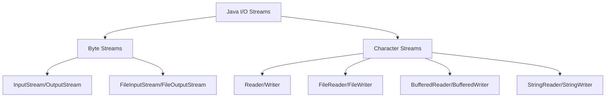
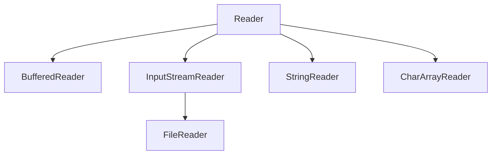
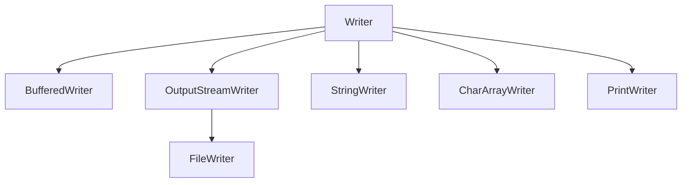

# Java Readers and Writers

## Introduction

In Java's I/O framework, **Readers** and **Writers** are essential classes for handling character-based input and output operations. While the `InputStream` and `OutputStream` classes deal with byte-based operations, the Reader and Writer classes specifically handle character data, making them ideal for text processing.

This distinction is important because:

- Character streams automatically handle character encoding and decoding
- They work with Unicode characters (16-bit) instead of bytes (8-bit)
- They provide more intuitive methods for text processing applications

In this tutorial, we'll explore how to use Java's Reader and Writer classes for efficiently handling text data.

## Understanding Character Streams vs. Byte Streams

Before diving into Readers and Writers, let's understand the difference between character streams and byte streams:



- **Byte Streams**: Work with binary data one byte at a time
- **Character Streams**: Work with text data one character at a time (handling Unicode encoding)

## The Reader Class Hierarchy

The `Reader` abstract class serves as the foundation for all character input streams:



Let's explore the most commonly used Reader classes:

### FileReader

`FileReader` is a class used for reading character files. It's a convenience class for reading characters from files.

```java
try (FileReader reader = new FileReader("example.txt")) {
    int character;
    while ((character = reader.read()) != -1) {
        System.out.print((char) character);
    }
} catch (IOException e) {
    e.printStackTrace();
}
```

### BufferedReader

`BufferedReader` adds buffering to improve performance and provides convenient methods like `readLine()`.

```java
try (BufferedReader reader = new BufferedReader(new FileReader("example.txt"))) {
    String line;
    while ((line = reader.readLine()) != null) {
        System.out.println(line);
    }
} catch (IOException e) {
    e.printStackTrace();
}
```

### InputStreamReader

`InputStreamReader` is a bridge between byte streams and character streams. It reads bytes and decodes them into characters.

```java
try (InputStreamReader reader = new InputStreamReader(new FileInputStream("example.txt"), StandardCharsets.UTF_8)) {
    int character;
    while ((character = reader.read()) != -1) {
        System.out.print((char) character);
    }
} catch (IOException e) {
    e.printStackTrace();
}
```

### StringReader

`StringReader` is a reader that uses a String as its source.

```java
String content = "Hello, World!";
try (StringReader reader = new StringReader(content)) {
    int character;
    while ((character = reader.read()) != -1) {
        System.out.print((char) character);
    }
} catch (IOException e) {
    e.printStackTrace();
}
```

**Output:**
```
Hello, World!
```

## The Writer Class Hierarchy

The `Writer` abstract class serves as the foundation for all character output streams:



Let's look at the most common Writer classes:

### FileWriter

`FileWriter` is used for writing characters to files.

```java
try (FileWriter writer = new FileWriter("output.txt")) {
    writer.write("Hello, FileWriter!");
} catch (IOException e) {
    e.printStackTrace();
}
```

### BufferedWriter

`BufferedWriter` adds buffering to improve performance and provides methods like `newLine()`.

```java
try (BufferedWriter writer = new BufferedWriter(new FileWriter("output.txt"))) {
    writer.write("Line 1");
    writer.newLine();
    writer.write("Line 2");
} catch (IOException e) {
    e.printStackTrace();
}
```

### PrintWriter

`PrintWriter` provides convenient methods for formatting text output.

```java
try (PrintWriter writer = new PrintWriter(new FileWriter("output.txt"))) {
    writer.println("Hello, PrintWriter!");
    writer.printf("Formatted number: %d", 42);
} catch (IOException e) {
    e.printStackTrace();
}
```

### StringWriter

`StringWriter` writes characters to a string buffer, which can be retrieved as a string.

```java
try (StringWriter writer = new StringWriter()) {
    writer.write("Hello, StringWriter!");
    String result = writer.toString();
    System.out.println(result);
} catch (IOException e) {
    e.printStackTrace();
}
```

**Output:**
```
Hello, StringWriter!
```

## Working with Character Encoding

One of the main advantages of character streams is their handling of character encoding:

```java
// Reading a file with specific encoding
try (Reader reader = new InputStreamReader(new FileInputStream("international.txt"), 
                                         StandardCharsets.UTF_8)) {
    // Read characters
    // ...
}

// Writing a file with specific encoding
try (Writer writer = new OutputStreamWriter(new FileOutputStream("international.txt"), 
                                          StandardCharsets.UTF_8)) {
    writer.write("こんにちは世界"); // "Hello World" in Japanese
}
```

## Real-World Example: Simple Text Editor

Let's create a simple text editor that can read, modify, and write text files:

```java
import java.io.*;
import java.nio.charset.StandardCharsets;
import java.util.ArrayList;
import java.util.List;

public class SimpleTextEditor {
    private List<String> lines = new ArrayList<>();
    private String filename;

    public SimpleTextEditor(String filename) {
        this.filename = filename;
    }

    public void loadFile() throws IOException {
        lines.clear();
        try (BufferedReader reader = new BufferedReader(
                new InputStreamReader(new FileInputStream(filename), StandardCharsets.UTF_8))) {
            String line;
            while ((line = reader.readLine()) != null) {
                lines.add(line);
            }
        }
        System.out.println("File loaded successfully: " + filename);
    }

    public void saveFile() throws IOException {
        try (BufferedWriter writer = new BufferedWriter(
                new OutputStreamWriter(new FileOutputStream(filename), StandardCharsets.UTF_8))) {
            for (String line : lines) {
                writer.write(line);
                writer.newLine();
            }
        }
        System.out.println("File saved successfully: " + filename);
    }

    public void displayContent() {
        System.out.println("\n--- File Content ---");
        for (int i = 0; i < lines.size(); i++) {
            System.out.println((i + 1) + ": " + lines.get(i));
        }
        System.out.println("--- End of File ---\n");
    }

    public void addLine(String text) {
        lines.add(text);
        System.out.println("Line added.");
    }

    public void editLine(int lineNumber, String newText) {
        if (lineNumber >= 1 && lineNumber <= lines.size()) {
            lines.set(lineNumber - 1, newText);
            System.out.println("Line " + lineNumber + " updated.");
        } else {
            System.out.println("Invalid line number.");
        }
    }

    public void removeLine(int lineNumber) {
        if (lineNumber >= 1 && lineNumber <= lines.size()) {
            lines.remove(lineNumber - 1);
            System.out.println("Line " + lineNumber + " removed.");
        } else {
            System.out.println("Invalid line number.");
        }
    }

    public static void main(String[] args) {
        try {
            SimpleTextEditor editor = new SimpleTextEditor("notes.txt");
            
            // Create the file if it doesn't exist
            File file = new File("notes.txt");
            if (!file.exists()) {
                try (FileWriter writer = new FileWriter(file)) {
                    writer.write("Initial line 1\n");
                    writer.write("Initial line 2\n");
                }
            }
            
            editor.loadFile();
            editor.displayContent();
            
            editor.addLine("This is a new line");
            editor.editLine(1, "Modified first line");
            editor.displayContent();
            
            editor.saveFile();
        } catch (IOException e) {
            System.out.println("Error: " + e.getMessage());
        }
    }
}
```

## Performance Considerations: Using Buffered Streams

For optimal performance when working with character streams, use buffered versions:

```java
// Inefficient way - reads character by character
try (FileReader reader = new FileReader("large_file.txt")) {
    int c;
    while ((c = reader.read()) != -1) {
        // Process each character
    }
}

// Efficient way - uses buffering
try (BufferedReader reader = new BufferedReader(new FileReader("large_file.txt"))) {
    String line;
    while ((line = reader.readLine()) != null) {
        // Process each line
    }
}
```

## Common Patterns and Best Practices

Here are some best practices when working with Readers and Writers:

1. **Always close your streams**: Use try-with-resources to ensure proper cleanup.

```java
try (Reader reader = new FileReader("example.txt")) {
    // Use the reader
} catch (IOException e) {
    e.printStackTrace();
}
```

2. **Use buffered streams for performance**:

```java
try (BufferedReader reader = new BufferedReader(new FileReader("example.txt"))) {
    // Use the buffered reader
}
```

3. **Specify character encoding explicitly**:

```java
try (Reader reader = new InputStreamReader(
        new FileInputStream("example.txt"), StandardCharsets.UTF_8)) {
    // Use the reader
}
```

4. **For text processing, prefer character streams over byte streams**:

```java
// Prefer this:
try (BufferedReader reader = new BufferedReader(new FileReader("example.txt"))) {
    String line = reader.readLine();
}

// Over this:
try (FileInputStream fis = new FileInputStream("example.txt")) {
    // Manual character conversion...
}
```

## Summary

In this tutorial, we've explored Java's Reader and Writer classes which provide a powerful mechanism for character-based I/O operations. We've covered:

- The difference between byte streams and character streams
- Key Reader classes: FileReader, BufferedReader, InputStreamReader, and StringReader
- Key Writer classes: FileWriter, BufferedWriter, PrintWriter, and StringWriter
- Character encoding considerations
- A real-world example of a text editor application
- Best practices for working with character streams

Readers and Writers are essential tools for any Java developer working with text data. Their ability to handle character encoding and provide convenient methods for text processing makes them preferable over byte streams when working with textual content.

## Exercises

1. Create a program that reads a text file and counts the occurrences of each word.
2. Build a CSV file parser using Readers and Writers.
3. Modify the text editor example to implement a search function that finds all occurrences of a given word.
4. Create a program that merges multiple text files into one file.
5. Implement a program that converts a text file from one character encoding to another.

## Additional Resources

- [Oracle Java Documentation: Reader](https://docs.oracle.com/en/java/javase/17/docs/api/java.base/java/io/Reader.html)
- [Oracle Java Documentation: Writer](https://docs.oracle.com/en/java/javase/17/docs/api/java.base/java/io/Writer.html)
- [Java I/O Tutorial](https://docs.oracle.com/javase/tutorial/essential/io/index.html)
- [Character Encoding in Java](https://www.baeldung.com/java-char-encoding)

Happy coding with Java Readers and Writers!