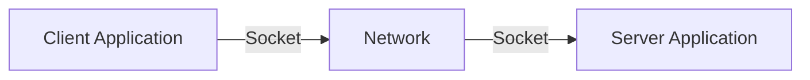
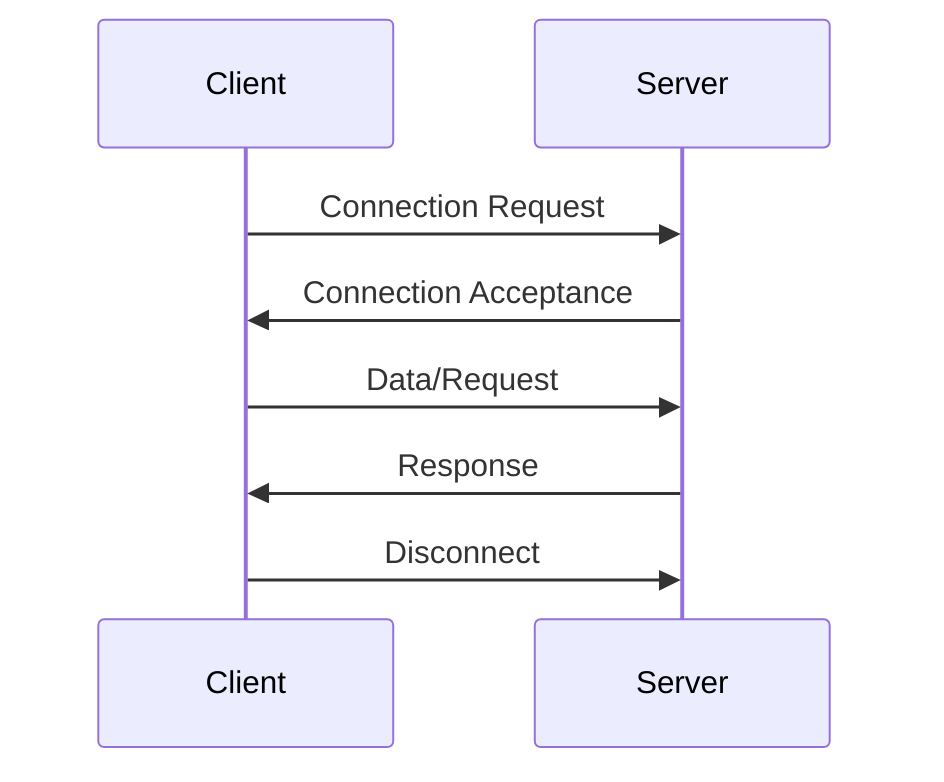

```
---
title: "Java Socket Programming"
description: "A comprehensive guide to understanding and implementing socket programming in Java, covering client-server communication, TCP/IP protocols, and practical networking applications."

---

# Java Socket Programming

## Introduction

Socket programming is a fundamental concept in network communication that allows applications to communicate with each other over a network. In Java, socket programming provides a powerful way to create networked applications ranging from simple client-server programs to complex distributed systems.

This tutorial will guide you through the basics of Java socket programming, demonstrating how applications can communicate over networks using Java's built-in networking capabilities. You'll learn how to create both clients and servers, understand the underlying TCP/IP protocols, and see practical examples of socket applications.

## Understanding Sockets

### What is a Socket?

A socket is an endpoint for communication between two machines. Think of it as a doorway through which data passes from one application to another across a network. In networking terms, a socket is defined by a combination of:

- IP address (identifies the machine)
- Port number (identifies the specific process/application)
- Protocol (defines how data is transmitted)



### Types of Sockets in Java

Java supports two main types of sockets:

1. **TCP Sockets**: Reliable, connection-oriented communication (uses `java.net.Socket` and `java.net.ServerSocket`)
2. **UDP Sockets**: Faster but unreliable, connectionless communication (uses `java.net.DatagramSocket`)

In this tutorial, we'll focus primarily on TCP sockets as they're the most commonly used for building reliable networked applications.

## Socket Programming Basics

### The Client-Server Architecture

Most networked applications follow a client-server model:

- **Server**: Waits for incoming connection requests, processes client requests, and sends responses
- **Client**: Initiates communication with the server, sends requests, and processes responses



### Java Classes for Socket Programming

Java provides several classes in the `java.net` package for socket programming:

- `Socket`: Represents a client socket (TCP)
- `ServerSocket`: Represents a server socket that listens for client connections (TCP)
- `InetAddress`: Represents an IP address
- `DatagramSocket` and `DatagramPacket`: Used for UDP communication

## Creating a Simple Client-Server Application

Let's create a simple echo server and client to demonstrate socket programming in action.

### 1. Creating a TCP Server

```java
import java.io.*;
import java.net.*;

public class SimpleServer {
    public static void main(String[] args) {
        try {
            // Create a server socket on port 5000
            ServerSocket serverSocket = new ServerSocket(5000);
            System.out.println("Server started. Listening on Port 5000...");
            
            // Wait for a client connection
            Socket clientSocket = serverSocket.accept();
            System.out.println("Client connected: " + clientSocket.getInetAddress().getHostAddress());
            
            // Set up input and output streams
            BufferedReader in = new BufferedReader(new InputStreamReader(clientSocket.getInputStream()));
            PrintWriter out = new PrintWriter(clientSocket.getOutputStream(), true);
            
            // Read message from client and echo it back
            String message = in.readLine();
            System.out.println("Message received from client: " + message);
            out.println("Echo from server: " + message);
            
            // Close resources
            in.close();
            out.close();
            clientSocket.close();
            serverSocket.close();
            System.out.println("Server stopped.");
            
        } catch (IOException e) {
            System.out.println("Server exception: " + e.getMessage());
        }
    }
}
```

### 2. Creating a TCP Client

```java
import java.io.*;
import java.net.*;

public class SimpleClient {
    public static void main(String[] args) {
        try {
            // Connect to the server at localhost on port 5000
            Socket socket = new Socket("localhost", 5000);
            
            // Set up input and output streams
            PrintWriter out = new PrintWriter(socket.getOutputStream(), true);
            BufferedReader in = new BufferedReader(new InputStreamReader(socket.getInputStream()));
            
            // Send a message to the server
            String message = "Hello from client!";
            out.println(message);
            System.out.println("Sent to server: " + message);
            
            // Read the server's response
            String response = in.readLine();
            System.out.println("Received from server: " + response);
            
            // Close resources
            out.close();
            in.close();
            socket.close();
            
        } catch (IOException e) {
            System.out.println("Client exception: " + e.getMessage());
        }
    }
}
```

### Execution and Output

Server output:
```
Server started. Listening on Port 5000...
Client connected: 127.0.0.1
Message received from client: Hello from client!
Server stopped.
```

Client output:
```
Sent to server: Hello from client!
Received from server: Echo from server: Hello from client!
```

## Building a Multi-Client Chat Server

Let's create a more advanced application: a chat server that can handle multiple clients simultaneously.

### Chat Server Implementation

```java
import java.io.*;
import java.net.*;
import java.util.*;

public class ChatServer {
    private static final int PORT = 5000;
    private static Set<PrintWriter> clientWriters = new HashSet<>();
    
    public static void main(String[] args) {
        System.out.println("Chat Server started on port " + PORT);
        
        try (ServerSocket serverSocket = new ServerSocket(PORT)) {
            while (true) {
                // Accept client connection
                Socket clientSocket = serverSocket.accept();
                System.out.println("New client connected: " + clientSocket.getInetAddress().getHostAddress());
                
                // Create a new thread to handle this client
                ClientHandler handler = new ClientHandler(clientSocket);
                new Thread(handler).start();
            }
        } catch (IOException e) {
            System.out.println("Server exception: " + e.getMessage());
        }
    }
    
    // Inner class to handle client connections
    private static class ClientHandler implements Runnable {
        private Socket socket;
        private PrintWriter out;
        private BufferedReader in;
        private String userName;
        
        public ClientHandler(Socket socket) {
            this.socket = socket;
        }
        
        @Override
        public void run() {
            try {
                // Set up input and output streams
                in = new BufferedReader(new InputStreamReader(socket.getInputStream()));
                out = new PrintWriter(socket.getOutputStream(), true);
                
                // Get the user's name
                userName = in.readLine();
                System.out.println(userName + " has joined the chat.");
                
                // Add this client's writer to the set
                synchronized (clientWriters) {
                    clientWriters.add(out);
                }
                
                // Broadcast user's arrival
                broadcast(userName + " has joined the chat.");
                
                // Process messages from this client
                String message;
                while ((message = in.readLine()) != null) {
                    if (message.equals("/quit")) {
                        break;
                    }
                    broadcast(userName + ": " + message);
                }
            } catch (IOException e) {
                System.out.println("Error handling client: " + e.getMessage());
            } finally {
                // Client disconnected - clean up
                try {
                    if (out != null) {
                        synchronized (clientWriters) {
                            clientWriters.remove(out);
                        }
                    }
                    if (userName != null) {
                        System.out.println(userName + " has left the chat.");
                        broadcast(userName + " has left the chat.");
                    }
                    if (socket != null) {
                        socket.close();
                    }
                } catch (IOException e) {
                    System.out.println("Error closing client connection: " + e.getMessage());
                }
            }
        }
        
        // Broadcast message to all clients
        private void broadcast(String message) {
            synchronized (clientWriters) {
                for (PrintWriter writer : clientWriters) {
                    writer.println(message);
                }
            }
        }
    }
}
```

### Chat Client Implementation

```java
import java.io.*;
import java.net.*;
import java.util.Scanner;

public class ChatClient {
    private static final String SERVER_ADDRESS = "localhost";
    private static final int SERVER_PORT = 5000;
    
    public static void main(String[] args) {
        Scanner scanner = new Scanner(System.in);
        
        try {
            // Connect to the server
            Socket socket = new Socket(SERVER_ADDRESS, SERVER_PORT);
            System.out.println("Connected to the chat server");
            
            // Set up input and output streams
            BufferedReader in = new BufferedReader(new InputStreamReader(socket.getInputStream()));
            PrintWriter out = new PrintWriter(socket.getOutputStream(), true);
            
            // Ask for the user's name
            System.out.print("Enter your name: ");
            String userName = scanner.nextLine();
            out.println(userName);
            
            // Start a thread to listen for server messages
            new Thread(new MessageReceiver(in)).start();
            
            // Main thread reads user input and sends to server
            String userInput;
            while (true) {
                userInput = scanner.nextLine();
                out.println(userInput);
                
                if (userInput.equals("/quit")) {
                    break;
                }
            }
            
            // Close resources
            socket.close();
            scanner.close();
            
        } catch (IOException e) {
            System.out.println("Client exception: " + e.getMessage());
        }
    }
    
    // Inner class to handle receiving messages from server
    private static class MessageReceiver implements Runnable {
        private BufferedReader in;
        
        public MessageReceiver(BufferedReader in) {
            this.in = in;
        }
        
        @Override
        public void run() {
            try {
                String message;
                while ((message = in.readLine()) != null) {
                    System.out.println(message);
                }
            } catch (IOException e) {
                System.out.println("Error receiving message: " + e.getMessage());
            }
        }
    }
}
```

This multi-client chat application demonstrates several advanced socket programming concepts:

1. Using threads to handle multiple clients concurrently
2. Maintaining a collection of client connections
3. Broadcasting messages to all connected clients
4. Handling client disconnection and cleanup

## Working with UDP Sockets

TCP isn't the only protocol for socket programming. UDP (User Datagram Protocol) provides a connectionless alternative that's faster but doesn't guarantee delivery or order of packets.

### UDP Server Example

```java
import java.io.*;
import java.net.*;

public class UDPServer {
    public static void main(String[] args) {
        try {
            // Create a UDP socket on port 9876
            DatagramSocket serverSocket = new DatagramSocket(9876);
            System.out.println("UDP Server started on port 9876");
            
            byte[] receiveBuffer = new byte[1024];
            
            while (true) {
                // Create a packet to receive data
                DatagramPacket receivePacket = new DatagramPacket(receiveBuffer, receiveBuffer.length);
                
                // Wait for incoming packet
                serverSocket.receive(receivePacket);
                
                // Process received data
                String message = new String(receivePacket.getData(), 0, receivePacket.getLength());
                System.out.println("RECEIVED: " + message);
                
                // Get client address and port
                InetAddress clientAddress = receivePacket.getAddress();
                int clientPort = receivePacket.getPort();
                
                // Prepare response
                String response = "Echo from server: " + message;
                byte[] sendBuffer = response.getBytes();
                
                // Send response to client
                DatagramPacket sendPacket = new DatagramPacket(
                    sendBuffer, sendBuffer.length, clientAddress, clientPort);
                serverSocket.send(sendPacket);
            }
            
        } catch (IOException e) {
            System.out.println("UDP Server exception: " + e.getMessage());
        }
    }
}
```

### UDP Client Example

```java
import java.io.*;
import java.net.*;

public class UDPClient {
    public static void main(String[] args) {
        try {
            // Create client socket
            DatagramSocket clientSocket = new DatagramSocket();
            
            // Get server address
            InetAddress serverAddress = InetAddress.getByName("localhost");
            int serverPort = 9876;
            
            // Prepare message
            String message = "Hello from UDP client!";
            byte[] sendBuffer = message.getBytes();
            
            // Create packet to send
            DatagramPacket sendPacket = new DatagramPacket(
                sendBuffer, sendBuffer.length, serverAddress, serverPort);
            
            // Send the packet
            clientSocket.send(sendPacket);
            System.out.println("Sent to server: " + message);
            
            // Prepare to receive response
            byte[] receiveBuffer = new byte[1024];
            DatagramPacket receivePacket = new DatagramPacket(
                receiveBuffer, receiveBuffer.length);
            
            // Wait for response
            clientSocket.receive(receivePacket);
            
            // Process response
            String response = new String(receivePacket.getData(), 0, receivePacket.getLength());
            System.out.println("Received from server: " + response);
            
            // Close the socket
            clientSocket.close();
            
        } catch (IOException e) {
            System.out.println("UDP Client exception: " + e.getMessage());
        }
    }
}
```

## Socket Options and Advanced Features

Java's socket API provides various options to customize socket behavior:

### Setting Socket Timeout

```java
// Set timeout to 5000 milliseconds (5 seconds)
socket.setSoTimeout(5000);
```

### Configuring Socket Buffer Sizes

```java
// Set send buffer size
socket.setSendBufferSize(8192);

// Set receive buffer size
socket.setReceiveBufferSize(8192);
```

### Keep-Alive and TCP No Delay

```java
// Enable TCP keep-alive
socket.setKeepAlive(true);

// Disable Nagle's algorithm for faster transmission
socket.setTcpNoDelay(true);
```

### Reusing Addresses

```java
// Allow reusing the same address
serverSocket.setReuseAddress(true);
```

## Best Practices for Socket Programming

1. **Always Close Resources**:
   ```java
   try (Socket socket = new Socket("localhost", 5000)) {
       // Use the socket
   } catch (IOException e) {
       e.printStackTrace();
   }
   ```

2. **Handle Exceptions Properly**: Network operations are prone to failures, so implement proper error handling.

3. **Use Timeouts**: Set appropriate timeouts to prevent your application from hanging indefinitely.

4. **Consider Using NIO**: For high-performance applications, consider Java's non-blocking I/O (NIO) package.

5. **Implement Proper Threading**: When handling multiple clients, use thread pools to manage resources efficiently.

6. **Secure Your Connections**: For sensitive data, use SSL/TLS with `SSLSocket` and `SSLServerSocket`.

## Real-World Application: Simple HTTP Server

Let's implement a basic HTTP server to demonstrate a practical use case of socket programming:

```java
import java.io.*;
import java.net.*;

public class SimpleHTTPServer {
    public static void main(String[] args) {
        try (ServerSocket serverSocket = new ServerSocket(8080)) {
            System.out.println("HTTP Server running on port 8080");
            
            while (true) {
                try (Socket clientSocket = serverSocket.accept()) {
                    // Handle HTTP request
                    handleRequest(clientSocket);
                } catch (IOException e) {
                    System.out.println("Error handling client: " + e.getMessage());
                }
            }
        } catch (IOException e) {
            System.out.println("Server error: " + e.getMessage());
        }
    }
    
    private static void handleRequest(Socket clientSocket) throws IOException {
        // Read the HTTP request
        BufferedReader in = new BufferedReader(new InputStreamReader(clientSocket.getInputStream()));
        
        // Parse the request line
        String requestLine = in.readLine();
        System.out.println("Request: " + requestLine);
        
        // Skip headers
        String line;
        while ((line = in.readLine()) != null && !line.isEmpty()) {
            System.out.println("Header: " + line);
        }
        
        // Send HTTP response
        PrintWriter out = new PrintWriter(clientSocket.getOutputStream(), true);
        
        // HTTP response headers
        out.println("HTTP/1.1 200 OK");
        out.println("Content-Type: text/html");
        out.println("Connection: close");
        out.println();  // Empty line between headers and body
        
        // HTTP response body
        out.println("<!DOCTYPE html>");
        out.println("<html>");
        out.println("<head><title>Simple HTTP Server</title></head>");
        out.println("<body>");
        out.println("<h1>Hello from Java HTTP Server!</h1>");
        out.println("<p>Your request was: " + requestLine + "</p>");
        out.println("</body>");
        out.println("</html>");
        
        // Close resources
        out.close();
        in.close();
    }
}
```

To test this server, open your web browser and navigate to `http://localhost:8080`. The server will respond with a simple HTML page.

## Summary

In this tutorial, you've learned:

- The fundamentals of socket programming in Java
- How to create TCP servers and clients
- Working with UDP for connectionless communication
- Building a multi-client chat application
- Implementing a basic HTTP server
- Best practices for Java socket programming

Socket programming is a powerful skill that enables you to create networked applications, from simple client-server programs to complex distributed systems. As you continue to develop your skills, you can build more sophisticated applications with features like secure connections, custom protocols, and advanced concurrency patterns.

## Exercises

1. **Basic Socket Exercise**: Modify the simple echo server to log all client connections and messages to a file.

2. **Chat Application Enhancement**: Add private messaging functionality to the chat server and client.

3. **File Transfer**: Create a client-server application that allows file uploads and downloads.

4. **HTTP Client**: Build a simple HTTP client that can send GET requests to web servers and display the responses.

5. **UDP Reliability**: Implement a basic acknowledgment system to make the UDP example more reliable.

## Additional Resources

- [Oracle Java Networking Tutorial](https://docs.oracle.com/javase/tutorial/networking/index.html)
- [Java Network Programming, 4th Edition](https://www.oreilly.com/library/view/java-network-programming/9781449365936/) by Elliotte Rusty Harold
- [TCP/IP Sockets in Java: Practical Guide for Programmers](https://www.elsevier.com/books/tcp-ip-sockets-in-java/calvert/978-0-12-374255-1) by Kenneth L. Calvert and Michael J. Donahoo
- [Java NIO documentation](https://docs.oracle.com/javase/8/docs/api/java/nio/package-summary.html) for advanced non-blocking socket programming
```