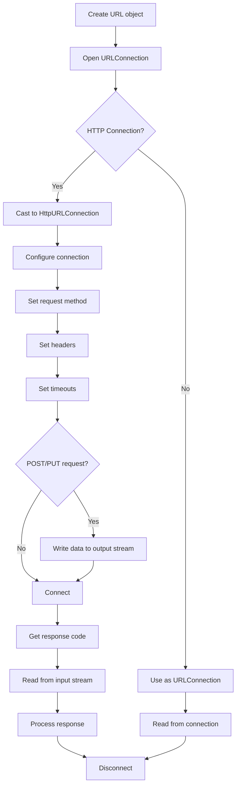

# Java URL Connection

When developing applications that interact with the web, understanding how to connect to URLs and handle HTTP communications is essential. Java provides robust APIs for working with URLs and establishing connections to web resources. This guide will introduce you to the `URL` and `URLConnection` classes in Java, which are fundamental for networking operations.

## Introduction to URL Connections

URL (Uniform Resource Locator) connections allow Java applications to communicate with web servers and other internet resources. This functionality is part of Java's networking capabilities, enabling you to:

- Retrieve web pages and API data
- Download files from the internet
- Submit forms and upload data
- Interact with web services

Java's URL connection functionality is primarily handled through two core classes:
- `java.net.URL`: Represents a resource on the web
- `java.net.URLConnection`: Manages the connection to that resource

## The URL Class

The `URL` class represents a Uniform Resource Locator, providing methods to access different parts of the URL and create connections.

### Creating URL Objects

Let's start by creating a URL object:

```java
import java.net.URL;
import java.net.MalformedURLException;

public class URLExample {
    public static void main(String[] args) {
        try {
            URL url = new URL("https://www.example.com/path/resource.html?param=value");
            
            // Accessing URL components
            System.out.println("Protocol: " + url.getProtocol());
            System.out.println("Host: " + url.getHost());
            System.out.println("Port: " + url.getPort());
            System.out.println("Default Port: " + url.getDefaultPort());
            System.out.println("Path: " + url.getPath());
            System.out.println("Query: " + url.getQuery());
            
        } catch (MalformedURLException e) {
            System.out.println("Invalid URL: " + e.getMessage());
        }
    }
}
```

**Output:**
```
Protocol: https
Host: www.example.com
Port: -1
Default Port: 443
Path: /path/resource.html
Query: param=value
```

## The URLConnection Class

`URLConnection` is an abstract class that represents a communication link between the application and a URL. It provides methods to interact with the URL resource.

### Basic URL Connection

Here's how to establish a basic connection and read content from a URL:

```java
import java.net.URL;
import java.net.URLConnection;
import java.io.BufferedReader;
import java.io.InputStreamReader;
import java.io.IOException;

public class URLConnectionExample {
    public static void main(String[] args) {
        try {
            // Create a URL object
            URL url = new URL("https://www.example.com");
            
            // Open a connection to the URL
            URLConnection connection = url.openConnection();
            
            // Read content from the URL
            try (BufferedReader reader = new BufferedReader(
                    new InputStreamReader(connection.getInputStream()))) {
                
                String line;
                while ((line = reader.readLine()) != null) {
                    System.out.println(line);
                }
            }
            
        } catch (IOException e) {
            System.out.println("Error: " + e.getMessage());
        }
    }
}
```

This code will print the HTML content of www.example.com.

## Working with HTTP Connections

For HTTP-specific operations, you can use `HttpURLConnection`, which extends `URLConnection` with HTTP-specific functionality.

```java
import java.net.URL;
import java.net.HttpURLConnection;
import java.io.BufferedReader;
import java.io.InputStreamReader;
import java.io.IOException;

public class HttpURLConnectionExample {
    public static void main(String[] args) {
        try {
            // Create a URL object
            URL url = new URL("https://www.example.com");
            
            // Cast the URLConnection to HttpURLConnection
            HttpURLConnection connection = (HttpURLConnection) url.openConnection();
            
            // Set request method
            connection.setRequestMethod("GET");
            
            // Get response code
            int responseCode = connection.getResponseCode();
            System.out.println("Response Code: " + responseCode);
            
            // Read the response
            if (responseCode == HttpURLConnection.HTTP_OK) {
                try (BufferedReader reader = new BufferedReader(
                        new InputStreamReader(connection.getInputStream()))) {
                    
                    String line;
                    StringBuilder response = new StringBuilder();
                    
                    while ((line = reader.readLine()) != null) {
                        response.append(line);
                        response.append("\n");
                    }
                    
                    System.out.println("Response Content: " + response.toString());
                }
            } else {
                System.out.println("Error response: " + responseCode);
            }
            
            // Disconnect after use
            connection.disconnect();
            
        } catch (IOException e) {
            System.out.println("Error: " + e.getMessage());
        }
    }
}
```

## Setting Request Headers

Often, you'll need to specify request headers when connecting to web resources:

```java
import java.net.URL;
import java.net.HttpURLConnection;
import java.io.IOException;

public class RequestHeadersExample {
    public static void main(String[] args) {
        try {
            URL url = new URL("https://api.example.com/data");
            HttpURLConnection connection = (HttpURLConnection) url.openConnection();
            
            // Set request method
            connection.setRequestMethod("GET");
            
            // Set request headers
            connection.setRequestProperty("User-Agent", "Mozilla/5.0");
            connection.setRequestProperty("Accept", "application/json");
            connection.setRequestProperty("Content-Type", "application/json");
            
            // Add authorization header (for APIs that need authentication)
            connection.setRequestProperty("Authorization", "Bearer YOUR_ACCESS_TOKEN");
            
            // Print request headers
            System.out.println("Request Method: " + connection.getRequestMethod());
            System.out.println("User-Agent: " + connection.getRequestProperty("User-Agent"));
            System.out.println("Accept: " + connection.getRequestProperty("Accept"));
            
            // Check for response
            int responseCode = connection.getResponseCode();
            System.out.println("Response Code: " + responseCode);
            
            // Always disconnect
            connection.disconnect();
            
        } catch (IOException e) {
            e.printStackTrace();
        }
    }
}
```

## Handling Timeouts

Setting connection and read timeouts is crucial for handling cases where a server might be slow or unresponsive:

```java
import java.net.URL;
import java.net.HttpURLConnection;
import java.io.IOException;

public class TimeoutExample {
    public static void main(String[] args) {
        try {
            URL url = new URL("https://www.example.com");
            HttpURLConnection connection = (HttpURLConnection) url.openConnection();
            
            // Set connection timeout (in milliseconds)
            connection.setConnectTimeout(5000); // 5 seconds
            
            // Set read timeout (in milliseconds)
            connection.setReadTimeout(10000); // 10 seconds
            
            System.out.println("Connection established!");
            
            // Always disconnect
            connection.disconnect();
            
        } catch (IOException e) {
            if (e instanceof java.net.SocketTimeoutException) {
                System.out.println("Connection timed out!");
            } else {
                System.out.println("Error: " + e.getMessage());
            }
        }
    }
}
```

## Making a POST Request

Sending data to a server with a POST request is a common operation:

```java
import java.net.URL;
import java.net.HttpURLConnection;
import java.io.OutputStream;
import java.io.BufferedReader;
import java.io.InputStreamReader;
import java.nio.charset.StandardCharsets;
import java.io.IOException;

public class PostRequestExample {
    public static void main(String[] args) {
        try {
            URL url = new URL("https://postman-echo.com/post");
            HttpURLConnection connection = (HttpURLConnection) url.openConnection();
            
            // Set request method
            connection.setRequestMethod("POST");
            
            // Enable output for POST data
            connection.setDoOutput(true);
            
            // Set headers
            connection.setRequestProperty("Content-Type", "application/json");
            
            // Prepare data
            String jsonData = "{\"name\":\"John Doe\",\"email\":\"john@example.com\"}";
            byte[] postData = jsonData.getBytes(StandardCharsets.UTF_8);
            
            // Set content length
            connection.setRequestProperty("Content-Length", String.valueOf(postData.length));
            
            // Write data to connection output stream
            try (OutputStream os = connection.getOutputStream()) {
                os.write(postData);
                os.flush();
            }
            
            // Get response code
            int responseCode = connection.getResponseCode();
            System.out.println("Response Code: " + responseCode);
            
            // Read response
            try (BufferedReader reader = new BufferedReader(
                    new InputStreamReader(connection.getInputStream()))) {
                
                String line;
                StringBuilder response = new StringBuilder();
                
                while ((line = reader.readLine()) != null) {
                    response.append(line);
                }
                
                System.out.println("Response: " + response.toString());
            }
            
            // Disconnect
            connection.disconnect();
            
        } catch (IOException e) {
            e.printStackTrace();
        }
    }
}
```

## Working with Cookies

Cookies are important for maintaining session state. Here's how to handle cookies with `HttpURLConnection`:

```java
import java.net.URL;
import java.net.HttpURLConnection;
import java.net.CookieManager;
import java.net.CookieHandler;
import java.net.HttpCookie;
import java.io.BufferedReader;
import java.io.InputStreamReader;
import java.util.List;
import java.io.IOException;

public class CookieHandlingExample {
    public static void main(String[] args) {
        try {
            // Set up cookie manager
            CookieManager cookieManager = new CookieManager();
            CookieHandler.setDefault(cookieManager);
            
            // First request to get cookies
            URL url1 = new URL("https://www.example.com");
            HttpURLConnection connection1 = (HttpURLConnection) url1.openConnection();
            connection1.connect();
            
            // Read response to ensure connection is complete
            try (BufferedReader reader = new BufferedReader(
                    new InputStreamReader(connection1.getInputStream()))) {
                reader.lines().count(); // Just read and discard
            }
            
            // Print the cookies received
            System.out.println("Cookies received:");
            cookieManager.getCookieStore().getCookies().forEach(
                cookie -> System.out.println(cookie.getName() + " = " + cookie.getValue())
            );
            
            // Make another request with cookies automatically included
            URL url2 = new URL("https://www.example.com/another-page");
            HttpURLConnection connection2 = (HttpURLConnection) url2.openConnection();
            
            // The cookie manager will automatically include the cookies
            
            connection1.disconnect();
            connection2.disconnect();
            
        } catch (IOException e) {
            e.printStackTrace();
        }
    }
}
```

## Handling Redirects

By default, Java's `HttpURLConnection` doesn't automatically follow redirects. Here's how to enable this behavior:

```java
import java.net.URL;
import java.net.HttpURLConnection;
import java.io.BufferedReader;
import java.io.InputStreamReader;
import java.io.IOException;

public class RedirectHandlingExample {
    public static void main(String[] args) {
        try {
            // This URL might redirect
            URL url = new URL("http://bit.ly/shortened-url");
            HttpURLConnection connection = (HttpURLConnection) url.openConnection();
            
            // Enable following redirects
            connection.setInstanceFollowRedirects(true);
            
            // You can also set this globally
            // HttpURLConnection.setFollowRedirects(true);
            
            // Connect and get the final URL after redirect
            connection.connect();
            URL finalUrl = connection.getURL();
            
            System.out.println("Original URL: " + url);
            System.out.println("Final URL: " + finalUrl);
            
            connection.disconnect();
            
        } catch (IOException e) {
            e.printStackTrace();
        }
    }
}
```

## Real-World Example: Fetching Weather Data

Let's combine what we've learned to fetch weather data from a public API:

```java
import java.net.URL;
import java.net.HttpURLConnection;
import java.io.BufferedReader;
import java.io.InputStreamReader;
import java.io.IOException;

public class WeatherApiExample {
    public static void main(String[] args) {
        String apiKey = "YOUR_API_KEY"; // Replace with your actual API key
        String city = "London";
        
        try {
            // Create URL with query parameters
            URL url = new URL("https://api.openweathermap.org/data/2.5/weather?q=" + 
                             city + "&units=metric&appid=" + apiKey);
            
            // Open connection
            HttpURLConnection connection = (HttpURLConnection) url.openConnection();
            connection.setRequestMethod("GET");
            
            // Set timeouts
            connection.setConnectTimeout(5000);
            connection.setReadTimeout(5000);
            
            // Get response code
            int responseCode = connection.getResponseCode();
            
            if (responseCode == HttpURLConnection.HTTP_OK) {
                // Read and process the response
                try (BufferedReader reader = new BufferedReader(
                        new InputStreamReader(connection.getInputStream()))) {
                    
                    String line;
                    StringBuilder response = new StringBuilder();
                    
                    while ((line = reader.readLine()) != null) {
                        response.append(line);
                    }
                    
                    // Simple processing of the JSON response
                    String jsonResponse = response.toString();
                    System.out.println("Weather data for " + city + ":");
                    System.out.println(jsonResponse);
                    
                    // In a real application, you'd use a JSON parser here
                    // to extract and display specific weather information
                }
            } else {
                System.out.println("Error fetching weather data. Response code: " + responseCode);
                
                // Read error stream if available
                try (BufferedReader errorReader = new BufferedReader(
                        new InputStreamReader(connection.getErrorStream()))) {
                    
                    String line;
                    StringBuilder errorResponse = new StringBuilder();
                    
                    while ((line = errorReader.readLine()) != null) {
                        errorResponse.append(line);
                    }
                    
                    System.out.println("Error details: " + errorResponse.toString());
                }
            }
            
            // Disconnect
            connection.disconnect();
            
        } catch (IOException e) {
            System.out.println("Error connecting to weather API: " + e.getMessage());
            e.printStackTrace();
        }
    }
}
```

## Understanding URL Connection Flow

Here's a diagram showing the general flow of using URL connections:



## Best Practices for URL Connections

When working with URL connections in Java, keep these best practices in mind:

1. **Always close connections**: Use `disconnect()` to free system resources
2. **Set timeouts**: Prevent your application from hanging if a server is unresponsive
3. **Handle exceptions properly**: Network operations can fail for many reasons
4. **Check response codes**: Always verify that the server returned the expected response
5. **Use try-with-resources**: Ensure input and output streams are properly closed
6. **Consider using higher-level libraries**: For more complex HTTP operations, consider libraries like Apache HttpClient, OkHttp, or Java 11's HttpClient

## Modern Alternatives

While `URL` and `URLConnection` are fundamentals, Java offers more modern alternatives:

1. **Java 11's HttpClient**: A modern HTTP client that supports HTTP/2 and WebSocket
2. **Third-party libraries**:
   - Apache HttpClient
   - OkHttp
   - Retrofit (for REST APIs)

These alternatives often provide more features and a more developer-friendly API.

## Summary

Java's URL Connection capabilities provide powerful tools for interacting with web resources. In this guide, we've explored:

- Creating and using URL objects
- Opening basic URL connections
- Working with HTTP-specific functions via HttpURLConnection
- Setting request headers and handling response codes
- Managing timeouts and redirects
- Sending data with POST requests
- Handling cookies
- A real-world example of fetching weather data

With these foundations, you're well-equipped to build applications that communicate with web services, download resources, or interact with APIs across the internet.

## Additional Resources

- [Java Documentation: URL Class](https://docs.oracle.com/en/java/javase/11/docs/api/java.base/java/net/URL.html)
- [Java Documentation: URLConnection Class](https://docs.oracle.com/en/java/javase/11/docs/api/java.base/java/net/URLConnection.html)
- [Java Documentation: HttpURLConnection Class](https://docs.oracle.com/en/java/javase/11/docs/api/java.base/java/net/HttpURLConnection.html)
- [Oracle Tutorial: Working with URLs](https://docs.oracle.com/javase/tutorial/networking/urls/index.html)

## Exercises

1. Create a simple program that downloads and saves an image from a URL to your local file system.
2. Modify the weather API example to display formatted weather information (temperature, conditions, etc.).
3. Create a program that sends form data to a server using POST and processes the response.
4. Implement a simple web scraper that connects to a website and extracts all the links from the HTML.
5. Build a program that checks the HTTP status code of multiple websites and reports if any are down.