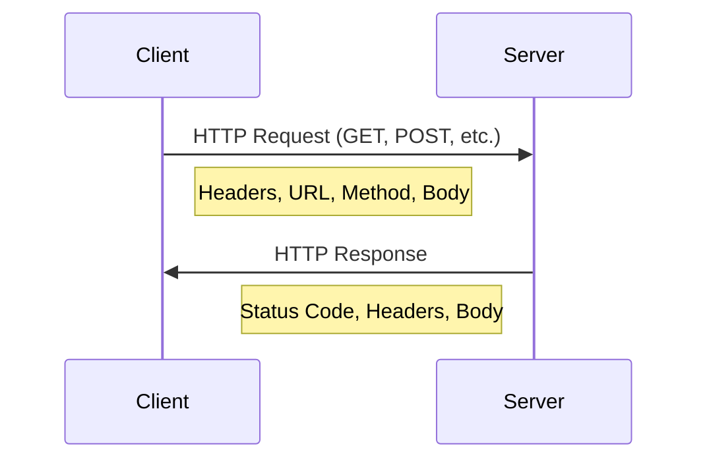

# Java HTTP Client

## Introduction

In today's interconnected world, applications frequently need to communicate with web services, APIs, and other resources over the internet. The HTTP protocol is the foundation of data exchange on the web, and Java provides several ways to make HTTP requests.

This guide focuses on the Java HTTP Client API introduced in Java 11, which provides a modern and efficient way to send HTTP requests and process responses. We'll also cover other alternatives like the traditional HttpURLConnection and popular third-party libraries.

## Understanding HTTP Basics

Before diving into the Java implementations, let's briefly understand what happens during an HTTP request:



HTTP requests contain:
- A method (GET, POST, PUT, DELETE, etc.)
- A URL
- Headers (metadata about the request)
- Optionally, a body (for methods like POST and PUT)

HTTP responses contain:
- A status code (200 OK, 404 Not Found, etc.)
- Headers
- Usually a body containing the requested data

## Java HTTP Client (Java 11+)

Java 11 introduced a new HTTP client API in the `java.net.http` package, designed to replace the older HttpURLConnection API. This modern API supports HTTP/1.1 and HTTP/2, provides both synchronous and asynchronous programming models, and offers better performance.

### Basic HTTP GET Request

Let's start with a simple GET request:

```java
import java.net.URI;
import java.net.http.HttpClient;
import java.net.http.HttpRequest;
import java.net.http.HttpResponse;
import java.net.http.HttpResponse.BodyHandlers;

public class BasicHttpClientExample {
    public static void main(String[] args) throws Exception {
        // Create a new HttpClient
        HttpClient client = HttpClient.newHttpClient();
        
        // Build a request
        HttpRequest request = HttpRequest.newBuilder()
                .uri(URI.create("https://jsonplaceholder.typicode.com/posts/1"))
                .build();
        
        // Send the request and get the response
        HttpResponse<String> response = client.send(request, BodyHandlers.ofString());
        
        // Print the response status code and body
        System.out.println("Status code: " + response.statusCode());
        System.out.println("Response body: " + response.body());
    }
}
```

**Output:**
```
Status code: 200
Response body: {
  "userId": 1,
  "id": 1,
  "title": "sunt aut facere repellat provident occaecati excepturi optio reprehenderit",
  "body": "quia et suscipit\nsuscipit recusandae consequuntur expedita et cum\nreprehenderit molestiae ut ut quas totam\nnostrum rerum est autem sunt rem eveniet architecto"
}
```

### Making a POST Request

Here's how to make a POST request with a JSON body:

```java
import java.net.URI;
import java.net.http.HttpClient;
import java.net.http.HttpRequest;
import java.net.http.HttpResponse;
import java.net.http.HttpResponse.BodyHandlers;

public class HttpPostExample {
    public static void main(String[] args) throws Exception {
        // Prepare the request body
        String jsonBody = """
                {
                    "title": "foo",
                    "body": "bar",
                    "userId": 1
                }""";
        
        // Create a new HttpClient
        HttpClient client = HttpClient.newHttpClient();
        
        // Build the request
        HttpRequest request = HttpRequest.newBuilder()
                .uri(URI.create("https://jsonplaceholder.typicode.com/posts"))
                .header("Content-Type", "application/json")
                .POST(HttpRequest.BodyPublishers.ofString(jsonBody))
                .build();
        
        // Send the request
        HttpResponse<String> response = client.send(request, BodyHandlers.ofString());
        
        // Print the response
        System.out.println("Status code: " + response.statusCode());
        System.out.println("Response body: " + response.body());
    }
}
```

**Output:**
```
Status code: 201
Response body: {
  "title": "foo",
  "body": "bar",
  "userId": 1,
  "id": 101
}
```

### Asynchronous Requests

One of the advantages of the new HTTP Client is its support for asynchronous requests, which allow your application to continue running while waiting for the response:

```java
import java.net.URI;
import java.net.http.HttpClient;
import java.net.http.HttpRequest;
import java.net.http.HttpResponse;
import java.net.http.HttpResponse.BodyHandlers;
import java.util.concurrent.CompletableFuture;

public class AsyncHttpRequestExample {
    public static void main(String[] args) throws Exception {
        // Create an HttpClient
        HttpClient client = HttpClient.newHttpClient();
        
        // Build the request
        HttpRequest request = HttpRequest.newBuilder()
                .uri(URI.create("https://jsonplaceholder.typicode.com/posts/1"))
                .build();
        
        // Send the request asynchronously
        CompletableFuture<HttpResponse<String>> futureResponse = 
                client.sendAsync(request, BodyHandlers.ofString());
        
        System.out.println("Request sent asynchronously...");
        
        // Do other work while waiting for the response
        System.out.println("Doing other work...");
        Thread.sleep(100);  // Simulating other work
        
        // Get the response when it's ready
        HttpResponse<String> response = futureResponse.join();
        
        // Process the response
        System.out.println("Status code: " + response.statusCode());
        System.out.println("Response body: " + response.body());
    }
}
```

**Output:**
```
Request sent asynchronously...
Doing other work...
Status code: 200
Response body: {
  "userId": 1,
  "id": 1,
  "title": "sunt aut facere repellat provident occaecati excepturi optio reprehenderit",
  "body": "quia et suscipit\nsuscipit recusandae consequuntur expedita et cum\nreprehenderit molestiae ut ut quas totam\nnostrum rerum est autem sunt rem eveniet architecto"
}
```

### Customizing the HTTP Client

The HTTP Client can be customized for different use cases:

```java
import java.net.URI;
import java.net.http.HttpClient;
import java.net.http.HttpRequest;
import java.net.http.HttpResponse;
import java.net.http.HttpResponse.BodyHandlers;
import java.time.Duration;

public class CustomizedHttpClientExample {
    public static void main(String[] args) throws Exception {
        // Create a custom HttpClient
        HttpClient client = HttpClient.newBuilder()
                .version(HttpClient.Version.HTTP_2)  // Use HTTP/2
                .followRedirects(HttpClient.Redirect.NORMAL)  // Follow redirects
                .connectTimeout(Duration.ofSeconds(10))  // Set timeout
                .build();
        
        HttpRequest request = HttpRequest.newBuilder()
                .uri(URI.create("https://httpbin.org/get"))
                .timeout(Duration.ofSeconds(5))  // Request-specific timeout
                .header("User-Agent", "Java HTTP Client")  // Custom header
                .GET()
                .build();
        
        HttpResponse<String> response = client.send(request, BodyHandlers.ofString());
        
        System.out.println("Status code: " + response.statusCode());
        System.out.println("Response body: " + response.body());
    }
}
```

## Handling Different Response Types

The HTTP Client can handle different types of responses using different `BodyHandlers`:

### String Body

We've already seen the `ofString()` body handler which converts the response body to a String:

```java
HttpResponse<String> response = client.send(request, BodyHandlers.ofString());
String body = response.body();  // The body as a String
```

### Binary Data (Byte Array)

For binary data like images:

```java
import java.net.URI;
import java.net.http.HttpClient;
import java.net.http.HttpRequest;
import java.net.http.HttpResponse;
import java.net.http.HttpResponse.BodyHandlers;
import java.nio.file.Files;
import java.nio.file.Path;
import java.nio.file.StandardOpenOption;

public class BinaryResponseExample {
    public static void main(String[] args) throws Exception {
        HttpClient client = HttpClient.newHttpClient();
        
        HttpRequest request = HttpRequest.newBuilder()
                .uri(URI.create("https://httpbin.org/image/png"))
                .build();
        
        // Receive response as byte array
        HttpResponse<byte[]> response = client.send(request, BodyHandlers.ofByteArray());
        
        // Save the image to a file
        Files.write(
            Path.of("downloaded_image.png"), 
            response.body(), 
            StandardOpenOption.CREATE, 
            StandardOpenOption.WRITE
        );
        
        System.out.println("Image downloaded successfully with status: " + response.statusCode());
    }
}
```

### Streaming the Response

For large responses, you might want to stream the data:

```java
import java.net.URI;
import java.net.http.HttpClient;
import java.net.http.HttpRequest;
import java.net.http.HttpResponse;
import java.net.http.HttpResponse.BodyHandlers;
import java.io.InputStream;

public class StreamResponseExample {
    public static void main(String[] args) throws Exception {
        HttpClient client = HttpClient.newHttpClient();
        
        HttpRequest request = HttpRequest.newBuilder()
                .uri(URI.create("https://jsonplaceholder.typicode.com/photos"))
                .build();
        
        // Get the response as an InputStream
        HttpResponse<InputStream> response = client.send(request, BodyHandlers.ofInputStream());
        
        // Process the stream
        try (InputStream is = response.body()) {
            // Read the first 100 bytes as an example
            byte[] buffer = new byte[100];
            int bytesRead = is.read(buffer);
            
            System.out.println("Status code: " + response.statusCode());
            System.out.println("First " + bytesRead + " bytes of response:");
            System.out.println(new String(buffer, 0, bytesRead));
            System.out.println("..."); // Indicates there's more data
        }
    }
}
```

## Real-World Example: Weather API Client

Let's create a more practical example by building a weather API client using the Java HTTP Client:

```java
import java.net.URI;
import java.net.URLEncoder;
import java.net.http.HttpClient;
import java.net.http.HttpRequest;
import java.net.http.HttpResponse;
import java.net.http.HttpResponse.BodyHandlers;
import java.nio.charset.StandardCharsets;
import java.util.Scanner;

public class WeatherApiClient {
    private static final String API_KEY = "your_api_key_here"; // Replace with your actual API key
    private static final String API_URL = "https://api.openweathermap.org/data/2.5/weather";
    
    public static void main(String[] args) throws Exception {
        Scanner scanner = new Scanner(System.in);
        System.out.print("Enter city name: ");
        String city = scanner.nextLine();
        scanner.close();
        
        // URL encode the city name
        String encodedCity = URLEncoder.encode(city, StandardCharsets.UTF_8);
        
        // Build the API URL with query parameters
        String requestUrl = API_URL + "?q=" + encodedCity + "&units=metric&appid=" + API_KEY;
        
        HttpClient client = HttpClient.newHttpClient();
        
        HttpRequest request = HttpRequest.newBuilder()
                .uri(URI.create(requestUrl))
                .GET()
                .build();
        
        HttpResponse<String> response = client.send(request, BodyHandlers.ofString());
        
        if (response.statusCode() == 200) {
            // Basic parsing of the JSON response to extract relevant info
            // In a real application, you would use a proper JSON library
            String json = response.body();
            String temp = json.replaceAll(".*\"temp\":(\\d+\\.\\d+).*", "$1");
            String description = json.replaceAll(".*\"description\":\"([^\"]*)\".*", "$1");
            
            System.out.println("Weather in " + city + ":");
            System.out.println("Temperature: " + temp + "°C");
            System.out.println("Description: " + description);
        } else {
            System.out.println("Error: " + response.statusCode());
            System.out.println(response.body());
        }
    }
}
```

**Example Output:**
```
Enter city name: London
Weather in London:
Temperature: 15.2°C
Description: scattered clouds
```

## Alternative HTTP Clients in Java

### HttpURLConnection (Legacy)

Before Java 11, `HttpURLConnection` was the primary way to make HTTP requests in Java:

```java
import java.io.BufferedReader;
import java.io.InputStreamReader;
import java.net.HttpURLConnection;
import java.net.URL;

public class HttpURLConnectionExample {
    public static void main(String[] args) throws Exception {
        // Create URL object
        URL url = new URL("https://jsonplaceholder.typicode.com/posts/1");
        
        // Open connection
        HttpURLConnection connection = (HttpURLConnection) url.openConnection();
        
        // Set request method
        connection.setRequestMethod("GET");
        
        // Get response code
        int responseCode = connection.getResponseCode();
        System.out.println("Response Code: " + responseCode);
        
        // Read the response
        BufferedReader reader = new BufferedReader(
                new InputStreamReader(connection.getInputStream()));
        String line;
        StringBuilder response = new StringBuilder();
        
        while ((line = reader.readLine()) != null) {
            response.append(line);
        }
        reader.close();
        
        // Print the response
        System.out.println("Response: " + response.toString());
        
        // Disconnect
        connection.disconnect();
    }
}
```

### Popular Third-Party Libraries

While the built-in HTTP client is sufficient for many use cases, there are popular third-party libraries that offer additional features:

#### Apache HttpClient

```java
// Maven dependency:
// <dependency>
//     <groupId>org.apache.httpcomponents</groupId>
//     <artifactId>httpclient</artifactId>
//     <version>4.5.13</version>
// </dependency>

import org.apache.http.HttpEntity;
import org.apache.http.client.methods.CloseableHttpResponse;
import org.apache.http.client.methods.HttpGet;
import org.apache.http.impl.client.CloseableHttpClient;
import org.apache.http.impl.client.HttpClients;
import org.apache.http.util.EntityUtils;

public class ApacheHttpClientExample {
    public static void main(String[] args) throws Exception {
        // Create an HttpClient instance
        try (CloseableHttpClient httpClient = HttpClients.createDefault()) {
            // Create an HttpGet request
            HttpGet request = new HttpGet("https://jsonplaceholder.typicode.com/posts/1");
            
            // Execute the request
            try (CloseableHttpResponse response = httpClient.execute(request)) {
                // Get the response entity
                HttpEntity entity = response.getEntity();
                
                // Print the response status and body
                System.out.println("Status: " + response.getStatusLine());
                if (entity != null) {
                    String result = EntityUtils.toString(entity);
                    System.out.println("Response body: " + result);
                }
            }
        }
    }
}
```

#### OkHttp

```java
// Maven dependency:
// <dependency>
//     <groupId>com.squareup.okhttp3</groupId>
//     <artifactId>okhttp</artifactId>
//     <version>4.9.1</version>
// </dependency>

import okhttp3.OkHttpClient;
import okhttp3.Request;
import okhttp3.Response;

public class OkHttpExample {
    public static void main(String[] args) throws Exception {
        // Create an OkHttpClient instance
        OkHttpClient client = new OkHttpClient();
        
        // Create a request
        Request request = new Request.Builder()
                .url("https://jsonplaceholder.typicode.com/posts/1")
                .build();
        
        // Execute the request
        try (Response response = client.newCall(request).execute()) {
            // Print the response code and body
            System.out.println("Response code: " + response.code());
            if (response.body() != null) {
                System.out.println("Response body: " + response.body().string());
            }
        }
    }
}
```

## Best Practices for HTTP Clients

When working with HTTP clients in Java, keep these best practices in mind:

1. **Handle resources properly**: Always close resources like InputStreams and Connections to prevent memory leaks.

2. **Set appropriate timeouts**: Configure timeouts to avoid hanging requests.

3. **Handle errors**: Always handle exceptions and error status codes appropriately.

4. **Use connection pooling** for multiple requests to the same host.

5. **Consider using asynchronous requests** for better performance in UI applications.

6. **Respect API rate limits** when making multiple requests to external services.

7. **Include proper headers** like User-Agent and Content-Type.

8. **Parse JSON responses** with a proper library like Jackson or Gson.

## Summary

In this guide, we explored various ways to make HTTP requests in Java, with a primary focus on the modern HTTP Client API introduced in Java 11:

- The Java 11 HTTP Client provides a modern, feature-rich API for HTTP requests
- It supports both synchronous and asynchronous requests
- Different response handlers let you process various types of data
- Legacy and third-party alternatives offer different features and compatibility options

With these tools, you can connect your Java applications to web services, APIs, and other HTTP-based resources, enabling them to interact with the broader internet ecosystem.

## Exercises

1. Write a program that fetches data from multiple endpoints asynchronously and combines the results.
2. Create a simple REST client for a public API like GitHub or Twitter.
3. Implement a file download program that shows download progress.
4. Build a simple web scraper that extracts information from an HTML page.
5. Extend the weather API example to include a 5-day forecast and handle API errors gracefully.

## Additional Resources

- [Java 11 HTTP Client API Documentation](https://docs.oracle.com/en/java/javase/11/docs/api/java.net.http/java/net/http/HttpClient.html)
- [MDN Web Docs: HTTP](https://developer.mozilla.org/en-US/docs/Web/HTTP)
- [RESTful API Design Best Practices](https://restfulapi.net/)
- [Jackson JSON Processor](https://github.com/FasterXML/jackson)
- [Gson User Guide](https://github.com/google/gson/blob/master/UserGuide.md)