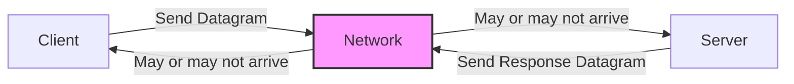

# Java Datagram Socket

## Introduction

In networking applications, there are two primary protocols for sending data: TCP (Transmission Control Protocol) and UDP (User Datagram Protocol). While TCP provides reliable, connection-oriented communication, UDP offers a lighter-weight, connectionless alternative that's perfect for scenarios where speed is more important than guaranteed delivery.

Java's `DatagramSocket` class is the implementation that allows you to send and receive data packets over a network using UDP. Unlike TCP sockets that establish a dedicated connection between sender and receiver, datagram sockets send individual, independent packets of data (called datagrams) without establishing a connection first.

In this tutorial, we'll explore:
- How UDP and datagram sockets work
- Creating datagram sockets in Java
- Sending and receiving datagram packets
- Practical applications and use cases
- Best practices and limitations

## Understanding UDP and Datagram Sockets

Before diving into the code, let's understand the key characteristics of UDP and how datagram sockets work:

### UDP Characteristics

- **Connectionless**: No need to establish a connection before sending data
- **Unreliable**: No guarantee that packets will arrive in order, or arrive at all
- **Low overhead**: Less network traffic compared to TCP
- **Fast**: Great for real-time applications where speed matters more than reliability



### When to Use Datagram Sockets

Datagram sockets are ideal for:
- Real-time applications like games or video streaming
- Simple request-response systems where occasional packet loss is acceptable
- Broadcasting to multiple recipients
- Applications where low latency is critical

## Creating and Using Datagram Sockets in Java

Let's start with the basics: how to create a datagram socket and use it to send and receive data.

### Key Classes

Java provides three main classes for UDP communication:

1. **`DatagramSocket`**: The socket used for sending and receiving datagrams
2. **`DatagramPacket`**: Represents the data packets being sent or received
3. **`InetAddress`**: Represents an IP address

### Creating a Simple UDP Server

Let's create a simple UDP server that listens for incoming messages:

```java
import java.net.*;

public class UDPServer {
    public static void main(String[] args) {
        try {
            // Create a socket to listen on port 9876
            DatagramSocket serverSocket = new DatagramSocket(9876);
            System.out.println("Server started on port 9876");
            
            byte[] receiveData = new byte[1024];
            
            while (true) {
                // Create a packet to receive data
                DatagramPacket receivePacket = new DatagramPacket(receiveData, receiveData.length);
                
                // Receive data from client
                serverSocket.receive(receivePacket);
                
                // Process the received data
                String sentence = new String(receivePacket.getData(), 0, receivePacket.getLength());
                System.out.println("RECEIVED: " + sentence);
                
                // Get client's address and port
                InetAddress clientAddress = receivePacket.getAddress();
                int clientPort = receivePacket.getPort();
                
                // Prepare response
                String capitalizedSentence = sentence.toUpperCase();
                byte[] sendData = capitalizedSentence.getBytes();
                
                // Create packet to send response
                DatagramPacket sendPacket = new DatagramPacket(
                    sendData, 
                    sendData.length, 
                    clientAddress, 
                    clientPort
                );
                
                // Send the response
                serverSocket.send(sendPacket);
            }
        } catch (Exception e) {
            e.printStackTrace();
        }
    }
}
```

### Creating a Simple UDP Client

Now let's create a client that sends messages to our UDP server:

```java
import java.net.*;
import java.util.Scanner;

public class UDPClient {
    public static void main(String[] args) {
        try {
            // Create a socket (no specific port needed for client)
            DatagramSocket clientSocket = new DatagramSocket();
            
            // Get the server's IP address
            InetAddress serverAddress = InetAddress.getByName("localhost");
            
            // Create a scanner for user input
            Scanner scanner = new Scanner(System.in);
            
            while (true) {
                System.out.print("Enter a message (or 'exit' to quit): ");
                String message = scanner.nextLine();
                
                if ("exit".equalsIgnoreCase(message)) {
                    break;
                }
                
                // Convert the message to bytes
                byte[] sendData = message.getBytes();
                
                // Create the packet to send
                DatagramPacket sendPacket = new DatagramPacket(
                    sendData, 
                    sendData.length, 
                    serverAddress, 
                    9876  // Must match server's port
                );
                
                // Send the packet
                clientSocket.send(sendPacket);
                
                // Prepare to receive the response
                byte[] receiveData = new byte[1024];
                DatagramPacket receivePacket = new DatagramPacket(receiveData, receiveData.length);
                
                // Receive the server's response
                clientSocket.receive(receivePacket);
                
                // Process the response
                String response = new String(receivePacket.getData(), 0, receivePacket.getLength());
                System.out.println("FROM SERVER: " + response);
            }
            
            // Close resources
            scanner.close();
            clientSocket.close();
            
        } catch (Exception e) {
            e.printStackTrace();
        }
    }
}
```

### Example Output

When you run these programs:

1. First, start the server: `java UDPServer`
2. Then, run the client: `java UDPClient`

The client will prompt for input:

```
Enter a message (or 'exit' to quit): hello world
FROM SERVER: HELLO WORLD
Enter a message (or 'exit' to quit): java datagram sockets are fun
FROM SERVER: JAVA DATAGRAM SOCKETS ARE FUN
Enter a message (or 'exit' to quit): exit
```

Meanwhile, the server shows:

```
Server started on port 9876
RECEIVED: hello world
RECEIVED: java datagram sockets are fun
```

## Advanced Features of DatagramSocket

### Setting Timeout

You can set a timeout to make the `receive()` method non-blocking:

```java
// Set timeout to 5000 milliseconds (5 seconds)
serverSocket.setSoTimeout(5000);

try {
    // This will now throw a SocketTimeoutException if no data arrives within 5 seconds
    serverSocket.receive(receivePacket);
} catch (SocketTimeoutException e) {
    System.out.println("Timeout reached, no data received.");
}
```

### Broadcasting

UDP allows you to send messages to all devices on a network:

```java
// Create a socket that can broadcast
DatagramSocket socket = new DatagramSocket();
socket.setBroadcast(true);

// Use broadcast address
InetAddress broadcastAddress = InetAddress.getByName("255.255.255.255");
byte[] data = "Hello everyone!".getBytes();

DatagramPacket packet = new DatagramPacket(data, data.length, broadcastAddress, 9876);
socket.send(packet);
```

### Buffer Size

You can adjust the buffer sizes for better performance:

```java
DatagramSocket socket = new DatagramSocket();

// Set send buffer size
socket.setSendBufferSize(65535);

// Set receive buffer size
socket.setReceiveBufferSize(65535);

// Verify settings
System.out.println("Send buffer size: " + socket.getSendBufferSize());
System.out.println("Receive buffer size: " + socket.getReceiveBufferSize());
```

## Practical Application: Simple Chat System

Let's create a more practical application: a simple UDP-based chat system. This example will demonstrate how to handle multiple clients and implement a basic broadcasting system.

### Chat Server

```java
import java.net.*;
import java.util.*;

public class ChatServer {
    private static final int PORT = 9876;
    private static final Set<ClientInfo> clients = new HashSet<>();
    
    static class ClientInfo {
        InetAddress address;
        int port;
        
        public ClientInfo(InetAddress address, int port) {
            this.address = address;
            this.port = port;
        }
        
        @Override
        public boolean equals(Object obj) {
            if (!(obj instanceof ClientInfo)) return false;
            ClientInfo other = (ClientInfo) obj;
            return address.equals(other.address) && port == other.port;
        }
        
        @Override
        public int hashCode() {
            return address.hashCode() ^ port;
        }
    }
    
    public static void main(String[] args) {
        try {
            DatagramSocket serverSocket = new DatagramSocket(PORT);
            System.out.println("Chat server running on port " + PORT);
            
            byte[] receiveData = new byte[1024];
            
            while (true) {
                // Create a packet to receive data
                DatagramPacket receivePacket = new DatagramPacket(receiveData, receiveData.length);
                
                // Receive data from client
                serverSocket.receive(receivePacket);
                
                // Extract client info
                InetAddress clientAddress = receivePacket.getAddress();
                int clientPort = receivePacket.getPort();
                ClientInfo client = new ClientInfo(clientAddress, clientPort);
                
                // Add client to set if new
                clients.add(client);
                
                // Get the message
                String message = new String(receivePacket.getData(), 0, receivePacket.getLength());
                System.out.println("Received from " + clientAddress + ":" + clientPort + " - " + message);
                
                // Format the message to broadcast
                String broadcastMessage = clientAddress.getHostAddress() + ":" + clientPort + " says: " + message;
                byte[] broadcastData = broadcastMessage.getBytes();
                
                // Broadcast to all clients except sender
                for (ClientInfo c : clients) {
                    if (!c.equals(client)) {  // Don't send back to the sender
                        DatagramPacket sendPacket = new DatagramPacket(
                            broadcastData,
                            broadcastData.length,
                            c.address,
                            c.port
                        );
                        serverSocket.send(sendPacket);
                    }
                }
            }
            
        } catch (Exception e) {
            e.printStackTrace();
        }
    }
}
```

### Chat Client

```java
import java.net.*;
import java.util.Scanner;

public class ChatClient {
    private static final int SERVER_PORT = 9876;
    
    public static void main(String[] args) {
        try {
            // Get the server's IP address
            System.out.print("Enter server IP (or press Enter for localhost): ");
            Scanner scanner = new Scanner(System.in);
            String serverIp = scanner.nextLine().trim();
            if (serverIp.isEmpty()) {
                serverIp = "localhost";
            }
            
            InetAddress serverAddress = InetAddress.getByName(serverIp);
            
            // Create a socket
            DatagramSocket clientSocket = new DatagramSocket();
            
            // Enter username
            System.out.print("Enter your username: ");
            final String username = scanner.nextLine();
            
            // Start a thread to receive messages
            new Thread(() -> {
                try {
                    byte[] receiveData = new byte[1024];
                    
                    while (true) {
                        DatagramPacket receivePacket = new DatagramPacket(receiveData, receiveData.length);
                        
                        try {
                            clientSocket.receive(receivePacket);
                            String message = new String(receivePacket.getData(), 0, receivePacket.getLength());
                            System.out.println(message);
                        } catch (Exception e) {
                            if (clientSocket.isClosed()) break;
                            e.printStackTrace();
                        }
                    }
                } catch (Exception e) {
                    e.printStackTrace();
                }
            }).start();
            
            // Main thread sends messages
            System.out.println("Start chatting (type 'exit' to quit):");
            
            while (true) {
                String message = scanner.nextLine();
                
                if ("exit".equalsIgnoreCase(message)) {
                    break;
                }
                
                // Format message with username
                String formattedMessage = username + ": " + message;
                byte[] sendData = formattedMessage.getBytes();
                
                DatagramPacket sendPacket = new DatagramPacket(
                    sendData,
                    sendData.length,
                    serverAddress,
                    SERVER_PORT
                );
                
                clientSocket.send(sendPacket);
            }
            
            // Clean up
            clientSocket.close();
            scanner.close();
            
        } catch (Exception e) {
            e.printStackTrace();
        }
    }
}
```

To use this chat system:
1. Run `ChatServer` on one machine
2. Run multiple instances of `ChatClient` on different machines or terminals
3. Each client can send messages that will be broadcast to all other clients

## Limitations and Considerations

When working with datagram sockets, keep the following limitations and considerations in mind:

1. **Packet Size**: UDP packets have a size limit (usually around 65,507 bytes). Larger data needs to be split into multiple packets.

2. **No Reliability**: There's no built-in mechanism to ensure packets arrive or arrive in order. You'd need to implement your own reliability layer if needed.

3. **No Congestion Control**: UDP doesn't back off when the network is congested, which can lead to increased packet loss.

4. **Firewalls**: Many firewalls block UDP traffic, which can cause connectivity issues.

5. **NAT Traversal**: Getting UDP through Network Address Translation can be challenging.

## Best Practices

Follow these best practices when working with datagram sockets:

1. **Keep Packets Small**: Smaller packets are less likely to be fragmented and lost.

2. **Handle Timeouts**: Always set timeouts when receiving to avoid blocking indefinitely.

3. **Implement Acknowledgments**: For important data, consider sending acknowledgment packets.

4. **Error Handling**: Robust error handling is essential since UDP is inherently unreliable.

5. **Close Resources**: Always close sockets when done to free up system resources.

## Summary

Java's `DatagramSocket` class provides a straightforward way to implement UDP communication in your applications. While UDP lacks the reliability guarantees of TCP, it offers advantages in terms of speed, low overhead, and the ability to broadcast messages to multiple recipients.

In this guide, we've covered:
- The basics of UDP and datagram sockets
- Creating datagram sockets in Java
- Sending and receiving datagram packets
- Setting timeouts and buffer sizes
- Broadcasting to multiple recipients
- Building a practical chat application
- Limitations and best practices

With this knowledge, you can implement UDP-based communication for scenarios where speed and low overhead are more important than guaranteed delivery.

## Exercises

1. Modify the chat client to allow users to specify a nickname when connecting.
2. Implement a simple file transfer application using datagrams (hint: you'll need to split files into small chunks).
3. Create a UDP-based ping application that measures round-trip time.
4. Modify the chat server to keep track of active users and notify everyone when users join or leave.
5. Implement a simple reliability layer on top of UDP that resends packets if no acknowledgment is received.

## Additional Resources

- [Java DatagramSocket Documentation](https://docs.oracle.com/en/java/javase/17/docs/api/java.base/java/net/DatagramSocket.html)
- [Java DatagramPacket Documentation](https://docs.oracle.com/en/java/javase/17/docs/api/java.base/java/net/DatagramPacket.html)
- [Java Network Programming, 4th Edition by Elliotte Rusty Harold](https://www.oreilly.com/library/view/java-network-programming/9781449365936/)
- [Understanding UDP Protocol](https://www.cloudflare.com/learning/ddos/glossary/user-datagram-protocol-udp/)

Happy networking!