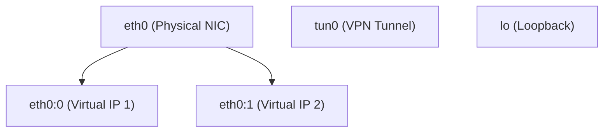

# Java Network Interfaces

## Introduction

In networking-focused Java applications, it's often necessary to gather information about the network interfaces available on a system. A network interface represents a connection point between a device and a network - this could be a physical network adapter (like an Ethernet card or WiFi adapter) or a virtual interface (like a loopback interface).

Java provides robust support for working with network interfaces through the `java.net.NetworkInterface` class, which was introduced in Java 1.4. This class allows developers to:

- Enumerate all network interfaces on a system
- Access information about each interface (like name, IP addresses, MAC address)
- Check interface status (up/down, loopback, point-to-point, etc.)

Understanding network interfaces is crucial for developing network-aware applications, especially those that need to make intelligent decisions based on available connections or that operate in multi-network environments.

## Basic Concepts

### What is a Network Interface?

A network interface is the point of connection between a device and a network. For example:

- `eth0`: A typical Ethernet adapter
- `wlan0`: A WiFi adapter
- `lo`: The loopback interface (always points back to the local machine)
- `tun0`/`tap0`: Virtual interfaces often used for VPN connections

Each interface has properties like:
- A name and display name
- One or more IP addresses (IPv4 or IPv6)
- A hardware/MAC address (for physical interfaces)
- Status flags (up/down, supports multicast, etc.)

## Working with NetworkInterface Class

The `NetworkInterface` class in the `java.net` package provides methods to retrieve information about the network interfaces on a system.

### Getting a List of All Network Interfaces

```java
import java.net.NetworkInterface;
import java.net.SocketException;
import java.util.Collections;
import java.util.Enumeration;

public class ListNetworkInterfaces {
    public static void main(String[] args) {
        try {
            Enumeration<NetworkInterface> interfaces = NetworkInterface.getNetworkInterfaces();
            
            if (interfaces == null) {
                System.out.println("No network interfaces found");
                return;
            }
            
            System.out.println("Network Interfaces on this system:");
            System.out.println("--------------------------------");
            
            for (NetworkInterface iface : Collections.list(interfaces)) {
                System.out.printf("Interface: %s (%s)%n", 
                    iface.getName(), iface.getDisplayName());
            }
            
        } catch (SocketException e) {
            System.err.println("Error retrieving network interfaces: " + e.getMessage());
            e.printStackTrace();
        }
    }
}
```

**Sample Output:**
```
Network Interfaces on this system:
--------------------------------
Interface: lo (Software Loopback Interface 1)
Interface: eth0 (Intel(R) Ethernet Connection I217-LM)
Interface: wlan0 (Intel(R) Dual Band Wireless-AC 8260)
```

### Retrieving a Specific Interface

You can get a specific interface by name or by IP address:

```java
import java.net.InetAddress;
import java.net.NetworkInterface;
import java.net.SocketException;
import java.net.UnknownHostException;

public class FindSpecificInterface {
    public static void main(String[] args) {
        try {
            // Get by name
            NetworkInterface nif = NetworkInterface.getByName("lo");
            if (nif != null) {
                System.out.println("Found interface by name: " + nif.getDisplayName());
            } else {
                System.out.println("Interface 'lo' not found");
            }
            
            // Get by local IP address
            InetAddress localHost = InetAddress.getLocalHost();
            NetworkInterface nif2 = NetworkInterface.getByInetAddress(localHost);
            if (nif2 != null) {
                System.out.println("Interface for " + localHost.getHostAddress() + 
                                 ": " + nif2.getDisplayName());
            }
            
        } catch (SocketException | UnknownHostException e) {
            e.printStackTrace();
        }
    }
}
```

**Sample Output:**
```
Found interface by name: Software Loopback Interface 1
Interface for 192.168.1.5: Intel(R) Ethernet Connection I217-LM
```

## Getting Detailed Information About Network Interfaces

Let's create a more comprehensive example that displays detailed information about each network interface:

```java
import java.net.NetworkInterface;
import java.net.InetAddress;
import java.net.SocketException;
import java.util.Collections;
import java.util.Enumeration;

public class NetworkInterfaceDetails {
    public static void main(String[] args) {
        try {
            Enumeration<NetworkInterface> interfaces = NetworkInterface.getNetworkInterfaces();
            
            for (NetworkInterface iface : Collections.list(interfaces)) {
                printInterfaceDetails(iface);
                System.out.println("-".repeat(50));
            }
            
        } catch (SocketException e) {
            e.printStackTrace();
        }
    }
    
    private static void printInterfaceDetails(NetworkInterface iface) throws SocketException {
        System.out.println("Interface: " + iface.getDisplayName());
        System.out.println("Name: " + iface.getName());
        
        // Get MAC address
        byte[] mac = iface.getHardwareAddress();
        if (mac != null) {
            System.out.print("MAC address: ");
            for (int i = 0; i < mac.length; i++) {
                System.out.format("%02X%s", mac[i], (i < mac.length - 1) ? "-" : "");
            }
            System.out.println();
        }
        
        // Get IP addresses
        System.out.println("IP addresses:");
        Enumeration<InetAddress> addresses = iface.getInetAddresses();
        for (InetAddress addr : Collections.list(addresses)) {
            System.out.println("  " + addr.getHostAddress() + 
                             (addr.isLoopbackAddress() ? " (loopback)" : ""));
        }
        
        // Status information
        System.out.println("Status Information:");
        System.out.println("  Up: " + iface.isUp());
        System.out.println("  Loopback: " + iface.isLoopback());
        System.out.println("  Point to Point: " + iface.isPointToPoint());
        System.out.println("  Virtual: " + iface.isVirtual());
        System.out.println("  Supports Multicast: " + iface.supportsMulticast());
        System.out.println("  MTU: " + iface.getMTU());
        
        // Sub-interfaces (if any)
        Enumeration<NetworkInterface> subInterfaces = iface.getSubInterfaces();
        if (subInterfaces.hasMoreElements()) {
            System.out.println("Sub Interfaces:");
            for (NetworkInterface subIf : Collections.list(subInterfaces)) {
                System.out.println("  " + subIf.getName());
            }
        }
    }
}
```

**Sample Output:**
```
Interface: Software Loopback Interface 1
Name: lo
IP addresses:
  127.0.0.1 (loopback)
  0:0:0:0:0:0:0:1 (loopback)
Status Information:
  Up: true
  Loopback: true
  Point to Point: false
  Virtual: false
  Supports Multicast: true
  MTU: 65536
--------------------------------------------------
Interface: Intel(R) Ethernet Connection I217-LM
Name: eth0
MAC address: 3C-97-0E-E3-45-F2
IP addresses:
  192.168.1.5
Status Information:
  Up: true
  Loopback: false
  Point to Point: false
  Virtual: false
  Supports Multicast: true
  MTU: 1500
--------------------------------------------------
```

## Practical Network Interface Applications

### Finding the Best Network Interface for External Communications

When developing applications that need to communicate with external servers, it's helpful to identify the most suitable network interface:

```java
import java.net.*;
import java.util.*;

public class BestNetworkInterface {
    public static void main(String[] args) {
        try {
            // Target we want to reach
            InetAddress targetAddress = InetAddress.getByName("8.8.8.8"); // Google DNS
            
            // Try to find the interface that would be used to reach the target
            NetworkInterface bestInterface = NetworkInterface.getByInetAddress(
                new Socket(targetAddress, 53).getLocalAddress());
            
            if (bestInterface != null) {
                System.out.println("Best interface for external communication: " + 
                                 bestInterface.getDisplayName());
                
                // Get the IP address being used
                Enumeration<InetAddress> addresses = bestInterface.getInetAddresses();
                while (addresses.hasMoreElements()) {
                    InetAddress addr = addresses.nextElement();
                    if (addr instanceof Inet4Address) { // Filter for IPv4
                        System.out.println("Using IP Address: " + addr.getHostAddress());
                        break;
                    }
                }
            } else {
                System.out.println("Could not determine best interface");
            }
            
        } catch (Exception e) {
            System.out.println("Error: " + e.getMessage());
            e.printStackTrace();
        }
    }
}
```

**Note**: This code attempts to establish a socket connection to determine the interface. In real applications, you might want to handle timeouts and exceptions more gracefully.

### Creating a Network Interface Monitor

Here's an example of a simple network monitor that periodically checks the status of interfaces:

```java
import java.net.NetworkInterface;
import java.util.*;
import java.util.concurrent.*;

public class NetworkInterfaceMonitor {
    private static Map<String, Boolean> lastKnownStatus = new ConcurrentHashMap<>();
    
    public static void main(String[] args) {
        // Monitor network interfaces every 5 seconds
        ScheduledExecutorService scheduler = Executors.newScheduledThreadPool(1);
        scheduler.scheduleAtFixedRate(NetworkInterfaceMonitor::checkInterfaces, 0, 5, TimeUnit.SECONDS);
        
        System.out.println("Network Interface Monitor started. Press Ctrl+C to exit.");
    }
    
    private static void checkInterfaces() {
        try {
            Enumeration<NetworkInterface> interfaces = NetworkInterface.getNetworkInterfaces();
            
            // Track which interfaces we've seen in this update
            Set<String> currentInterfaces = new HashSet<>();
            
            for (NetworkInterface iface : Collections.list(interfaces)) {
                String name = iface.getName();
                currentInterfaces.add(name);
                boolean isUp = iface.isUp();
                
                // If this is the first time we're seeing this interface or its status changed
                if (!lastKnownStatus.containsKey(name) || lastKnownStatus.get(name) != isUp) {
                    System.out.printf("[%s] Interface %s (%s) is %s%n", 
                        new Date(), name, iface.getDisplayName(), 
                        isUp ? "UP" : "DOWN");
                    
                    // Update our tracking
                    lastKnownStatus.put(name, isUp);
                }
            }
            
            // Check for interfaces that disappeared
            for (String name : new HashSet<>(lastKnownStatus.keySet())) {
                if (!currentInterfaces.contains(name)) {
                    System.out.printf("[%s] Interface %s is no longer available%n", 
                        new Date(), name);
                    lastKnownStatus.remove(name);
                }
            }
            
        } catch (Exception e) {
            System.err.println("Error checking network interfaces: " + e.getMessage());
        }
    }
}
```

**Sample Output:**
```
Network Interface Monitor started. Press Ctrl+C to exit.
[Wed Aug 23 15:30:00 EDT 2023] Interface lo (Software Loopback Interface 1) is UP
[Wed Aug 23 15:30:00 EDT 2023] Interface eth0 (Intel(R) Ethernet Connection I217-LM) is UP
[Wed Aug 23 15:30:00 EDT 2023] Interface wlan0 (Intel(R) Dual Band Wireless-AC 8260) is DOWN
[Wed Aug 23 15:30:15 EDT 2023] Interface wlan0 (Intel(R) Dual Band Wireless-AC 8260) is UP
[Wed Aug 23 15:30:35 EDT 2023] Interface eth0 (Intel(R) Ethernet Connection I217-LM) is DOWN
```

## Network Interface Hierarchy

In modern systems, network interfaces can have a hierarchical relationship. The `NetworkInterface` class allows you to explore this hierarchy:



The following code demonstrates how to navigate this hierarchy:

```java
import java.net.NetworkInterface;
import java.net.SocketException;
import java.util.Collections;
import java.util.Enumeration;

public class NetworkInterfaceHierarchy {
    public static void main(String[] args) {
        try {
            Enumeration<NetworkInterface> interfaces = NetworkInterface.getNetworkInterfaces();
            
            System.out.println("Network Interface Hierarchy:");
            System.out.println("---------------------------");
            
            for (NetworkInterface iface : Collections.list(interfaces)) {
                // Only print parent interfaces (those not associated with another interface)
                if (iface.getParent() == null) {
                    printInterfaceHierarchy(iface, 0);
                }
            }
            
        } catch (SocketException e) {
            e.printStackTrace();
        }
    }
    
    private static void printInterfaceHierarchy(NetworkInterface iface, int depth) throws SocketException {
        StringBuilder indent = new StringBuilder();
        for (int i = 0; i < depth; i++) {
            indent.append("  ");
        }
        
        System.out.println(indent + "- " + iface.getName() + " (" + iface.getDisplayName() + ")");
        
        // Process children
        Enumeration<NetworkInterface> subInterfaces = iface.getSubInterfaces();
        for (NetworkInterface subIf : Collections.list(subInterfaces)) {
            printInterfaceHierarchy(subIf, depth + 1);
        }
    }
}
```

**Sample Output:**
```
Network Interface Hierarchy:
---------------------------
- lo (Software Loopback Interface 1)
- eth0 (Intel(R) Ethernet Connection I217-LM)
  - eth0:0 (Intel(R) Ethernet Connection I217-LM Virtual Interface)
- wlan0 (Intel(R) Dual Band Wireless-AC 8260)
- tun0 (WireGuard VPN)
```

## Practical Considerations

### Working with IPv4 vs IPv6 Addresses

When dealing with network interfaces, you'll often need to distinguish between IPv4 and IPv6 addresses:

```java
import java.net.*;
import java.util.*;

public class IPv4vsIPv6 {
    public static void main(String[] args) {
        try {
            NetworkInterface nif = NetworkInterface.getByName("eth0");
            if (nif == null) {
                System.out.println("Interface not found");
                return;
            }
            
            System.out.println("IPv4 Addresses:");
            System.out.println("IPv6 Addresses:");
            
            Enumeration<InetAddress> addresses = nif.getInetAddresses();
            while (addresses.hasMoreElements()) {
                InetAddress addr = addresses.nextElement();
                if (addr instanceof Inet4Address) {
                    System.out.println("IPv4: " + addr.getHostAddress());
                } else if (addr instanceof Inet6Address) {
                    Inet6Address ipv6 = (Inet6Address) addr;
                    System.out.println("IPv6: " + ipv6.getHostAddress() + 
                                     (ipv6.isLinkLocalAddress() ? " (link-local)" : ""));
                }
            }
            
        } catch (SocketException e) {
            e.printStackTrace();
        }
    }
}
```

### MAC Address Formatting

MAC addresses are retrieved as byte arrays and typically displayed in hexadecimal. Here's a utility method for formatting MAC addresses:

```java
public static String formatMAC(byte[] mac) {
    if (mac == null) {
        return "N/A";
    }
    
    StringBuilder sb = new StringBuilder();
    for (int i = 0; i < mac.length; i++) {
        sb.append(String.format("%02X%s", mac[i], (i < mac.length - 1) ? ":" : ""));
    }
    return sb.toString();
}
```

### Network Interface Changes

Network interfaces can change during the execution of your application, especially on mobile devices or laptops that frequently change network connections. Your code should be prepared to handle dynamic changes.

## Summary

Java's `NetworkInterface` class provides powerful capabilities for working with network interfaces on a system. With it, you can:

- Enumerate all network interfaces on a system
- Retrieve detailed information about each interface
- Check interface status and properties
- Find the most suitable interface for a specific network operation
- Monitor changes in network interfaces

These capabilities are essential for developing networking applications that need to make intelligent decisions based on available network connections, such as selecting the best interface for a connection or monitoring network status.

## Exercises

1. Write a program that finds all available network interfaces and prints out only those that are up and not loopback interfaces.

2. Create a utility that displays all IPv4 addresses assigned to your computer across all interfaces.

3. Write a program that continuously monitors network interfaces and reports when an interface goes up or down or when new interfaces are added.

4. Create an application that automatically selects the best network interface for reaching the internet (hint: try to connect to a well-known public DNS server like 8.8.8.8).

5. Write a utility that outputs network interface information in a structured format like JSON or XML.

## Additional Resources

- [Java NetworkInterface Documentation](https://docs.oracle.com/en/java/javase/17/docs/api/java.base/java/net/NetworkInterface.html)
- [Oracle Java Networking Tutorial](https://docs.oracle.com/javase/tutorial/networking/)
- [TCP/IP Network Interfaces](https://www.ibm.com/docs/en/aix/7.2?topic=management-tcpip-network-interfaces)
- [RFC 3493 - Basic Socket Interface Extensions for IPv6](https://datatracker.ietf.org/doc/html/rfc3493)