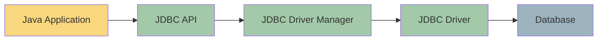
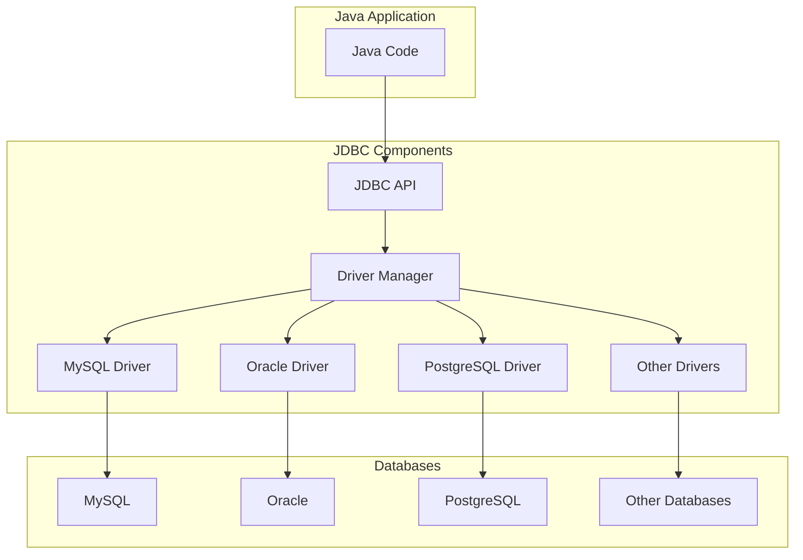

# Java JDBC Introduction

## What is JDBC?

JDBC (Java Database Connectivity) is a Java API that enables Java programs to connect and interact with relational databases. It provides methods for querying and updating data in a database and is an essential part of Java's enterprise programming toolkit.

Think of JDBC as a bridge that connects your Java application to a database:



## Why Use JDBC?

- **Database Independence**: Write code once, connect to any database
- **Standard API**: Consistent approach to database access
- **Rich Functionality**: Supports all SQL operations and complex queries
- **Transaction Management**: Allows control over database transactions
- **Robust Error Handling**: Provides detailed information about errors

## JDBC Architecture

JDBC architecture consists of two layers:

1. **JDBC API**: The interface that your Java application uses
2. **JDBC Driver**: The implementation that connects to a specific database



## JDBC Components

JDBC includes several key components that work together:

1. **DriverManager**: Manages the database drivers
2. **Connection**: Represents a connection to the database
3. **Statement**: Used to execute SQL statements
4. **ResultSet**: Contains the results of a query
5. **SQLException**: Handles database errors

## JDBC Driver Types

JDBC provides four types of drivers:

1. **Type 1 (JDBC-ODBC Bridge)**: Translates JDBC to ODBC (legacy)
2. **Type 2 (Native-API)**: Converts JDBC calls to database-specific API calls
3. **Type 3 (Network Protocol)**: Uses middleware to connect to the database
4. **Type 4 (Pure Java)**: Written entirely in Java, connects directly to the database

Most modern applications use Type 4 drivers for optimal performance and portability.

## Setting Up JDBC

Before you can use JDBC, you need to:

1. Add the JDBC driver JAR file to your project
2. Import the necessary JDBC packages
3. Register the driver
4. Establish a connection

### Adding the JDBC Driver

For Maven projects, add the dependency to your `pom.xml`:

```xml
<dependency>
    <groupId>mysql</groupId>
    <artifactId>mysql-connector-java</artifactId>
    <version>8.0.28</version>
</dependency>
```

For Gradle projects, add to your `build.gradle`:

```groovy
implementation 'mysql:mysql-connector-java:8.0.28'
```

### Basic JDBC Code

Here's a simple example that connects to a MySQL database and performs a query:

```java
import java.sql.Connection;
import java.sql.DriverManager;
import java.sql.ResultSet;
import java.sql.Statement;
import java.sql.SQLException;

public class JDBCExample {
    public static void main(String[] args) {
        // Database URL, username, and password
        String url = "jdbc:mysql://localhost:3306/mydb";
        String username = "root";
        String password = "password";
        
        // SQL query to execute
        String query = "SELECT * FROM employees";
        
        try {
            // Register the driver
            Class.forName("com.mysql.cj.jdbc.Driver");
            
            // Establish connection
            Connection connection = DriverManager.getConnection(url, username, password);
            System.out.println("Database connected successfully!");
            
            // Create a statement
            Statement statement = connection.createStatement();
            
            // Execute the query
            ResultSet resultSet = statement.executeQuery(query);
            
            // Process the results
            while (resultSet.next()) {
                int id = resultSet.getInt("id");
                String name = resultSet.getString("name");
                String position = resultSet.getString("position");
                
                System.out.println(id + " | " + name + " | " + position);
            }
            
            // Close resources
            resultSet.close();
            statement.close();
            connection.close();
            
        } catch (ClassNotFoundException e) {
            System.out.println("JDBC Driver not found!");
            e.printStackTrace();
        } catch (SQLException e) {
            System.out.println("Database connection error!");
            e.printStackTrace();
        }
    }
}
```

**Output:**
```
Database connected successfully!
1 | John Doe | Developer
2 | Jane Smith | Designer
3 | Bob Johnson | Manager
```

## Understanding the JDBC URL

The JDBC URL specifies which database to connect to. The format depends on the database vendor:

- **MySQL**: `jdbc:mysql://hostname:port/database_name`
- **PostgreSQL**: `jdbc:postgresql://hostname:port/database_name`
- **Oracle**: `jdbc:oracle:thin:@hostname:port:database_name`
- **SQL Server**: `jdbc:sqlserver://hostname:port;databaseName=database_name`

## Basic JDBC Operations

### 1. Creating a Table

```java
String createTableSQL = "CREATE TABLE products (" +
                        "id INT AUTO_INCREMENT PRIMARY KEY," +
                        "name VARCHAR(100) NOT NULL," +
                        "price DECIMAL(10,2)," +
                        "quantity INT)";

Statement statement = connection.createStatement();
statement.executeUpdate(createTableSQL);
System.out.println("Table created successfully!");
```

### 2. Inserting Data

```java
String insertSQL = "INSERT INTO products (name, price, quantity) " +
                   "VALUES ('Laptop', 999.99, 10)";

int rowsAffected = statement.executeUpdate(insertSQL);
System.out.println(rowsAffected + " row(s) inserted.");
```

### 3. Updating Data

```java
String updateSQL = "UPDATE products SET price = 899.99 WHERE name = 'Laptop'";

int rowsAffected = statement.executeUpdate(updateSQL);
System.out.println(rowsAffected + " row(s) updated.");
```

### 4. Deleting Data

```java
String deleteSQL = "DELETE FROM products WHERE quantity = 0";

int rowsAffected = statement.executeUpdate(deleteSQL);
System.out.println(rowsAffected + " row(s) deleted.");
```

## Using PreparedStatement

`PreparedStatement` is a more secure alternative to `Statement` for executing SQL operations. It prevents SQL injection attacks by properly escaping input values:

```java
// Unsafe way (vulnerable to SQL injection)
String name = userInput; // Could contain malicious SQL
String unsafeSQL = "SELECT * FROM users WHERE username = '" + name + "'";

// Safe way using PreparedStatement
String safeSQL = "SELECT * FROM users WHERE username = ?";
PreparedStatement preparedStatement = connection.prepareStatement(safeSQL);
preparedStatement.setString(1, name);
ResultSet resultSet = preparedStatement.executeQuery();
```

## Real-World Example: Product Inventory System

Here's a practical example that simulates a simple product inventory system:

```java
import java.sql.*;
import java.util.Scanner;

public class InventorySystem {
    private static final String URL = "jdbc:mysql://localhost:3306/inventory";
    private static final String USERNAME = "root";
    private static final String PASSWORD = "password";
    
    public static void main(String[] args) {
        try {
            // Load the driver and establish connection
            Class.forName("com.mysql.cj.jdbc.Driver");
            Connection connection = DriverManager.getConnection(URL, USERNAME, PASSWORD);
            
            // Create products table if it doesn't exist
            createProductsTable(connection);
            
            Scanner scanner = new Scanner(System.in);
            int choice;
            
            do {
                System.out.println("\n===== Product Inventory System =====");
                System.out.println("1. Add new product");
                System.out.println("2. List all products");
                System.out.println("3. Update product quantity");
                System.out.println("4. Delete product");
                System.out.println("0. Exit");
                System.out.print("Enter your choice: ");
                choice = scanner.nextInt();
                scanner.nextLine(); // Consume newline
                
                switch (choice) {
                    case 1:
                        addProduct(connection, scanner);
                        break;
                    case 2:
                        listProducts(connection);
                        break;
                    case 3:
                        updateProductQuantity(connection, scanner);
                        break;
                    case 4:
                        deleteProduct(connection, scanner);
                        break;
                    case 0:
                        System.out.println("Exiting system...");
                        break;
                    default:
                        System.out.println("Invalid choice. Please try again.");
                }
            } while (choice != 0);
            
            connection.close();
            scanner.close();
            
        } catch (ClassNotFoundException e) {
            System.out.println("JDBC Driver not found!");
            e.printStackTrace();
        } catch (SQLException e) {
            System.out.println("Database error occurred!");
            e.printStackTrace();
        }
    }
    
    private static void createProductsTable(Connection connection) throws SQLException {
        String sql = "CREATE TABLE IF NOT EXISTS products (" +
                     "id INT AUTO_INCREMENT PRIMARY KEY," +
                     "name VARCHAR(100) NOT NULL UNIQUE," +
                     "price DECIMAL(10,2) NOT NULL," +
                     "quantity INT NOT NULL)";
        
        Statement statement = connection.createStatement();
        statement.execute(sql);
        statement.close();
    }
    
    private static void addProduct(Connection connection, Scanner scanner) throws SQLException {
        System.out.print("Enter product name: ");
        String name = scanner.nextLine();
        
        System.out.print("Enter price: ");
        double price = scanner.nextDouble();
        
        System.out.print("Enter quantity: ");
        int quantity = scanner.nextInt();
        
        String sql = "INSERT INTO products (name, price, quantity) VALUES (?, ?, ?)";
        
        PreparedStatement statement = connection.prepareStatement(sql);
        statement.setString(1, name);
        statement.setDouble(2, price);
        statement.setInt(3, quantity);
        
        int rowsInserted = statement.executeUpdate();
        if (rowsInserted > 0) {
            System.out.println("Product added successfully!");
        }
        statement.close();
    }
    
    private static void listProducts(Connection connection) throws SQLException {
        String sql = "SELECT * FROM products";
        
        Statement statement = connection.createStatement();
        ResultSet resultSet = statement.executeQuery(sql);
        
        System.out.println("\n===== Products List =====");
        System.out.printf("%-5s %-20s %-10s %-10s%n", "ID", "Name", "Price", "Quantity");
        System.out.println("-----------------------------------------");
        
        while (resultSet.next()) {
            int id = resultSet.getInt("id");
            String name = resultSet.getString("name");
            double price = resultSet.getDouble("price");
            int quantity = resultSet.getInt("quantity");
            
            System.out.printf("%-5d %-20s $%-9.2f %-10d%n", id, name, price, quantity);
        }
        
        resultSet.close();
        statement.close();
    }
    
    private static void updateProductQuantity(Connection connection, Scanner scanner) throws SQLException {
        System.out.print("Enter product ID to update: ");
        int id = scanner.nextInt();
        
        System.out.print("Enter new quantity: ");
        int quantity = scanner.nextInt();
        
        String sql = "UPDATE products SET quantity = ? WHERE id = ?";
        
        PreparedStatement statement = connection.prepareStatement(sql);
        statement.setInt(1, quantity);
        statement.setInt(2, id);
        
        int rowsUpdated = statement.executeUpdate();
        if (rowsUpdated > 0) {
            System.out.println("Product quantity updated successfully!");
        } else {
            System.out.println("Product not found!");
        }
        statement.close();
    }
    
    private static void deleteProduct(Connection connection, Scanner scanner) throws SQLException {
        System.out.print("Enter product ID to delete: ");
        int id = scanner.nextInt();
        
        String sql = "DELETE FROM products WHERE id = ?";
        
        PreparedStatement statement = connection.prepareStatement(sql);
        statement.setInt(1, id);
        
        int rowsDeleted = statement.executeUpdate();
        if (rowsDeleted > 0) {
            System.out.println("Product deleted successfully!");
        } else {
            System.out.println("Product not found!");
        }
        statement.close();
    }
}
```

This example demonstrates:
- Creating a table if it doesn't exist
- Adding, listing, updating, and deleting records
- Using PreparedStatement to prevent SQL injection
- Basic console UI for user interaction

## Best Practices for JDBC

1. **Always close resources**: Use try-with-resources to automatically close Connection, Statement, and ResultSet
2. **Use PreparedStatement**: Prevents SQL injection and improves performance
3. **Handle exceptions properly**: Use specific exception handling for different types of errors
4. **Use connection pooling**: For applications that need multiple connections
5. **Don't hardcode credentials**: Use configuration files or environment variables
6. **Batch processing**: Use batch updates for bulk operations

## Summary

In this introduction to JDBC, we've covered:

- What JDBC is and its architecture
- The various components and driver types
- How to set up and use JDBC for database operations
- Basic CRUD operations (Create, Read, Update, Delete)
- A practical example of a simple inventory system
- Best practices for using JDBC

JDBC provides a powerful way to connect Java applications with databases. While there are more modern frameworks like JPA/Hibernate that build on top of JDBC, understanding the fundamentals of JDBC gives you a solid foundation for Java database programming.

## Exercises for Practice

1. Create a simple address book application that stores contacts in a database
2. Modify the inventory system to include categories for products
3. Implement transaction handling in the inventory system (commit/rollback)
4. Create a simple banking application that tracks account balances
5. Build a library management system with books and borrower information

## Additional Resources

- [Official JDBC Documentation](https://docs.oracle.com/javase/8/docs/technotes/guides/jdbc/)
- [Java JDBC Tutorial on Baeldung](https://www.baeldung.com/java-jdbc)
- [JDBC Database Access on Oracle Tutorials](https://docs.oracle.com/javase/tutorial/jdbc/index.html)
- [MySQL Connector/J Documentation](https://dev.mysql.com/doc/connector-j/en/)
- Book: "JDBC API Tutorial and Reference" by Maydene Fisher

With JDBC, you've taken the first step into the world of database connectivity with Java. As you practice and build more applications, you'll discover the full power that JDBC offers for enterprise application development.