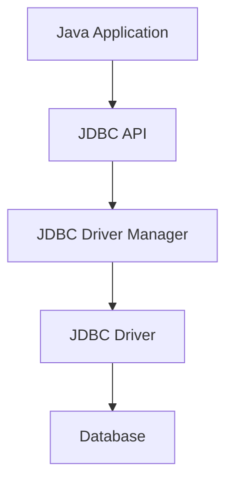

# Java Database Connection

## Introduction

Database connectivity is an essential skill in modern application development. Almost every real-world application needs to store and retrieve data persistently. In Java, the **Java Database Connectivity (JDBC) API** provides a standard way to interact with relational databases.

In this tutorial, we'll explore how to establish connections between your Java applications and databases, which serves as the foundation for all database operations. By the end of this guide, you'll be able to connect to a database from your Java code and understand the key components involved in this process.

## JDBC Architecture Overview

Before diving into code, let's understand the basic JDBC architecture:



1. **Java Application**: Your code that needs database access
2. **JDBC API**: Standard Java interfaces and classes for database operations
3. **JDBC Driver Manager**: Manages the set of database drivers
4. **JDBC Driver**: Database-specific implementation that converts JDBC calls to the database's native protocol
5. **Database**: The target database system (MySQL, PostgreSQL, Oracle, etc.)

## Prerequisites

Before establishing a database connection, you need:

1. **JDK installed** (version 8 or above recommended)
2. **A database system** installed and running (MySQL, PostgreSQL, etc.)
3. **JDBC driver** for your specific database
4. **Database credentials** (username, password)
5. **Connection URL** for your database

## Adding JDBC Driver to Your Project

### For Maven Projects

Add the appropriate dependency to your `pom.xml`:

```xml
<!-- For MySQL -->
<dependency>
    <groupId>mysql</groupId>
    <artifactId>mysql-connector-java</artifactId>
    <version>8.0.28</version>
</dependency>

<!-- For PostgreSQL -->
<!-- 
<dependency>
    <groupId>org.postgresql</groupId>
    <artifactId>postgresql</artifactId>
    <version>42.3.3</version>
</dependency>
-->
```

### For Non-Maven Projects

Download the appropriate JDBC driver JAR file and add it to your project's classpath.

## Basic Database Connection

Here's a step-by-step example of establishing a connection to a MySQL database:

```java
import java.sql.Connection;
import java.sql.DriverManager;
import java.sql.SQLException;

public class DatabaseConnectionExample {
    public static void main(String[] args) {
        // Database URL, username, and password
        String url = "jdbc:mysql://localhost:3306/mydb";
        String username = "root";
        String password = "password";
        
        // Declare the connection object
        Connection connection = null;
        
        try {
            // Register the JDBC driver
            // This step is optional in modern Java versions
            Class.forName("com.mysql.cj.jdbc.Driver");
            
            // Open a connection
            System.out.println("Connecting to database...");
            connection = DriverManager.getConnection(url, username, password);
            
            System.out.println("Connection established successfully!");
            
        } catch (ClassNotFoundException e) {
            System.out.println("JDBC Driver not found!");
            e.printStackTrace();
        } catch (SQLException e) {
            System.out.println("Connection failed!");
            e.printStackTrace();
        } finally {
            // Always close the connection when done
            try {
                if (connection != null && !connection.isClosed()) {
                    connection.close();
                    System.out.println("Connection closed successfully!");
                }
            } catch (SQLException e) {
                e.printStackTrace();
            }
        }
    }
}
```

**Expected Output:**
```
Connecting to database...
Connection established successfully!
Connection closed successfully!
```

## Understanding Connection URLs

The connection URL format varies depending on the database system. Here are some common formats:

- **MySQL**: `jdbc:mysql://hostname:port/database`
- **PostgreSQL**: `jdbc:postgresql://hostname:port/database`
- **Oracle**: `jdbc:oracle:thin:@hostname:port:database`
- **SQL Server**: `jdbc:sqlserver://hostname:port;databaseName=database`
- **SQLite**: `jdbc:sqlite:path/to/database.db`

### Example URLs:

```java
// MySQL connection URL
String mysqlUrl = "jdbc:mysql://localhost:3306/studentdb?useSSL=false";

// PostgreSQL connection URL
String postgresUrl = "jdbc:postgresql://localhost:5432/studentdb";

// SQLite connection URL
String sqliteUrl = "jdbc:sqlite:C:/data/students.db";
```

## Connection Pooling

For real-world applications, creating and closing connections repeatedly can be inefficient. **Connection pooling** is a technique that maintains a pool of reusable database connections.

Here's a simplified example using HikariCP, a popular connection pooling library:

```java
import com.zaxxer.hikari.HikariConfig;
import com.zaxxer.hikari.HikariDataSource;

import java.sql.Connection;
import java.sql.SQLException;

public class ConnectionPoolExample {
    
    private static HikariDataSource dataSource;
    
    // Initialize the connection pool
    static {
        HikariConfig config = new HikariConfig();
        config.setJdbcUrl("jdbc:mysql://localhost:3306/mydb");
        config.setUsername("root");
        config.setPassword("password");
        config.setMaximumPoolSize(10);
        config.setMinimumIdle(5);
        config.setIdleTimeout(300000);
        config.setConnectionTimeout(20000);
        
        dataSource = new HikariDataSource(config);
    }
    
    // Method to get a connection from the pool
    public static Connection getConnection() throws SQLException {
        return dataSource.getConnection();
    }
    
    public static void main(String[] args) {
        Connection conn = null;
        try {
            conn = getConnection();
            System.out.println("Got connection from pool!");
            // Use the connection for database operations...
            
        } catch (SQLException e) {
            e.printStackTrace();
        } finally {
            // Return the connection to the pool (don't actually close it)
            if (conn != null) {
                try {
                    conn.close();
                    System.out.println("Connection returned to pool!");
                } catch (SQLException e) {
                    e.printStackTrace();
                }
            }
        }
    }
}
```

## Error Handling and Best Practices

### 1. Always Close Resources

Use try-with-resources to automatically close connections:

```java
try (Connection connection = DriverManager.getConnection(url, username, password)) {
    System.out.println("Connection established successfully!");
    // Perform database operations
} catch (SQLException e) {
    System.out.println("Connection failed!");
    e.printStackTrace();
}
// Connection is automatically closed when exiting the try block
```

### 2. Handle Connection Failures Gracefully

```java
try {
    connection = DriverManager.getConnection(url, username, password);
} catch (SQLException e) {
    if (e.getErrorCode() == 1045) {
        System.out.println("Authentication failed. Check your username and password.");
    } else if (e.getErrorCode() == 1049) {
        System.out.println("Database does not exist.");
    } else {
        System.out.println("Connection error: " + e.getMessage());
    }
}
```

### 3. Store Connection Parameters Securely

Don't hardcode credentials in your source code:

```java
// Load properties from a configuration file
Properties props = new Properties();
try (FileInputStream in = new FileInputStream("database.properties")) {
    props.load(in);
}

String url = props.getProperty("db.url");
String username = props.getProperty("db.username");
String password = props.getProperty("db.password");

Connection connection = DriverManager.getConnection(url, username, password);
```

## Real-World Example: User Authentication System

Here's a more practical example showing a simple user authentication system using a database:

```java
import java.sql.*;
import java.util.Scanner;

public class UserAuthenticationSystem {
    
    private static final String URL = "jdbc:mysql://localhost:3306/userdb";
    private static final String USERNAME = "root";
    private static final String PASSWORD = "password";
    
    public static void main(String[] args) {
        Scanner scanner = new Scanner(System.in);
        
        System.out.print("Enter username: ");
        String username = scanner.nextLine();
        
        System.out.print("Enter password: ");
        String password = scanner.nextLine();
        
        if (authenticateUser(username, password)) {
            System.out.println("Authentication successful! Welcome, " + username);
        } else {
            System.out.println("Authentication failed. Invalid username or password.");
        }
        
        scanner.close();
    }
    
    private static boolean authenticateUser(String username, String password) {
        String query = "SELECT * FROM users WHERE username = ? AND password = ?";
        
        try (
            Connection connection = DriverManager.getConnection(URL, USERNAME, PASSWORD);
            PreparedStatement statement = connection.prepareStatement(query)
        ) {
            // In a real system, passwords should be hashed, not stored in plain text
            statement.setString(1, username);
            statement.setString(2, password);
            
            try (ResultSet resultSet = statement.executeQuery()) {
                return resultSet.next(); // True if a matching user was found
            }
            
        } catch (SQLException e) {
            System.out.println("Database error: " + e.getMessage());
            return false;
        }
    }
}
```

**Note:** In a real application, you should never store passwords as plain text. Always use proper password hashing algorithms like BCrypt.

## Summary

In this tutorial, we've covered:

- The fundamentals of Java Database Connectivity (JDBC)
- How to add JDBC drivers to your project
- Establishing a basic database connection
- Understanding connection URLs for different databases
- Connection pooling for improved performance
- Best practices for managing database connections
- A practical example of a database-backed authentication system

With these concepts, you can now start building Java applications that interact with databases for persistent data storage.

## Additional Resources

- [Oracle's JDBC Documentation](https://docs.oracle.com/javase/tutorial/jdbc/basics/index.html)
- [HikariCP Connection Pool](https://github.com/brettwooldridge/HikariCP)
- [MySQL Connector/J Documentation](https://dev.mysql.com/doc/connector-j/en/)
- [PostgreSQL JDBC Driver](https://jdbc.postgresql.org/documentation/head/index.html)

## Exercises

1. Create a connection to a SQLite database and verify it works correctly.
2. Modify the basic connection example to use try-with-resources for automatic resource management.
3. Implement a simple address book application that connects to a database and allows users to add, view, and delete contacts.
4. Create a properties file to store database connection parameters and modify one of the examples to use it.
5. Research and implement a connection pool using a different library like Apache DBCP or C3P0.

By mastering database connections in Java, you've taken your first step toward building data-driven applications!