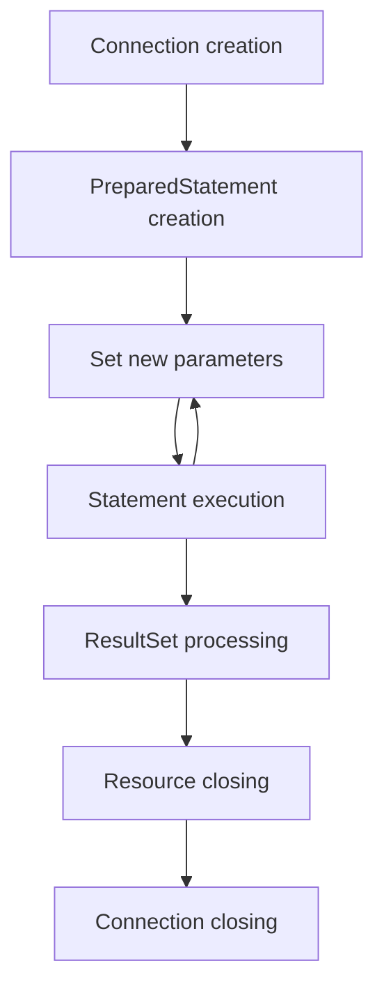

# Java PreparedStatement

## Introduction

When working with databases in Java applications, the Java Database Connectivity (JDBC) API provides several ways to execute SQL statements. Among these, the `PreparedStatement` interface stands out as a powerful tool that offers significant advantages over regular statements.

A `PreparedStatement` is a precompiled SQL statement that can be executed multiple times with different parameter values. It extends the `Statement` interface and provides additional methods for setting parameters before execution.

In this tutorial, you'll learn:
- What PreparedStatement is and why you should use it
- How to create and use PreparedStatement objects
- How to set different types of parameters
- Security benefits of using PreparedStatement
- Performance considerations
- Best practices and common patterns

## Why Use PreparedStatement?

Before diving into the details, let's understand why `PreparedStatement` is often preferred over regular `Statement`:

1. **Protection against SQL Injection**: PreparedStatement automatically escapes special characters, preventing SQL injection attacks.
2. **Improved Performance**: SQL statements are precompiled, which can lead to better performance when executing the same statement multiple times.
3. **Easier Parameter Handling**: It provides methods to set different types of parameters without manual string concatenation.
4. **Batch Processing**: It enables efficient execution of multiple similar SQL operations.

## Creating a PreparedStatement

To use a `PreparedStatement`, you first need to establish a database connection and then create the prepared statement:

```java
import java.sql.Connection;
import java.sql.DriverManager;
import java.sql.PreparedStatement;
import java.sql.SQLException;

public class PreparedStatementExample {
    public static void main(String[] args) {
        String url = "jdbc:mysql://localhost:3306/mydatabase";
        String username = "user";
        String password = "password";
        
        try (Connection connection = DriverManager.getConnection(url, username, password)) {
            // Create a PreparedStatement with a parameterized query
            String sql = "SELECT * FROM employees WHERE department = ? AND salary > ?";
            PreparedStatement preparedStatement = connection.prepareStatement(sql);
            
            // Now the preparedStatement is ready to be used with parameters
            
        } catch (SQLException e) {
            e.printStackTrace();
        }
    }
}
```

Notice the `?` marks in the SQL string. These are parameter placeholders that will be replaced with actual values later.

## Setting Parameters

The `PreparedStatement` interface provides various `setXXX()` methods to set values for each parameter placeholder:

```java
// Continuing from the previous example
preparedStatement.setString(1, "IT"); // Set department name for the first parameter
preparedStatement.setDouble(2, 50000.0); // Set salary threshold for the second parameter

// Now execute the query
ResultSet resultSet = preparedStatement.executeQuery();

// Process the results
while (resultSet.next()) {
    int id = resultSet.getInt("employee_id");
    String name = resultSet.getString("name");
    System.out.println("Employee ID: " + id + ", Name: " + name);
}
```

### Common Parameter Setting Methods

| Method | Description |
|--------|-------------|
| `setString(int index, String value)` | Sets a String parameter |
| `setInt(int index, int value)` | Sets an integer parameter |
| `setLong(int index, long value)` | Sets a long parameter |
| `setDouble(int index, double value)` | Sets a double parameter |
| `setDate(int index, Date value)` | Sets a SQL Date parameter |
| `setTimestamp(int index, Timestamp value)` | Sets a timestamp parameter |
| `setBoolean(int index, boolean value)` | Sets a boolean parameter |
| `setNull(int index, int sqlType)` | Sets a NULL parameter |
| `setObject(int index, Object value)` | Sets an Object parameter |

The index starts at 1 (not 0), referring to the position of the placeholder in the SQL statement.

## Complete CRUD Examples

Let's look at how to use `PreparedStatement` for each CRUD operation (Create, Read, Update, Delete).

### 1. INSERT Example (Create)

```java
public void addProduct(String name, String category, double price, int stock) {
    String sql = "INSERT INTO products (name, category, price, stock) VALUES (?, ?, ?, ?)";
    
    try (Connection connection = getConnection();  // Assume getConnection() method exists
         PreparedStatement statement = connection.prepareStatement(sql)) {
        
        statement.setString(1, name);
        statement.setString(2, category);
        statement.setDouble(3, price);
        statement.setInt(4, stock);
        
        int rowsInserted = statement.executeUpdate();
        if (rowsInserted > 0) {
            System.out.println("A new product was inserted successfully!");
        }
    } catch (SQLException e) {
        e.printStackTrace();
    }
}
```

### 2. SELECT Example (Read)

```java
public List<Product> getProductsByCategory(String category) {
    List<Product> products = new ArrayList<>();
    String sql = "SELECT * FROM products WHERE category = ?";
    
    try (Connection connection = getConnection();
         PreparedStatement statement = connection.prepareStatement(sql)) {
        
        statement.setString(1, category);
        ResultSet resultSet = statement.executeQuery();
        
        while (resultSet.next()) {
            int id = resultSet.getInt("id");
            String name = resultSet.getString("name");
            double price = resultSet.getDouble("price");
            int stock = resultSet.getInt("stock");
            
            Product product = new Product(id, name, category, price, stock);
            products.add(product);
        }
    } catch (SQLException e) {
        e.printStackTrace();
    }
    
    return products;
}
```

### 3. UPDATE Example

```java
public boolean updateProductPrice(int productId, double newPrice) {
    String sql = "UPDATE products SET price = ? WHERE id = ?";
    
    try (Connection connection = getConnection();
         PreparedStatement statement = connection.prepareStatement(sql)) {
        
        statement.setDouble(1, newPrice);
        statement.setInt(2, productId);
        
        int rowsUpdated = statement.executeUpdate();
        return rowsUpdated > 0;
    } catch (SQLException e) {
        e.printStackTrace();
        return false;
    }
}
```

### 4. DELETE Example

```java
public boolean deleteProduct(int productId) {
    String sql = "DELETE FROM products WHERE id = ?";
    
    try (Connection connection = getConnection();
         PreparedStatement statement = connection.prepareStatement(sql)) {
        
        statement.setInt(1, productId);
        
        int rowsDeleted = statement.executeUpdate();
        return rowsDeleted > 0;
    } catch (SQLException e) {
        e.printStackTrace();
        return false;
    }
}
```

## Batch Processing with PreparedStatement

For operations that need to insert or update multiple rows, batch processing can significantly improve performance:

```java
public void addProductsBatch(List<Product> products) {
    String sql = "INSERT INTO products (name, category, price, stock) VALUES (?, ?, ?, ?)";
    
    try (Connection connection = getConnection();
         PreparedStatement statement = connection.prepareStatement(sql)) {
        
        // Disable auto-commit for better performance
        connection.setAutoCommit(false);
        
        for (Product product : products) {
            statement.setString(1, product.getName());
            statement.setString(2, product.getCategory());
            statement.setDouble(3, product.getPrice());
            statement.setInt(4, product.getStock());
            
            // Add to batch instead of executing immediately
            statement.addBatch();
        }
        
        // Execute the entire batch
        int[] updateCounts = statement.executeBatch();
        
        // Commit the transaction
        connection.commit();
        
        System.out.println("Added " + updateCounts.length + " products in batch");
        
    } catch (SQLException e) {
        e.printStackTrace();
    }
}
```

## Working with Generated Keys

When inserting records, you often need to retrieve auto-generated keys (like auto-increment IDs). `PreparedStatement` can help with that:

```java
public int addProductAndGetId(String name, String category, double price, int stock) {
    String sql = "INSERT INTO products (name, category, price, stock) VALUES (?, ?, ?, ?)";
    int generatedId = -1;
    
    try (Connection connection = getConnection();
         PreparedStatement statement = connection.prepareStatement(sql, 
                 Statement.RETURN_GENERATED_KEYS)) {
        
        statement.setString(1, name);
        statement.setString(2, category);
        statement.setDouble(3, price);
        statement.setInt(4, stock);
        
        int affectedRows = statement.executeUpdate();
        
        if (affectedRows > 0) {
            try (ResultSet generatedKeys = statement.getGeneratedKeys()) {
                if (generatedKeys.next()) {
                    generatedId = generatedKeys.getInt(1);
                }
            }
        }
    } catch (SQLException e) {
        e.printStackTrace();
    }
    
    return generatedId;
}
```

## SQL Injection Protection

One of the main benefits of using `PreparedStatement` is protection against SQL injection attacks. Let's see a comparison:

### Vulnerable Code (using Statement)

```java
// DO NOT USE THIS APPROACH - Vulnerable to SQL injection
public User findUserByUsername(String username) {
    User user = null;
    try (Connection connection = getConnection();
         Statement statement = connection.createStatement()) {
        
        String sql = "SELECT * FROM users WHERE username = '" + username + "'";
        ResultSet resultSet = statement.executeQuery(sql);
        
        if (resultSet.next()) {
            user = new User();
            user.setId(resultSet.getInt("id"));
            user.setUsername(resultSet.getString("username"));
            // ... set other properties
        }
    } catch (SQLException e) {
        e.printStackTrace();
    }
    return user;
}
```

If a malicious user provides `admin' OR '1'='1` as the username, the SQL becomes:

```sql
SELECT * FROM users WHERE username = 'admin' OR '1'='1'
```

This will return all users, bypassing the authentication.

### Safe Code (using PreparedStatement)

```java
// SAFE approach using PreparedStatement
public User findUserByUsername(String username) {
    User user = null;
    String sql = "SELECT * FROM users WHERE username = ?";
    
    try (Connection connection = getConnection();
         PreparedStatement statement = connection.prepareStatement(sql)) {
        
        statement.setString(1, username);
        ResultSet resultSet = statement.executeQuery();
        
        if (resultSet.next()) {
            user = new User();
            user.setId(resultSet.getInt("id"));
            user.setUsername(resultSet.getString("username"));
            // ... set other properties
        }
    } catch (SQLException e) {
        e.printStackTrace();
    }
    return user;
}
```

Even if the username is `admin' OR '1'='1`, the `PreparedStatement` will treat it as a literal string value and escape it properly.

## The PreparedStatement Lifecycle

Understanding the lifecycle of a `PreparedStatement` is important for efficient resource management:



For best practices, always close your resources in the reverse order of creation, preferably using try-with-resources.

## Best Practices

1. **Always use try-with-resources** to ensure proper resource cleanup
2. **Reuse PreparedStatements** for similar queries to improve performance
3. **Use parameter placeholders** for all variable parts of your SQL
4. **Consider batch processing** for multiple similar operations
5. **Set the appropriate parameter type** using the correct `setXXX()` method
6. **Close resources explicitly** if not using try-with-resources
7. **Use connection pooling** with PreparedStatements for better performance
8. **Check your SQL syntax** before creating the PreparedStatement

## Common Mistakes to Avoid

1. **Parameter index starts at 1, not 0**: The first parameter is `1`, not `0`.
2. **Forgetting to set all parameters**: Every `?` placeholder must have a corresponding `setXXX()` call.
3. **Mixing up parameter types**: Using `setInt()` for a string column can cause type conversion errors.
4. **Not handling NULL values properly**: Use `setNull()` for NULL values.
5. **Not closing resources**: This can lead to memory leaks and connection pool exhaustion.
6. **Using string concatenation with PreparedStatement**: This defeats the purpose of using PreparedStatement.

```java
// WRONG - Defeats the purpose of PreparedStatement
String sql = "SELECT * FROM users WHERE username = '" + username + "'";
PreparedStatement statement = connection.prepareStatement(sql);

// CORRECT
String sql = "SELECT * FROM users WHERE username = ?";
PreparedStatement statement = connection.prepareStatement(sql);
statement.setString(1, username);
```

## Summary

Java's `PreparedStatement` is a powerful tool for executing SQL statements safely and efficiently. It offers significant advantages over regular statements, including:

- Protection against SQL injection attacks
- Better performance through precompilation and statement caching
- Convenient methods for setting parameters
- Support for batch processing
- Ability to retrieve auto-generated keys

By following best practices and understanding how `PreparedStatement` works, you can write more secure, efficient, and maintainable database code in your Java applications.

## Exercises

1. Create a simple CRUD application that uses `PreparedStatement` for all database operations.
2. Write a method that safely searches for products in a specific price range.
3. Implement batch processing to insert multiple records efficiently.
4. Create a method that retrieves auto-generated keys after insertion.
5. Compare the performance of regular `Statement` vs. `PreparedStatement` when executing the same query multiple times.

## Additional Resources

- [Oracle Java Documentation on PreparedStatement](https://docs.oracle.com/javase/8/docs/api/java/sql/PreparedStatement.html)
- [JDBC Tutorial from Oracle](https://docs.oracle.com/javase/tutorial/jdbc/index.html)
- [SQL Injection Prevention Cheat Sheet](https://cheatsheetseries.owasp.org/cheatsheets/SQL_Injection_Prevention_Cheat_Sheet.html)
- [Java JDBC Best Practices](https://www.oracle.com/technical-resources/articles/java/jdbc-best-practices.html)

Happy coding with JDBC PreparedStatements!