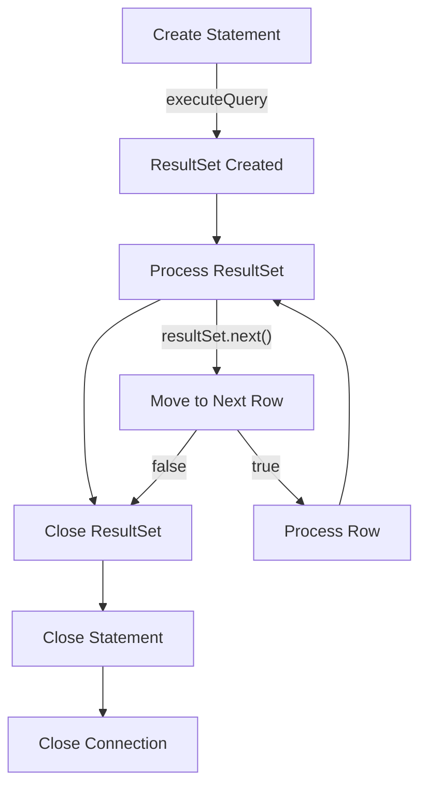

# Java ResultSet

## Introduction

A `ResultSet` is one of the fundamental components of Java Database Connectivity (JDBC) that allows you to interact with the results of a database query. When you execute a SQL query through JDBC, the data returned from the database is encapsulated in a `ResultSet` object, which provides methods to navigate through the rows of data and access the values in each column.

Think of a `ResultSet` as a table-like structure where:
- Each row represents a record from your database query
- Each column represents a field from those records
- You have a cursor that points to the current row being processed

In this tutorial, we'll explore how to work with `ResultSet` objects effectively, including navigation, data retrieval, and best practices.

## Creating a ResultSet

A `ResultSet` object is created when you execute a SQL query using a `Statement`, `PreparedStatement`, or `CallableStatement` object. You don't directly instantiate a `ResultSet` - it's returned by the execution methods.

Here's a simple example of how to obtain a `ResultSet`:

```java
import java.sql.*;

public class ResultSetExample {
    public static void main(String[] args) {
        // Database connection variables
        String url = "jdbc:mysql://localhost:3306/mydatabase";
        String username = "root";
        String password = "password";
        
        try {
            // Establish a connection
            Connection connection = DriverManager.getConnection(url, username, password);
            
            // Create a statement
            Statement statement = connection.createStatement();
            
            // Execute a query and get a ResultSet
            ResultSet resultSet = statement.executeQuery("SELECT * FROM employees");
            
            // Process the ResultSet (we'll cover this next)
            
            // Close resources
            resultSet.close();
            statement.close();
            connection.close();
        } catch (SQLException e) {
            e.printStackTrace();
        }
    }
}
```

## ResultSet Types and Concurrency

When creating a `Statement`, you can specify the type and concurrency mode for the `ResultSet` it will generate:

```java
// Create a scrollable and updatable ResultSet
Statement statement = connection.createStatement(
    ResultSet.TYPE_SCROLL_INSENSITIVE,  // Type
    ResultSet.CONCUR_UPDATABLE          // Concurrency
);
```

### ResultSet Types

1. **ResultSet.TYPE_FORWARD_ONLY** (default): The cursor can only move forward through the ResultSet.
2. **ResultSet.TYPE_SCROLL_INSENSITIVE**: The cursor can move both forward and backward, and is not sensitive to changes made by others.
3. **ResultSet.TYPE_SCROLL_SENSITIVE**: The cursor can move both forward and backward, and is sensitive to changes made by others.

### Concurrency Modes

1. **ResultSet.CONCUR_READ_ONLY** (default): The ResultSet cannot be used to update the database.
2. **ResultSet.CONCUR_UPDATABLE**: The ResultSet can be used to update the database.

## Navigating a ResultSet

The `ResultSet` interface provides several methods for moving the cursor:

```java
try {
    // Execute a query
    ResultSet resultSet = statement.executeQuery("SELECT * FROM employees");
    
    // Move to the first row
    boolean hasFirstRow = resultSet.first();  // Only works with scrollable ResultSets
    
    // Move to the next row (this is the most common method)
    boolean hasNextRow = resultSet.next();
    
    // Move to the previous row
    boolean hasPreviousRow = resultSet.previous();  // Only works with scrollable ResultSets
    
    // Move to the last row
    boolean hasLastRow = resultSet.last();  // Only works with scrollable ResultSets
    
    // Move to an absolute position (row 3)
    boolean hasAbsoluteRow = resultSet.absolute(3);  // Only works with scrollable ResultSets
    
    // Move relatively from current position (forward 2 rows)
    boolean hasRelativeRow = resultSet.relative(2);  // Only works with scrollable ResultSets
    
    // Check if cursor is before first row
    boolean isBeforeFirst = resultSet.isBeforeFirst();
    
    // Check if cursor is after last row
    boolean isAfterLast = resultSet.isAfterLast();
} catch (SQLException e) {
    e.printStackTrace();
}
```

For non-scrollable `ResultSet` objects (TYPE_FORWARD_ONLY), only the `next()` method is available for navigation.

### The next() Method Pattern

For beginners, the most common pattern for processing `ResultSet` objects is using the `next()` method in a while loop:

```java
ResultSet resultSet = statement.executeQuery("SELECT * FROM employees");

// Process each row
while (resultSet.next()) {
    // Access data from the current row
    // (we'll cover this next)
}
```

## Retrieving Data from a ResultSet

The `ResultSet` interface provides various methods to retrieve data from the current row:

```java
ResultSet resultSet = statement.executeQuery("SELECT id, first_name, last_name, hire_date, salary FROM employees");

while (resultSet.next()) {
    // Get data by column index (1-based)
    int id = resultSet.getInt(1);
    String firstName = resultSet.getString(2);
    
    // Get data by column name (more readable)
    String lastName = resultSet.getString("last_name");
    Date hireDate = resultSet.getDate("hire_date");
    double salary = resultSet.getDouble("salary");
    
    // Print the employee information
    System.out.println("Employee #" + id + ": " + firstName + " " + lastName);
    System.out.println("  Hired on: " + hireDate);
    System.out.println("  Salary: $" + salary);
    System.out.println();
}
```

### Common Data Retrieval Methods

Here's a list of common methods for retrieving different data types:

| Method | Description |
|--------|-------------|
| `getString(int)` or `getString(String)` | Retrieves a String value |
| `getInt(int)` or `getInt(String)` | Retrieves an int value |
| `getLong(int)` or `getLong(String)` | Retrieves a long value |
| `getDouble(int)` or `getDouble(String)` | Retrieves a double value |
| `getFloat(int)` or `getFloat(String)` | Retrieves a float value |
| `getBoolean(int)` or `getBoolean(String)` | Retrieves a boolean value |
| `getDate(int)` or `getDate(String)` | Retrieves a java.sql.Date value |
| `getTime(int)` or `getTime(String)` | Retrieves a java.sql.Time value |
| `getTimestamp(int)` or `getTimestamp(String)` | Retrieves a java.sql.Timestamp value |
| `getBinaryStream(int)` or `getBinaryStream(String)` | Retrieves a binary stream |
| `getBlob(int)` or `getBlob(String)` | Retrieves a Blob value |
| `getClob(int)` or `getClob(String)` | Retrieves a Clob value |
| `getObject(int)` or `getObject(String)` | Retrieves an Object value |

### Handling NULL Values

When retrieving data from a database, some columns might contain NULL values. After calling a getter method, you can check if the last value retrieved was NULL using the `wasNull()` method:

```java
int age = resultSet.getInt("age");
if (resultSet.wasNull()) {
    // Handle the case where age is NULL
    age = -1; // or set to default value
}
```

## Updating Data Through a ResultSet

If you created an updatable `ResultSet` (with `ResultSet.CONCUR_UPDATABLE`), you can modify the data directly:

```java
// Create an updatable ResultSet
Statement statement = connection.createStatement(
    ResultSet.TYPE_SCROLL_INSENSITIVE,
    ResultSet.CONCUR_UPDATABLE
);

ResultSet resultSet = statement.executeQuery("SELECT id, first_name, last_name, salary FROM employees");

// Move to the second row
resultSet.absolute(2);

// Update the salary
resultSet.updateDouble("salary", 75000.00);
resultSet.updateRow(); // Apply the changes to the database

// Insert a new row
resultSet.moveToInsertRow();
resultSet.updateInt("id", 101);
resultSet.updateString("first_name", "John");
resultSet.updateString("last_name", "Doe");
resultSet.updateDouble("salary", 65000.00);
resultSet.insertRow();
resultSet.moveToCurrentRow();

// Delete a row
resultSet.absolute(3);
resultSet.deleteRow();
```

## ResultSet Metadata

`ResultSetMetaData` provides information about the columns in a `ResultSet`, such as column names, types, and properties:

```java
ResultSet resultSet = statement.executeQuery("SELECT * FROM employees");
ResultSetMetaData metaData = resultSet.getMetaData();

// Get the number of columns
int columnCount = metaData.getColumnCount();

// Print column information
System.out.println("Query returns " + columnCount + " columns");
for (int i = 1; i <= columnCount; i++) {
    System.out.println("Column " + i + ":");
    System.out.println("  Name: " + metaData.getColumnName(i));
    System.out.println("  Type: " + metaData.getColumnTypeName(i));
    System.out.println("  Size: " + metaData.getColumnDisplaySize(i));
}
```

## Practical Example: Building a Dynamic Data Viewer

Here's a practical example that demonstrates how to use `ResultSet` and `ResultSetMetaData` to build a dynamic data viewer that works with any SQL query:

```java
import java.sql.*;
import java.util.ArrayList;
import java.util.List;

public class DynamicDataViewer {
    
    public static void main(String[] args) {
        String url = "jdbc:mysql://localhost:3306/mydatabase";
        String username = "root";
        String password = "password";
        String query = "SELECT * FROM employees WHERE department = 'Engineering'";
        
        try {
            Connection connection = DriverManager.getConnection(url, username, password);
            Statement statement = connection.createStatement();
            ResultSet resultSet = statement.executeQuery(query);
            
            // Display the data in a formatted table
            displayResultSet(resultSet);
            
            // Close resources
            resultSet.close();
            statement.close();
            connection.close();
        } catch (SQLException e) {
            e.printStackTrace();
        }
    }
    
    public static void displayResultSet(ResultSet resultSet) throws SQLException {
        ResultSetMetaData metaData = resultSet.getMetaData();
        int columnCount = metaData.getColumnCount();
        
        // Store column names and maximum widths
        List<String> columnNames = new ArrayList<>();
        List<Integer> columnWidths = new ArrayList<>();
        
        for (int i = 1; i <= columnCount; i++) {
            String columnName = metaData.getColumnName(i);
            columnNames.add(columnName);
            columnWidths.add(Math.max(columnName.length(), 15)); // Min width of 15
        }
        
        // Print header
        printTableLine(columnWidths);
        for (int i = 0; i < columnCount; i++) {
            System.out.print("| " + padRight(columnNames.get(i), columnWidths.get(i)) + " ");
        }
        System.out.println("|");
        printTableLine(columnWidths);
        
        // Print data rows
        int rowCount = 0;
        while (resultSet.next()) {
            rowCount++;
            for (int i = 1; i <= columnCount; i++) {
                String value = resultSet.getString(i);
                if (resultSet.wasNull()) {
                    value = "NULL";
                }
                System.out.print("| " + padRight(value, columnWidths.get(i-1)) + " ");
            }
            System.out.println("|");
        }
        printTableLine(columnWidths);
        
        // Print summary
        System.out.println(rowCount + " row(s) in set");
    }
    
    private static void printTableLine(List<Integer> widths) {
        for (int width : widths) {
            System.out.print("+-" + "-".repeat(width) + "-");
        }
        System.out.println("+");
    }
    
    private static String padRight(String s, int n) {
        if (s == null) {
            s = "NULL";
        }
        return String.format("%-" + n + "s", s.length() <= n ? s : s.substring(0, n-3) + "...");
    }
}
```

**Sample Output:**
```
+---------------+---------------+---------------+---------------+---------------+
| id            | first_name    | last_name     | department    | salary        |
+---------------+---------------+---------------+---------------+---------------+
| 1             | Alice         | Johnson       | Engineering   | 85000.00      |
| 3             | Carlos        | Rodriguez     | Engineering   | 92000.00      |
| 5             | Emily         | Chen          | Engineering   | 88000.00      |
| 8             | Michael       | Wong          | Engineering   | 79000.00      |
+---------------+---------------+---------------+---------------+---------------+
4 row(s) in set
```

## ResultSet Life Cycle

Understanding the lifecycle of a `ResultSet` is important for proper resource management:



1. **Creation**: A `ResultSet` is created when you execute a query using a `Statement`, `PreparedStatement`, or `CallableStatement`.
2. **Navigation**: You navigate through the `ResultSet` using methods like `next()`, `previous()`, etc.
3. **Data Retrieval**: You retrieve data using getter methods like `getString()`, `getInt()`, etc.
4. **Closing**: You must explicitly close the `ResultSet` when you're done with it, which releases database resources.

## Best Practices for Working with ResultSet

1. **Always close resources**: Use try-with-resources or finally blocks to ensure `ResultSet`, `Statement`, and `Connection` objects are closed.

```java
try (
    Connection connection = DriverManager.getConnection(url, username, password);
    Statement statement = connection.createStatement();
    ResultSet resultSet = statement.executeQuery(query)
) {
    // Process resultSet
    while (resultSet.next()) {
        // ...
    }
} catch (SQLException e) {
    e.printStackTrace();
}
// Resources automatically closed here
```

2. **Use column names instead of indices**: It makes code more readable and less prone to errors when column orders change.

3. **Check for NULL values**: Always handle potential NULL values from the database.

4. **Be aware of ResultSet type limitations**: Not all databases support all `ResultSet` types and concurrency modes.

5. **Consider batch processing for large datasets**: For huge result sets, consider processing data in batches to manage memory usage.

6. **Avoid keeping ResultSets open longer than needed**: Close them as soon as you're done processing the data.

## Common Errors and Troubleshooting

### "Operation not allowed after ResultSet closed"

This error occurs when you try to access a `ResultSet` after closing it:

```java
ResultSet resultSet = statement.executeQuery(query);
resultSet.close();
// The following will throw an exception
String name = resultSet.getString("name"); // Error!
```

### "Invalid cursor position"

This error occurs when you try to retrieve data without properly positioning the cursor:

```java
ResultSet resultSet = statement.executeQuery(query);
// The following will throw an exception
String name = resultSet.getString("name"); // Error! Need to call next() first
```

### "Column not found"

This error occurs when you try to access a column that doesn't exist:

```java
ResultSet resultSet = statement.executeQuery("SELECT id, name FROM employees");
while (resultSet.next()) {
    // The following will throw an exception
    double salary = resultSet.getDouble("salary"); // Error! Column doesn't exist in the result
}
```

## Summary

The `ResultSet` interface is a powerful component of JDBC that allows you to work with data returned from SQL queries. In this tutorial, we've covered:

- How to create and navigate a `ResultSet`
- Different `ResultSet` types and concurrency modes
- Retrieving various types of data from a `ResultSet`
- Updating data through an updatable `ResultSet`
- Working with `ResultSetMetaData` to get information about columns
- Best practices and common errors when working with `ResultSet` objects

By mastering the `ResultSet` interface, you'll be able to interact with databases effectively in your Java applications.

## Additional Resources and Exercises

### Resources
- [Java ResultSet API Documentation](https://docs.oracle.com/en/java/javase/11/docs/api/java.sql/java/sql/ResultSet.html)
- [JDBC Tutorial - Oracle Docs](https://docs.oracle.com/javase/tutorial/jdbc/basics/index.html)

### Practice Exercises

1. **Employee Database Explorer**: Create a program that allows a user to enter SQL queries and displays the results in a formatted table.

2. **CSV Export Tool**: Create a utility that executes a SQL query and exports the results to a CSV file.

3. **ResultSet Navigation Practice**: Write a program that demonstrates all the navigation methods of a scrollable `ResultSet`.

4. **Data Statistics Calculator**: Create a program that calculates statistics (min, max, average, etc.) from numeric columns in a database table.

5. **Data Transformation Pipeline**: Build a program that reads data from one table, transforms it in some way (e.g., currency conversion, text formatting), and writes it to another table using updatable `ResultSet` objects.

Remember that working effectively with databases requires practice, so try to incorporate these concepts into your projects to solidify your understanding.