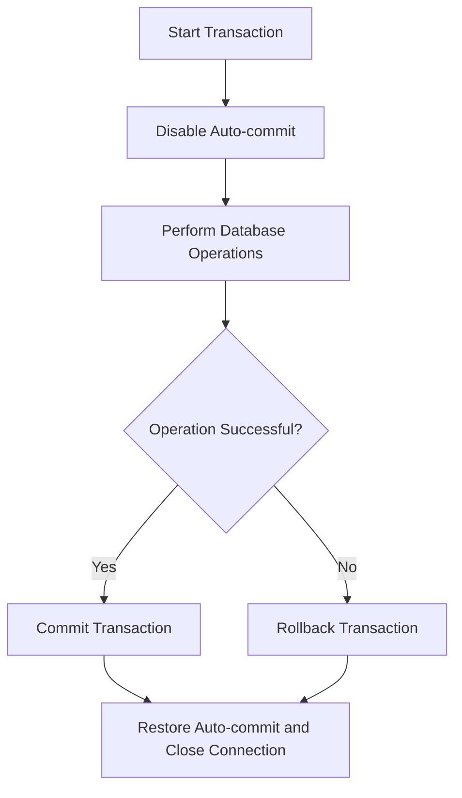

# Java Transactions

## Introduction

In database operations, maintaining data integrity is crucial. Imagine transferring money between bank accounts - you need to ensure that if one part of the operation fails, the entire operation is canceled. This is where **transactions** come in.

A transaction is a sequence of operations that are executed as a single unit of work - either all operations succeed, or none of them take effect. In JDBC, transactions provide a mechanism to control the execution of SQL statements, ensuring data consistency and integrity.

In this tutorial, you'll learn how to use transactions in Java applications through JDBC to maintain the reliability and integrity of your database operations.

## Understanding Transactions

Before diving into code, let's understand the key properties of transactions, often referred to as the **ACID** properties:

- **Atomicity**: All operations in a transaction complete successfully, or none of them do
- **Consistency**: The database remains in a consistent state before and after the transaction
- **Isolation**: Transactions operate independently without interference
- **Durability**: Once a transaction is committed, it remains permanent even in the event of system failure

## Basic Transaction Control in JDBC

By default, JDBC operates in auto-commit mode, meaning each SQL statement is treated as a separate transaction and automatically committed after execution. To use transactions properly, we need to disable this behavior.

Here's the basic pattern for using transactions in JDBC:

```java
Connection connection = null;
try {
    // Step 1: Establish connection
    connection = DriverManager.getConnection("jdbc:mysql://localhost:3306/mydb", "username", "password");
    
    // Step 2: Disable auto-commit
    connection.setAutoCommit(false);
    
    // Step 3: Perform multiple database operations
    Statement stmt = connection.createStatement();
    stmt.executeUpdate("UPDATE accounts SET balance = balance - 1000 WHERE account_id = 1");
    stmt.executeUpdate("UPDATE accounts SET balance = balance + 1000 WHERE account_id = 2");
    
    // Step 4: Commit the transaction
    connection.commit();
    System.out.println("Transaction committed successfully!");
    
} catch (SQLException e) {
    // Step 5: Roll back in case of an exception
    if (connection != null) {
        try {
            connection.rollback();
            System.out.println("Transaction rolled back due to an error!");
        } catch (SQLException ex) {
            ex.printStackTrace();
        }
    }
    e.printStackTrace();
} finally {
    // Step 6: Restore auto-commit mode and close connection
    if (connection != null) {
        try {
            connection.setAutoCommit(true);
            connection.close();
        } catch (SQLException e) {
            e.printStackTrace();
        }
    }
}
```

## Transaction Flow Visualization

Here's a diagram showing the flow of a database transaction:



## Practical Example: Bank Transfer System

Let's create a complete example that simulates a bank transfer between two accounts:

```java
import java.sql.*;

public class BankTransferExample {

    // Database connection parameters
    private static final String DB_URL = "jdbc:mysql://localhost:3306/bank_db";
    private static final String USER = "bank_user";
    private static final String PASS = "bank_password";
    
    public static void main(String[] args) {
        transferFunds(101, 102, 500.00);
    }
    
    public static void transferFunds(int fromAccount, int toAccount, double amount) {
        Connection conn = null;
        
        try {
            // Step 1: Connect to database
            conn = DriverManager.getConnection(DB_URL, USER, PASS);
            
            // Step 2: Begin transaction
            conn.setAutoCommit(false);
            System.out.println("Transaction started...");
            
            // Step 3: Verify sufficient funds
            PreparedStatement checkBalanceStmt = conn.prepareStatement(
                "SELECT balance FROM accounts WHERE account_id = ?");
            checkBalanceStmt.setInt(1, fromAccount);
            ResultSet rs = checkBalanceStmt.executeQuery();
            
            if (rs.next()) {
                double currentBalance = rs.getDouble("balance");
                
                if (currentBalance < amount) {
                    System.out.println("Insufficient funds! Transaction cancelled.");
                    return; // Exit without committing
                }
            } else {
                System.out.println("Source account not found! Transaction cancelled.");
                return; // Exit without committing
            }
            
            // Step 4: Perform withdrawal
            PreparedStatement withdrawStmt = conn.prepareStatement(
                "UPDATE accounts SET balance = balance - ? WHERE account_id = ?");
            withdrawStmt.setDouble(1, amount);
            withdrawStmt.setInt(2, fromAccount);
            int withdrawalResult = withdrawStmt.executeUpdate();
            
            // Step 5: Perform deposit
            PreparedStatement depositStmt = conn.prepareStatement(
                "UPDATE accounts SET balance = balance + ? WHERE account_id = ?");
            depositStmt.setDouble(1, amount);
            depositStmt.setInt(2, toAccount);
            int depositResult = depositStmt.executeUpdate();
            
            // Step 6: Verify both operations succeeded
            if (withdrawalResult == 1 && depositResult == 1) {
                // Step 7: Commit the transaction
                conn.commit();
                System.out.println("Transaction committed: $" + amount + 
                                  " transferred from account " + fromAccount + 
                                  " to account " + toAccount);
            } else {
                // Something went wrong, roll back
                conn.rollback();
                System.out.println("Transaction failed! Rolling back...");
            }
            
            // Optional: Log the transaction
            PreparedStatement logStmt = conn.prepareStatement(
                "INSERT INTO transaction_log (from_account, to_account, amount, transaction_date) VALUES (?, ?, ?, NOW())");
            logStmt.setInt(1, fromAccount);
            logStmt.setInt(2, toAccount);
            logStmt.setDouble(3, amount);
            logStmt.executeUpdate();
            conn.commit(); // Commit the log entry separately
            
        } catch (SQLException e) {
            // Step 8: Handle errors by rolling back
            try {
                if (conn != null) {
                    conn.rollback();
                    System.out.println("Transaction rolled back due to error!");
                }
            } catch (SQLException ex) {
                System.out.println("Failed to rollback transaction: " + ex.getMessage());
            }
            e.printStackTrace();
        } finally {
            // Step 9: Restore auto-commit and close resources
            try {
                if (conn != null) {
                    conn.setAutoCommit(true);
                    conn.close();
                    System.out.println("Database connection closed.");
                }
            } catch (SQLException e) {
                System.out.println("Failed to close connection: " + e.getMessage());
            }
        }
    }
}
```

### Expected Output:

If the transaction is successful:
```
Transaction started...
Transaction committed: $500.0 transferred from account 101 to account 102
Database connection closed.
```

If there are insufficient funds:
```
Transaction started...
Insufficient funds! Transaction cancelled.
Database connection closed.
```

## Transaction Isolation Levels

JDBC supports different isolation levels that control how transactions interact with each other. These levels trade off between data consistency and performance:

```java
// Setting transaction isolation level
connection.setTransactionIsolation(Connection.TRANSACTION_READ_COMMITTED);
```

The available isolation levels in JDBC are:

| Isolation Level | Description |
|-----------------|-------------|
| `TRANSACTION_NONE` | No transaction support |
| `TRANSACTION_READ_UNCOMMITTED` | Allows dirty reads (can see uncommitted changes from other transactions) |
| `TRANSACTION_READ_COMMITTED` | Prevents dirty reads (default in many databases) |
| `TRANSACTION_REPEATABLE_READ` | Prevents dirty reads and non-repeatable reads |
| `TRANSACTION_SERIALIZABLE` | Highest isolation; prevents all concurrency issues but has lowest performance |

Here's how to check and set the isolation level:

```java
// Check current isolation level
int isolationLevel = connection.getTransactionIsolation();
System.out.println("Current isolation level: " + isolationLevel);

// Set a new isolation level
connection.setTransactionIsolation(Connection.TRANSACTION_SERIALIZABLE);
```

## Transaction Savepoints

Sometimes you may want to roll back only part of a transaction rather than the entire transaction. JDBC provides savepoints for this purpose:

```java
Connection connection = null;
Savepoint savepoint1 = null;

try {
    connection = DriverManager.getConnection(DB_URL, USER, PASS);
    connection.setAutoCommit(false);
    
    Statement stmt = connection.createStatement();
    
    // First operation
    stmt.executeUpdate("INSERT INTO products (name, price) VALUES ('Product A', 10.99)");
    
    // Create a savepoint after first operation
    savepoint1 = connection.setSavepoint("SavePoint1");
    
    // Second operation
    stmt.executeUpdate("INSERT INTO products (name, price) VALUES ('Invalid Product', -5.99)");
    
    // If we reach here and decide the second operation was invalid
    connection.rollback(savepoint1);  // Roll back to savepoint1
    System.out.println("Rolled back to savepoint after second operation");
    
    // Third operation - will still execute since we only rolled back to the savepoint
    stmt.executeUpdate("INSERT INTO products (name, price) VALUES ('Product B', 24.99)");
    
    // Commit what remains in the transaction (first and third operations)
    connection.commit();
    System.out.println("Transaction committed with first and third operations");
    
} catch (SQLException e) {
    if (connection != null) {
        try {
            connection.rollback();  // Roll back entire transaction in case of error
            System.out.println("Transaction completely rolled back due to error");
        } catch (SQLException ex) {
            ex.printStackTrace();
        }
    }
    e.printStackTrace();
} finally {
    if (connection != null) {
        try {
            connection.setAutoCommit(true);
            connection.close();
        } catch (SQLException e) {
            e.printStackTrace();
        }
    }
}
```

## Best Practices for Using Transactions

1. **Keep transactions short**: Long-running transactions can lead to locking issues and reduced concurrency.

2. **Handle exceptions properly**: Always include proper exception handling with rollback mechanisms.

3. **Close resources in finally blocks**: Ensure connections are properly closed even if exceptions occur.

4. **Choose the appropriate isolation level**: Use the least restrictive isolation level that meets your application's needs.

5. **Use PreparedStatements**: They perform better and protect against SQL injection.

6. **Understand your database's default behavior**: Different database systems may have different default isolation levels.

7. **Test transaction behavior**: Especially under concurrent access conditions.

## Common Transaction Pitfalls

1. **Forgetting to disable auto-commit**: If auto-commit remains enabled, your code won't behave as a transaction.

2. **Not handling rollbacks in catch blocks**: This can leave the database in an inconsistent state.

3. **Nested transactions**: JDBC doesn't directly support nested transactions. Be careful when calling methods that might start their own transactions.

4. **Transaction timeouts**: Long-running transactions may timeout, so set appropriate timeout values.

5. **Connection pooling issues**: When using connection pools, ensure connections are properly returned to the pool with auto-commit reset.

## Summary

Transactions are a powerful feature in JDBC that help maintain data integrity and consistency in your database operations. They ensure that a series of database operations either complete entirely or have no effect at all.

In this tutorial, you've learned:

- How to start, commit, and roll back transactions in JDBC
- How to implement transaction control in a practical bank transfer scenario
- How to use different isolation levels based on your application needs
- How to use savepoints for more granular control over transactions
- Best practices and common pitfalls when working with transactions

By implementing transactions properly, you can build more robust applications that maintain data integrity even when errors occur.

## Additional Resources

- [Oracle JDBC Documentation on Transactions](https://docs.oracle.com/javase/tutorial/jdbc/basics/transactions.html)
- [MySQL Documentation on Transactions](https://dev.mysql.com/doc/refman/8.0/en/commit.html)
- [PostgreSQL Transaction Documentation](https://www.postgresql.org/docs/current/tutorial-transactions.html)

## Exercises

1. Modify the bank transfer example to include a transaction log table that records all successful and failed transactions.

2. Create a simple inventory management system that uses transactions to ensure that when a product is sold, both the inventory count decreases and the sales record is created.

3. Implement a transaction with different isolation levels and observe how they affect concurrent access from multiple connections.

4. Create a batch processing system that uses savepoints to track progress through a large set of operations, allowing partial rollbacks if needed.

5. Develop a small application that demonstrates the differences between auto-commit mode and explicit transaction control with timing measurements.