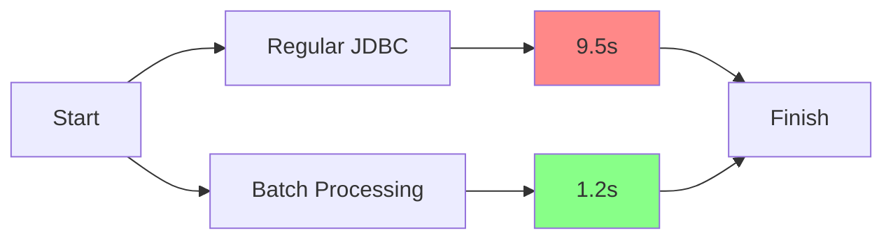
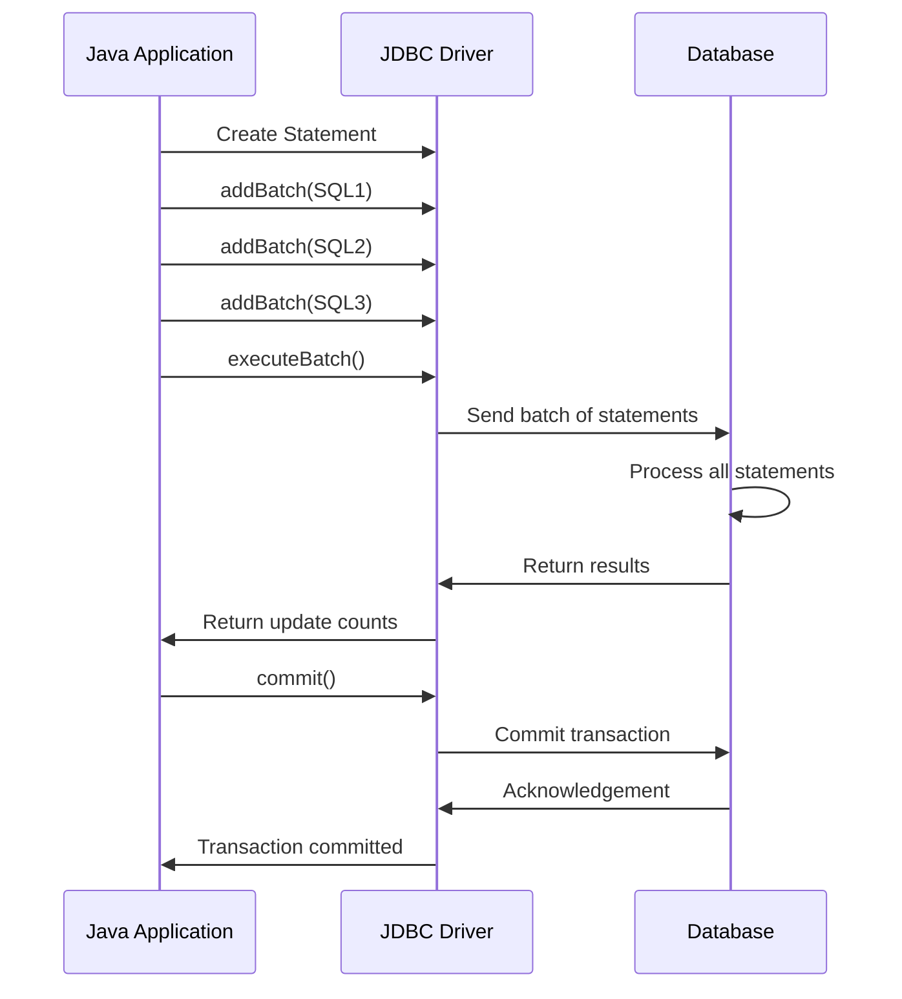

# Java Batch Processing

## Introduction

When your Java application needs to perform multiple similar database operations, such as inserting hundreds of records or updating multiple rows, executing these operations one by one can be inefficient. This is where **batch processing** comes in. 

Batch processing allows you to group multiple SQL statements together and submit them to the database in a single call. This approach significantly reduces network traffic between your application and the database, leading to dramatically improved performance.

In this tutorial, we'll explore how to implement batch processing using JDBC (Java Database Connectivity), understand its benefits, and see real-world applications.

## Why Use Batch Processing?

Before diving into the implementation details, let's understand why batch processing is so important:

1. **Performance Improvement**: Reduces the number of round trips between your application and database
2. **Network Traffic Reduction**: Sends multiple operations in a single network packet
3. **Resource Efficiency**: Minimizes database connection overhead
4. **Transaction Management**: Allows grouping multiple operations in a single transaction

## Basic Batch Processing in JDBC

The JDBC API provides methods specifically designed for batch operations. Let's look at how to implement basic batch processing:

### Step 1: Set Up Connection

First, we need to establish a connection to our database:

```java
import java.sql.Connection;
import java.sql.DriverManager;
import java.sql.SQLException;
import java.sql.Statement;

public class BatchProcessingDemo {
    public static void main(String[] args) {
        String url = "jdbc:mysql://localhost:3306/mydb";
        String user = "username";
        String password = "password";
        
        try (Connection connection = DriverManager.getConnection(url, user, password)) {
            // Turn off auto-commit for better performance
            connection.setAutoCommit(false);
            
            // Batch processing code will go here
            
            // ... (we'll add code in the next steps)
            
        } catch (SQLException e) {
            e.printStackTrace();
        }
    }
}
```

### Step 2: Create and Add Statements to Batch

Now, let's add multiple SQL statements to a batch:

```java
try (Connection connection = DriverManager.getConnection(url, user, password)) {
    // Turn off auto-commit
    connection.setAutoCommit(false);
    
    // Create statement
    try (Statement stmt = connection.createStatement()) {
        // Add statements to batch
        stmt.addBatch("INSERT INTO employees (name, department, salary) VALUES ('John Doe', 'IT', 75000)");
        stmt.addBatch("INSERT INTO employees (name, department, salary) VALUES ('Jane Smith', 'HR', 65000)");
        stmt.addBatch("INSERT INTO employees (name, department, salary) VALUES ('Bob Johnson', 'Finance', 80000)");
        stmt.addBatch("UPDATE departments SET budget = budget + 10000 WHERE name = 'IT'");
        
        // More batch statements can be added here
        
        // ... (next step will show how to execute the batch)
    }
    
} catch (SQLException e) {
    e.printStackTrace();
}
```

### Step 3: Execute the Batch

After adding all statements to the batch, we execute them together:

```java
try (Connection connection = DriverManager.getConnection(url, user, password)) {
    connection.setAutoCommit(false);
    
    try (Statement stmt = connection.createStatement()) {
        // Add statements to batch
        stmt.addBatch("INSERT INTO employees (name, department, salary) VALUES ('John Doe', 'IT', 75000)");
        stmt.addBatch("INSERT INTO employees (name, department, salary) VALUES ('Jane Smith', 'HR', 65000)");
        stmt.addBatch("INSERT INTO employees (name, department, salary) VALUES ('Bob Johnson', 'Finance', 80000)");
        stmt.addBatch("UPDATE departments SET budget = budget + 10000 WHERE name = 'IT'");
        
        // Execute the batch
        int[] updateCounts = stmt.executeBatch();
        
        // Commit the transaction
        connection.commit();
        
        // Print results
        System.out.println("Batch executed successfully!");
        System.out.println("Number of statements executed: " + updateCounts.length);
        
        for (int i = 0; i < updateCounts.length; i++) {
            System.out.println("Statement " + (i + 1) + " affected " + updateCounts[i] + " rows");
        }
    } catch (SQLException e) {
        // If there's an error, roll back the transaction
        connection.rollback();
        e.printStackTrace();
    }
} catch (SQLException e) {
    e.printStackTrace();
}
```

**Output:**
```
Batch executed successfully!
Number of statements executed: 4
Statement 1 affected 1 rows
Statement 2 affected 1 rows
Statement 3 affected 1 rows
Statement 4 affected 1 rows
```

## Batch Processing with PreparedStatement

For better security and performance, especially when executing similar statements repeatedly, using `PreparedStatement` is recommended:

```java
import java.sql.Connection;
import java.sql.DriverManager;
import java.sql.PreparedStatement;
import java.sql.SQLException;

public class BatchProcessingWithPreparedStatement {
    public static void main(String[] args) {
        String url = "jdbc:mysql://localhost:3306/mydb";
        String user = "username";
        String password = "password";
        
        try (Connection connection = DriverManager.getConnection(url, user, password)) {
            connection.setAutoCommit(false);
            
            String sql = "INSERT INTO employees (name, department, salary) VALUES (?, ?, ?)";
            
            try (PreparedStatement pstmt = connection.prepareStatement(sql)) {
                // First employee
                pstmt.setString(1, "Michael Scott");
                pstmt.setString(2, "Management");
                pstmt.setDouble(3, 70000);
                pstmt.addBatch();
                
                // Second employee
                pstmt.setString(1, "Jim Halpert");
                pstmt.setString(2, "Sales");
                pstmt.setDouble(3, 60000);
                pstmt.addBatch();
                
                // Third employee
                pstmt.setString(1, "Pam Beesly");
                pstmt.setString(2, "Reception");
                pstmt.setDouble(3, 45000);
                pstmt.addBatch();
                
                // Execute batch
                int[] updateCounts = pstmt.executeBatch();
                
                // Commit
                connection.commit();
                
                System.out.println("Prepared statement batch executed successfully!");
                System.out.println("Total records inserted: " + updateCounts.length);
            } catch (SQLException e) {
                connection.rollback();
                e.printStackTrace();
            }
        } catch (SQLException e) {
            e.printStackTrace();
        }
    }
}
```

**Output:**
```
Prepared statement batch executed successfully!
Total records inserted: 3
```

## Best Practices for Batch Processing

To get the most out of JDBC batch processing, follow these best practices:

### 1. Optimal Batch Size

While batching improves performance, excessively large batches can consume too much memory. Here's an example showing how to process a large dataset with optimal batch sizes:

```java
public static void insertEmployeesInBatches(Connection connection, List<Employee> employees) throws SQLException {
    String sql = "INSERT INTO employees (name, department, salary) VALUES (?, ?, ?)";
    final int BATCH_SIZE = 1000;
    
    try (PreparedStatement pstmt = connection.prepareStatement(sql)) {
        connection.setAutoCommit(false);
        
        int count = 0;
        for (Employee emp : employees) {
            pstmt.setString(1, emp.getName());
            pstmt.setString(2, emp.getDepartment());
            pstmt.setDouble(3, emp.getSalary());
            pstmt.addBatch();
            
            count++;
            
            // Execute batch when it reaches the batch size
            if (count % BATCH_SIZE == 0) {
                pstmt.executeBatch();
                System.out.println("Batch executed. Processed " + count + " records so far.");
            }
        }
        
        // Execute remaining statements
        if (count % BATCH_SIZE != 0) {
            pstmt.executeBatch();
            System.out.println("Final batch executed. Total records: " + count);
        }
        
        connection.commit();
    }
}
```

### 2. Error Handling

When errors occur during batch execution, you need to handle them properly:

```java
try {
    // Add batch statements
    // ...
    
    // Execute the batch
    int[] updateCounts = pstmt.executeBatch();
    
    connection.commit();
    
    // Process update counts
    for (int i = 0; i < updateCounts.length; i++) {
        if (updateCounts[i] == Statement.EXECUTE_FAILED) {
            System.out.println("Execution failed for statement " + (i + 1));
        } else {
            System.out.println("Statement " + (i + 1) + " affected " + updateCounts[i] + " rows");
        }
    }
    
} catch (BatchUpdateException e) {
    connection.rollback();
    
    // Get the update counts for successful statements
    int[] updateCounts = e.getUpdateCounts();
    System.err.println("Batch error. Successful updates before error: " + updateCounts.length);
    
    // Log the specific error
    System.err.println("Error message: " + e.getMessage());
    e.printStackTrace();
}
```

### 3. Disable Auto-Commit

Always disable auto-commit mode when performing batch operations to reduce overhead:

```java
connection.setAutoCommit(false);
// Perform batch operations
// ...
connection.commit();
```

## Real-World Application: Data Import System

Let's create a more complete example of a system that imports data from a CSV file into a database using batch processing:

```java
import java.io.BufferedReader;
import java.io.FileReader;
import java.io.IOException;
import java.sql.*;
import java.util.ArrayList;
import java.util.List;

public class DataImportSystem {
    
    private static final int BATCH_SIZE = 500;
    
    public static void main(String[] args) {
        String url = "jdbc:mysql://localhost:3306/inventory_system";
        String user = "admin";
        String password = "password";
        String csvFile = "products.csv";
        
        long startTime = System.currentTimeMillis();
        
        try (Connection connection = DriverManager.getConnection(url, user, password)) {
            connection.setAutoCommit(false);
            
            // First, let's read all products from the CSV
            List<Product> products = readProductsFromCsv(csvFile);
            System.out.println("Read " + products.size() + " products from CSV file");
            
            // Then import them using batch processing
            int totalImported = importProductsBatch(connection, products);
            
            long endTime = System.currentTimeMillis();
            System.out.println("Successfully imported " + totalImported + " products");
            System.out.println("Import took " + (endTime - startTime) + " milliseconds");
            
        } catch (SQLException | IOException e) {
            e.printStackTrace();
        }
    }
    
    private static List<Product> readProductsFromCsv(String fileName) throws IOException {
        List<Product> products = new ArrayList<>();
        
        try (BufferedReader br = new BufferedReader(new FileReader(fileName))) {
            String line;
            // Skip header
            br.readLine();
            
            while ((line = br.readLine()) != null) {
                String[] values = line.split(",");
                Product product = new Product();
                product.setSku(values[0]);
                product.setName(values[1]);
                product.setCategory(values[2]);
                product.setPrice(Double.parseDouble(values[3]));
                product.setQuantity(Integer.parseInt(values[4]));
                
                products.add(product);
            }
        }
        
        return products;
    }
    
    private static int importProductsBatch(Connection connection, List<Product> products) throws SQLException {
        String sql = "INSERT INTO products (sku, name, category, price, quantity) VALUES (?, ?, ?, ?, ?)";
        
        int count = 0;
        int batchCount = 0;
        
        try (PreparedStatement pstmt = connection.prepareStatement(sql)) {
            for (Product product : products) {
                pstmt.setString(1, product.getSku());
                pstmt.setString(2, product.getName());
                pstmt.setString(3, product.getCategory());
                pstmt.setDouble(4, product.getPrice());
                pstmt.setInt(5, product.getQuantity());
                pstmt.addBatch();
                
                count++;
                
                if (count % BATCH_SIZE == 0) {
                    int[] results = pstmt.executeBatch();
                    batchCount++;
                    System.out.println("Executed batch " + batchCount + " with " + results.length + " operations");
                }
            }
            
            // Execute remaining statements
            if (count % BATCH_SIZE != 0) {
                int[] results = pstmt.executeBatch();
                batchCount++;
                System.out.println("Executed final batch " + batchCount + " with " + results.length + " operations");
            }
            
            connection.commit();
        } catch (BatchUpdateException e) {
            connection.rollback();
            
            int[] updateCounts = e.getUpdateCounts();
            int successfulUpdates = 0;
            for (int updateCount : updateCounts) {
                if (updateCount >= 0) {
                    successfulUpdates += updateCount;
                }
            }
            
            System.err.println("Batch error. Only " + successfulUpdates + " records were imported before failure.");
            throw e;
        }
        
        return count;
    }
    
    // Product class for the example
    static class Product {
        private String sku;
        private String name;
        private String category;
        private double price;
        private int quantity;
        
        // Getters and setters
        public String getSku() { return sku; }
        public void setSku(String sku) { this.sku = sku; }
        
        public String getName() { return name; }
        public void setName(String name) { this.name = name; }
        
        public String getCategory() { return category; }
        public void setCategory(String category) { this.category = category; }
        
        public double getPrice() { return price; }
        public void setPrice(double price) { this.price = price; }
        
        public int getQuantity() { return quantity; }
        public void setQuantity(int quantity) { this.quantity = quantity; }
    }
}
```

**Sample CSV Input (products.csv):**
```
sku,name,category,price,quantity
P001,Laptop,Electronics,999.99,15
P002,Headphones,Electronics,89.95,30
P003,Coffee Maker,Home,49.99,20
...
(many more rows)
```

**Sample Output:**
```
Read 1000 products from CSV file
Executed batch 1 with 500 operations
Executed batch 2 with 500 operations
Successfully imported 1000 products
Import took 827 milliseconds
```

## Batch Processing Performance Comparison

Let's visualize the performance difference between regular JDBC operations and batch processing:



## Batch Processing Workflow

Here's a visual representation of how batch processing works:



## Summary

Java batch processing with JDBC is a powerful technique for optimizing database operations by executing multiple queries in a single database call. Key takeaways include:

- Batch processing significantly improves performance for multiple similar database operations
- It reduces network traffic between your application and the database
- Both `Statement` and `PreparedStatement` support batch operations, but `PreparedStatement` is preferred for security and performance
- Always disable auto-commit when using batch processing
- Use appropriate batch sizes (typically between 100-1000) for optimal performance
- Proper error handling is crucial to manage failed batch operations

By implementing batch processing in your Java applications, you can achieve substantial performance improvements when working with databases, especially for operations involving large datasets.

## Further Exercises

1. **Exercise 1**: Create a batch processing system to update the prices of multiple products by a percentage.
2. **Exercise 2**: Implement a batch delete operation that removes inactive users based on their last login date.
3. **Exercise 3**: Extend the data import example to handle data validation before adding to the batch.
4. **Exercise 4**: Create a performance testing program that compares the execution time of individual inserts vs. batch inserts with different batch sizes.

## Additional Resources

- [Oracle's JDBC Batch Processing Guide](https://docs.oracle.com/javase/tutorial/jdbc/basics/jdbcswing.html)
- [JDBC API Documentation](https://docs.oracle.com/javase/8/docs/api/java/sql/Statement.html#addBatch-java.lang.String-)
- [Performance Tuning JDBC Applications](https://docs.oracle.com/cd/E11882_01/java.112/e16548/tune.htm#JJDBC28752)
- [MySQL Connector/J Developer Guide](https://dev.mysql.com/doc/connector-j/8.0/en/)