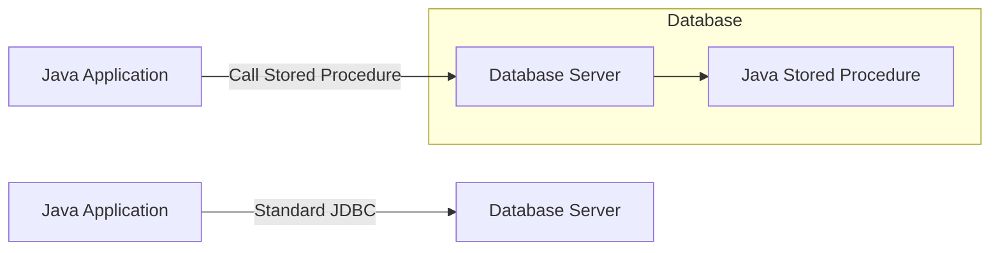

# Java Stored Procedures

## Introduction

Java Stored Procedures represent a powerful way to extend database functionality by writing procedures in Java rather than in the database's native procedural language (like PL/SQL for Oracle or T-SQL for SQL Server). This allows developers to leverage their Java skills and the rich Java ecosystem while performing complex operations directly within the database server.

In this tutorial, you'll learn:
- What Java stored procedures are and why they're useful
- How to create Java classes for stored procedures
- How to register and deploy Java code to your database
- How to call Java stored procedures from JDBC
- Best practices and common use cases

## What are Java Stored Procedures?

Java stored procedures are database routines written in Java that are stored and executed within the database server. Unlike standard JDBC code that runs in your application and communicates with the database, Java stored procedures run *inside* the database engine itself.



### Advantages of Java Stored Procedures

- **Performance**: Reduces network traffic by processing data where it resides
- **Reusability**: Can be called by multiple applications
- **Security**: Provides an additional layer of security by encapsulating business logic
- **Portability**: Java code can be more portable across database systems than native procedural languages
- **Leverage Java ecosystem**: Use Java libraries and features within your database operations

### Limitations

- **Database-specific implementation**: Despite Java's portability, the way you deploy stored procedures varies by database vendor
- **Debugging challenges**: Debugging code running inside a database can be complex
- **Version management**: Managing Java versions in the database requires careful coordination

## Setting Up Your Environment

To work with Java stored procedures, you'll need:

1. A database that supports Java stored procedures (Oracle, PostgreSQL, DB2, etc.)
2. JDK installed on both your development machine and database server
3. JDBC drivers for your database
4. Appropriate database permissions to create and execute stored procedures

## Creating a Simple Java Stored Procedure

Let's start with a basic example. We'll create a Java stored procedure for Oracle that calculates the factorial of a number.

### Step 1: Write the Java Class

```java
// Factorial.java
public class Factorial {
    public static int calculate(int n) {
        if (n <= 1) return 1;
        
        int result = 1;
        for (int i = 2; i <= n; i++) {
            result *= i;
        }
        return result;
    }
}
```

### Step 2: Compile the Java Class

```bash
javac Factorial.java
```

### Step 3: Upload to the Database (Oracle Example)

First, we need to load the class into the database:

```sql
CREATE OR REPLACE JAVA SOURCE NAMED "Factorial" AS
public class Factorial {
    public static int calculate(int n) {
        if (n <= 1) return 1;
        
        int result = 1;
        for (int i = 2; i <= n; i++) {
            result *= i;
        }
        return result;
    }
}
/
```

### Step 4: Create a PL/SQL Wrapper

Next, create a PL/SQL wrapper to call our Java method:

```sql
CREATE OR REPLACE FUNCTION factorial(n INTEGER) 
RETURN INTEGER
AS LANGUAGE JAVA 
NAME 'Factorial.calculate(int) return int';
/
```

### Step 5: Test the Function

```sql
SELECT factorial(5) FROM dual;
```

Result:
```
FACTORIAL(5)
-----------
        120
```

## Calling Java Stored Procedures via JDBC

Once your Java stored procedure is deployed to the database, you can call it from your Java application like any other stored procedure:

```java
import java.sql.*;

public class CallFactorial {
    public static void main(String[] args) {
        String url = "jdbc:oracle:thin:@localhost:1521:orcl";
        String username = "system";
        String password = "password";
        
        try (Connection conn = DriverManager.getConnection(url, username, password);
             CallableStatement stmt = conn.prepareCall("{? = call factorial(?)}")) {
            
            // Register the output parameter
            stmt.registerOutParameter(1, Types.INTEGER);
            
            // Set the input parameter
            stmt.setInt(2, 6);
            
            // Execute the stored procedure
            stmt.execute();
            
            // Get the result
            int result = stmt.getInt(1);
            System.out.println("Factorial of 6 = " + result);
            
        } catch (SQLException e) {
            e.printStackTrace();
        }
    }
}
```

Output:
```
Factorial of 6 = 720
```

## A More Complex Example: Database Utility Functions

Let's create a more practical example: a utility class for handling common database operations like string manipulation that might be cumbersome in SQL.

```java
// DbUtils.java
public class DbUtils {
    // Counts occurrences of a substring within a string
    public static int countOccurrences(String text, String searchStr) {
        if (text == null || searchStr == null || text.isEmpty() || searchStr.isEmpty()) {
            return 0;
        }
        
        int count = 0;
        int idx = 0;
        while ((idx = text.indexOf(searchStr, idx)) != -1) {
            count++;
            idx += searchStr.length();
        }
        return count;
    }
    
    // Reverse a string
    public static String reverseString(String input) {
        if (input == null) return null;
        return new StringBuilder(input).reverse().toString();
    }
    
    // Check if string is a valid email format
    public static boolean isValidEmail(String email) {
        if (email == null) return false;
        return email.matches("^[A-Za-z0-9+_.-]+@(.+)$");
    }
}
```

After compiling, load it into the Oracle database:

```sql
CREATE OR REPLACE JAVA SOURCE NAMED "DbUtils" AS
public class DbUtils {
    // Counts occurrences of a substring within a string
    public static int countOccurrences(String text, String searchStr) {
        if (text == null || searchStr == null || text.isEmpty() || searchStr.isEmpty()) {
            return 0;
        }
        
        int count = 0;
        int idx = 0;
        while ((idx = text.indexOf(searchStr, idx)) != -1) {
            count++;
            idx += searchStr.length();
        }
        return count;
    }
    
    // Reverse a string
    public static String reverseString(String input) {
        if (input == null) return null;
        return new StringBuilder(input).reverse().toString();
    }
    
    // Check if string is a valid email format
    public static boolean isValidEmail(String email) {
        if (email == null) return false;
        return email.matches("^[A-Za-z0-9+_.-]+@(.+)$");
    }
}
/
```

Create PL/SQL wrappers:

```sql
-- Count occurrences function
CREATE OR REPLACE FUNCTION count_occurrences(text VARCHAR2, search_str VARCHAR2) 
RETURN INTEGER
AS LANGUAGE JAVA 
NAME 'DbUtils.countOccurrences(java.lang.String, java.lang.String) return int';
/

-- Reverse string function
CREATE OR REPLACE FUNCTION reverse_string(input VARCHAR2) 
RETURN VARCHAR2
AS LANGUAGE JAVA 
NAME 'DbUtils.reverseString(java.lang.String) return java.lang.String';
/

-- Email validation function
CREATE OR REPLACE FUNCTION is_valid_email(email VARCHAR2) 
RETURN NUMBER
AS LANGUAGE JAVA 
NAME 'DbUtils.isValidEmail(java.lang.String) return boolean';
/
```

Now you can use these functions in SQL:

```sql
-- Count occurrences example
SELECT count_occurrences('Mississippi', 'is') FROM dual;

-- Reverse string example
SELECT reverse_string('Hello World') FROM dual;

-- Email validation example
SELECT 
    email,
    CASE WHEN is_valid_email(email) = 1 THEN 'Valid' ELSE 'Invalid' END as status
FROM users;
```

## Database-Specific Implementation Examples

### PostgreSQL Implementation

PostgreSQL supports Java stored procedures through its PL/Java extension:

```sql
-- First, install PL/Java extension
CREATE EXTENSION pljava;

-- Create Java function
CREATE OR REPLACE FUNCTION factorial(n INTEGER)
RETURNS INTEGER
AS 'Factorial.calculate'
LANGUAGE java;
```

### MySQL Implementation

MySQL doesn't support Java stored procedures directly, but you can use User-Defined Functions (UDFs) with C/C++ or use external connectors.

## Best Practices for Java Stored Procedures

1. **Keep them focused**: Each procedure should do one thing well
2. **Handle exceptions properly**: Implement robust error handling
3. **Optimize for performance**: Remember that these run in the database
4. **Avoid excessive memory usage**: Database servers often have memory constraints
5. **Minimize external dependencies**: Fewer dependencies means fewer potential issues
6. **Document thoroughly**: Include clear Javadoc comments
7. **Test extensively**: Unit test both the Java code and the procedure as deployed
8. **Version control**: Keep track of changes to your stored procedures

## Common Use Cases

Java stored procedures are especially valuable for:

1. **Complex calculations** that would be difficult in SQL
2. **Text processing and manipulation** beyond SQL's capabilities
3. **Integration with external systems** (with proper security considerations)
4. **Implementing business rules** that should be enforced at the database level
5. **Batch processing** of large datasets
6. **Custom data validation** beyond constraints

## Security Considerations

When working with Java stored procedures, consider:

1. **Permissions**: Carefully manage execute permissions
2. **Input validation**: Always validate inputs to prevent SQL injection
3. **Resource limits**: Set timeouts and resource limits
4. **Avoid sensitive information**: Don't hard-code credentials or sensitive data
5. **Regular auditing**: Periodically review who has access and how procedures are used

## Summary

Java Stored Procedures offer a powerful way to extend your database functionality using the Java language you already know. By running Java code directly within the database, you can improve performance, enhance security, and leverage Java's rich ecosystem for complex data processing tasks.

Key points to remember:
- Java stored procedures run inside the database server
- Implementation details vary by database vendor
- They provide better performance for complex operations on large datasets
- You can call them from Java applications using standard JDBC APIs
- Proper design and security considerations are essential

## Additional Resources

- [Oracle Java in the Database documentation](https://docs.oracle.com/en/database/oracle/oracle-database/19/jjdev/index.html)
- [PostgreSQL PL/Java documentation](https://github.com/tada/pljava/wiki)
- [IBM Db2 Java Routines documentation](https://www.ibm.com/docs/en/db2/11.5?topic=routines-java)

## Exercises

1. Create a Java stored procedure that calculates the Fibonacci sequence up to n terms.
2. Develop a string manipulation utility that formats phone numbers into a standardized format.
3. Create a stored procedure that validates XML against a schema.
4. Implement a procedure that converts between different date formats.
5. Build a utility class for encrypting and decrypting sensitive data within the database.