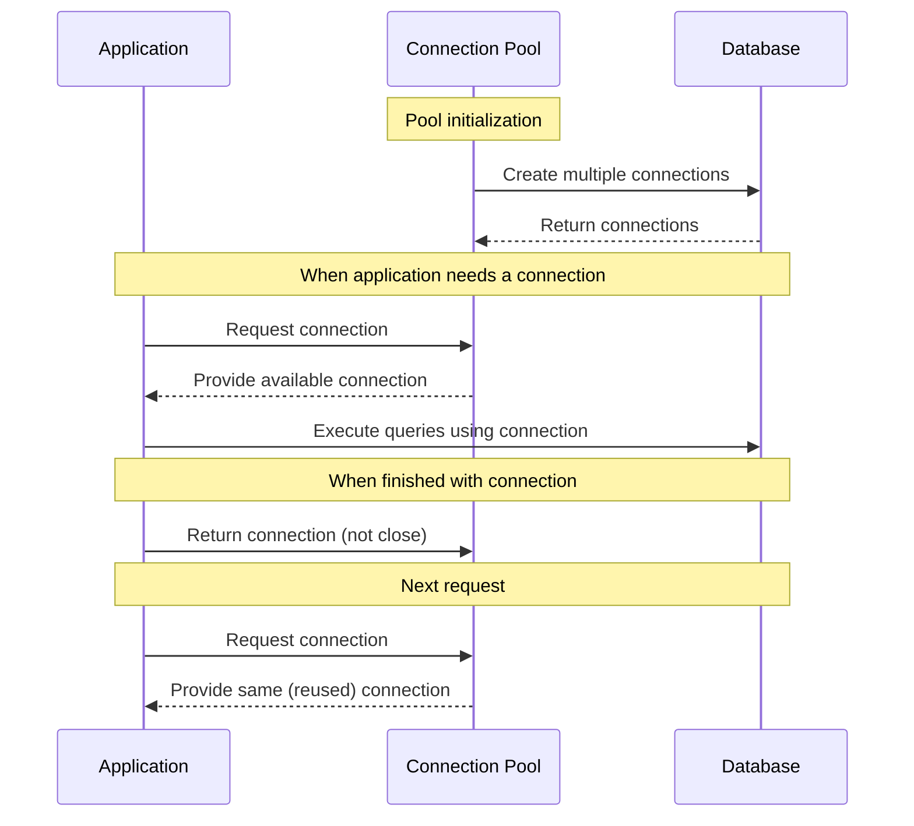

# Java Connection Pooling

## Introduction

When developing applications that interact with databases, one of the most resource-intensive operations is establishing database connections. Each connection requires network communication, authentication, and allocation of resources both on the client and server sides. If your application creates a new connection for each database operation and then closes it afterward, the performance overhead can become significant, especially under high load.

**Connection pooling** is a technique that helps solve this problem by maintaining a cache (or "pool") of database connections that can be reused when needed. Instead of creating a new connection each time, your application borrows one from the pool, uses it, and then returns it to the pool instead of closing it.

## Why Use Connection Pooling?

Before diving into implementation details, let's understand why connection pooling is essential:

1. **Performance improvement**: Creating database connections is expensive. Connection pooling significantly reduces this overhead.
2. **Resource management**: It limits the number of concurrent connections to the database, preventing resource exhaustion.
3. **Better scalability**: Applications can handle more concurrent users with fewer resources.
4. **Connection timeouts**: Pooling implementations can handle stale connections automatically.
5. **Load balancing**: Some advanced connection pools can distribute connections across multiple database servers.

## How Connection Pooling Works

Here's a simplified view of how connection pooling works:



## Implementing Connection Pooling in Java

Java offers several connection pooling libraries. The most popular ones include:

- **HikariCP**: Known for its high performance and simplicity
- **Apache DBCP**: Part of the Apache Commons project
- **C3P0**: A mature, feature-rich connection pooling library
- **Tomcat JDBC Connection Pool**: Built into Tomcat but can be used independently

### Basic JDBC Without Connection Pooling

Before showing connection pooling, let's look at the traditional way of handling JDBC connections:

```java
// Traditional JDBC connection approach (without pooling)
public void executeQueryWithoutPooling() {
    Connection conn = null;
    Statement stmt = null;
    ResultSet rs = null;
    
    try {
        // Create a new connection each time
        conn = DriverManager.getConnection("jdbc:mysql://localhost:3306/mydb", "user", "password");
        stmt = conn.createStatement();
        rs = stmt.executeQuery("SELECT * FROM users");
        
        while (rs.next()) {
            System.out.println("User: " + rs.getString("username"));
        }
    } catch (SQLException e) {
        e.printStackTrace();
    } finally {
        // Close all resources
        try {
            if (rs != null) rs.close();
            if (stmt != null) stmt.close();
            if (conn != null) conn.close(); // Connection is fully closed
        } catch (SQLException e) {
            e.printStackTrace();
        }
    }
}
```

### Using HikariCP for Connection Pooling

HikariCP is one of the fastest and most lightweight connection pool implementations. Let's implement a simple example using HikariCP:

First, add the HikariCP dependency to your project:

For Maven:
```xml
<dependency>
    <groupId>com.zaxxer</groupId>
    <artifactId>HikariCP</artifactId>
    <version>5.0.1</version>
</dependency>
```

For Gradle:
```groovy
implementation 'com.zaxxer:HikariCP:5.0.1'
```

Now, let's create a connection pool using HikariCP:

```java
import com.zaxxer.hikari.HikariConfig;
import com.zaxxer.hikari.HikariDataSource;
import java.sql.*;

public class DatabaseConnectionPool {
    private static HikariDataSource dataSource;
    
    // Initialize the connection pool once
    static {
        try {
            HikariConfig config = new HikariConfig();
            config.setJdbcUrl("jdbc:mysql://localhost:3306/mydb");
            config.setUsername("user");
            config.setPassword("password");
            
            // Configuration options
            config.setMaximumPoolSize(10); // Maximum number of connections in the pool
            config.setMinimumIdle(5);      // Minimum number of idle connections
            config.setIdleTimeout(30000);  // Maximum time a connection can sit idle (30 seconds)
            config.setConnectionTimeout(10000); // Maximum time to wait for a connection (10 seconds)
            
            dataSource = new HikariDataSource(config);
        } catch (Exception e) {
            throw new RuntimeException("Failed to initialize connection pool", e);
        }
    }
    
    // Get a connection from the pool
    public static Connection getConnection() throws SQLException {
        return dataSource.getConnection();
    }
    
    // Close the pool when application shuts down
    public static void closePool() {
        if (dataSource != null && !dataSource.isClosed()) {
            dataSource.close();
        }
    }
}
```

Now, let's use this connection pool to execute a query:

```java
// Using connection pooling with HikariCP
public void executeQueryWithPooling() {
    Connection conn = null;
    Statement stmt = null;
    ResultSet rs = null;
    
    try {
        // Get a connection from the pool
        conn = DatabaseConnectionPool.getConnection();
        stmt = conn.createStatement();
        rs = stmt.executeQuery("SELECT * FROM users");
        
        while (rs.next()) {
            System.out.println("User: " + rs.getString("username"));
        }
    } catch (SQLException e) {
        e.printStackTrace();
    } finally {
        try {
            if (rs != null) rs.close();
            if (stmt != null) stmt.close();
            if (conn != null) conn.close(); // Returns connection to the pool instead of closing it
        } catch (SQLException e) {
            e.printStackTrace();
        }
    }
}
```

## Using a Connection Pool with Try-with-resources

Modern Java provides a cleaner way to handle connections using try-with-resources:

```java
// Using connection pooling with try-with-resources
public void executeQueryModern() {
    String sql = "SELECT * FROM users";
    
    try (
        Connection conn = DatabaseConnectionPool.getConnection();
        PreparedStatement stmt = conn.prepareStatement(sql);
        ResultSet rs = stmt.executeQuery()
    ) {
        while (rs.next()) {
            String username = rs.getString("username");
            String email = rs.getString("email");
            System.out.printf("User: %s, Email: %s%n", username, email);
        }
    } catch (SQLException e) {
        e.printStackTrace();
    }
    // Resources automatically returned to the pool when the try block exits
}
```

## Example: Service Class with Connection Pooling

Let's create a complete example with a user service that utilizes connection pooling:

```java
public class UserService {
    // Get user by ID
    public User getUserById(int userId) {
        String sql = "SELECT id, username, email FROM users WHERE id = ?";
        
        try (
            Connection conn = DatabaseConnectionPool.getConnection();
            PreparedStatement stmt = conn.prepareStatement(sql)
        ) {
            stmt.setInt(1, userId);
            
            try (ResultSet rs = stmt.executeQuery()) {
                if (rs.next()) {
                    User user = new User();
                    user.setId(rs.getInt("id"));
                    user.setUsername(rs.getString("username"));
                    user.setEmail(rs.getString("email"));
                    return user;
                }
                return null;
            }
        } catch (SQLException e) {
            e.printStackTrace();
            throw new RuntimeException("Database access error", e);
        }
    }
    
    // Create a new user
    public boolean createUser(User user) {
        String sql = "INSERT INTO users (username, email, password) VALUES (?, ?, ?)";
        
        try (
            Connection conn = DatabaseConnectionPool.getConnection();
            PreparedStatement stmt = conn.prepareStatement(sql)
        ) {
            stmt.setString(1, user.getUsername());
            stmt.setString(2, user.getEmail());
            stmt.setString(3, user.getPassword());
            
            int rowsAffected = stmt.executeUpdate();
            return rowsAffected > 0;
        } catch (SQLException e) {
            e.printStackTrace();
            throw new RuntimeException("Failed to create user", e);
        }
    }
}

// Simple User class
class User {
    private int id;
    private String username;
    private String email;
    private String password;
    
    // Getters and setters
    public int getId() { return id; }
    public void setId(int id) { this.id = id; }
    
    public String getUsername() { return username; }
    public void setUsername(String username) { this.username = username; }
    
    public String getEmail() { return email; }
    public void setEmail(String email) { this.email = email; }
    
    public String getPassword() { return password; }
    public void setPassword(String password) { this.password = password; }
}
```

## Best Practices for Connection Pooling

To get the most out of connection pooling, follow these best practices:

1. **Properly size your connection pool**: 
   - Too small: can lead to performance issues during peak loads
   - Too large: can overwhelm the database server
   - Start with `connections = (core_count * 2) + effective_spindle_count`

2. **Always close connections**: Return connections to the pool by calling `close()` in a `finally` block or using try-with-resources.

3. **Set appropriate timeouts**:
   - Connection timeout: how long to wait for a connection
   - Idle timeout: how long a connection can be idle before being removed
   - Max lifetime: maximum time a connection can exist

4. **Test connections**: Configure your pool to test connections periodically or before use to ensure they're still valid.

5. **Monitor your pool**: Track metrics like connection wait time, usage, and pool size to optimize performance.

## Alternative Connection Pooling Libraries

### Apache DBCP Example

```java
import org.apache.commons.dbcp2.BasicDataSource;

public class DBCPConnectionPool {
    private static BasicDataSource dataSource;
    
    static {
        dataSource = new BasicDataSource();
        dataSource.setDriverClassName("com.mysql.cj.jdbc.Driver");
        dataSource.setUrl("jdbc:mysql://localhost:3306/mydb");
        dataSource.setUsername("user");
        dataSource.setPassword("password");
        
        // Configuration
        dataSource.setInitialSize(5);
        dataSource.setMaxTotal(10);
        dataSource.setMaxIdle(5);
        dataSource.setMaxWaitMillis(10000);
    }
    
    public static Connection getConnection() throws SQLException {
        return dataSource.getConnection();
    }
    
    public static void closePool() throws SQLException {
        dataSource.close();
    }
}
```

### C3P0 Example

```java
import com.mchange.v2.c3p0.ComboPooledDataSource;

public class C3P0ConnectionPool {
    private static ComboPooledDataSource dataSource;
    
    static {
        try {
            dataSource = new ComboPooledDataSource();
            dataSource.setDriverClass("com.mysql.cj.jdbc.Driver");
            dataSource.setJdbcUrl("jdbc:mysql://localhost:3306/mydb");
            dataSource.setUser("user");
            dataSource.setPassword("password");
            
            // Configuration
            dataSource.setMinPoolSize(5);
            dataSource.setMaxPoolSize(10);
            dataSource.setAcquireIncrement(1);
            dataSource.setMaxIdleTime(30);
        } catch (Exception e) {
            throw new RuntimeException("Failed to initialize C3P0 pool", e);
        }
    }
    
    public static Connection getConnection() throws SQLException {
        return dataSource.getConnection();
    }
    
    public static void closePool() {
        DataSources.destroy(dataSource);
    }
}
```

## Connection Pool Performance Comparison

Here's a simple comparison of the popular connection pooling libraries:

| Library    | Startup Time | Connection Acquisition | Memory Usage | Features           |
|------------|--------------|------------------------|--------------|-------------------|
| HikariCP   | Very Fast    | Fastest               | Low          | Simple, Fast      |
| DBCP2      | Medium       | Medium                | Medium       | Many config options |
| C3P0       | Slow         | Slower                | Higher       | Feature-rich      |
| Tomcat JDBC| Fast         | Fast                  | Low          | Good timeout handling |

## Summary

Connection pooling is an essential technique for any Java application that interacts with a database. It provides significant performance improvements by reusing database connections instead of creating new ones for each operation.

Key points to remember:

1. Connection pooling reduces the overhead of establishing database connections.
2. It improves application performance, scalability, and resource management.
3. Popular Java connection pooling libraries include HikariCP, Apache DBCP, and C3P0.
4. Always return connections to the pool by calling `close()`.
5. Properly configure your connection pool based on your application's needs and database capabilities.

In modern Java applications, HikariCP is often the preferred choice due to its simplicity, small footprint, and excellent performance characteristics. However, the other libraries may be preferred in specific situations where their unique features are required.

## Additional Resources

- [HikariCP GitHub Repository](https://github.com/brettwooldridge/HikariCP)
- [Apache Commons DBCP Documentation](https://commons.apache.org/proper/commons-dbcp/)
- [C3P0 Documentation](https://www.mchange.com/projects/c3p0/)
- [Tomcat JDBC Connection Pool](https://tomcat.apache.org/tomcat-9.0-doc/jdbc-pool.html)

## Practice Exercises

1. Create a simple application that measures and compares the performance of direct JDBC connections vs. connection pooling.
2. Implement a connection pool using HikariCP and create a DAO (Data Access Object) layer for a user management system.
3. Configure different connection pool sizes and test the application performance under various loads.
4. Create a multi-threaded application that simulates concurrent users accessing a database, and measure the impact of connection pooling.
5. Experiment with different connection pool libraries and compare their performance in your specific use case.