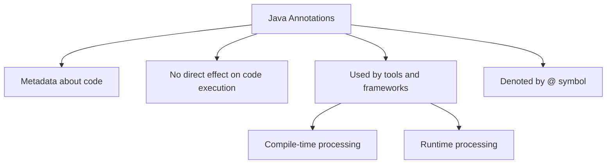

# Java Annotations

## Introduction

Java annotations are a form of metadata that provide data about a program that is not part of the program itself. They have no direct effect on the operation of the code they annotate. Instead, they provide information for the compiler, development tools, or frameworks at compile time or runtime.

Annotations were introduced in Java 5 (JDK 1.5) and have become an integral part of modern Java development. They are widely used in frameworks like Spring, Hibernate, JUnit, and Android development to reduce boilerplate code and provide configuration details.

In this tutorial, we'll explore what annotations are, how to use built-in annotations, how to create custom annotations, and how they're applied in real-world applications.

## What Are Annotations?

An annotation is a special kind of Java syntax, denoted by the `@` symbol followed by the annotation name. Annotations can be applied to classes, methods, fields, parameters, local variables, and other program elements.



## Built-in Java Annotations

Java provides several built-in annotations. Let's look at some of the most common ones:

### 1. `@Override`

Indicates that a method is intended to override a method in a superclass. If the method doesn't actually override a superclass method, the compiler will generate an error.

```java
class Parent {
    public void display() {
        System.out.println("Display in Parent");
    }
}

class Child extends Parent {
    @Override
    public void display() {
        System.out.println("Display in Child");
    }
    
    // This would cause a compilation error because there's no displayData() in Parent
    // @Override
    // public void displayData() { }
}
```

When run:

```
// Creating and calling Child instance
Display in Child
```

### 2. `@Deprecated`

Indicates that a program element is deprecated and should no longer be used. The compiler will generate a warning if the annotated element is used.

```java
public class DeprecationExample {
    @Deprecated
    public void oldMethod() {
        System.out.println("This method is deprecated");
    }
    
    public void newMethod() {
        System.out.println("Use this method instead");
    }
    
    public static void main(String[] args) {
        DeprecationExample example = new DeprecationExample();
        example.oldMethod(); // Compiler warning
        example.newMethod();
    }
}
```

### 3. `@SuppressWarnings`

Tells the compiler to suppress specific warnings that it would otherwise generate.

```java
public class SuppressWarningExample {
    @SuppressWarnings("unchecked")
    public void uncheckedOperation() {
        // This would normally cause an unchecked warning
        List list = new ArrayList();
        list.add("item");
    }
    
    public static void main(String[] args) {
        SuppressWarningExample example = new SuppressWarningExample();
        example.uncheckedOperation(); // No warning
    }
}
```

### 4. `@FunctionalInterface`

Indicates that an interface is intended to be a functional interface (with exactly one abstract method).

```java
@FunctionalInterface
interface Calculator {
    int calculate(int a, int b);
    
    // Adding another abstract method would cause a compilation error
    // int subtract(int a, int b);
}

public class FunctionalInterfaceExample {
    public static void main(String[] args) {
        // Using lambda with our functional interface
        Calculator addition = (a, b) -> a + b;
        System.out.println("10 + 5 = " + addition.calculate(10, 5));
        
        Calculator multiplication = (a, b) -> a * b;
        System.out.println("10 * 5 = " + multiplication.calculate(10, 5));
    }
}
```

Output:
```
10 + 5 = 15
10 * 5 = 50
```

## Annotation Elements

Annotations can have elements that look similar to methods. These elements can have default values.

```java
@interface SimpleAnnotation {
    String value() default "Default value";
    int count() default 0;
}
```

When using an annotation with elements, you provide values for those elements:

```java
@SimpleAnnotation(value = "Custom value", count = 3)
public class AnnotatedClass {
    // Class implementation
}
```

If the annotation has only one element named `value`, you can omit the element name:

```java
@SimpleAnnotation("Custom value")
public class AnotherAnnotatedClass {
    // Class implementation
}
```

## Creating Custom Annotations

To create a custom annotation, you use the `@interface` keyword.

### Basic Custom Annotation

```java
// Defining a custom annotation
public @interface MyAnnotation {
    String value() default "default value";
    int count() default 1;
    String[] tags() default {};
}
```

### Using the Custom Annotation

```java
@MyAnnotation(value = "example", count = 5, tags = {"important", "documentation"})
public class AnnotatedExample {
    @MyAnnotation("field annotation")
    private String annotatedField;
    
    @MyAnnotation(count = 10)
    public void annotatedMethod() {
        // Method implementation
    }
}
```

## Meta-Annotations

Meta-annotations are annotations that apply to other annotations. Java provides several meta-annotations in the `java.lang.annotation` package:

### 1. `@Retention`

Specifies how long annotations with the annotated type are to be retained:
- `RetentionPolicy.SOURCE` – Retained only in the source and discarded during compilation
- `RetentionPolicy.CLASS` – Retained during compilation but ignored by the JVM
- `RetentionPolicy.RUNTIME` – Retained during runtime and can be accessed through reflection

### 2. `@Target`

Specifies the kinds of program elements to which an annotation type is applicable. The possible element types are:
- `ElementType.TYPE` - Classes, interfaces, enums
- `ElementType.FIELD` - Fields
- `ElementType.METHOD` - Methods
- `ElementType.PARAMETER` - Method parameters
- `ElementType.CONSTRUCTOR` - Constructors
- `ElementType.LOCAL_VARIABLE` - Local variables
- `ElementType.ANNOTATION_TYPE` - Other annotations
- `ElementType.PACKAGE` - Packages
- (Java 8+) `ElementType.TYPE_PARAMETER` - Type parameters
- (Java 8+) `ElementType.TYPE_USE` - Use of types

### 3. `@Documented`

Indicates that annotations with the annotated type should be documented by javadoc and similar tools.

### 4. `@Inherited`

Indicates that an annotation type is automatically inherited.

### Complete Custom Annotation Example

```java
import java.lang.annotation.*;

// Creating a runtime annotation that can be applied to methods
@Retention(RetentionPolicy.RUNTIME)
@Target(ElementType.METHOD)
@Documented
public @interface MethodInfo {
    String author() default "Unknown";
    String date();
    int revision() default 1;
    String comments();
}

// Using our custom annotation
class AnnotationDemo {
    @MethodInfo(
        author = "John Doe",
        date = "2023-08-15",
        revision = 2,
        comments = "This method performs an important task"
    )
    public void importantMethod() {
        System.out.println("Executing important method");
    }
    
    public static void main(String[] args) {
        AnnotationDemo demo = new AnnotationDemo();
        demo.importantMethod();
        
        // We can access annotation information through reflection
        try {
            java.lang.reflect.Method method = demo.getClass().getMethod("importantMethod");
            MethodInfo annotation = method.getAnnotation(MethodInfo.class);
            
            if (annotation != null) {
                System.out.println("Method Author: " + annotation.author());
                System.out.println("Method Date: " + annotation.date());
                System.out.println("Method Revision: " + annotation.revision());
                System.out.println("Method Comments: " + annotation.comments());
            }
        } catch (NoSuchMethodException e) {
            e.printStackTrace();
        }
    }
}
```

Output:
```
Executing important method
Method Author: John Doe
Method Date: 2023-08-15
Method Revision: 2
Method Comments: This method performs an important task
```

## Processing Annotations with Reflection

Java annotations by themselves don't "do" anything. To make them useful, you need to process them, typically using Java's reflection API.

```java
import java.lang.annotation.*;
import java.lang.reflect.*;

@Retention(RetentionPolicy.RUNTIME)
@Target(ElementType.FIELD)
@interface MaxLength {
    int value();
}

class User {
    @MaxLength(10)
    private String username;
    
    public User(String username) {
        try {
            // Get the field
            Field field = this.getClass().getDeclaredField("username");
            
            // Get the annotation
            MaxLength annotation = field.getAnnotation(MaxLength.class);
            
            // Process the annotation
            if (annotation != null && username.length() > annotation.value()) {
                throw new IllegalArgumentException(
                    "Username cannot be longer than " + annotation.value() + " characters"
                );
            }
            
            this.username = username;
        } catch (NoSuchFieldException e) {
            e.printStackTrace();
        }
    }
    
    public String getUsername() {
        return username;
    }
    
    public static void main(String[] args) {
        try {
            User validUser = new User("john");
            System.out.println("Valid user created: " + validUser.getUsername());
            
            User invalidUser = new User("johndoewithlongname");
            // This will throw an exception
        } catch (IllegalArgumentException e) {
            System.out.println("Error: " + e.getMessage());
        }
    }
}
```

Output:
```
Valid user created: john
Error: Username cannot be longer than 10 characters
```

## Real-World Applications of Java Annotations

Annotations are widely used in many Java frameworks and libraries. Here are some common real-world examples:

### 1. Spring Framework

Spring heavily uses annotations for dependency injection, configuration, and more:

```java
import org.springframework.beans.factory.annotation.Autowired;
import org.springframework.stereotype.Controller;
import org.springframework.web.bind.annotation.GetMapping;
import org.springframework.web.bind.annotation.RequestParam;
import org.springframework.web.bind.annotation.ResponseBody;

@Controller
public class HelloController {
    
    @Autowired
    private UserService userService;
    
    @GetMapping("/hello")
    @ResponseBody
    public String hello(@RequestParam(defaultValue = "World") String name) {
        return "Hello, " + name + "!";
    }
}
```

### 2. JUnit Testing Framework

JUnit uses annotations to identify test methods and configure test execution:

```java
import org.junit.jupiter.api.*;

public class CalculatorTest {
    
    private Calculator calculator;
    
    @BeforeEach
    void setUp() {
        calculator = new Calculator();
    }
    
    @Test
    void testAddition() {
        assertEquals(5, calculator.add(2, 3));
    }
    
    @Test
    @Disabled("Not implemented yet")
    void testDivision() {
        // Test will be skipped
    }
    
    @AfterEach
    void tearDown() {
        calculator = null;
    }
}
```

### 3. Java Persistence API (JPA)

JPA uses annotations to map Java objects to database tables:

```java
import javax.persistence.*;

@Entity
@Table(name = "employees")
public class Employee {
    
    @Id
    @GeneratedValue(strategy = GenerationType.IDENTITY)
    private Long id;
    
    @Column(name = "first_name", nullable = false)
    private String firstName;
    
    @Column(name = "last_name", nullable = false)
    private String lastName;
    
    @ManyToOne
    @JoinColumn(name = "department_id")
    private Department department;
    
    // Getters and setters
}
```

### 4. Lombok Library

Lombok uses annotations to generate boilerplate code like getters, setters, and constructors:

```java
import lombok.Data;
import lombok.NoArgsConstructor;
import lombok.AllArgsConstructor;

@Data  // Generates getters, setters, toString, equals, hashCode
@NoArgsConstructor  // Generates a no-args constructor
@AllArgsConstructor  // Generates a constructor with all arguments
public class Product {
    private Long id;
    private String name;
    private double price;
    private String category;
}
```

## Summary

Java annotations provide a powerful way to add metadata to your code. They can be used for a wide variety of purposes:

- Giving instructions to the compiler
- Providing configuration information for tools and frameworks
- Generating code or documentation
- Runtime processing through reflection

Key points to remember about annotations:

1. Annotations start with the `@` symbol
2. Built-in annotations include `@Override`, `@Deprecated`, `@SuppressWarnings`, and `@FunctionalInterface`
3. Custom annotations are created using `@interface`
4. Meta-annotations like `@Retention`, `@Target`, `@Documented`, and `@Inherited` control how annotations work
5. Annotations can be processed at compile-time or runtime (using reflection)
6. Many modern Java frameworks rely heavily on annotations

## Exercises

1. Create a custom annotation called `@Important` that can be applied to methods and includes elements for priority level (int) and a description (String).

2. Create a simple annotation processor that uses reflection to find all methods in a class annotated with `@Important` and prints their names and annotation details.

3. Implement a custom validation framework using annotations. Create annotations like `@NotNull`, `@MinLength`, and `@MaxLength` and a validator class that uses reflection to validate objects based on these annotations.

4. Research and implement a basic example using a compile-time annotation processor (requires understanding of the Java Annotation Processing API).

## Additional Resources

- [Oracle's Java Tutorial on Annotations](https://docs.oracle.com/javase/tutorial/java/annotations/)
- [Java Reflection API Guide](https://www.oracle.com/technical-resources/articles/java/javareflection.html)
- [Spring Framework Annotation Documentation](https://docs.spring.io/spring-framework/docs/current/reference/html/core.html#beans-annotation-config)
- [Lombok Project](https://projectlombok.org/)
- [Java Annotation Processing Tool (apt)](https://docs.oracle.com/javase/7/docs/technotes/guides/apt/)

Good luck with your Java annotations journey! Remember that annotations are a powerful tool in modern Java development, and understanding them will greatly enhance your ability to work with frameworks and create clean, maintainable code.