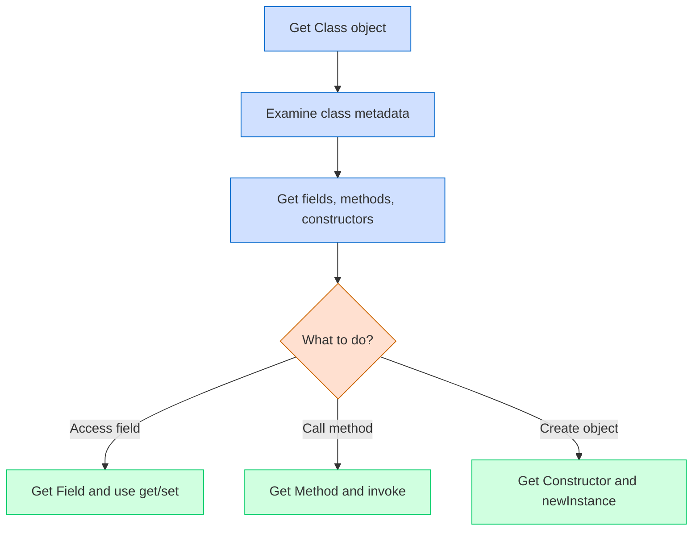

# Java Reflection

## Introduction

Java Reflection is a powerful feature that allows you to inspect and manipulate classes, interfaces, fields, and methods at runtime without knowing their names at compile time. It's like giving your program the ability to look in a mirror and see itself—hence the term "reflection."

Reflection enables you to:
- Examine class information at runtime
- Create new objects dynamically
- Invoke methods dynamically
- Access and modify fields, even private ones
- Load classes dynamically based on string names

While reflection is incredibly powerful, it's considered an advanced feature because it can bypass normal Java access controls, potentially leading to security issues and reduced performance if used improperly.

## Getting Started with Reflection

### The Core Reflection Classes

Java provides several classes in the `java.lang.reflect` package that form the foundation of reflection:

1. `Class<?>` - Represents class and interface metadata
2. `Method` - Represents a method of a class
3. `Field` - Represents a field of a class
4. `Constructor` - Represents a constructor of a class
5. `Modifier` - Contains methods to decode class and member access modifiers

Let's start by exploring how to obtain a `Class` object, which is the entry point for reflection.

### Obtaining a Class Object

There are three primary ways to get a `Class` object:

```java
// Method 1: Using .class
Class<?> stringClass = String.class;

// Method 2: Using getClass() on an object
String str = "Hello Reflection";
Class<?> strClass = str.getClass();

// Method 3: Using Class.forName()
try {
    Class<?> dynamicClass = Class.forName("java.lang.String");
} catch (ClassNotFoundException e) {
    e.printStackTrace();
}
```

## Exploring Class Information

Once you have a `Class` object, you can extract various information about it:

```java
public class ReflectionDemo {
    public static void main(String[] args) {
        Class<?> stringClass = String.class;
        
        System.out.println("Class name: " + stringClass.getName());
        System.out.println("Simple name: " + stringClass.getSimpleName());
        System.out.println("Package name: " + stringClass.getPackageName());
        System.out.println("Is interface? " + stringClass.isInterface());
        System.out.println("Superclass: " + stringClass.getSuperclass().getName());
        
        // Print all implemented interfaces
        Class<?>[] interfaces = stringClass.getInterfaces();
        System.out.println("Implemented interfaces:");
        for (Class<?> iface : interfaces) {
            System.out.println("  - " + iface.getName());
        }
    }
}
```

**Output:**
```
Class name: java.lang.String
Simple name: String
Package name: java.lang
Is interface? false
Superclass: java.lang.Object
Implemented interfaces:
  - java.io.Serializable
  - java.lang.Comparable
  - java.lang.CharSequence
  - java.lang.constant.Constable
  - java.lang.constant.ConstantDesc
```

## Working with Fields

Let's examine how to access and modify fields using reflection:

```java
import java.lang.reflect.Field;
import java.lang.reflect.Modifier;

public class FieldReflectionDemo {
    public static void main(String[] args) {
        try {
            // Get the Person class
            Class<?> personClass = Person.class;
            
            // Create a new Person instance
            Person person = new Person("John", 25);
            
            // Print all declared fields (including private ones)
            System.out.println("Fields in Person class:");
            Field[] fields = personClass.getDeclaredFields();
            for (Field field : fields) {
                System.out.println("  - " + Modifier.toString(field.getModifiers()) + 
                           " " + field.getType().getSimpleName() + 
                           " " + field.getName());
            }
            
            // Access and modify a private field
            Field nameField = personClass.getDeclaredField("name");
            nameField.setAccessible(true); // Override access control
            
            String originalName = (String) nameField.get(person);
            System.out.println("\nOriginal name: " + originalName);
            
            nameField.set(person, "Jane");
            System.out.println("Modified name: " + person.getName());
            
        } catch (Exception e) {
            e.printStackTrace();
        }
    }
}

class Person {
    private String name;
    private int age;
    
    public Person(String name, int age) {
        this.name = name;
        this.age = age;
    }
    
    public String getName() {
        return name;
    }
    
    public int getAge() {
        return age;
    }
}
```

**Output:**
```
Fields in Person class:
  - private String name
  - private int age

Original name: John
Modified name: Jane
```

:::caution
Using `setAccessible(true)` bypasses Java's access control, allowing you to access private fields. This should be used with care, as it can break encapsulation.
:::

## Working with Methods

Reflection allows you to examine and invoke methods at runtime:

```java
import java.lang.reflect.Method;

public class MethodReflectionDemo {
    public static void main(String[] args) {
        try {
            // Get the Calculator class
            Class<?> calcClass = Calculator.class;
            
            // Create a new Calculator instance
            Calculator calc = new Calculator();
            
            // Display all public methods
            System.out.println("Public methods in Calculator:");
            Method[] methods = calcClass.getMethods();
            for (Method method : methods) {
                // Filter out methods inherited from Object class
                if (method.getDeclaringClass() == Calculator.class) {
                    System.out.println("  - " + method.getName() + 
                               "(" + String.join(", ", getParamTypeNames(method)) + ")");
                }
            }
            
            // Invoke the add method using reflection
            Method addMethod = calcClass.getMethod("add", int.class, int.class);
            Object result = addMethod.invoke(calc, 5, 3);
            System.out.println("\nResult of add(5, 3): " + result);
            
            // Invoke the multiply method using reflection
            Method multiplyMethod = calcClass.getMethod("multiply", int.class, int.class);
            result = multiplyMethod.invoke(calc, 4, 6);
            System.out.println("Result of multiply(4, 6): " + result);
            
        } catch (Exception e) {
            e.printStackTrace();
        }
    }
    
    // Helper method to get parameter type names
    private static String[] getParamTypeNames(Method method) {
        Class<?>[] paramTypes = method.getParameterTypes();
        String[] typeNames = new String[paramTypes.length];
        for (int i = 0; i < paramTypes.length; i++) {
            typeNames[i] = paramTypes[i].getSimpleName();
        }
        return typeNames;
    }
}

class Calculator {
    public int add(int a, int b) {
        return a + b;
    }
    
    public int subtract(int a, int b) {
        return a - b;
    }
    
    public int multiply(int a, int b) {
        return a * b;
    }
    
    public int divide(int a, int b) {
        if (b == 0) throw new ArithmeticException("Cannot divide by zero");
        return a / b;
    }
}
```

**Output:**
```
Public methods in Calculator:
  - add(int, int)
  - subtract(int, int)
  - multiply(int, int)
  - divide(int, int)

Result of add(5, 3): 8
Result of multiply(4, 6): 24
```

## Creating Objects Dynamically

Reflection allows you to create objects without using the `new` keyword directly:

```java
import java.lang.reflect.Constructor;

public class DynamicObjectCreation {
    public static void main(String[] args) {
        try {
            // Get the Person class
            Class<?> personClass = Class.forName("Person");
            
            // Get the constructor that takes String and int
            Constructor<?> constructor = personClass.getConstructor(String.class, int.class);
            
            // Create a new Person instance
            Object person = constructor.newInstance("Alice", 30);
            
            // Use reflection to call getName()
            Method getNameMethod = personClass.getMethod("getName");
            String name = (String) getNameMethod.invoke(person);
            
            System.out.println("Created person with name: " + name);
            
        } catch (Exception e) {
            e.printStackTrace();
        }
    }
}
```

**Output:**
```
Created person with name: Alice
```

## Practical Applications of Reflection

### 1. Building a Simple Dependency Injection Framework

Dependency injection frameworks like Spring heavily use reflection. Here's a basic example:

```java
import java.lang.annotation.Retention;
import java.lang.annotation.RetentionPolicy;
import java.lang.reflect.Field;
import java.util.HashMap;
import java.util.Map;

// Define an annotation for injectable fields
@Retention(RetentionPolicy.RUNTIME)
@interface Inject {}

// Our simple DI container
class DIContainer {
    private Map<Class<?>, Object> services = new HashMap<>();
    
    // Register a service
    public <T> void register(Class<T> serviceClass, T implementation) {
        services.put(serviceClass, implementation);
    }
    
    // Inject dependencies into an object
    public void injectDependencies(Object object) throws Exception {
        Class<?> clazz = object.getClass();
        
        for (Field field : clazz.getDeclaredFields()) {
            if (field.isAnnotationPresent(Inject.class)) {
                Object dependency = services.get(field.getType());
                
                if (dependency == null) {
                    throw new RuntimeException("No implementation registered for " 
                                                + field.getType().getName());
                }
                
                field.setAccessible(true);
                field.set(object, dependency);
            }
        }
    }
}

// Example service interfaces and implementations
interface MessageService {
    String getMessage();
}

class EmailService implements MessageService {
    public String getMessage() {
        return "Email message";
    }
}

class Application {
    @Inject
    private MessageService messageService;
    
    public void processMessage() {
        System.out.println("Processing: " + messageService.getMessage());
    }
}

public class DIExample {
    public static void main(String[] args) {
        try {
            // Create the DI container
            DIContainer container = new DIContainer();
            
            // Register services
            container.register(MessageService.class, new EmailService());
            
            // Create application
            Application app = new Application();
            
            // Inject dependencies
            container.injectDependencies(app);
            
            // Use the application
            app.processMessage();
            
        } catch (Exception e) {
            e.printStackTrace();
        }
    }
}
```

**Output:**
```
Processing: Email message
```

### 2. Unit Testing Private Methods

Reflection enables testing of private methods, which can be useful in certain unit testing scenarios:

```java
import java.lang.reflect.Method;

class Calculator {
    public int calculate(int a, int b, String operation) {
        switch (operation) {
            case "add": return add(a, b);
            case "subtract": return subtract(a, b);
            case "multiply": return multiply(a, b);
            default: throw new IllegalArgumentException("Unknown operation");
        }
    }
    
    private int add(int a, int b) {
        return a + b;
    }
    
    private int subtract(int a, int b) {
        return a - b;
    }
    
    private int multiply(int a, int b) {
        return a * b;
    }
}

public class TestPrivateMethods {
    public static void main(String[] args) {
        try {
            Calculator calculator = new Calculator();
            Class<?> calculatorClass = Calculator.class;
            
            // Test private add method
            Method addMethod = calculatorClass.getDeclaredMethod("add", int.class, int.class);
            addMethod.setAccessible(true);
            int sum = (int) addMethod.invoke(calculator, 10, 5);
            System.out.println("Testing private add(10, 5): " + sum);
            assert sum == 15 : "Addition failed";
            
            // Test private subtract method
            Method subtractMethod = calculatorClass.getDeclaredMethod("subtract", int.class, int.class);
            subtractMethod.setAccessible(true);
            int difference = (int) subtractMethod.invoke(calculator, 10, 5);
            System.out.println("Testing private subtract(10, 5): " + difference);
            assert difference == 5 : "Subtraction failed";
            
        } catch (Exception e) {
            e.printStackTrace();
        }
    }
}
```

**Output:**
```
Testing private add(10, 5): 15
Testing private subtract(10, 5): 5
```

## Reflection Flow Diagram



## Performance Considerations

Reflection is powerful but comes with costs:

1. **Performance Overhead**: Reflection operations are slower than direct code
2. **No Compile-Time Checks**: Errors show up at runtime instead of compile time
3. **Security Restrictions**: May not work in restricted security environments
4. **Encapsulation Breaking**: Can expose private implementation details

For these reasons, reflection should be used sparingly and primarily in frameworks or tools rather than application code.

## Summary

Java Reflection provides powerful capabilities to inspect and manipulate classes at runtime:

- You can examine class structure, fields, methods, and constructors
- You can instantiate objects, invoke methods, and access fields dynamically
- Reflection enables frameworks like Spring, Hibernate, and JUnit to work
- While powerful, reflection should be used carefully due to performance costs and potential security issues

Reflection is best used for frameworks, tooling, and testing rather than regular application logic. When you need flexibility at runtime, reflection is the tool to use, but "with great power comes great responsibility."

## Additional Resources

- [Oracle's Java Reflection Tutorial](https://docs.oracle.com/javase/tutorial/reflect/index.html)
- [Java Reflection API Documentation](https://docs.oracle.com/en/java/javase/17/docs/api/java.base/java/lang/reflect/package-summary.html)
- [Baeldung's Java Reflection Guide](https://www.baeldung.com/java-reflection)

## Exercises

1. Create a program that uses reflection to print all public methods in the `java.util.ArrayList` class.
2. Build a simple annotation processor that finds all methods annotated with a custom `@Test` annotation in a class.
3. Create a simple serialization framework that converts objects to JSON strings using reflection.
4. Write a program that dynamically loads a class by name and creates an instance of it.
5. Implement a tool that can "deep clone" any object using reflection (including its nested objects).